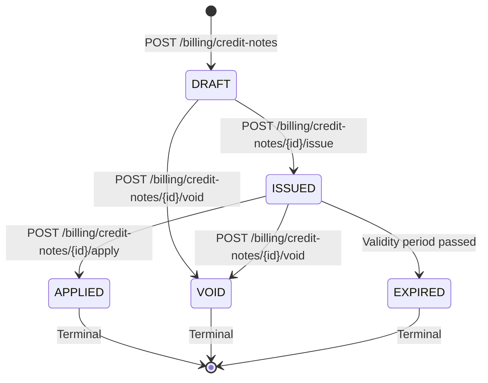

# Credit Note Workflow

## Overview

Credit notes represent a reduction in the amount owed by a patient. They are created against an issued invoice and can be applied to reduce the outstanding balance.

## State Machine

## Endpoints

| Method | Path | Role | Description |
|--------|------|------|-------------|
| `POST` | `/billing/credit-notes` | Receptionist, Admin, Doctor | Create credit note |
| `POST` | `/billing/credit-notes/{id}/issue` | Receptionist, Admin, Doctor | Issue (assign number) |
| `POST` | `/billing/credit-notes/{id}/void` | Receptionist, Admin, Doctor | Void a credit note |
| `POST` | `/billing/credit-notes/{id}/apply` | Receptionist, Admin, Doctor | Apply to invoice |

## Business Rules

1. Credit notes are created in **DRAFT** status
2. **DRAFT** credit notes have no financial effect
3. **ISSUED** credit notes have a permanent sequential number
4. Only **ISSUED** credit notes can be **APPLIED** or **VOIDED**
5. Applied credit notes reduce the target invoice's outstanding balance
6. Voided credit notes have no financial effect
7. Once applied or voided, a credit note is immutable
