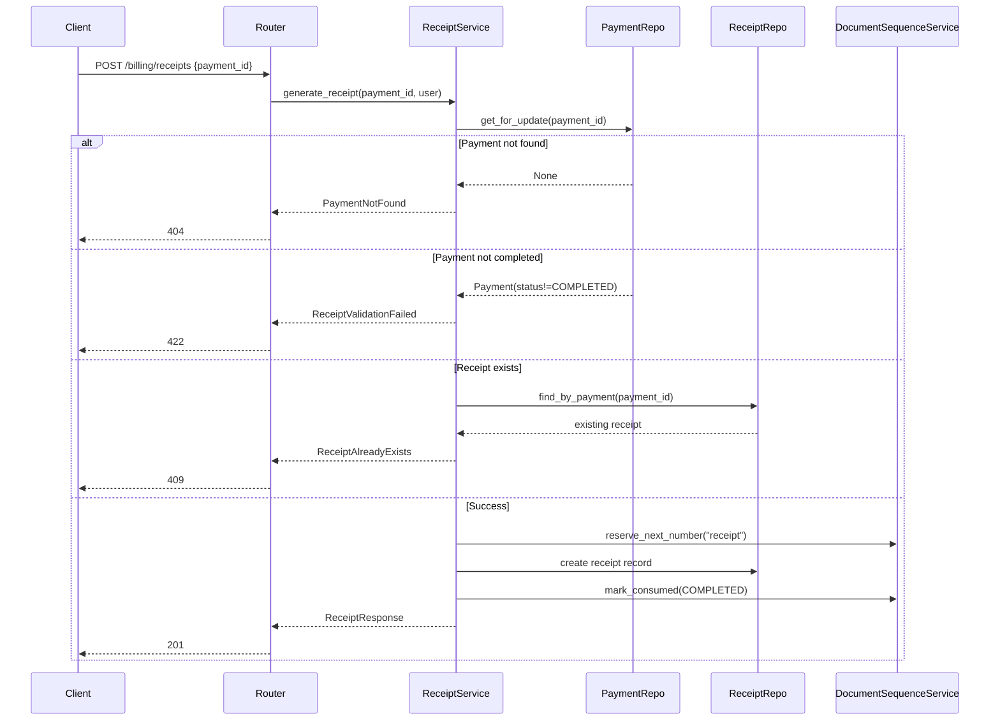

# Receipt Generation

## Overview

Receipts are generated for completed payments. Each receipt carries a unique sequential number and serves as a formal acknowledgment of payment.

## Endpoints

| Method | Path | Description |
|--------|------|-------------|
| `GET` | `/billing/receipts/{receipt_id}` | Retrieve a receipt |
| `POST` | `/billing/receipts` | Generate receipt for a payment (payment_id in body) |
| `POST` | `/billing/receipts/{receipt_id}/regenerate` | Regenerate an existing receipt |

## Business Rules

1. Receipts can only be generated against **COMPLETED** payments
2. A payment can have at most one active receipt
3. Receipt regeneration creates a new version of the receipt with an incremented sequence
4. Old receipt versions are preserved for audit purposes
5. Each receipt receives a unique sequential number via `DocumentSequenceService`

## Sequence Diagram

