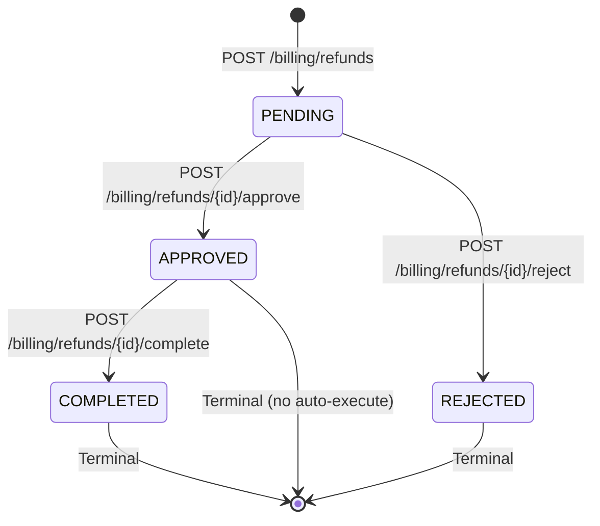

# Refund Workflow

## Overview

The refund workflow handles reversing payments made against invoices. It follows an approval-gated flow to prevent unauthorized refunds.

## State Machine



## Endpoints

| Method | Path | Role | Description |
|--------|------|------|-------------|
| `POST` | `/billing/refunds` | Receptionist, Admin, Doctor | Create refund request |
| `POST` | `/billing/refunds/{id}/approve` | Receptionist, Admin, Doctor | Approve pending refund |
| `POST` | `/billing/refunds/{id}/reject` | Receptionist, Admin, Doctor | Reject pending refund |
| `POST` | `/billing/refunds/{id}/complete` | Receptionist, Admin, Doctor | Execute approved refund |

## Business Rules

1. Refund amount cannot exceed the original payment amount
2. Only completed payments can be refunded
3. A payment cannot be refunded more than once (total refunds ≤ payment amount)
4. Approve and Reject are mutually exclusive
5. Reject requires a rejection reason
6. Only approved refunds can be completed (executed)

## Implementation Flow

```
Request Refund (PENDING)
  → Validate payment exists and is COMPLETED
  → Validate refund amount ≤ payment amount
  → Create Refund record
  → Return 201 Created

Approve (APPROVED)
  → Validate status is PENDING
  → Admin RBAC check
  → Update status to APPROVED
  → Return 200 OK

Reject (REJECTED)
  → Validate status is PENDING
  → Admin RBAC check
  → Requires rejection reason
  → Update status to REJECTED
  → Return 200 OK

Complete (COMPLETED)
  → Validate status is APPROVED
  → Admin RBAC check
  → Execute actual refund (reverse payment allocation)
  → Update status to COMPLETED
  → Return 200 OK
```
