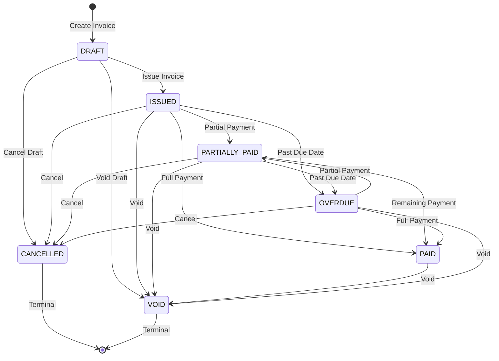
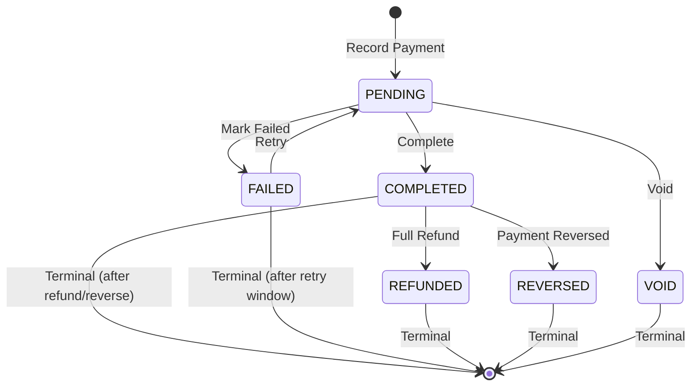
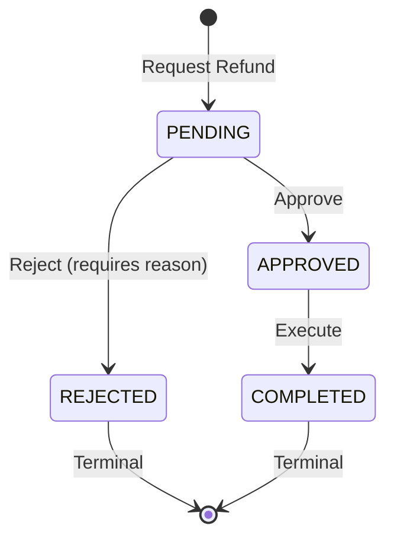
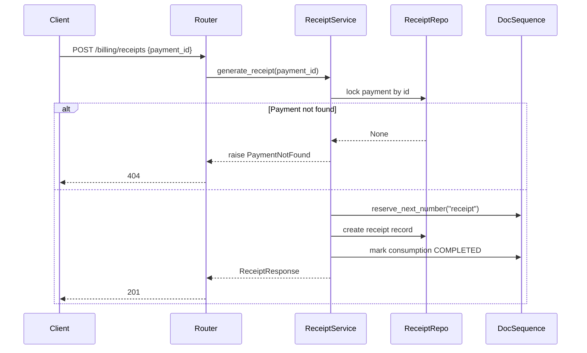
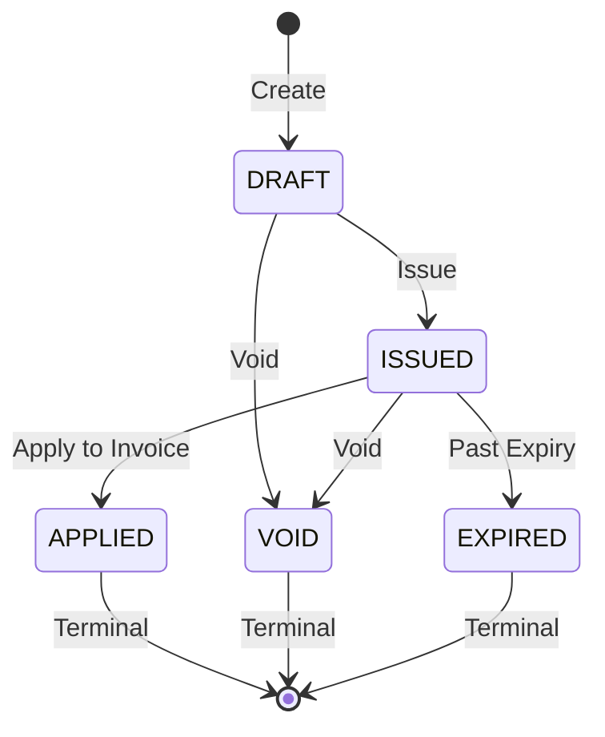

# Billing Module — Core Workflows

## 1. Invoice Lifecycle



### Key Rules

- **DRAFT** is the only editable status — line items and amounts can change
- **ISSUED** freezes all amounts and assigns a permanent sequential invoice number
- Once **ISSUED**, an invoice becomes immutable (see ADR-002)
- An **ISSUED** invoice can be **CANCELLED** with a required reason
- **CANCELLED** and **VOID** are terminal states with no outgoing transitions

### Implementation Flow

```
1. POST /billing/invoices
   → Creates invoice in DRAFT status
   → Validates line items
   → Computes grand_total
   → Returns InvoiceResponse

2. POST /billing/invoices/{id}/issue
   → Validates status is DRAFT
   → Validates at least 1 line item exists
   → Reserves document sequence number (gap-tracked)
   → Creates sequence consumption log
   → Updates status to ISSUED
   → Returns InvoiceResponse with permanent invoice_number

3. POST /billing/invoices/{id}/cancel
   → Requires cancellation_reason
   → Validates status is ISSUED/OVERDUE
   → Updates status to CANCELLED
   → Records audit trail

4. PATCH /billing/invoices/{id}
   → Only updates notes and due_date
   → Validates status is DRAFT
   → Returns updated InvoiceResponse
```

## 2. Payment Lifecycle



### Key Rules

- **PENDING** is the only editable status
- **COMPLETED** payments can be allocated to invoices
- A payment can be allocated across multiple invoices
- Allocations cannot exceed the payment's total amount
- Allocations cannot exceed the invoice's grand total

### Implementation Flow

```
1. POST /billing/payments
   → Validates patient exists
   → Creates payment in PENDING status
   → Returns PaymentResponse

2. POST /billing/payments/{id}/complete
   → Validates status is PENDING
   → Updates to COMPLETED
   → Returns PaymentResponse

3. POST /billing/payments/{id}/allocate
   → Validates payment is COMPLETED
   → Validates invoice is ISSUED/PARTIALLY_PAID/OVERDUE
   → Validates amounts
   → Creates payment allocation
   → Updates invoice status if fully paid
   → Returns AllocationResponse
```

## 3. Refund Workflow



### Key Rules

- **PENDING** refunds can be approved or rejected
- **APPROVED** refunds can be executed once
- Refund amount cannot exceed the original payment amount
- A completed refund reverses the corresponding payment allocation

### Implementation Flow

```
1. POST /billing/refunds
   → Validates payment exists and is completed
   → Validates refund amount ≤ payment amount
   → Creates refund in PENDING status
   → Returns RefundResponse

2. POST /billing/refunds/{id}/approve
   → Validates status is PENDING
   → Administrative action (RBAC-guarded)
   → Updates to APPROVED
   → Returns RefundResponse

3. POST /billing/refunds/{id}/complete
   → Validates status is APPROVED
   → Executes refund (reverses allocation)
   → Updates to COMPLETED
   → Returns RefundResponse
```

## 4. Receipt Generation



## 5. Credit Note Lifecycle



### Key Rules

- Credit notes are created against an invoice
- **DRAFT** credit notes can be issued or voided
- **ISSUED** credit notes can be applied, voided, or expire
- Applying a credit note reduces the outstanding balance of the target invoice
- Once applied, voided, or expired, a credit note cannot be modified
