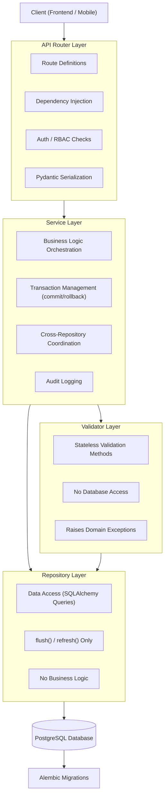
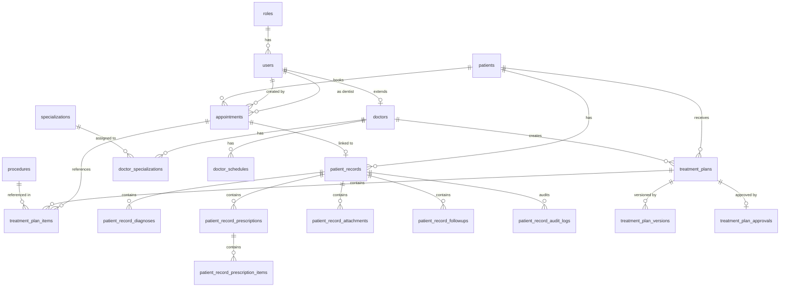
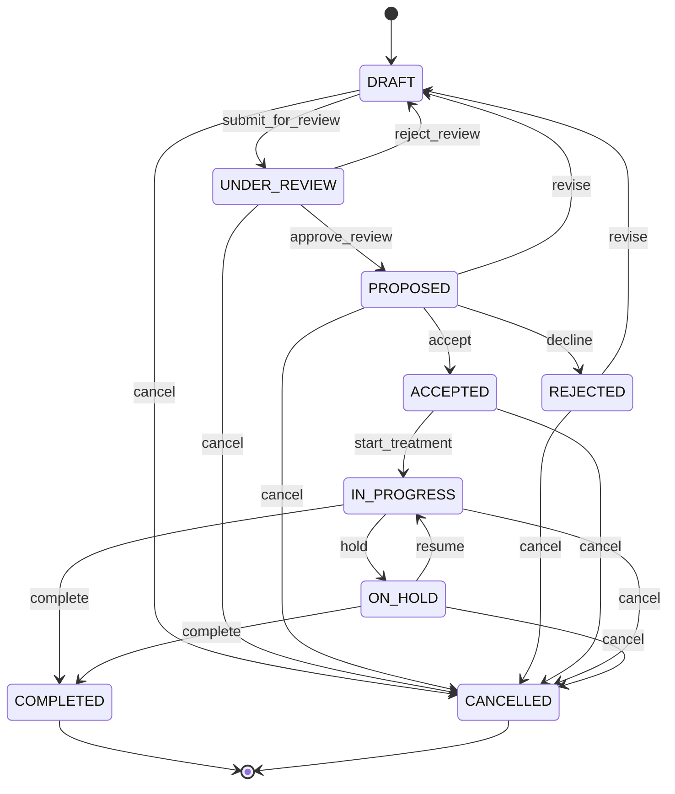

# DensCare — Dental Clinic Management System

## Project Technical Documentation

> **Document Version:** 2.0.0  
> **Last Updated:** July 16, 2026  
> **Status:** Production-Ready  

---

## Table of Contents

1. [Project Overview](#1-project-overview)
2. [Tech Stack](#2-tech-stack)
3. [Architecture](#3-architecture)
4. [Folder Structure](#4-folder-structure)
5. [Module Documentation](#5-module-documentation)
6. [API Documentation](#6-api-documentation)
7. [Database Schema](#7-database-schema)
8. [RBAC](#8-rbac)
9. [Validation Rules](#9-validation-rules)
10. [Testing & Coverage](#10-testing--coverage)
11. [Migrations & Deployment](#11-migrations--deployment)
12. [Changelog](#12-changelog)

---

## 1. Project Overview

### Project Name

**DensCare** — Dental Clinic Management System

### Purpose

DensCare is a comprehensive backend system designed to digitize and streamline the daily operations of a multi-specialty dental clinic. It provides a secure, role-based platform for managing patients, doctors, appointments, clinical records, prescriptions, treatment plans, and administrative workflows in a production healthcare environment.

### Target Users

| User Group | Description | Primary Modules |
|------------|-------------|-----------------|
| Administrators | Full system control, user approval, clinic configuration | Auth, Users, RBAC, all modules |
| Chief Doctors | Senior clinical supervision, treatment plan review | Doctors, Records, Treatment Plans |
| General Doctors | Clinical treatment, documentation | Doctors, Records, Treatment Plans |
| Specialist Doctors | Specialist consultation | Doctors, Records |
| Consulting Doctors | Visiting/part-time consultants | Doctors (limited) |
| Receptionists | Patient registration, appointment scheduling | Patients, Appointments |
| Dental Assistants | Supporting clinical operations | Patient Records (read) |

### Current Project Status

| Module | Status | Endpoints | Tests |
|--------|--------|-----------|-------|
| Authentication | ✅ Complete | 6 | ✅ |
| RBAC | ✅ Complete | (Integrated) | ✅ |
| User Management | ✅ Complete | 5 | ✅ |
| Patient Management | ✅ Complete | 7 | ✅ |
| Appointment Management | ✅ Complete | 6 | ✅ |
| Doctor Management | ✅ Complete | 25+ | 227+ |
| Patient Records | ✅ Complete | 38+ | 100+ |
| Treatment Plans | ✅ Complete | 30+ | ✅ |

---

## 2. Tech Stack

| Layer | Technology | Version | Purpose |
|-------|-----------|---------|---------|
| Runtime | Python | 3.11+ | Application language |
| Web Framework | FastAPI | 0.137.0+ | REST API framework |
| ORM | SQLAlchemy | 2.0.50+ | Database ORM with typed mappings |
| Validation | Pydantic v2 | 2.13.4+ | Request/response schema validation |
| Auth | PyJWT (python-jose) | 3.5.0+ | JWT token generation and verification |
| Password Hashing | Passlib (bcrypt) | 1.7.4+ | Secure password hashing |
| Database | PostgreSQL | 14+ | Primary database |
| ORM Compatibility | psycopg2-binary | 2.9.12+ | PostgreSQL adapter |
| Migrations | Alembic | 1.18.4+ | Schema migration management |
| Testing | Pytest | latest | Test framework |
| Server | Uvicorn | 0.49.0+ | ASGI server |
| Frontend (planned) | React + TypeScript | — | Web UI client |

---

## 3. Architecture

### High-Level System Architecture



### Layer Responsibilities

| Layer | Responsibility | Database Access | Transaction |
|-------|---------------|-----------------|-------------|
| **Router** | HTTP concerns, path/query params, auth/authz, response serialization | None | None |
| **Service** | Business orchestration, cross-repo coordination, audit logging | Via Repositories | Owns commit/rollback |
| **Validator** | Pure business rule validation, raises domain exceptions | None (receives repo protocols) | None |
| **Repository** | Data access (SQLAlchemy queries) | flush/refresh only | Never commits |
| **Mapper** | Transforms ORM entities to Pydantic response DTOs | None | None |

### Architecture Principles

1. **Defense in depth** — Validation at every layer (schema → business → database)
2. **Fail fast** — Configuration validation at import time
3. **Auditability** — Every state change tracked via audit columns
4. **Separation of concerns** — Each layer has a single responsibility
5. **Enterprise-grade error handling** — Structured JSON error responses

### ER Diagram



---

## 4. Folder Structure

The project follows a **modular monolith** structure with each module containing its own layers:

```
denscare/
├── README.md
├── PROJECT_DOCUMENTATION.md
├── docs/
│   ├── BRD.md
│   ├── PROJECT_DOCUMENTATION.md
│   ├── README.md
│   ├── DENSCARE_PROJECT_REPORT.md
│   ├── doctor-management/       # Doctor module design docs
│   └── treatment/               # Treatment module design docs
├── backend/
│   ├── main.py                  # FastAPI app entry point
│   ├── requirements.txt         # Python dependencies
│   ├── alembic.ini              # Alembic configuration
│   ├── alembic/
│   │   ├── env.py               # Migration environment
│   │   ├── script.py.mako       # Migration template
│   │   └── versions/            # Migration files (14+)
│   └── app/
│       ├── core/
│       │   ├── config.py        # Settings from env vars
│       │   ├── constants.py     # App-wide constants & enums
│       │   ├── security.py      # Password hashing, JWT
│       │   └── exception_handlers.py  # Global error handlers
│       ├── database/
│       │   ├── base.py          # SQLAlchemy DeclarativeBase
│       │   ├── models.py        # Re-exports all ORM models
│       │   ├── session.py       # Engine & session factory
│       │   ├── seed_roles.py    # Role seeding script
│       │   └── test_connection.py  # DB connectivity test
│       ├── dependencies/
│       │   └── auth.py          # JWT auth dependency
│       └── modules/
│           ├── auth/            # Authentication module
│           │   ├── models.py, schemas.py, routes.py
│           │   ├── service.py, repository.py, exceptions.py
│           │   └── __init__.py
│           ├── rbac/            # RBAC module
│           │   ├── permissions.py
│           │   └── __init__.py
│           ├── users/           # User management
│           │   ├── schemas.py, routes.py, service.py
│           │   ├── repository.py, exceptions.py
│           │   └── __init__.py
│           ├── patients/        # Patient management
│           │   ├── models.py, schemas.py, routes.py
│           │   ├── service.py, repository.py
│           │   ├── exceptions.py, mapper.py
│           │   └── __init__.py
│           ├── appointments/    # Appointment scheduling
│           │   ├── model.py, schema.py, router.py
│           │   ├── service.py, repository.py
│           │   ├── enums.py, exceptions.py
│           │   ├── validators.py, dependencies.py
│           │   └── __init__.py
│           ├── doctors/         # Doctor management
│           │   ├── models.py, schemas.py, routes.py
│           │   ├── mapper.py, enums.py, constants.py
│           │   ├── dependencies.py, exceptions.py
│           │   ├── services/
│           │   │   ├── doctor_service.py
│           │   │   ├── schedule_service.py
│           │   │   └── specialization_service.py
│           │   ├── repositories/
│           │   │   ├── doctor_repository.py
│           │   │   └── __init__.py
│           │   └── __init__.py
│           ├── patient_records/  # Clinical documentation
│           │   ├── models/       # per-entity model files
│           │   ├── schemas/      # per-entity schema files
│           │   ├── routers/      # per-entity router files
│           │   ├── services/     # per-entity service files
│           │   ├── repositories/ # per-entity repo files
│           │   ├── validators/   # per-entity validator files
│           │   ├── enums/        # per-entity enum files
│           │   ├── orchestrators/ # workflow orchestration
│           │   ├── workflow/     # state machine engine
│           │   ├── mappers/      # entity-to-DTO mapping
│           │   ├── dependencies/ # permissions & DI
│           │   ├── constants/    # audit events & constants
│           │   ├── exceptions/
│           │   ├── tests/
│           │   └── __init__.py
│           └── treatment/       # Treatment plans
│               ├── models.py, enums.py, constants.py
│               ├── exceptions.py, dependencies.py
│               ├── routers/     # treatment_plan_router, procedure_router
│               ├── schemas/     # treatment_plan, procedure, common, errors, pagination
│               ├── services/    # treatment_plan_service, procedure_service
│               ├── repositories/ # plan & procedure repos
│               ├── validators/  # plan & procedure validators, state_machine
│               ├── mappers/     # entity-to-DTO mapping
│               └── __init__.py
└── frontend/                    # React + Vite (scaffold)
    ├── package.json
    ├── vite.config.ts
    └── src/
        ├── App.tsx, App.css
        ├── index.css, main.tsx
        └── services/api.ts
```

### Module Architecture Pattern

Each module follows this consistent structure:

```
module_name/
├── models.py               # SQLAlchemy ORM models
├── schemas.py              # Pydantic request/response DTOs
├── routes.py / router.py   # FastAPI route definitions
├── service.py              # Business logic / orchestration
├── repository.py           # Data access layer
├── exceptions.py           # Domain-specific exceptions
├── enums.py                # Application enums
├── constants.py            # Module constants
├── validators.py           # Business rule validators
├── mapper.py               # ORM → DTO transformation
├── dependencies.py         # FastAPI dependency injection
└── tests/                  # Test files
```

---

## 5. Module Documentation

### 5.1 Authentication Module

**Location:** `backend/app/modules/auth/`  
**Purpose:** Handle user registration, login, admin approval workflow, and account lifecycle management.

#### Users

- Public users (registration)
- All staff (login, profile)
- Administrators (approval, deactivation)

#### Key Features & APIs

| Method | Endpoint | Auth | Roles | Description |
|--------|----------|------|-------|-------------|
| POST | `/auth/register` | None | Public | Register new user (pending status) |
| POST | `/auth/login` | None | Public | Authenticate, receive JWT |
| GET | `/auth/me` | JWT | Any | Current user profile |
| GET | `/auth/users/pending` | JWT | Admin | List pending users |
| PATCH | `/auth/users/{id}/approve` | JWT | Admin | Approve pending user |
| PATCH | `/auth/users/{id}/deactivate` | JWT | Admin | Deactivate user |

#### Data Models

**Role** (`roles` table): `id`, `name` (unique), relationships to users.

**User** (`users` table): `id`, `full_name`, `email` (unique), `password_hash`, `status` (pending/active/inactive), `is_active`, `role_id` (FK → roles), `last_login_at`, `created_by`, `updated_by`, `created_at`, `updated_at`.

#### Business Rules

- BR-AUTH-001: Email must be unique (case-insensitive)
- BR-AUTH-002: Password must contain uppercase, lowercase, digit, and special character
- BR-AUTH-003: New users start as pending, requiring admin approval
- BR-AUTH-004: Admin cannot deactivate their own account
- BR-AUTH-005: Last remaining admin cannot be deactivated
- BR-AUTH-006: Login is case-insensitive

#### Security Roles

- `POST /register` — Public (no auth required)
- All other endpoints — require JWT + role check

#### Example Usage

```json
// POST /auth/register
{
  "full_name": "Juan Dela Cruz",
  "email": "juan@example.com",
  "password": "Secure@Pass1"
}

// Response: 201
{
  "message": "Registration submitted. Waiting for admin approval."
}

// POST /auth/login
// Body: (form data) username=juan@example.com&password=Secure@Pass1
// Response: 200
{
  "access_token": "eyJhbGciOiJIUzI1NiIs...",
  "token_type": "bearer"
}
```

---

### 5.2 RBAC Module

**Location:** `backend/app/modules/rbac/`  
**Purpose:** Granular role-based access control with dependency-based authorization.

#### Key Features

- `require_admin()` — Dependency that ensures the current user has ADMIN role
- `require_roles([...])` — Factory dependency that accepts a list of allowed role names
- Integration with JWT authentication via `get_current_user()`

#### Enforcement Points

| Protection Level | Mechanism | Example |
|-----------------|-----------|---------|
| Role-specific | `require_roles([ROLE_ADMIN, ROLE_RECEPTIONIST])` | Patient creation |
| Admin-only | `require_admin()` | User management |
| Self-or-read | Custom dependency checking ownership | Doctor self-view |
| Public | No dependency | Registration, login |

---

### 5.3 User Management Module

**Location:** `backend/app/modules/users/`  
**Purpose:** Admin CRUD for system users with role assignment, activation/deactivation, and the last-admin safety net.

#### Key Features & APIs

| Method | Endpoint | Auth | Roles | Description |
|--------|----------|------|-------|-------------|
| GET | `/users` | JWT | Admin | List users (paginated, searchable) |
| GET | `/users/{id}` | JWT | Admin | Get user details |
| PATCH | `/users/{id}/role` | JWT | Admin | Change user role |
| PATCH | `/users/{id}/activate` | JWT | Admin | Activate user |
| PATCH | `/users/{id}/deactivate` | JWT | Admin | Deactivate user |

#### Business Rules

- BR-USER-001: Admin cannot change their own role
- BR-USER-002: Admin cannot activate/deactivate themselves
- BR-USER-003: Last remaining admin cannot be deactivated
- BR-USER-004: All mutations record audit trail (updated_by)

---

### 5.4 Patient Management Module

**Location:** `backend/app/modules/patients/`  
**Purpose:** Patient registration, duplicate detection, search, and lifecycle management.

#### Users

- Receptionists (create, update)
- Doctors (read)
- Administrators (full access)

#### Key Features & APIs

| Method | Endpoint | Auth | Roles | Description |
|--------|----------|------|-------|-------------|
| POST | `/patients` | JWT | Admin, Receptionist | Create patient |
| GET | `/patients` | JWT | Admin, Receptionist, Doctors | List/search patients |
| GET | `/patients/{id}` | JWT | Admin, Receptionist, Doctors | Get patient details |
| PATCH | `/patients/{id}` | JWT | Admin, Receptionist | Update patient |
| PATCH | `/patients/{id}/activate` | JWT | Admin | Activate patient |
| PATCH | `/patients/{id}/deactivate` | JWT | Admin | Deactivate patient |
| GET | `/patients/{id}/profile` | JWT | Admin, Receptionist, Doctors | Patient profile |

#### Data Models

**Patient** (`patients` table): `id` (UUID), `patient_code` (auto-generated, e.g. PAT-000001), `first_name`, `middle_name` (optional), `last_name`, `date_of_birth`, `gender`, `primary_contact_number`, `emergency_contact_number` (optional), `email` (optional), `address` (optional), `remarks` (optional), `is_active`, standard audit fields.

#### Business Rules

- BR-PAT-001: Patient codes are auto-generated (PAT-XXXXXX) and unique
- BR-PAT-002: Duplicate detection blocks exact matches, warns on partial
- BR-PAT-003: Text fields are normalized (names, email, phone)
- BR-PAT-004: Date of birth must not be in the future (year >= 1900)
- BR-PAT-005: Phone numbers follow pattern `^\+?[0-9]{10,15}$`
- BR-PAT-006: Status toggles are idempotent

#### Example Usage

```json
// POST /patients
{
  "first_name": "Juan",
  "last_name": "Dela Cruz",
  "date_of_birth": "1990-05-15",
  "gender": "male",
  "primary_contact_number": "+639123456789",
  "email": "juan@email.com"
}

// Response: 201
{
  "id": "a1b2c3d4-e5f6-7890-abcd-ef1234567890",
  "patient_code": "PAT-000001",
  "full_name": "Juan Dela Cruz",
  "age": 34,
  "is_active": true,
  "created_at": "2026-07-16T10:00:00Z",
  ...
}
```

---

### 5.5 Appointment Management Module

**Location:** `backend/app/modules/appointments/`  
**Purpose:** Appointment scheduling with working hour validation, conflict prevention, and status lifecycle.

#### Users

- Receptionists (book, manage)
- Doctors (view own schedule)
- Administrators (full access)

#### Key Features & APIs

| Method | Endpoint | Auth | Roles | Description |
|--------|----------|------|-------|-------------|
| POST | `/appointments` | JWT | Admin, Receptionist, Doctors | Create appointment |
| GET | `/appointments` | JWT | Admin, Receptionist, Doctors | List appointments |
| GET | `/appointments/today` | JWT | Admin, Receptionist, Doctors | Today's appointments |
| GET | `/appointments/{id}` | JWT | Admin, Receptionist, Doctors | Get appointment |
| PUT | `/appointments/{id}` | JWT | Admin, Receptionist, Doctors | Update appointment |
| PATCH | `/appointments/{id}/cancel` | JWT | Admin, Receptionist, Doctors | Cancel appointment |

#### Data Models

**Appointment** (`appointments` table): `id` (UUID), `appointment_number` (auto-generated, APT-XXXXXX), `patient_id` (FK → patients), `dentist_id` (FK → users), `appointment_date`, `start_time`, `end_time`, `duration_minutes`, `appointment_type` (enum), `status` (enum: SCHEDULED → NO_SHOW), `reason_for_visit`, `notes` (optional), standard audit fields.

#### Status Lifecycle

```
SCHEDULED → CONFIRMED → CHECKED_IN → IN_TREATMENT → COMPLETED
                                                       ↘ CANCELLED
                                                       ↘ NO_SHOW
```

#### Business Rules

- BR-APT-001: Appointments must be within clinic working hours (10:00–13:00, 17:00–21:00)
- BR-APT-002: Appointments only on working days (Monday–Saturday)
- BR-APT-003: Duration must be one of: 15, 30, 45, 60 minutes
- BR-APT-004: Patient must be active
- BR-APT-005: Dentist must be active
- BR-APT-006: No overlapping appointments for the same dentist at the same time
- BR-APT-007: No overlapping appointments for the same patient at the same time
- BR-APT-008: Status transitions must follow the state machine
- BR-APT-009: Appointment numbers are auto-generated (APT-XXXXXX)

---

### 5.6 Doctor Management Module

**Location:** `backend/app/modules/doctors/`  
**Purpose:** Structured doctor profiles with specialization management, weekly schedule templates, and search/filter capabilities.

**Note:** This is the most comprehensive CRUD module with a full 4-layer architecture.

#### Users

- Administrators (create, update, manage specializations/schedules)
- Receptionists (read, search)
- Doctors (self-read only)

#### Key Features & APIs

**Doctor Endpoints (13):**

| Method | Endpoint | Auth | Roles | Description |
|--------|----------|------|-------|-------------|
| POST | `/doctors` | JWT | Admin | Create doctor profile |
| GET | `/doctors` | JWT | Admin, Receptionist | List doctors |
| GET | `/doctors/{id}` | JWT | Admin, Receptionist, Self | Get doctor |
| GET | `/doctors/user/{user_id}` | JWT | Admin, Receptionist, Self | Get by user ID |
| PATCH | `/doctors/{id}` | JWT | Admin | Update doctor |
| DELETE | `/doctors/{id}` | JWT | Admin | Delete doctor |
| PATCH | `/doctors/{id}/activate` | JWT | Admin | Activate doctor |
| PATCH | `/doctors/{id}/deactivate` | JWT | Admin | Deactivate doctor |
| PATCH | `/doctors/{id}/leave` | JWT | Admin | Toggle leave |
| PATCH | `/doctors/{id}/availability` | JWT | Admin | Toggle availability |
| POST | `/doctors/{id}/specializations` | JWT | Admin | Assign specialization |
| DELETE | `/doctors/{id}/specializations/{sid}` | JWT | Admin | Remove specialization |
| GET | `/doctors/{id}/profile` | JWT | Admin, Receptionist, Self | Full profile |

**Specialization Endpoints (7):** CRUD + activate/deactivate for the specialization master list.

**Schedule Endpoints (5):** CRUD + bulk replace for weekly schedule templates.

#### Data Models

**Doctor** (`doctors` table): `id` (UUID), `doctor_code` (DOC-XXXXXX), `user_id` (FK → users, unique), `date_of_birth`, `gender`, `primary_phone`, `address`, `emergency_contact_name`, `emergency_contact_phone`, `qualification`, `registration_number` (unique), `years_of_experience`, `consultation_fee`, `consultation_duration`, `languages_known` (JSONB), `profile_photo_url`, `biography`, `available_for_appointment`, `on_leave`, `is_active`, standard audit fields.

**Specialization** (`specializations` table): `id`, `name` (unique), `code` (unique), `description`, `is_active`.

**DoctorSpecialization** (`doctor_specializations` table): `doctor_id` (FK), `specialization_id` (FK), `is_primary`, `certification_date`. Partial unique index ensures exactly one primary per doctor.

**DoctorSchedule** (`doctor_schedules` table): `id` (UUID), `doctor_id` (FK), `day_of_week` (0–5), `start_time`, `end_time`, `is_active`.

#### Business Rules

- BR-DOC-001: Every profile references exactly one existing User
- BR-DOC-002: Only DOCTOR-family roles may own profiles
- BR-DOC-003: Doctor codes are auto-generated (DOC-XXXXXX) and unique
- BR-DOC-004: Registration numbers are unique
- BR-DOC-005: One primary specialization per doctor (enforced at DB level)
- BR-DOC-006: Schedule entries cannot overlap per doctor
- BR-DOC-007: Inactive doctors are excluded from appointment booking
- BR-DOC-008: On-leave doctors are excluded from appointment booking

#### Example Usage

```json
// POST /doctors
{
  "user_id": 1,
  "primary_phone": "+639171234567",
  "qualification": "DMD, University of the Philippines",
  "registration_number": "DEN-2020-12345",
  "years_of_experience": 10,
  "consultation_fee": 800.00,
  "consultation_duration": 30,
  "languages_known": ["Filipino", "English"]
}

// Response: 201
{
  "id": "3fa85f64-5717-4562-b3fc-2c963f66afa6",
  "doctor_code": "DOC-00001",
  "user_id": 1,
  "user_full_name": "Maria Santos",
  "primary_phone": "+639171234567",
  "is_active": true,
  "created_at": "2026-07-16T10:00:00Z",
  ...
}
```

---

### 5.7 Patient Records Module

**Location:** `backend/app/modules/patient_records/`  
**Purpose:** Core clinical documentation module — the largest and most complex module in the system with 84 source files.

**Architecture:** Uses an **Orchestrator pattern** (on top of the standard Service pattern) to coordinate complex multi-entity clinical workflows. It has its own internal state machine engine, workflow rules engine, and per-entity validators.

#### Features

| Feature | APIs | Description |
|---------|------|-------------|
| Patient Records | 9 | CRUD, status transitions, finalization |
| Diagnoses | 5 | CRUD, bulk create, provisional/confirmed |
| Prescriptions | 5 | CRUD, finalization, soft delete |
| Prescription Items | 6 | CRUD, bulk add, delete |
| Attachments | 5 | Upload metadata, search, update, delete |
| Follow-ups | 6 | CRUD, upcoming follow-ups |
| Audit Logs | 3 | Record/user/action audit, immutable history |

#### Data Models

- `patient_records` — Clinical record, linked to patient + appointment
- `patient_record_diagnoses` — Diagnoses (provisional/confirmed)
- `patient_record_prescriptions` — Prescriptions with status
- `patient_record_prescription_items` — Line items per prescription
- `patient_record_attachments` — File attachment metadata
- `patient_record_followups` — Follow-up scheduling
- `patient_record_audit_logs` — Immutable audit trail (28 event types)

#### Record Status Lifecycle

```
DRAFT ⇄ IN_PROGRESS ⇄ UNDER_REVIEW → COMPLETED → FINALIZED
```

- Editable statuses: DRAFT, IN_PROGRESS, UNDER_REVIEW, COMPLETED
- Terminal status: FINALIZED (no further changes allowed)
- Once FINALIZED: immutable — no updates, no deletes, no status changes

#### Business Rules

- BR-REC-001: Record must reference an existing patient
- BR-REC-002: Record must reference an existing appointment
- BR-REC-003: No duplicate records per appointment
- BR-REC-004: Status transitions must follow the state machine
- BR-REC-005: FINALIZED records are immutable
- BR-REC-006: Only authorized roles can change status (role-gated transitions)
- BR-REC-007: All mutations are audit-logged with actor ID and timestamp
- BR-REC-008: 28 distinct audit event types

---

### 5.8 Treatment Plan Module

**Location:** `backend/app/modules/treatment/`  
**Purpose:** Structured dental treatment planning with versioning, status lifecycle (8 states), approval workflow, cost estimation, and procedure master catalog.

**Architecture:** The most sophisticated module — implements the **Aggregate Root pattern** with `TreatmentPlan` owning items, versions, and approvals. Uses a formal state machine engine, optimistic concurrency control, and immutable version snapshots.

#### Users

- All clinical roles (create, read, manage treatment plans)
- Administrators (full access)
- Receptionists (read-only)

#### Key Features & APIs

**Treatment Plan Endpoints (30+):**

| Category | Endpoints | Description |
|----------|-----------|-------------|
| Plan CRUD | 4 | Create, Get, List, Search |
| Plan Filtering | 5 | By patient, doctor, status, pending review/approval |
| Item Management | 5 | Add, Update, Remove, Reorder |
| Status Transitions | 10 | Submit, Approve, Reject, Accept, Decline, Cancel, Start, Hold, Resume, Complete |
| Versioning | 4 | Create snapshot, List, Get, Restore |
| Dashboard | 2 | Summary, Counts by status/doctor/patient |

**Procedure Catalog Endpoints (7+):** CRUD + activate/deactivate + search.

#### Data Models

**Procedure** (`procedures` table): `id`, `code` (unique), `name`, `description`, `default_cost`, `category` (11 categories), `is_active`.

**TreatmentPlan** (`treatment_plans` table): `id` (UUID), `plan_code` (TXN-XXXXXX), `patient_id` (FK), `doctor_id` (FK), `clinical_notes`, `observations`, `dentist_recommendations`, `valid_from`, `valid_to`, `status` (8 states), `current_version`, `lock_version` (optimistic concurrency), `is_active`, standard audit fields.

**TreatmentPlanItem** (`treatment_plan_items` table): `id` (UUID), `plan_id` (FK), `procedure_id` (FK), `sequence_number`, `tooth_number`, `tooth_surface`, `quadrant`, `arch`, `estimated_cost`, `discount`, `item_status` (5 states), `notes`, `appointment_id` (FK, optional), `diagnosis_id` (FK, optional).

**TreatmentPlanVersion** (`treatment_plan_versions` table): `id` (UUID), `plan_id` (FK), `version_number`, `items_snapshot` (JSONB — immutable), `change_reason`, `changed_by`, `created_at`.

**TreatmentPlanApproval** (`treatment_plan_approvals` table): `id` (UUID), `plan_id` (FK, unique), `approved_by`, `approved_at`, `patient_status`, `patient_acknowledged_at`, `approval_notes`.

#### State Machine (Plan Status)



#### State Machine (Item Status)

```
PENDING → IN_PROGRESS → COMPLETED
                     ↘ DEFERRED → PENDING
                     ↘ CANCELLED
```

#### Business Rules

- BR-TP-001: Plans start in DRAFT status
- BR-TP-002: Only editable statuses (DRAFT, UNDER_REVIEW, PROPOSED) allow item modification
- BR-TP-003: Terminal statuses (COMPLETED, CANCELLED) have no outgoing transitions
- BR-TP-004: Submitting for review requires at least 1 item
- BR-TP-005: Starting treatment requires at least 1 item
- BR-TP-006: Version snapshots are created after a plan is accepted and then modified
- BR-TP-007: Plan codes are auto-generated (TXN-XXXXXX) and unique
- BR-TP-008: Sequence numbers are unique per plan
- BR-TP-009: Discount cannot exceed estimated cost
- BR-TP-010: Optimistic concurrency via lock_version (SQLAlchemy version_id_col)
- BR-TP-011: Tooth numbers follow FDI notation (11–48 permanent, 51–85 primary)

#### Example Usage

```json
// POST /treatment-plans
{
  "patient_id": "a1b2c3d4-e5f6-7890-abcd-ef1234567890",
  "doctor_id": "3fa85f64-5717-4562-b3fc-2c963f66afa6",
  "clinical_notes": "Patient presents with severe caries on tooth 36",
  "observations": "X-ray confirms deep caries reaching pulp chamber",
  "dentist_recommendations": "Root canal treatment recommended"
}

// Response: 201
{
  "id": "b2c3d4e5-f6a7-8901-bcde-f12345678901",
  "plan_code": "TXN-000001",
  "status": "draft",
  "current_version": 1,
  "items": [],
  "approval": {
    "patient_status": "pending",
    "approved_by": null
  },
  "versions": [
    {
      "version_number": 1,
      "change_reason": "Initial plan creation"
    }
  ]
}
```

---

## 6. API Documentation

### Complete API Reference

#### Authentication (6 endpoints)

| Method | Endpoint | Auth | Roles | Description |
|--------|----------|------|-------|-------------|
| POST | `/auth/register` | None | Public | Register new user |
| POST | `/auth/login` | None | Public | Login, get JWT |
| GET | `/auth/me` | JWT | Any | Current user profile |
| GET | `/auth/users/pending` | JWT | Admin | List pending users |
| PATCH | `/auth/users/{id}/approve` | JWT | Admin | Approve pending user |
| PATCH | `/auth/users/{id}/deactivate` | JWT | Admin | Deactivate user |

#### Users (5 endpoints)

| Method | Endpoint | Auth | Roles | Description |
|--------|----------|------|-------|-------------|
| GET | `/users` | JWT | Admin | List users (paginated) |
| GET | `/users/{id}` | JWT | Admin | Get user details |
| PATCH | `/users/{id}/role` | JWT | Admin | Change user role |
| PATCH | `/users/{id}/activate` | JWT | Admin | Activate user |
| PATCH | `/users/{id}/deactivate` | JWT | Admin | Deactivate user |

#### Patients (7 endpoints)

| Method | Endpoint | Auth | Roles | Description |
|--------|----------|------|-------|-------------|
| POST | `/patients` | JWT | Admin, Receptionist | Create patient |
| GET | `/patients` | JWT | Admin, Receptionist, Doctors | List/search patients |
| GET | `/patients/{id}` | JWT | Admin, Receptionist, Doctors | Get patient |
| PATCH | `/patients/{id}` | JWT | Admin, Receptionist | Update patient |
| PATCH | `/patients/{id}/activate` | JWT | Admin | Activate patient |
| PATCH | `/patients/{id}/deactivate` | JWT | Admin | Deactivate patient |
| GET | `/patients/{id}/profile` | JWT | Admin, Receptionist, Doctors | Patient profile |

#### Appointments (6 endpoints)

| Method | Endpoint | Auth | Roles | Description |
|--------|----------|------|-------|-------------|
| POST | `/appointments` | JWT | Admin, Receptionist, Doctors | Create appointment |
| GET | `/appointments` | JWT | Admin, Receptionist, Doctors | List appointments |
| GET | `/appointments/today` | JWT | Admin, Receptionist, Doctors | Today's appointments |
| GET | `/appointments/{id}` | JWT | Admin, Receptionist, Doctors | Get appointment |
| PUT | `/appointments/{id}` | JWT | Admin, Receptionist, Doctors | Update appointment |
| PATCH | `/appointments/{id}/cancel` | JWT | Admin, Receptionist, Doctors | Cancel appointment |

#### Doctors (13 endpoints)

| Method | Endpoint | Auth | Roles | Description |
|--------|----------|------|-------|-------------|
| POST | `/doctors` | JWT | Admin | Create doctor |
| GET | `/doctors` | JWT | Admin, Receptionist | List doctors |
| GET | `/doctors/{id}` | JWT | Admin, Receptionist, Self | Get doctor by ID |
| GET | `/doctors/user/{user_id}` | JWT | Admin, Receptionist, Self | Get by user ID |
| PATCH | `/doctors/{id}` | JWT | Admin | Update doctor |
| DELETE | `/doctors/{id}` | JWT | Admin | Delete doctor |
| PATCH | `/doctors/{id}/activate` | JWT | Admin | Activate doctor |
| PATCH | `/doctors/{id}/deactivate` | JWT | Admin | Deactivate doctor |
| PATCH | `/doctors/{id}/leave` | JWT | Admin | Toggle leave |
| PATCH | `/doctors/{id}/availability` | JWT | Admin | Toggle availability |
| POST | `/doctors/{id}/specializations` | JWT | Admin | Assign specialization |
| DELETE | `/doctors/{id}/specializations/{sid}` | JWT | Admin | Remove specialization |
| GET | `/doctors/{id}/profile` | JWT | Admin, Receptionist, Self | Full profile |

#### Specializations (7 endpoints)

| Method | Endpoint | Auth | Roles | Description |
|--------|----------|------|-------|-------------|
| POST | `/specializations` | JWT | Admin | Create specialization |
| GET | `/specializations` | JWT | Admin, Receptionist, Doctors | List specializations |
| GET | `/specializations/{id}` | JWT | Admin, Receptionist, Doctors | Get specialization |
| PATCH | `/specializations/{id}` | JWT | Admin | Update specialization |
| PATCH | `/specializations/{id}/activate` | JWT | Admin | Activate specialization |
| PATCH | `/specializations/{id}/deactivate` | JWT | Admin | Deactivate specialization |
| DELETE | `/specializations/{id}` | JWT | Admin | Delete specialization |

#### Schedules (5 endpoints)

| Method | Endpoint | Auth | Roles | Description |
|--------|----------|------|-------|-------------|
| GET | `/doctors/{id}/schedules` | JWT | Admin, Receptionist, Self | List schedules |
| POST | `/doctors/{id}/schedules` | JWT | Admin | Create schedule |
| PATCH | `/doctors/{id}/schedules/{sid}` | JWT | Admin | Update schedule |
| DELETE | `/doctors/{id}/schedules/{sid}` | JWT | Admin | Delete schedule |
| PUT | `/doctors/{id}/schedules` | JWT | Admin | Replace weekly schedule |

#### Patient Records (38+ endpoints)

| Category | Endpoints | Description |
|----------|-----------|-------------|
| Records | 9 | CRUD, status transitions, finalization, search |
| Diagnoses | 5 | CRUD, bulk create |
| Prescriptions | 5 | CRUD, finalization, soft delete |
| Prescription Items | 6 | Add, update, bulk, delete |
| Attachments | 5 | Upload metadata, search, update, delete |
| Follow-ups | 6 | Schedule, update, upcoming, delete |
| Audit Logs | 3 | Record, user, and action audit history |

#### Treatment Plans (30+ endpoints)

| Category | Endpoints | Description |
|----------|-----------|-------------|
| Plans | 15+ | CRUD, search, filter by patient/doctor/status, dashboard |
| Items | 5 | Add, update, remove, reorder |
| Transitions | 10 | Submit, approve, reject, accept, decline, cancel, start, hold, resume, complete |
| Versions | 4 | Create snapshot, list, get, restore |
| Analytics | 3 | Count by status, doctor, patient |

---

## 7. Database Schema

### Complete Table List

| # | Table | Module | Description |
|---|-------|--------|-------------|
| 1 | `roles` | Auth | RBAC role definitions (7 seeded roles) |
| 2 | `users` | Auth | System users with auth and status lifecycle |
| 3 | `patients` | Patients | Patient demographic records |
| 4 | `appointments` | Appointments | Appointment scheduling data |
| 5 | `doctors` | Doctors | Doctor profiles (1:1 with users) |
| 6 | `specializations` | Doctors | Dental specialization master list |
| 7 | `doctor_specializations` | Doctors | Doctor-Specialization many-to-many |
| 8 | `doctor_schedules` | Doctors | Weekly availability templates |
| 9 | `patient_records` | Patient Records | Clinical patient records |
| 10 | `patient_record_diagnoses` | Patient Records | Diagnoses within records |
| 11 | `patient_record_prescriptions` | Patient Records | Prescriptions |
| 12 | `patient_record_prescription_items` | Patient Records | Prescription line items |
| 13 | `patient_record_attachments` | Patient Records | File attachment metadata |
| 14 | `patient_record_followups` | Patient Records | Follow-up entries |
| 15 | `patient_record_audit_logs` | Patient Records | Immutable audit trail |
| 16 | `treatment_plans` | Treatment | Treatment plan aggregate root |
| 17 | `treatment_plan_items` | Treatment | Procedure line items |
| 18 | `treatment_plan_versions` | Treatment | Immutable version snapshots (JSONB) |
| 19 | `treatment_plan_approvals` | Treatment | Doctor approval + patient acknowledgment |
| 20 | `procedures` | Treatment | Procedure master catalog |

### Key Relationships

```
users 1:1 doctors                        (doctor extends user identity)
users 1:N appointments                   (as dentist)
patients 1:N appointments                (patient books appointments)
patients 1:N patient_records             (patient has clinical records)
patients 1:N treatment_plans             (patient receives treatment plans)
appointments 1:1 patient_records         (appointment produces record)
appointments 1:N treatment_plan_items    (appointment linked to plan items)
doctors 1:N doctor_specializations       (doctor has specializations)
doctors 1:N doctor_schedules             (doctor has schedule templates)
doctors 1:N treatment_plans              (doctor creates treatment plans)
specializations 1:N doctor_specializations (specialization belongs to doctors)
treatment_plans 1:N treatment_plan_items (plan contains items)
treatment_plans 1:N treatment_plan_versions (plan has version history)
treatment_plans 1:1 treatment_plan_approvals (plan has approval record)
procedures 1:N treatment_plan_items      (procedure referenced in plan items)
patient_records 1:N child entities       (diagnoses, prescriptions, attachments, follow-ups, audit_logs)
```

### Audit Convention

Every data table includes these audit columns:

| Column | Type | Description |
|--------|------|-------------|
| `created_by` | Integer (FK → users.id) | User who created the record |
| `updated_by` | Integer (FK → users.id) | User who last modified the record |
| `created_at` | DateTime(tz) | Timestamp of creation |
| `updated_at` | DateTime(tz) | Timestamp of last modification |

---

## 8. RBAC

### Role Definitions

| Role Name | DB Seed ID | Purpose |
|-----------|-----------|---------|
| `ADMIN` | 1 | Complete system access |
| `CHIEF_DOCTOR` | 2 | Senior clinical supervision |
| `GENERAL_DOCTOR` | 3 | General dental practice |
| `SPECIALIST_DOCTOR` | 4 | Specialist consultation |
| `CONSULTING_DOCTOR` | 5 | Visiting/part-time consultant |
| `RECEPTIONIST` | 6 | Front desk operations |
| `DENTAL_ASSISTANT` | 7 | Clinical support |

### Role Permissions by Module

| Module | ADMIN | CHIEF_DOCTOR | GENERAL_DOCTOR | SPECIALIST | CONSULTING | RECEPTIONIST | DENTAL_ASST |
|--------|-------|-------------|----------------|------------|------------|--------------|-------------|
| Auth (approve) | ✅ | — | — | — | — | — | — |
| Users (manage) | ✅ | — | — | — | — | — | — |
| Patients (create) | ✅ | — | — | — | — | ✅ | — |
| Patients (read) | ✅ | ✅ | ✅ | ✅ | ✅ | ✅ | ✅ |
| Appointments (CRUD) | ✅ | ✅ | ✅ | ✅ | ✅ | ✅ | — |
| Doctors (manage) | ✅ | — | — | — | — | — | — |
| Doctors (read) | ✅ | ✅ | Self | Self | Self | ✅ | — |
| Specializations (manage) | ✅ | — | — | — | — | — | — |
| Specializations (read) | ✅ | ✅ | ✅ | ✅ | ✅ | ✅ | — |
| Schedules (manage) | ✅ | — | — | — | — | — | — |
| Records (write) | ✅ | ✅ | ✅ | ✅ | ✅ | — | — |
| Records (read) | ✅ | ✅ | ✅ | ✅ | ✅ | ✅ | ✅ |
| Treatment Plans | ✅ | ✅ | ✅ | ✅ | ✅ | Read | — |

### Authorization Pattern

```python
# Role-specific
Depends(require_roles([ROLE_ADMIN, ROLE_RECEPTIONIST]))

# Admin-only
Depends(require_admin())

# Self-or-read (custom dependency)
Depends(require_doctor_self_or_full_read)
```

---

## 9. Validation Rules

Validation is performed at **three layers**:

| Layer | Technology | Scope |
|-------|-----------|-------|
| Schema Validation | Pydantic v2 | Type checking, format, length, regex |
| Business Validation | Custom Validator classes | Domain rules, uniqueness, state transitions |
| Database Constraints | SQLAlchemy + PostgreSQL | NOT NULL, UNIQUE, CHECK, FK constraints |

### Key Schema Validations

| Field | Validations |
|-------|-------------|
| Password | 8–128 chars, requires upper + lower + digit + special |
| Email | Valid format via Pydantic `EmailStr`, normalized to lowercase |
| Phone | 10–15 digits, optional leading `+`, pattern `^\+?[0-9]{10,15}$` |
| Date of Birth | Not future, year >= 1900 |
| Names | Alphabetic only, spaces/hyphens/apostrophes allowed |
| Registration Number | Uppercase letters, digits, hyphens only |
| Consultation Fee | Positive, max 10 digits, 2 decimal places |
| Consultation Duration | 15–240 minutes |
| Years of Experience | 0–50 years |
| Languages | List of strings, trimmed, title-cased, deduplicated |
| Extra Fields | Always rejected via `ConfigDict(extra="forbid")` |
| Tooth Number (FDI) | 11–48 (permanent), 51–85 (primary) |
| Estimated Cost | 0.00–999999.99 |
| Discount | ≥ 0, ≤ estimated_cost |
| Sequence Number | ≥ 1, unique per plan |
| Plan Code | Max 20 chars, unique |

### Domain Exception Hierarchy

```
Exception
├── AuthException (11 subclasses)
├── UserException (11 subclasses)
├── PatientException (6 subclasses)
├── PatientRecordException (3 subclasses)
├── AppointmentException (4 subclasses)
├── DoctorException (18 subclasses)
├── TreatmentPlanException (PlanNotFound, PlanNotEditable, …)
```

Each exception has: `code` (machine-readable), `message` (human-readable), `details` (optional context).

---

## 10. Testing & Coverage

### Test Framework

- **Framework:** pytest with function-scoped fixtures
- **Database:** SQLite in-memory with custom UUID/JSONB compilers
- **HTTP Client:** FastAPI TestClient

### Test Distribution

| Module | Test Files | Tests | Type |
|--------|-----------|-------|------|
| Auth | 2 | ✅ | Unit + Integration |
| Users | 2 | ✅ | Unit + Integration |
| Patients | 1 | ✅ | Unit |
| Appointments | — | ✅ | Integration |
| Doctors | 5+ | 227+ | Unit + Integration + Edge Case + Repository |
| Patient Records | 10+ | 100+ | Unit + Integration + Workflow |
| Treatment | 8+ | ✅ | Unit + Integration + State Machine |

**Total: 300+ automated tests**

### Test Categories

| Category | Description |
|----------|-------------|
| Unit Tests | Test validators, exceptions, schemas in isolation |
| Service Tests | Test business logic with mocked repositories |
| Repository Tests | Test data access with real SQLite database |
| Integration Tests | Test full API flows via TestClient |
| Router Tests | Test endpoint authorization, request/response |
| State Machine Tests | Test all valid and invalid status transitions |
| Edge Case Tests | Boundary conditions, error paths, stress scenarios |

---

## 11. Migrations & Deployment

### Alembic Migrations

**Location:** `backend/alembic/versions/`

The project uses Alembic for database schema migration management:

| Migration | Description |
|-----------|-------------|
| `6d6a9ff9fbea` | Create users and roles tables |
| `239e5e25d211` | Create appointments table |
| `3733f4eaa564` | Create patients module |
| `43f93a7e590e` | Add patient records module |
| `3e904edeca5a` | Add treatment module |
| `2acc90fbcbf0` | Add record status enum values |
| `14b364e7b2e5` | Create doctor management tables |
| `652824d3ff1f` | Add user status |
| `4f279e3eb1f6` | Add last_login_at to users |
| `9a8b7c6d5e4f` | Add appointment constraints |
| `e5f6a7b8c9d0` | Add updated_by to patients |
| `f1a2b3c4d5e6` | Add created_by to users |
| `d4e5f6a7b8c9` | Add updated_by to users |
| `c0594e64fa77` | Merge patient and user audit branches |
| `b8d407be5e45` | Sync existing schema with models |

### Local Development Setup

```bash
# 1. Clone the repository
git clone <repo-url>
cd denscare

# 2. Create virtual environment
python -m venv venv
source venv/bin/activate  # or venv\Scripts\activate on Windows

# 3. Install dependencies
cd backend
pip install -r requirements.txt

# 4. Configure environment
cp .env.example .env
# Edit .env with your DATABASE_URL and JWT_SECRET

# 5. Run migrations
alembic upgrade head

# 6. Seed roles
python -c "from app.database.seed_roles import seed_roles; from app.database.session import SessionLocal; db = SessionLocal(); seed_roles(db); db.close()"

# 7. Start the server
uvicorn main:app --reload

# 8. Visit API docs
# http://localhost:8000/docs
```

### Environment Variables

| Variable | Required | Default | Description |
|----------|----------|---------|-------------|
| `DATABASE_URL` | Yes | — | PostgreSQL connection string |
| `JWT_SECRET` | Yes | — | Secret key for JWT (≥32 chars) |
| `JWT_ALGORITHM` | No | `HS256` | JWT signing algorithm (HS256/HS384/HS512) |
| `ACCESS_TOKEN_EXPIRE_MINUTES` | No | `30` | Token lifetime in minutes |

---

## 12. Changelog

### v2.0.0 (July 16, 2026)

#### Added
- **Treatment Plan Module** — Complete treatment planning with versioning, 8-state status lifecycle, approval workflow, and cost estimation
- **Procedure Master Catalog** — 11 dental procedure categories with CRUD management
- **Optimistic Concurrency Control** — `lock_version` column on treatment plans prevents lost updates
- **Immutable Version Snapshots** — JSONB snapshots capture plan state at each modification
- **Status Dashboard** — Aggregated plan statistics and counts by status/doctor/patient
- **Documentation Suite** — Added `docs/BRD.md`, `docs/PROJECT_DOCUMENTATION.md`, `docs/README.md`
- **Comprehensive ER Diagram** — Mermaid-based entity relationship covering all 20+ tables

#### Changed
- Updated `PROJECT_DOCUMENTATION.md` to v2.0 with Treatment Plan module coverage
- Enhanced database models.py to include all Treatment Plan entities
- Extended RBAC coverage for treatment plan endpoints

#### Fixed
- None

---

### v1.0.0 (July 11, 2026)

#### Added
- Complete Authentication module with JWT, bcrypt, and admin approval workflow
- RBAC with 7 roles (ADMIN, CHIEF_DOCTOR, GENERAL_DOCTOR, SPECIALIST_DOCTOR, CONSULTING_DOCTOR, RECEPTIONIST, DENTAL_ASSISTANT)
- User Management with last-admin protection
- Patient Management with duplicate detection
- Appointment Management with conflict prevention and status lifecycle
- Doctor Management with specializations, schedules, and availability
- Patient Records (flagship module) with clinical documentation, diagnoses, prescriptions, attachments, follow-ups, and immutable audit trail
- 14 Alembic migrations
- 300+ automated tests
- PostgreSQL-compatible schema with all production hardening fixes

---

> **Document Version History:**  
> v2.0.0 — Added Treatment Plan module, enhanced documentation, comprehensive ER diagram (July 16, 2026)  
> v1.0.0 — Initial documentation covering 7 modules (July 11, 2026)
