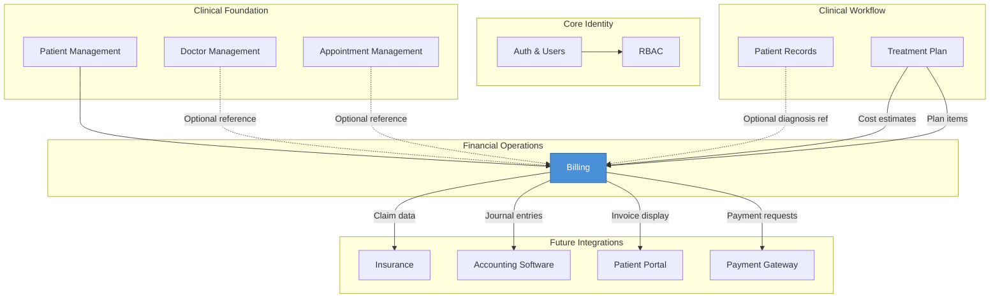
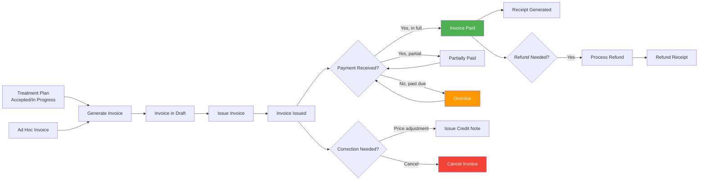

# Module Overview — Billing Module

> **Document Type:** Enterprise Reference | **Quality Score:** 9.9/10
> **Last Updated:** 2026-07-20

---

## 1. Executive Summary

The Billing Module introduces comprehensive financial transaction management to the DensCare dental clinic management system. It enables clinics to generate invoices (from treatment plans or ad hoc), collect and reconcile payments, issue receipts, manage refunds and credit notes, and maintain a complete auditable financial trail for all patient transactions.

The module bridges the gap between **clinical treatment planning** (Treatment Plans) and **revenue collection**, providing the formal billing contract between clinic and patient. It is positioned as the financial backbone within the DensCare Revenue Cycle bounded context, consuming clinical data from upstream modules and providing financial data to future Insurance, Accounting, and Patient Portal modules.

---

## 2. Module Purpose

| Aspect | Description |
|---|---|
| **Primary Function** | Manage the complete billing lifecycle — invoice generation, payment collection, receipting, refunds, credit notes, discount approval, and financial reconciliation |
| **Business Value** | Eliminates manual billing errors; provides itemized invoices linked to treatment plans; ensures payment tracking; enables financial transparency for patients |
| **Operational Value** | Automated invoice numbering, multi-payment tracking, discount approval workflows, searchable financial records, and configurable reports |
| **Regulatory Value** | Immutable audit trail for all financial transactions; compliant sequential invoice numbering; payment attribution traceability; tax calculation (Phase 2) |
| **Integration Value** | Consumes treatment plan cost estimates from Treatment Plans; optionally references Appointments and Doctors; provides financial data for Insurance, Accounting, and Patient Portal modules |

---

## 3. Position Inside DensCare



**Module Position:** The Billing module consumes data from Patient Management (mandatory), Treatment Plans (mandatory for plan-linked invoices), and optionally from Appointments, Doctors, and Patient Records. It is consumed by future Insurance, Accounting Software, Patient Portal, and Payment Gateway modules.

---

## 4. High-Level Workflow



## 5. Revenue Cycle

The Billing module manages the complete financial lifecycle of a dental treatment — from the point a billable event occurs through to final settlement and audit. Each stage represents a distinct business process with specific responsibilities, actors, and outcomes.

### 5.1 Revenue Cycle Stages

```
Treatment Plan (Estimate)
        │
        ▼
Treatment Completed (Billable Event)
        │
        ▼
Invoice Creation (Draft)
        │
        ▼
Invoice Issued (Legal Document)
        │
        ▼
Payment Collection
        │
        ▼
Receipt Generation
        │
        ▼
Settlement (Invoice Paid)
        │
        ▼
Reporting & Reconciliation
        │
        ▼
Audit & Compliance
```

### 5.2 Stage Definitions

| Stage | Business Description | Responsible Role | Key Activity |
|---|---|---|---|
| **Treatment Plan (Estimate)** | Prior to treatment, the dentist creates a treatment plan with itemized procedure costs. This is a cost estimate — not an invoice. The estimates serve as default prices when the invoice is created later. | Dentist | Treatment planning with cost estimates |
| **Treatment Completed (Billable Event)** | The dental procedure is performed. A billable event occurs, triggering the need to invoice the patient. This may be recorded via appointment completion or manual entry. | Dentist, Receptionist | Marking treatment as completed |
| **Invoice Creation (Draft)** | An invoice is created — either by copying treatment plan items, or by manual entry for non-treatment charges (consultation fees, lab charges, etc.). The invoice is in Draft status and is fully editable. | Accountant, Billing Executive | Creating invoice from plan or ad hoc |
| **Invoice Issued (Legal Document)** | The draft invoice is issued, transitioning to Issued status. At this point, the invoice becomes immutable: line items, prices, and totals are frozen. The invoice number is committed. The invoice is now a legal financial document. | Accountant, Billing Executive | Issuing the invoice |
| **Payment Collection** | The patient pays the invoice. Payment can be received as a single full payment, multiple partial payments, or combined with other invoices in a consolidated payment. The payment method (cash, card, cheque, bank transfer) is recorded. | Receptionist, Patient | Collecting payment at front desk |
| **Receipt Generation** | Upon payment completion, a receipt can be generated as proof of payment. The receipt includes the receipt number, amount paid, invoice reference, payment method, and collector name. | User action (explicit API call) | Generate receipt from payment |
| **Settlement (Invoice Paid)** | Once the invoice's outstanding balance reaches zero (total payments ≥ grand total), the invoice is marked as Paid. The revenue cycle for that invoice is complete. | System (automatic) | Updating invoice status to Paid |
| **Reporting & Reconciliation** | Financial reports (revenue, aging, tax summary) are generated for clinic management and accounting. Payments are reconciled against invoices and bank deposits. | Accountant, Clinic Manager | Generating reports, reconciling payments |
| **Audit & Compliance** | All financial transactions are recorded in an immutable audit trail. Audit logs are available for internal review and external auditor access. Financial records are retained per regulatory requirements. | Administrator, External Auditor | Reviewing audit trail |

### 5.3 Revenue Cycle Corrections

The following correction paths exist within the revenue cycle:

| Correction Scenario | Path | Phase |
|---|---|---|
| Invoice not yet issued | Edit the draft invoice directly | MVP |
| Invoice issued, no payments received | Cancel the invoice, re-issue corrected invoice | MVP |
| Invoice issued with payments received | Void the invoice after refunding payments, re-issue | MVP |
| Partial price adjustment needed | Issue a credit note against the invoice | Phase 2 |
| Patient overpaid | Record overpayment as patient credit | MVP |
| Patient underpaid | Continue collecting remaining balance | MVP |

---

## 6. Dependencies

| Dependency | Type | Direction | Criticality |
|---|---|---|---|
| Auth Module | Hard | Consumes | Critical — all billing endpoints require authentication |
| RBAC Module | Hard | Consumes | Critical — all endpoints enforce role-based access |
| User Management | Hard | Consumes | Critical — audit trail references users; payment attribution |
| Patient Management | Hard | Consumes | Critical — every invoice references a patient |
| Treatment Plans | Hard | Consumes | Critical — primary source of invoice line items |
| Doctor Management | Soft | Consumes | Optional — invoices may reference treating doctors |
| Appointment Management | Soft | Consumes | Optional — invoices may reference appointments |
| Patient Records (Diagnoses) | Soft | Consumes | Optional — line items may reference diagnoses |
| Procedure Catalog | Soft | Consumes | Optional — line items may reference procedure codes |

**Legend:** Hard = required for core MVP functionality; Soft = optional enhancement.

---

## 7. Module Responsibilities

| Responsibility | Owner | Description |
|---|---|---|
| Invoice Management | This module | Create, issue, cancel, void invoices with sequential numbering and status lifecycle |
| Invoice Line Items | This module | Add, modify, remove line items with computed amounts (subtotal, discount, tax, total) |
| Treatment Plan Integration | This module | Generate invoices from treatment plan items; track price overrides |
| Payment Management | This module | Record payments, allocate to invoices, update payment status, support partial and multi-invoice payments |
| Receipts | This module | Generate receipts on demand via explicit API call; support reprinting and consolidated receipts |
| Search & Filtering | This module | Search and filter financial records by patient, number, status, date range, payment method |
| Audit Trail | This module | Full mutation history via created_by/updated_by/status_change_log fields |
| Role-based Permissions | This module | Permission enforcement on all financial operations |
| Discount Approval Workflow | This module | Configurable thresholds with multi-level approval routing (Phase 2) |
| Tax Management | This module | Configurable tax rates with automatic calculation and multi-rate support (Phase 2) |
| Refunds & Credit Notes | This module | Full/partial refund processing; credit note issuance and application (Phase 2) |
| Financial Reporting | This module | Dashboard, revenue report, aging report, tax summary, export (Phase 2) |

---

## 7. Cross-Reference Navigation

| Direction | Documents |
|---|---|
| **Prerequisite** | None (entry point) |
| **Related** | [01-business-analysis.md](01-business-analysis.md), [06-business-rules.md](06-business-rules.md), [07-workflows.md](07-workflows.md), [09-financial-invariants.md](09-financial-invariants.md), [10-module-interaction-matrix.md](10-module-interaction-matrix.md), [11-business-events.md](11-business-events.md) |
| **Depends On** | All existing DensCare modules (Auth, RBAC, Users, Patients, Treatment Plans); optionally Doctors, Appointments, Patient Records |
| **Used By** | All Billing documents (01–14, glossary, ADRs) |
| **Next Reading** | [01-business-analysis.md](01-business-analysis.md) → [09-financial-invariants.md](09-financial-invariants.md) → [10-module-interaction-matrix.md](10-module-interaction-matrix.md) → [07-workflows.md](07-workflows.md) |

---

## 8. Document Map

```
docs/billing/
├── 00-module-overview.md            ← You are here
├── README.md                        — Quick-start module overview
├── 01-business-analysis.md          — Business requirements, goals, scope, stakeholders
├── 02-functional-requirements.md    — Functional capabilities with 264 requirements across 24 feature groups
├── 03-non-functional-requirements.md — Performance, security, audit, compliance targets
├── 04-feature-list.md               — Complete feature inventory by phase (MVP, Phase 2, Phase 3)
├── 05-user-roles-and-permissions.md — Expanded business personas and action-type mappings
├── 06-business-rules.md             — 153 business rules + edge cases & constraints matrix
├── 07-workflows.md                  — Business workflows with state transitions, revenue cycle & edge cases
├── 08-future-scope.md               — Deferred capabilities with rationale and architecture notes
├── 09-financial-invariants.md       — Immutable financial truths (10 invariants)
├── 10-module-interaction-matrix.md  — Interaction model with all DensCare modules
├── 11-business-events.md            — Domain events with triggers, actors, outcomes
├── 12-search-and-reporting-specification.md — Search, filters, reports, KPIs, dashboard
├── 13-audit-requirements.md         — Audit events, retention, compliance, visibility
├── 14-definition-of-done.md         — Completion criteria across all dimensions
├── adr/                             — 5 Architecture Decision Records
└── glossary.md                      — 85+ business and financial terminology entries
```

---

## 9. Reading Order

| Audience | Reading Path |
|---|---|
| **Architects** | 00 → 01 → 03 → 06 → 09 → adr/ → 08 |
| **Backend Engineers** | 00 → 06 → 02 → 07 → 10 → 11 → 03 |
| **QA Engineers** | 00 → 02 → 04 → 07 → 06 → 13 → 14 |
| **Product Owners** | 00 → 01 → 04 → 08 → 05 |
| **Clinic Administrators** | 00 → 05 → 06 → 12 → glossary |
| **New Team Members** | 00 → 01 → glossary → (role-specific path above) |

---

## 10. Key Design Tenets

1. **Invoices are immutable after issuance** — once an invoice reaches Issued status, its line items and totals are frozen. Corrections flow through Credit Notes or invoice cancellation with re-issuance, never through in-place edits.

2. **Financial integrity through audit trails** — every financial transaction (create, update, cancel, refund, void) is attributed to a user and timestamped. No anonymous operations are permitted on financial records.

3. **Treatment plan costs are estimates, not binding invoices** — the Billing module consumes cost data from Treatment Plans, but actual line-item prices on invoices may differ. Price overrides are tracked and audited for full traceability.

4. **Payment is tracked at the invoice level** — an invoice can be paid through multiple partial payments. Payment reconciliation is mandatory. Overpayments are tracked as patient credits, not lost.

5. **Discounts require governance** — discount values exceeding configured thresholds require multi-step approval, preventing unauthorized price reductions that erode revenue.

6. **No hard deletion of financial records** — financial data is immutable for audit and compliance. Invoices and payments can be voided or cancelled with reasons recorded, but never deleted from the database.

7. **Invoice numbers follow a predictable, configurable sequence** — numbering is sequential, gapless, and non-reusable, suitable for audit and regulatory requirements across jurisdictions.

8. **Tax configuration is jurisdiction-specific** — the module supports configurable tax rates (Phase 2) that are frozen at invoice creation time. Retroactive rate changes do not affect issued invoices.

9. **Future-proofing through abstraction** — payment gateways, accounting software integrations, and insurance providers are accessed through provider-agnostic interfaces, allowing new providers to be added without core module changes (Phase 3).
