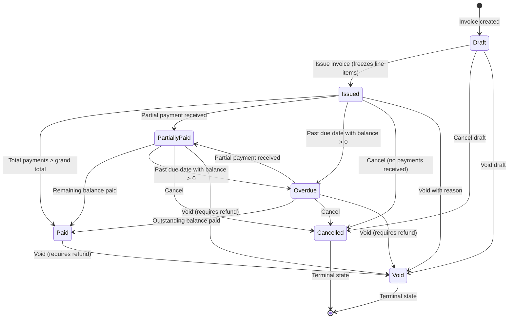
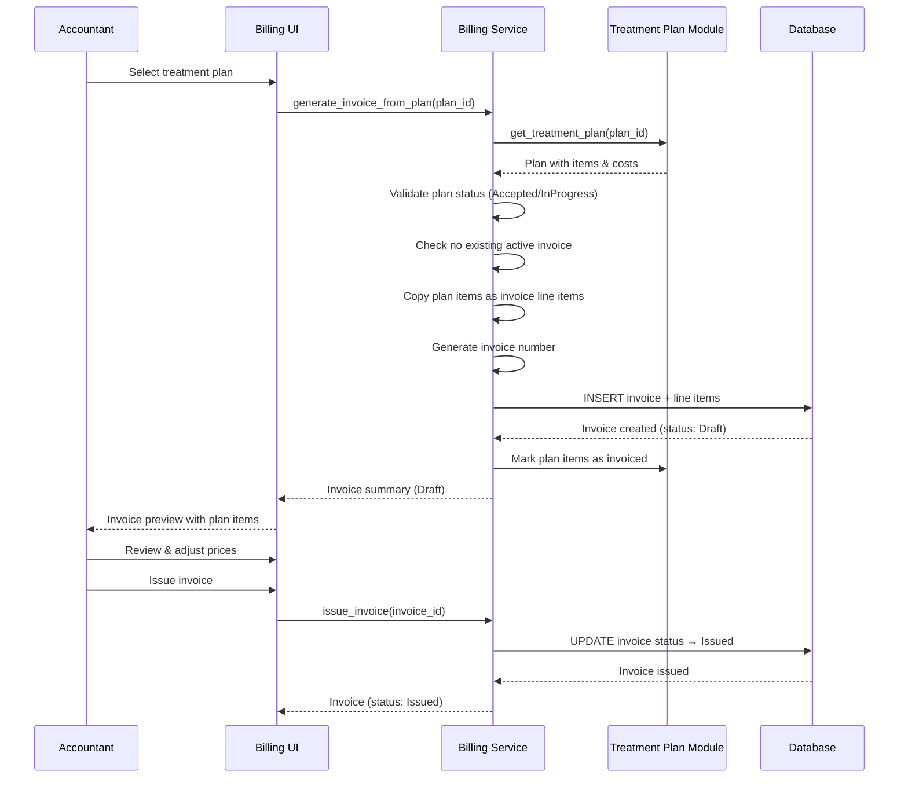
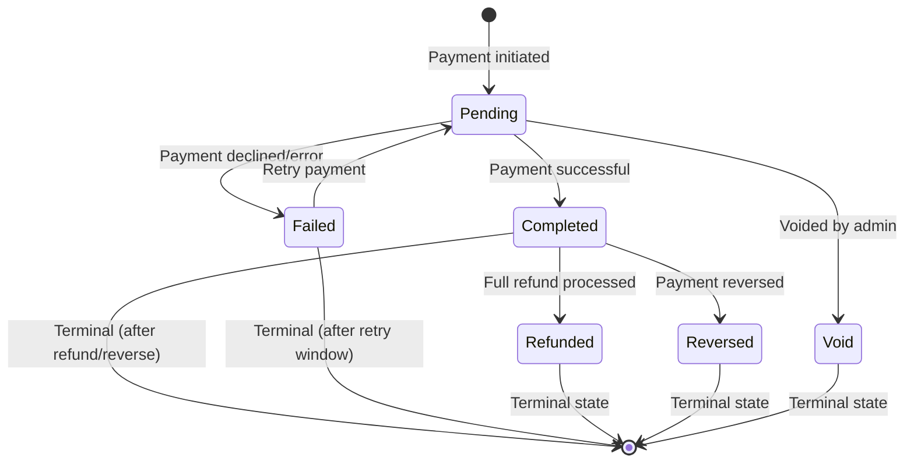
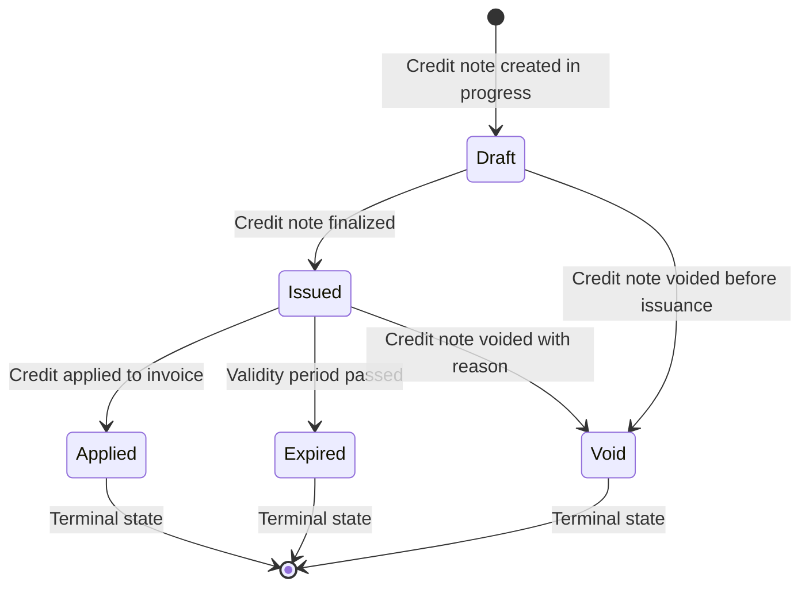

# Business Workflows — Billing Module

> **Document Type:** Workflow Specification
> **Status:** DRAFT | **Target Quality Score:** 9.9/10
> **Audience:** Business analysts, developers, QA engineers, product owners
> **Convention:** Workflows are described in narrative form with actors, preconditions, steps, and postconditions.

| Field | Value |
|---|---|
| Document | Business Workflows |
| Module | Billing |
| Version | 1.0 |
| Status | Draft |
| Owner | Engineering Team |
| Last Updated | 2026-07-20 |
| Related Documents | 02-functional-requirements.md, 06-business-rules.md, glossary.md |

---

## Table of Contents

1. [Invoice Status Lifecycle Diagram](#invoice-status-lifecycle-diagram)
2. [Workflow 1: Invoice Creation](#workflow-1-invoice-creation)
3. [Workflow 2: Treatment Plan Billing](#workflow-2-treatment-plan-billing)
4. [Workflow 3: Payment Collection](#workflow-3-payment-collection)
5. [Workflow 4: Receipt Issuance](#workflow-4-receipt-issuance)
6. [Workflow 5: Invoice Cancellation](#workflow-5-invoice-cancellation)
7. [Workflow 6: Invoice Voiding](#workflow-6-invoice-voiding)
8. [Workflow 7: Discount Approval (Phase 2)](#workflow-7-discount-approval-phase-2)
9. [Workflow 8: Refund Processing (Phase 2)](#workflow-8-refund-processing-phase-2)
10. [Workflow 9: Credit Note Issuance (Phase 2)](#workflow-9-credit-note-issuance-phase-2)
11. [Workflow 10: Overdue Invoice Handling (Phase 2)](#workflow-10-overdue-invoice-handling-phase-2)

---

## Invoice Status Lifecycle Diagram

### State Diagram



### Key Transition Rules

| From | To | Trigger | Condition |
|---|---|---|---|
| Draft | Issued | Issue | Invoice has ≥1 line item |
| Draft | Cancelled | Cancel | Always allowed |
| Issued | Paid | Payment | Sum of payments ≥ grand total |
| Issued | PartiallyPaid | Payment | Payment < outstanding balance |
| Issued | Overdue | Time elapsed | Due date passed + balance > 0 |
| Issued | Cancelled | Cancel | No payments received |
| Issued → Paid/PartiallyPaid → Void | Void | Void | Payments refunded first |

---

### Treatment Plan Billing Sequence



### Payment Collection Sequence

```mermaid
sequenceDiagram
    participant User as Receptionist
    participant UI as Billing UI
    participant Service as Billing Service
    participant DB as Database

    User->>UI: Search for patient
    UI->>Service: search_patients(name)
    Service-->UI: Matching patients list
    UI--→User: Select patient

    User->>UI: Enter payment amount, method, date
    UI->>Service: create_payment(patient_id, amount, method, date)

    Service->>Service: Validate payment amount > 0
    Service->>DB: INSERT payment record (status=pending)
    DB--→Service: Payment created
    Service--→UI: Payment created (pending)

    opt Allocate to invoice(s)
        User->>UI: Select invoice(s) to allocate
        UI->>Service: allocate_payment(payment_id, invoice_id, amount)
        Service->>DB: INSERT payment_allocation
        Service->>DB: UPDATE invoice outstanding balance
        Service--→UI: Allocation confirmed
    end

    User->>UI: Confirm payment completion
    UI->>Service: complete_payment(payment_id)
    Service->>Service: Validate status transition pending → completed
    Service->>DB: UPDATE payment status → completed
    Service--→UI: Payment completed

    opt Generate Receipt
        User->>UI: Generate receipt
        UI->>Service: generate_receipt(payment_id)
        Service->>Service: Validate payment is completed
        Service->>DB: INSERT receipt (status=generated)
        Service--→UI: Receipt created
        UI--→User: Receipt displayed for printing
    end
```

---

### Payment State Transitions

In addition to invoice status transitions, the Payment and Credit Note entities have their own state machines:

#### Payment Status Lifecycle



**Valid Transitions:**

| From | To | Trigger | Condition |
|---|---|---|---|
| Pending | Completed | Confirmation | Payment successfully processed |
| Pending | Failed | Declined | Payment gateway rejection or timeout |
| Pending | Void | Admin action | Voided before completion |
| Completed | Refunded | Full refund | Full refund processed |
| Completed | Reversed | Reversal | Payment reversed |
| Failed | Pending | Retry | Retry after failure |

**Invalid Transitions:**

| From | To | Reason |
|---|---|---|
| Completed | Pending | Cannot revert a completed payment to pending |
| Failed | Completed | A failed payment cannot be retroactively marked successful |
| Refunded | Completed | A fully refunded payment is terminal |
| Void | Completed | A voided payment cannot be completed |

#### Credit Note Status Lifecycle



**Valid Transitions:**

| From | To | Trigger | Condition |
|---|---|---|---|
| Draft | Issued | Issue | Credit note details finalized |
| Draft | Void | Void | Always allowed |
| Issued | Applied | Apply | Credit applied to invoice |
| Issued | Expired | Time elapsed | Validity period passed with balance > 0 |
| Issued | Void | Void | Always allowed |

**Invalid Transitions:**

| From | To | Reason |
|---|---|---|
| Draft | Applied | Cannot apply a credit note that hasn't been issued |
| Applied | Issued | Once applied, credit note is terminal |
| Expired | Applied | An expired credit note cannot be used |
| Void | Issued | Voided credit note is terminal |
| Expired | Void | Already in terminal state |

---

## Workflow 1: Invoice Creation

**Actors:** Accountant, Billing Manager
**Phase:** MVP

### Description

An invoice is created to bill a patient for dental services rendered. The invoice can be created from scratch (ad hoc) or generated from a treatment plan (see Workflow 2).

### Preconditions

- The patient record exists in the Patient Management module.
- The user is authenticated and has permission to create invoices.
- If generating from a treatment plan, the plan exists and is in Accepted or In Progress status.

### Workflow Steps

1. **User initiates invoice creation** — The user selects the patient and chooses to create a new invoice.
2. **System presents invoice form** — The system displays a blank invoice with default values:
   - Invoice date: current date
   - Due date: current date + configured payment terms (e.g., 30 days)
   - Invoice number: pre-generated from the sequential number generator
   - Currency: clinic default
3. **User adds line items** — The user adds one or more line items to the invoice. Each line item includes:
   - Description (required; can be free text or selected from a procedure catalog)
   - Quantity (default 1)
   - Unit price (required; can be entered manually or sourced from a treatment plan)
   - Discount (optional; fixed amount or percentage)
   - Tax rate (optional; selected from configured tax rates; Phase 2)
4. **System computes amounts in real time** — As the user adds or modifies line items, the system computes:
   - Line item net amount = (unit price × quantity) − discount
   - Line item tax amount = net amount × (tax rate / 100) [Phase 2]
   - Subtotal = sum of (unit price × quantity)
   - Total discount = sum of all line item discounts
   - Total tax = sum of all line item tax amounts [Phase 2]
   - Grand total = subtotal − total discount + total tax
5. **User optionally adds notes** — The user can add invoice-level notes, terms and conditions, and reference an appointment or treating doctor.
6. **User saves as Draft** — The invoice is saved in Draft status. It can be edited later.
7. **User reviews the invoice** — Before issuing, the user can preview the invoice and verify all amounts.
8. **User issues the invoice** — The user issues the invoice, transitioning it to Issued status. At this point:
   - The invoice is frozen — no further line item edits are permitted.
   - The invoice number is committed permanently.
   - The invoice becomes available for payment collection.

### Postconditions

- Invoice exists in Issued status with all line items, computed totals, and metadata.
- Invoice number is committed to the sequence.
- Invoice is available for payment, search, and reporting.
- If generated from a treatment plan, the plan items are marked as invoiced.

### Exception Paths

- **Validation failure** — If required fields are missing (e.g., no line items, no patient), the system prevents save and displays field-level errors.
- **Duplicate patient selection error** — Cannot select a non-existent or inactive patient.
- **Concurrent invoice creation** — If two users attempt to create invoices simultaneously, the number sequence generator ensures no duplicates.

---

## Workflow 2: Treatment Plan Billing

**Actors:** Accountant, Billing Manager
**Phase:** MVP

### Description

An invoice is generated directly from an accepted or in-progress treatment plan, converting the plan's itemized cost estimates into invoice line items. This is the primary mechanism for billing treatment-related procedures.

### Preconditions

- The treatment plan exists and is in Accepted or In Progress status.
- The treatment plan does not already have an active (non-cancelled, non-voided) invoice.
- The patient associated with the treatment plan is active.

### Workflow Steps

1. **User selects treatment plan** — The user navigates to the treatment plan and selects "Generate Invoice."
2. **System displays treatment plan items as invoice line item defaults** — The system presents a pre-populated invoice with:
   - Patient information from the treatment plan's patient
   - Line items copied from treatment plan items, including:
     - Description (procedure name)
     - Quantity (default 1)
     - Unit price (copied from treatment plan estimated cost)
     - Reference to original treatment plan item ID
3. **User reviews and adjusts** — The user can:
   - Modify unit prices (overrides are tracked with original and new values)
   - Add additional line items not in the treatment plan
   - Remove line items (if partial billing is desired)
   - Adjust quantities
   - Apply discounts
   - Select applicable tax rates (Phase 2)
4. **User selects billing mode** — The user chooses either:
   - **Full billing**: Invoice all treatment plan items
   - **Partial billing**: Invoice only selected items; remaining items stay available for future invoices
5. **System validates** — The system verifies that:
   - No duplicate invoice exists for this treatment plan
   - All selected plan items are eligible for invoicing
   - Patient is active
6. **User saves as Draft** — Invoice is created in Draft status for review.
7. **User issues the invoice** — Invoice transitions to Issued status.

### Postconditions

- Invoice is created with line items from the treatment plan.
- Billed treatment plan items are marked as "Invoiced."
- Treatment plan shows linkage to the invoice.
- Price overrides (if any) are recorded in the audit trail.

### Business Rules Applied

- BR-120: Plan must be Accepted or In Progress.
- BR-121: Maximum one active invoice per plan.
- BR-122: Plan items marked as invoiced.
- BR-123: Plan costs default into invoice.
- BR-124: Price overrides tracked.
- BR-125: Partial billing supported.
- BR-126: Multiple plans on one invoice.

### Exception Paths

- **Plan has existing active invoice** — System prevents duplicate billing and notifies the user.
- **Plan items already invoiced** — System warns if some items were previously billed.
- **Patient inactive** — System prevents invoice creation for inactive patients.

---

## Workflow 3: Payment Collection

**Actors:** Receptionist, Accountant, Billing Manager
**Phase:** MVP

### Description

A payment is collected from a patient against one or more invoices. The payment method, amount, and allocation are recorded, and the invoice payment status is updated.

### Preconditions

- At least one invoice exists in Issued (or later) status with an outstanding balance > 0.
- The user is authenticated and has permission to record payments.

### Workflow Steps

1. **User locates the invoice** — The user searches for the invoice by patient name, invoice number, or other criteria.
2. **User selects "Record Payment"** — The system displays the payment entry form.
3. **User enters payment details**:
   - Payment amount (required; must be > 0)
   - Payment method (required; select from: Cash, Card, Cheque, Bank Transfer, Other)
   - Reference number (optional; e.g., cheque number, card transaction ID)
   - Payment date (defaults to current date)
   - Notes (optional)
4. **User allocates payment to invoice(s)**:
   - **Single invoice payment**: The user allocates the full payment to one invoice.
   - **Partial payment**: The user enters an amount less than the invoice total; the invoice remains with a balance.
   - **Overpayment**: If the payment exceeds the invoice total, the system flags this as an overpayment and offers to create a credit balance.
   - **Multi-invoice payment**: The user allocates portions of the payment to multiple invoices.
5. **System validates the payment**:
   - Payment amount > 0
   - Allocated amounts sum to total payment
   - Invoice balances are sufficient (unless overpayment explicitly confirmed)
6. **User confirms payment** — The payment is recorded.
7. **System updates invoice status** (if applicable):
   - If total payments ≥ invoice grand total → status changes to Paid
   - If partial payment → status changes to Partially Paid
   - If overpayment → overpayment amount recorded as patient credit
8. **System generates receipt** (see Workflow 4).

### Postconditions

- Payment is recorded with full details and audit trail.
- Invoice payment status is updated.
- Receipt is generated.
- Patient credit balance is updated (if overpayment occurred).

### Exception Paths

- **Payment exceeds outstanding balance without confirmation** — System requires explicit overpayment confirmation.
- **Invalid payment method** — System validates against configured payment methods.
- **Payment allocation does not sum** — System prevents submission if allocated amount ≠ payment amount.

---

## Workflow 4: Receipt Issuance

**Actors:** Receptionist, Accountant
**Phase:** MVP

### Description

A receipt is generated via an explicit API call for a completed payment. The receipt serves as the patient's formal proof of payment.

### Preconditions

- A payment has been successfully recorded and completed (see Workflow 3).

### Workflow Steps

1. **Payment is completed** — The payment is recorded and transitioned to Completed status.
2. **User generates receipt** — The user calls `POST /billing/receipts` with the payment_id:
   - Receipt number is generated from the sequential receipt number series.
   - Receipt date is set to the payment date.
   - Receipt includes:
     - Patient name and identifier
     - Receipt number and date
     - Invoice number(s) and amount(s)
     - Payment amount
     - Payment method
     - Payment reference (if applicable)
     - Collector name (user who recorded the payment)
3. **System stores the receipt** — Receipt is stored for future retrieval and reprinting.
4. **System makes receipt available** — The receipt can be:
   - Viewed on screen
   - Printed (physical copy for the patient)
   - Sent via email (Phase 3 — Notifications)

### Postconditions

- Receipt exists with unique number and full payment details.
- Receipt is re-printable at any time.
- Receipt is linked to the payment and invoice records.

### Exception Paths

- **Payment not completed** — Receipt generation fails with a validation error if the payment is not in Completed status.
- **Receipt already exists** — A payment can have at most one active receipt.
- **Manual retry** — If receipt generation fails, the user can retry from the payment record.

---

## Workflow 5: Invoice Cancellation

**Actors:** Accountant, Billing Manager, Clinic Administrator
**Phase:** MVP

### Description

An issued invoice that has not received any payments is cancelled. Cancellation is distinct from voiding (see Workflow 6) and is used when an invoice was issued in error but no money changed hands.

### Preconditions

- Invoice exists in Issued status.
- No payments have been recorded against the invoice.
- User has permission to cancel invoices.

### Workflow Steps

1. **User locates the invoice** — The user searches for the invoice to cancel.
2. **User verifies no payments received** — The system confirms that no payments exist against this invoice.
3. **User selects "Cancel Invoice"** — The system prompts for confirmation.
4. **User enters cancellation reason** — A mandatory reason field is displayed.
5. **User confirms cancellation** — The invoice transitions to Cancelled status.
6. **System records the cancellation** — The status change is recorded with old status, new status, user, timestamp, and cancellation reason.

### Postconditions

- Invoice is in Cancelled status.
- Invoice number is retired (not reusable).
- Invoice data remains visible for audit purposes.
- If the invoice was linked to a treatment plan, the plan items are marked as no longer invoiced (available for re-invoicing).

### Exception Paths

- **Payments exist** — User cannot cancel; must process refund first, then void.
- **Already cancelled or voided** — System prevents re-cancellation.

---

## Workflow 6: Invoice Voiding

**Actors:** Accountant (with approval), Clinic Administrator
**Phase:** MVP

### Description

An invoice that has received payments but needs to be invalidated is voided. Voiding requires refunding any payments first and requires elevated permissions.

### Preconditions

- Invoice exists in Issued, Partially Paid, or Paid status.
- If payments exist, they must be refunded (see Workflow 8) or reversed before voiding.
- User has elevated permission to void invoices.

### Workflow Steps

1. **User locates the invoice** — The user searches for the invoice to void.
2. **User reviews payment status**:
   - If no payments → invoice can be cancelled (simpler path, see Workflow 5).
   - If payments exist → refund must be processed first.
3. **User processes refunds** — User initiates refund(s) for all payments against the invoice (see Workflow 8).
4. **User selects "Void Invoice"** — After all payments are refunded, the user selects void.
5. **User enters void reason** — Mandatory reason field.
6. **User confirms void** — Invoice transitions to Void status.

### Postconditions

- Invoice is in Void status.
- All payments against the invoice have been refunded.
- Invoice number is retired (not reusable).
- Invoice data remains visible for audit.
- Void is recorded with user, timestamp, and reason.

### Exception Paths

- **Unrefunded payments** — System prevents voiding until all payments are refunded.
- **Approval required** — Voiding an invoice with payments may require secondary approval (configurable).

---

## Workflow 7: Discount Approval (Phase 2)

**Actors:** Accountant (requester), Billing Manager / Clinic Administrator (approver)
**Phase:** Phase 2

### Description

When a discount exceeds the configured threshold (percentage of subtotal and/or fixed amount), it requires approval before it can be applied to an invoice.

### Preconditions

- An invoice is being created or edited in Draft status.
- A line-item-level or invoice-level discount is applied that exceeds the configured threshold.
- The discount approval feature is enabled and thresholds are configured.

### Workflow Steps

1. **User applies a discount** — While creating or editing an invoice, the user enters a discount (percentage or fixed amount) that exceeds the configured threshold.
2. **System flags discount for approval** — The discount is recorded as "pending approval" and is not yet applied to the invoice total.
3. **System creates approval request** — An approval request is created with:
   - Requested by (user)
   - Discount amount/percentage
   - Relevant invoice and line item details
   - Reason for discount
   - Timestamp
4. **System routes approval request** — The request is routed to the configured approver (e.g., Billing Manager, Clinic Administrator).
5. **Approver reviews request** — The approver reviews the discount details, invoice context, and reason.
6. **Approver decides**:
   - **Approve**: Discount is applied to the invoice. Approval decision recorded with user, timestamp, and optional notes.
   - **Reject**: Discount is removed. User must adjust or remove the discount. Rejection recorded with reason.
   - **Escalate**: If configured, the request can be escalated to a higher-level approver (e.g., Clinic Administrator).
7. **User is notified of decision** — The requesting user is notified that the discount was approved or rejected.
8. **Invoice is updated** — If approved, the discount is applied and the invoice totals are recalculated. If rejected, the user must take corrective action.

### Postconditions

- Discount is either applied (approved) or removed (rejected).
- Approval/rejection is recorded in the audit trail.
- Invoice totals reflect the approved discount.

### Exception Paths

- **Approval request expires** — If the approver does not act within the configured period, the request expires. The user must re-request.
- **Multiple over-threshold discounts** — Each discount is evaluated independently against the threshold.

---

## Workflow 8: Refund Processing (Phase 2)

**Actors:** Accountant, Billing Manager
**Phase:** Phase 2

### Description

A refund is processed when a patient is owed money back — due to overpayment, treatment cancellation, billing error, or other reasons.

### Preconditions

- A payment exists against an invoice.
- The user has permission to process refunds.
- If the refund exceeds a configurable threshold, approval has been obtained.

### Workflow Steps

1. **User locates the payment** — The user searches for the payment record or invoice.
2. **User selects "Process Refund"** — The system displays the refund form.
3. **User enters refund details**:
   - Refund amount (must not exceed the original payment amount)
   - Refund reason (required)
   - Refund method (where trackable: original payment method, cash, etc.)
   - Authorization reference (if applicable)
4. **System checks refund threshold**:
   - If refund ≤ threshold → proceeds directly.
   - If refund > threshold → approval workflow triggered (similar to Workflow 7).
5. **User confirms refund** — The refund is processed.
6. **System processes refund**:
   - Payment is partially or fully reversed.
   - Invoice outstanding balance is recalculated.
   - If full refund and no remaining payments → invoice reverts to Issued status.
   - If partial refund → invoice remains in Partially Paid or Paid status (adjusted).
7. **System generates refund receipt** — A refund receipt is created.

### Postconditions

- Payment is reversed (fully or partially).
- Invoice balance is recalculated.
- Refund receipt is generated.
- Audit record of refund is created.

### Exception Paths

- **Refund exceeds original payment** — System rejects.
- **Payment already fully refunded** — System prevents double refund.
- **Threshold exceeded without approval** — System blocks until approval is obtained.

---

## Workflow 9: Credit Note Issuance (Phase 2)

**Actors:** Accountant, Billing Manager
**Phase:** Phase 2

### Description

A credit note is issued to correct an invoice — for price adjustments, returned services, or billing errors. The credit note can be applied to outstanding invoices or left as a patient credit.

### Preconditions

- An invoice exists (any status).
- The user has permission to issue credit notes.

### Workflow Steps

1. **User locates the invoice** — The user searches for the invoice requiring correction.
2. **User selects "Issue Credit Note"** — The system presents a credit note form pre-populated with invoice details.
3. **User enters credit note details**:
   - Credit amount (full or partial invoice amount)
   - Credit reason (required; e.g., "Price adjustment — incorrect rate applied," "Service not completed")
   - Line items affected (optional; select specific items for partial credits)
4. **User confirms issuance** — The credit note is issued with a unique credit note number.
5. **System records the credit note** — The credit note is stored referencing the original invoice.
6. **User applies the credit note** (optional):
   - **Apply to outstanding invoices**: The credit is applied to reduce the balance of one or more outstanding invoices for the same patient.
   - **Leave as patient credit**: The credit remains available for future invoicing.
7. **System updates balances**:
   - If applied to an invoice, the invoice outstanding balance is reduced.
   - If left as patient credit, the patient's credit balance is increased.

### Postconditions

- Credit note is issued with unique number and full details.
- Credit note is linked to the original invoice.
- Invoice balance or patient credit balance is adjusted.
- Credit note has a configurable expiry date.

### Exception Paths

- **Credit exceeds invoice total** — System prevents (partial credit only).
- **Credit note expired** — System prevents application of expired credit notes.
- **Invoice already fully credited** — System prevents duplicate full credits.

---

## Workflow 10: Overdue Invoice Handling (Phase 2)

**Actors:** System (automatic), Accountant
**Phase:** Phase 2

### Description

When an invoice passes its due date with an outstanding balance, it is marked as Overdue. The system tracks overdue invoices for reporting and escalation.

### Preconditions

- Invoice exists in Issued or Partially Paid status.
- The due date has passed.
- The outstanding balance > 0.

### Workflow Steps

1. **System checks for overdue invoices** — A scheduled process (or on-demand check) identifies invoices past due with outstanding balance.
2. **System updates status** — Each qualifying invoice is transitioned to Overdue status.
3. **System records the transition** — The status change is recorded with the system as the actor.
4. **System makes overdue data available** — Overdue invoices appear in:
   - Receivables aging report (Phase 2)
   - Patient financial summary (Phase 2)
   - Overdue invoice list in the billing UI
5. **Accountant reviews overdue invoices** — The accountant can:
   - Contact the patient for payment
   - Apply credit notes if applicable
   - Process payment if the patient pays
6. **When payment is received**, the invoice transitions from Overdue → Paid (or Partially Paid).

### Postconditions

- Overdue invoices are identified and reported.
- Overdue status is visible in search and reports.
- Receivables aging data is updated.

### Exception Paths

- **Payment arrangement** — If a payment arrangement is made (tracked manually in Phase 2), the invoice remains Overdue but may be noted.
- **Disputed invoice** — The accountant can add notes explaining the dispute status.

---

## Cross-Reference Navigation

| Direction | Documents |
|---|---|
| **Prerequisite** | [01-business-analysis.md](01-business-analysis.md), [02-functional-requirements.md](02-functional-requirements.md) |
| **Related** | [06-business-rules.md](06-business-rules.md), [05-user-roles-and-permissions.md](05-user-roles-and-permissions.md) |
| **Next Reading** | [08-future-scope.md](08-future-scope.md) → [glossary.md](glossary.md) |
