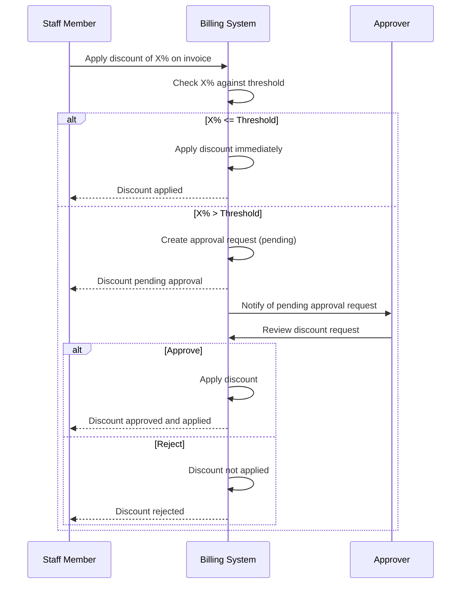

# ADR-005: Discount Approval Workflow

| Field | Value |
|---|---|
| **ADR ID** | ADR-005 |
| **Status** | Proposed |
| **Date** | 2026-07-20 |
| **Module** | Billing |
| **Phase** | Phase 2 |
| **Deciders** | Engineering Team |

---

## Context

Discounts on invoices reduce clinic revenue. Unauthorized or excessive discounting — whether intentional (friendly discounts) or unintentional (data entry errors) — directly impacts the clinic's bottom line. The Billing module must support discounting (it's a legitimate business practice) but provide controls to prevent abuse.

The challenge is to balance operational flexibility (receptionists need to apply reasonable discounts without delay) with financial control (large discounts require supervisory approval).

## Problem

How should discount application be controlled to prevent unauthorized revenue erosion while maintaining operational efficiency for reasonable discounts?

## Options Considered

| Option | Description | Pros | Cons |
|---|---|---|---|
| **A: Configurable thresholds with approval routing** | Discounts below threshold are applied immediately. Discounts above threshold require approval from a designated approver. Thresholds are configurable per clinic. | Balances flexibility and control; configurable without code changes; audit trail for approvals | Requires notification infrastructure; approval routing adds latency for above-threshold discounts |
| **B: Hard-coded maximum discount** | A single system-wide maximum discount percentage (e.g., 10%). No discounts above this value are allowed. | Simple to implement; no approval workflow needed; no notifications | Inflexible — clinics cannot offer legitimate large discounts; staff cannot accommodate special cases |
| **C: No discount control** | Any user with invoice edit permission can apply any discount amount. | Maximum flexibility; no implementation complexity | No financial control; high risk of revenue leakage; no audit trail; cannot detect abuse |
| **D: Role-based discount limits** | Each role has a maximum discount they can apply (e.g., Receptionist: 5%, Accountant: 15%, Admin: unlimited). | Role-appropriate limits; no approval delays for in-role discounts | Hard to change limits (require code or config update); doesn't handle exceptions; receptionist cannot apply 10% even if clinic policy allows it |
| **E: Multi-level approval with escalation** | Discount exceeds Tier 1 threshold → Manager approval. Exceeds Tier 2 → Director approval. Escalation if no response. | Strongest control; handles extreme cases | Complex setup; operational overhead for rare cases; most clinics don't need multi-level |

## Decision

**Option A: Configurable thresholds with single-level approval routing.**

## Rationale

- **Balance of concerns:** Option A provides financial control without excessive operational overhead. Most discounts (those below threshold) are applied immediately. Only exceptions require approval.
- **Configurability:** Thresholds are configurable via admin UI (percentage and/or fixed amount). Each clinic sets their own thresholds based on their business needs.
- **Single-level approval:** For Phase 2, a single approval level (Billing Manager or Clinic Administrator) is sufficient. Multi-level escalation (Option E) is reserved for Phase 3 or specific deployment needs.
- **Audit trail:** Every discount — whether auto-approved or manually approved — is recorded with user, amount, reason, and timestamp. Above-threshold discounts additionally record the approver and approval decision.
- **Existing DensCare pattern:** The Treatment Plan module's state machine (ADR-003) uses a similar config-driven validation approach. The discount approval mechanism follows the same architectural style.

## Consequences

### Positive
- Operational flexibility — routine discounts proceed without delay
- Financial control — large discounts require documented approval
- Configurable thresholds — adaptable per clinic without code changes
- Full audit trail — all discount decisions recorded
- No dependency on external notification infrastructure in MVP (approval requests are viewed in-app)

### Negative
- Above-threshold discounts experience workflow latency (request → approve → apply)
- Requires in-app notification or a dashboard for pending approvals
- Staff must understand the threshold configuration relevant to their role

## Approval Workflow

## Configuration

Default thresholds (recommended starting values):

| Parameter | Default | Description |
|---|---|---|
| Discount percentage threshold | 10% | Discounts above 10% of line item/invoice subtotal require approval |
| Fixed amount threshold | $50.00 | Discounts above $50 require approval (whichever threshold is exceeded first) |
| Approval expiry | 48 hours | Pending approvals auto-expire after this period |
| Allow escalation | No | Phase 2 — single-level only |

All values are configurable via the admin UI.

## Alternatives Rejected

**Option B (Hard-coded maximum)** was rejected because it is too inflexible. Clinics may have legitimate reasons for large discounts (loyalty programs, hardship cases, promotional pricing, insurance adjustments).

**Option C (No control)** was rejected because it provides no financial governance. Even with a trustworthy staff, data entry errors can result in unintended large discounts.

**Option D (Role-based limits)** was rejected because they cannot handle legitimate exceptions. If a receptionist needs to apply a 15% discount for a special promotion, role-based limits block it, forcing escalation to a manager anyway — essentially replicating Option A with less flexibility.

**Option E (Multi-level escalation)** was rejected for Phase 2 as over-engineered. Single-level approval covers the vast majority of clinic scenarios. Multi-level escalation can be added in Phase 3 if needed.

## Future Considerations

When the Notification module is available (Phase 3), approval requests should trigger email or in-app notifications to approvers. The Phase 2 implementation relies on in-app pending-approval views.

Multi-level escalation (Option E) can be added in Phase 3 by introducing a `next_approver` field on the approval request and a cascading approval chain configuration.

## Related ADRs

- ADR-001 (Invoice as Aggregate Root) — discount is a property of line items within the Invoice aggregate
- ADR-002 (Immutable Invoice After Issuance) — discount approval must occur before invoice is issued
- ADR-004 (Payment Allocation Model) — discounts affect the grand total and thus payment allocations
