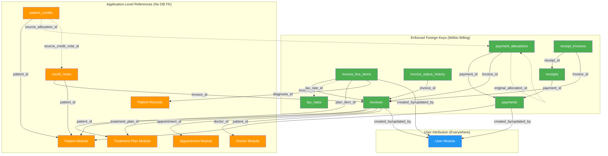

# Foreign Key Map — Billing Module

> **Document Type:** Architecture Diagram (Mermaid)
> **Last Updated:** 2026-07-20

## Foreign Key Relationship Map

## FK Enforcement Summary

| Type | Count | Tables |
|---|---|---|
| Enforced (within Billing schema) | 9 | All composition relationships within Billing |
| Application-level (to external modules) | 14 | patient_id, treatment_plan_id, doctor_id, appointment_id, plan_item_id, diagnosis_id |
| User references | 4 per table | created_by, updated_by |

## FK Enforcement Rules

| Rule | Description |
|---|---|
| **Composition FKs** | Always enforced with RESTRICT. Parent cannot be deleted while children exist. |
| **Reference FKs** | Always enforced with RESTRICT. Referenced record cannot be deleted while references exist. |
| **Self-referencing FKs** | `original_allocation_id` uses SET NULL — refund allocation can exist without the original (if original was deleted — though this should not happen). |
| **External UUID references** | No FK constraint. Application validates existence before creating records. |

## Cross-Reference

| Direction | Document |
|---|---|
| **Part of** | [04-primary-and-foreign-keys.md](../04-primary-and-foreign-keys.md) |
| **Related** | [03-table-specifications.md](../03-table-specifications.md) |
