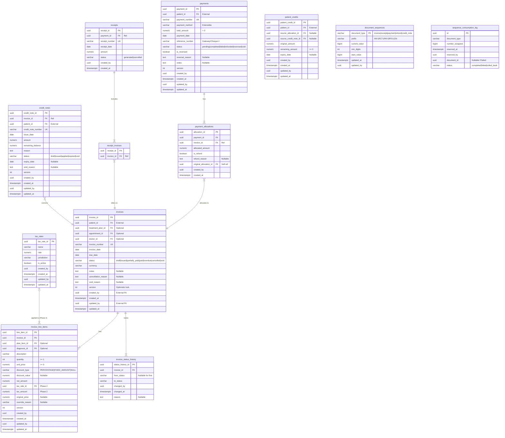

# Physical ER Diagram — Billing Module

> **Document Type:** Architecture Diagram (Mermaid)
> **Last Updated:** 2026-07-20

## Physical Table Relationship Diagram

## Table Count

| Category | Count | Tables |
|---|---|---|
| Core domain tables | 8 | invoices, invoice_line_items, payments, payment_allocations, receipts, credit_notes, patient_credits |
| Join tables | 1 | receipt_invoices |
| Audit tables | 2 | invoice_status_history, sequence_consumption_log |
| Utility tables | 2 | document_sequences, tax_rates |

## Color Legend (for visual implementation)

| Entity Type | Suggested Color |
|---|---|
| Aggregate Root | Blue header |
| Child Entity | Light blue header |
| Join Table | Green header |
| Audit/History | Grey header |
| Utility/Reference | Yellow header |

## Cross-Reference

| Direction | Document |
|---|---|
| **Part of** | [03-table-specifications.md](../03-table-specifications.md) |
| **Related** | [diagrams/logical-er-diagram.md](logical-er-diagram.md) |
