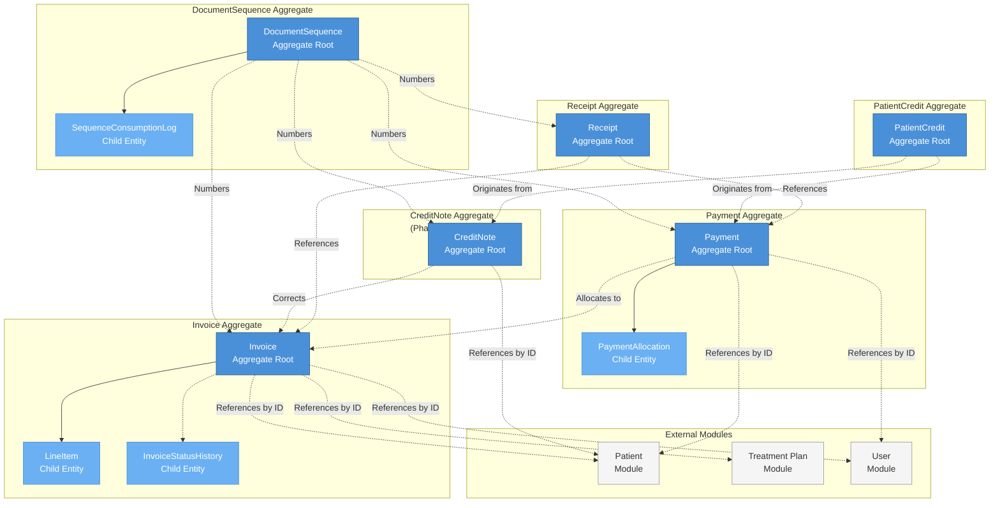

# Aggregate Diagram — Billing Domain

> **Document Type:** Architecture Diagram (Mermaid)
> **Last Updated:** 2026-07-20

## Aggregate Boundary & Relationship Diagram

## Legend

| Shape | Meaning |
|---|---|
| Blue filled box | Aggregate root |
| Light blue filled box | Child entity (owned by aggregate) |
| White box with border | External module (not owned by Billing) |
| Purple filled box | Utility aggregate |
| Solid arrow | Composition (child → parent) |
| Dotted arrow | Reference (cross-aggregate or cross-module) |

## Cross-Reference

| Direction | Document |
|---|---|
| **Part of** | [11-aggregate-design.md](../11-aggregate-design.md) |
| **Related** | [12-entity-relationships.md](../12-entity-relationships.md) |
