# Billing Context Diagram

> **Document Type:** Architecture Diagram (Mermaid)
> **Last Updated:** 2026-07-20

## Bounded Context — Revenue Cycle

```mermaid
graph TB
    subgraph "Revenue Cycle Bounded Context"
        BILL[Billing Module]

        subgraph "Core Aggregates"
            INV[Invoice]
            PAY[Payment]
            REC[Receipt]
            CN[Credit Note]
            PC[PatientCredit]
        end

        subgraph "Supporting"
            SEQ[Document Sequence]
            CALC[Calculations]
        end

        BILL --> INV
        BILL --> PAY
        BILL --> REC
        BILL --> CN
        BILL --> PC
        BILL --> SEQ
        BILL --> CALC
    end

    subgraph "Clinical Context"
        PAT[Patient Management]
        TP[Treatment Plans]
        PR[Patient Records]
        APPT[Appointment Management]
        DOC[Doctor Management]
    end

    subgraph "Infrastructure Context"
        AUTH[Authentication]
        RBAC[RBAC / Permissions]
        USR[User Management]
    end

    subgraph "Reporting Context"
        DASH[Dashboard]
        RPT[Reports]
    end

    subgraph "Future Context"
        INS[Insurance Module]
        NOTIF[Notifications]
        INVTY[Inventory]
        ACCT[Accounting Software]
    end

    PAT -.->|Patient reference| BILL
    TP -.->|Plan cost estimates| BILL
    APPT -.->|Appointment reference| BILL
    DOC -.->|Doctor reference| BILL
    PR -.->|Diagnosis reference| BILL

    AUTH -.->|Identity| BILL
    RBAC -.->|Permissions| BILL
    USR -.->|User attribution| BILL

    BILL -.->|Metrics| DASH
    BILL -.->|Report data| RPT

    BILL -.->|Claim data| INS
    BILL -.->|Events| NOTIF
    BILL -.->|Consumption| INVTY
    BILL -.->|Journal| ACCT

    classDef context fill:#e8f4f8,stroke:#4a90d9,color:#333
    classDef clinical fill:#e8f8e8,stroke:#4caf50,color:#333
    classDef infra fill:#f8f0e8,stroke:#ff9800,color:#333
    classDef report fill:#f0e8f8,stroke:#9c27b0,color:#333
    classDef future fill:#f8e8e8,stroke:#f44336,color:#333
    classDef core fill:#4a90d9,stroke:#2c5f8a,color:#fff

    class BILL context
    class INV,PAY,REC,CN,PC core
    class SEQ,CALC core
    class PAT,TP,PR,APPT,DOC clinical
    class AUTH,RBAC,USR infra
    class DASH,RPT report
    class INS,NOTIF,INVTY,ACCT future
```

## Context Descriptions

| Context | Role |
|---|---|
| **Revenue Cycle** | Owns all billing and financial transaction data (this module) |
| **Clinical** | Provides patient data, treatment plans, clinical context for invoices |
| **Infrastructure** | Provides authentication, authorization, and user attribution |
| **Reporting** | Consumes billing data for dashboards and financial reports |
| **Future** | Planned integrations — insurance, notifications, inventory, accounting |

## Cross-Reference

| Direction | Document |
|---|---|
| **Part of** | [08-domain-model.md](../08-domain-model.md) |
| **Related** | [17-integration-boundaries.md](../17-integration-boundaries.md) |
