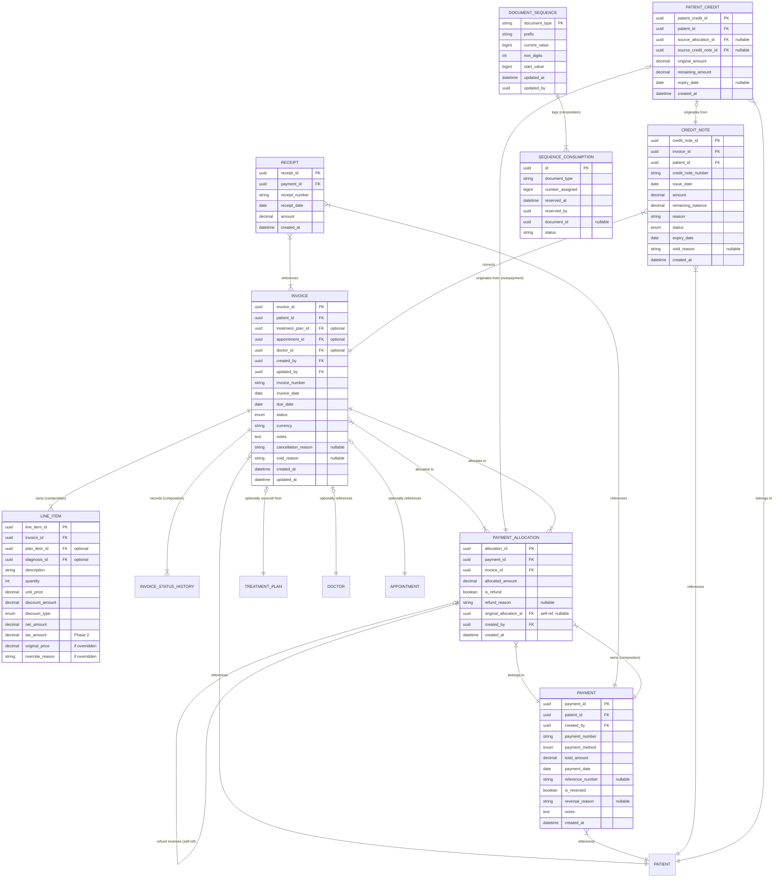

# Entity Relationship Diagram — Billing Domain

> **Document Type:** Architecture Diagram (Mermaid)
> **Last Updated:** 2026-07-20

## Conceptual ER Diagram

## Legend

| Notation | Meaning |
|---|---|
| `||--||` | One-to-one |
| `||--|{` | One-to-many (non-optional) |
| `||--o{` | One-to-many (optional) |
| `}|--||` | Many-to-one (non-optional) |
| `}o--||` | Many-to-one (optional from child side) |
| `FK` | Foreign key reference to another entity |
| `PK` | Primary key |

## Cross-Reference

| Direction | Document |
|---|---|
| **Part of** | [18-er-diagram.md](../18-er-diagram.md) |
| **Related** | [12-entity-relationships.md](../12-entity-relationships.md) |
