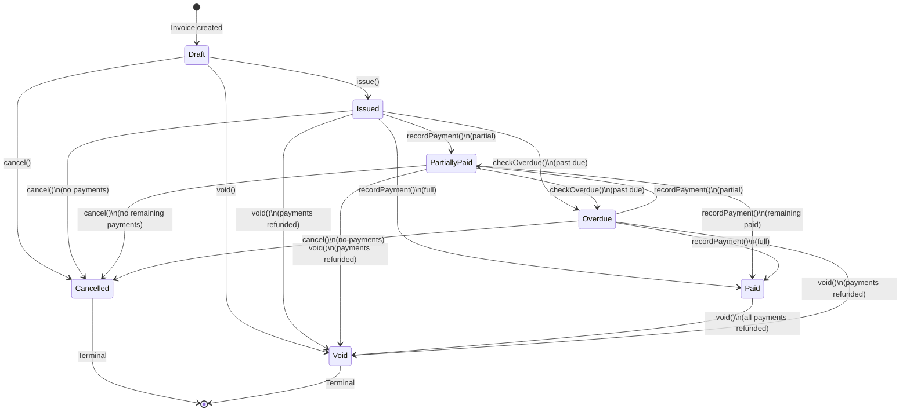

# Invoice Lifecycle Diagram

> **Document Type:** State Diagram (Mermaid)
> **Last Updated:** 2026-07-20

## Invoice Status State Machine

## Transition Table

| Current State | Target State | Trigger | Condition |
|---|---|---|---|
| Draft | Issued | `issue()` | Has ≥ 1 line item |
| Draft | Cancelled | `cancel()` | Always allowed |
| Draft | Void | `void()` | Always allowed |
| Issued | PartiallyPaid | `recordPayment()` | Payment < outstanding balance |
| Issued | Paid | `recordPayment()` | Payments ≥ grand total |
| Issued | Overdue | `checkOverdue()` | Past due date + balance > 0 |
| Issued | Cancelled | `cancel()` | No payments received |
| Issued | Void | `void()` | All payments refunded |
| PartiallyPaid | Paid | `recordPayment()` | Payments ≥ grand total |
| PartiallyPaid | Overdue | `checkOverdue()` | Past due date + balance > 0 |
| PartiallyPaid | Cancelled | `cancel()` | No remaining payments expected |
| PartiallyPaid | Void | `void()` | All payments refunded |
| Paid | Void | `void()` | All payments refunded |
| Overdue | PartiallyPaid | `recordPayment()` | Payment received |
| Overdue | Paid | `recordPayment()` | Payments ≥ grand total |
| Overdue | Cancelled | `cancel()` | No payments received |
| Overdue | Void | `void()` | All payments refunded |

## Invalid Transitions

| From → To | Reason |
|---|---|
| Draft → Paid | Must be issued first |
| Draft → Overdue | Must be issued first |
| Issued → Draft | Immutability |
| Cancelled → Any | Terminal state |
| Void → Any | Terminal state |
| Paid → Issued | Cannot revert payment |
| Overdue → Issued | Cannot revert |

## Cross-Reference

| Direction | Document |
|---|---|
| **Part of** | [14-lifecycle-models.md](../14-lifecycle-models.md) |
| **Related** | [15-state-machines.md](../15-state-machines.md), [07-workflows.md](../../07-workflows.md) |
