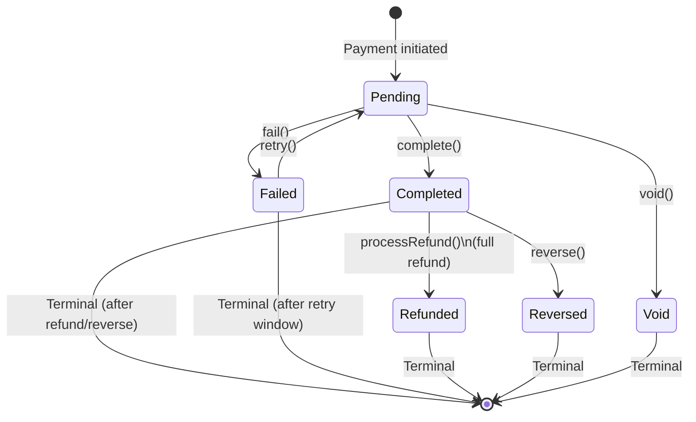
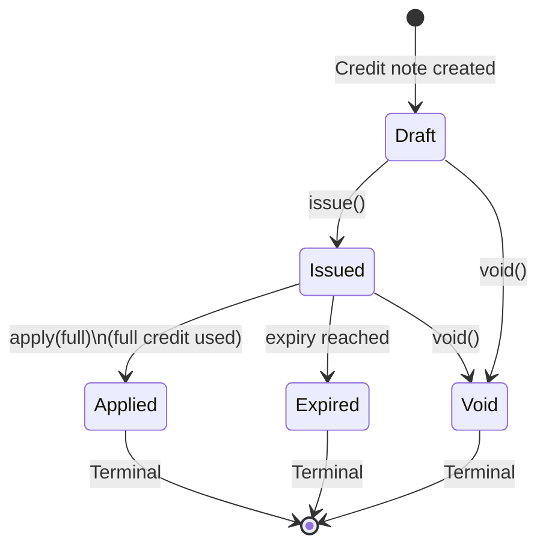

# Payment Lifecycle Diagram

> **Document Type:** State Diagram (Mermaid)
> **Last Updated:** 2026-07-24

## Payment Status State Machine

## Transition Table

| Current State | Target State | Trigger | Condition |
|---|---|---|---|
| Pending | Completed | `complete()` | Payment confirmed |
| Pending | Failed | `fail()` | Payment error or timeout |
| Pending | Void | `void()` | Admin action |
| Completed | Refunded | `processRefund()` | Full refund processed |
| Completed | Reversed | `reverse()` | Payment reversed |
| Failed | Pending | `retry()` | Retry requested |

## Invalid Transitions

| From → To | Reason |
|---|---|
| Pending → Refunded | Cannot refund an unconfirmed payment |
| Completed → Pending | Cannot revert a completed payment |
| Failed → Completed | Cannot retroactively mark failed payment as successful |
| Refunded → Any | Terminal state |
| Reversed → Any | Terminal state |
| Void → Any | Terminal state |

## Credit Note Status State Machine

## Cross-Reference

| Direction | Document |
|---|---|
| **Part of** | [14-lifecycle-models.md](../14-lifecycle-models.md) |
| **Related** | [15-state-machines.md](../15-state-machines.md), [07-workflows.md](../../07-workflows.md) |
