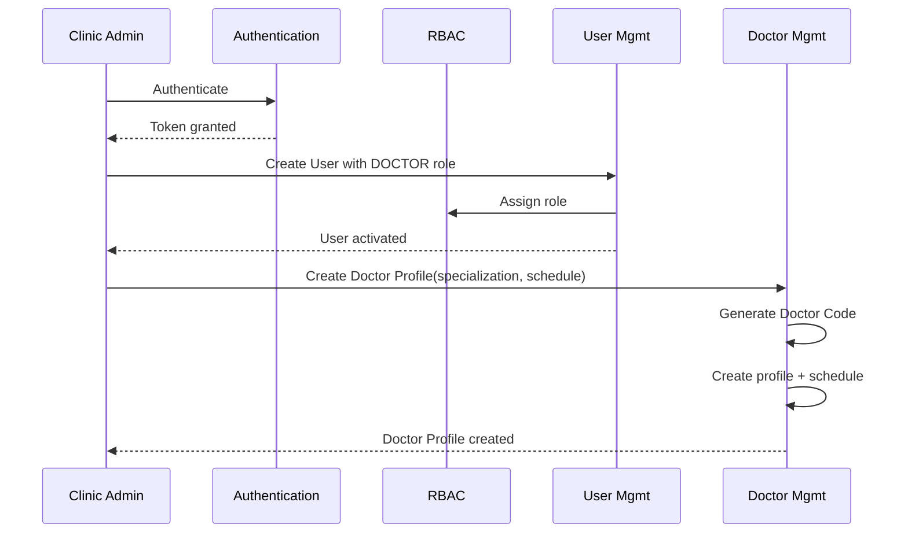
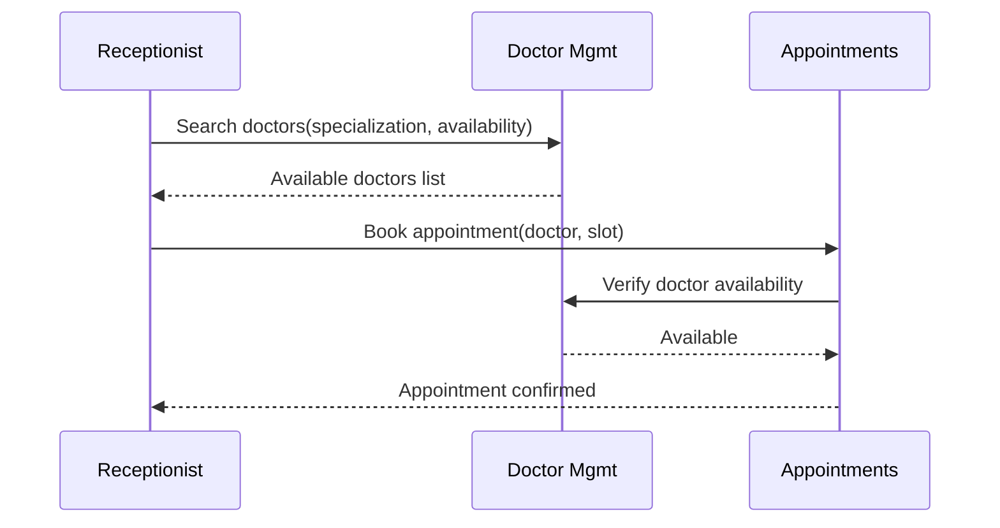
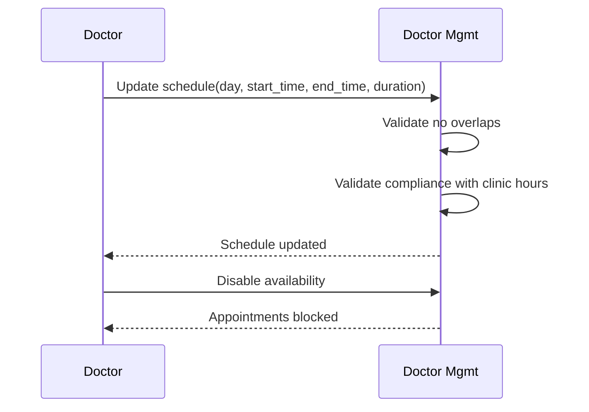

# Phase 1: Business Analysis — Doctor Management Module

> **Status:** APPROVED | **Target Quality Score:** 9.8/10
> **MVP Scope:** This document reflects only the Doctor Management MVP. Future features are documented in Phase 18.

| Field | Value |
|-------|-------|
| Document | Business Requirements Document |
| Module | Doctor Management |
| Version | 1.0 |
| Status | Approved |
| Owner | Engineering Team |
| Last Updated | 2026-07-07 |
| Related ADRs | ADR-001 |
| Related Documents | Phase 2, Phase 3, Phase 4 |

---

## 1. Executive Summary

The Doctor Management Module introduces dedicated doctor profiles to DensCare, replacing the current practice of representing dentists solely through User records. This MVP provides structured professional profiles, specialization management, weekly schedule templates, and search/filter capabilities — enabling proper patient-to-doctor routing, conflict-free scheduling, and audit-compliant doctor data management. The module integrates with the existing Auth, RBAC, User Management, Appointment, and Patient Records modules.

---

## 2. Purpose

This Business Requirements Document (BRD) defines the scope, functional and non-functional requirements for the Doctor Management MVP. It serves as the authoritative reference for architects, engineers, QA, and stakeholders throughout design, implementation, and acceptance testing.

---

## 3. Business Context

DensCare is a dental clinic management platform with the following completed modules:

- **Authentication & Authorization** — Login, token-based authentication, password management
- **RBAC** — Role-based access control with 7 roles
- **User Management** — User lifecycle (pending → active → inactive), role assignment
- **Patient Management** — Patient registration, search, profile management
- **Appointment Management** — Scheduling, conflict detection, status lifecycle
- **Patient Records** — Clinical documentation, diagnoses, prescriptions, attachments

### Problem Statement

Doctors (dentists) are currently represented indirectly as User records with a DOCTOR-family role. This causes several operational problems:

| # |       Problem                        | Business Impact               |
|---|--------------------------------------|------------------------------|
| P1 | No structured specialization data | Reception staff cannot route        patients to the correct specialist. Manual lookups waste 5–10 minutes per patient. |
| P2 | No schedule templates | Each appointment requires manual time-slot verification. Schedule conflicts go undetected until patient arrival. |
| P3 | No consultation fee configuration | Fee negotiation happens verbally. Billing has no reference rate for doctor-specific procedures. |
| P4 | No doctor search by attributes | Front desk cannot answer "available general dentists today." Patients wait while staff manually check. |
| P5 | No audit trail for doctor data | Regulatory compliance (data retention, access logs) is unverifiable for doctor-specific information. |
| P6 | No active/inactive doctor toggle | Retired or departed doctors remain in appointment selection lists, causing confusion. |

---

## 4. Business Goals

| # | Goal | Priority | Success Metric |
|---|---|---|---|
| G1 | Enable structured doctor profile management with 1:1 User mapping | Critical | All active doctors have profiles within 1 week of deployment |
| G2 | Support specialization assignment with primary designation | Critical | Patient routing accuracy ≥95% |
| G3 | Provide weekly schedule templates with availability tracking | High | Zero scheduling conflicts from doctor unavailability |
| G4 | Enable search/filter of doctors by name, code, specialization, availability | High | Front desk finds matching doctor in <2 seconds |
| G5 | Maintain full audit trail for all doctor data operations | Critical | Every create/update is traceable to user + timestamp |
| G6 | Integrate with Appointments module for availability-based booking | High | Appointment booking references doctor schedule |
| G7 | Integrate with Patient Records for doctor attribution | Medium | Clinical records show treating doctor |

---

## 5. Scope

### In Scope (MVP)

1. **Doctor Profile Management**
   - Create doctor profile linked to an existing User with a DOCTOR-family role
   - Doctor Code (auto-generated, unique)
   - Profile photo, biography, active status
   - Update and deactivate/reactivate profiles

2. **Professional Information**
   - Specialization (One Primary Specialization (required) + Optional Secondary Specialization(s))
   - Qualifications, registration/license number
   - Years of professional experience
   - Languages known

3. **Contact Information**
   - Primary phone number
   - Email (inherited from User)
   - Emergency contact details

4. **Clinic Information**
   - Weekly working schedule maintained as structured schedule information
   - Working Day, Start Time, End Time
   - Default consultation duration per appointment slot
   - Consultation fee
   - Available for appointment toggle
   - Temporary leave toggle (simple on/off, no approval workflow)
   - Active status

5. **Search & Discovery**
   - Search by name, doctor code, specialization, role, availability, active status
   - Paginated results with configurable page size
   - Filtering by specialization, employment type, status
   - Sorting by name, experience

6. **Audit**
   - Created by, Updated by, Created at, Updated at
   - Full traceability per record

7. **Integration**
   - Auth module for authentication
   - RBAC for permission enforcement
   - User Management for linked User records
   - Appointments for doctor availability queries
   - Patient Records for doctor attribution

### Non-Goals

This module is NOT intended to:

- Replace HR management
- Replace payroll processing
- Replace attendance tracking
- Implement notification engines (email/SMS)
- Implement analytics or reporting dashboards

### Out of Scope (Future Modules)

The following are explicitly out of scope for the MVP and are documented in Phase 18 (Future Roadmap):

- Staff/HR management, payroll, attendance
- Commission/revenue sharing/incentive management
- Performance dashboards, productivity/revenue analytics, KPI tracking
- Department management, shift scheduling
- Leave approval workflows (only simple leave toggle in MVP)
- Multi-clinic assignment and scheduling
- License/certificate expiry notifications
- Email/SMS/notification engine
- Background/cron jobs
- Regulatory reporting, document verification workflows
- Certificate expiry engine

---

## 6. Stakeholders

| Stakeholder          | Role         | Interest |
|----------------------|--------------|-------------------------|
| Clinic Administrator | System owner | Complete doctor data visibility, audit compliance |
| Chief Doctor | Clinical lead | Specialization routing, schedule management |
| General Dentist | End user | Own profile management, schedule visibility |
| Specialist Dentist | End user | Own profile, specialization display |
| Consulting Dentist | End user | Basic profile, availability toggle |
| Receptionist | Primary operator | Doctor search, availability checking |
| IT Team | Implementation | Integration, performance, deployment |
| QA Team | Validation | Acceptance criteria verification |

---

## 7. Business Rules

### 7.1 User ↔ Doctor Profile Relationship

The following rules govern the relationship between User records and Doctor Profiles:

- **BR-1:** Every Doctor Profile SHALL reference exactly one existing User.
- **BR-2:** Every User with a doctor role MAY own exactly one Doctor Profile.
- **BR-3:** Users without doctor roles SHALL NOT own Doctor Profiles.
- **BR-4:** Doctor Management extends User Management rather than replacing or duplicating it.

This relationship is the primary business rule of the module and governs all downstream validations.

---

## 8. Assumptions

1. Users with DOCTOR-family roles (`CHIEF_DOCTOR`, `GENERAL_DOCTOR`, `SPECIALIST_DOCTOR`, `CONSULTING_DOCTOR`) already exist in the Users module.
2. The Auth module handles all authentication (login, token management, password management) — Doctor Management does not duplicate this.
3. The RBAC module provides role-based authorization for endpoint protection.
4. Email delivery is handled by existing infrastructure, not by this module.
5. The Appointments module references the User record for dentist assignment (not a new Doctor Profile identifier).
6. Doctor schedules must comply with the clinic operating hours defined by the Appointment Management module.
7. Database schema changes are managed following existing project patterns.
8. File uploads (profile photos) use existing infrastructure or are deferred to a future enhancement.

---

## 9. Dependencies

| Dependency | Module | Nature |
|---|---|---|
| User records | Users | Doctor Profile references the linked User record |
| Role assignment | Auth/RBAC | Only DOCTOR-family roles can have profiles |
| Authentication | Auth | Login and token validation |
| Authorization | RBAC | Role-based endpoint protection |
| Appointment scheduling | Appointments | Reads doctor availability from schedule |
| Patient record attribution | Patient Records | References treating doctor |
| Database | Database | All data persistence |
| Schema changes | Migrations | Versioned schema management |

---

## 10. Business Constraints

| # | Constraint | Description |
|---|---|---|
| C-1 | One Doctor Profile per User | A User may have at most one Doctor Profile. |
| C-2 | One Doctor Code per Doctor | Doctor Codes are unique and non-reusable. |
| C-3 | Only Doctor-role Users may own Doctor Profiles | Non-doctor roles are prohibited from owning profiles. |
| C-4 | Working schedules cannot overlap | A doctor's schedule entries for the same day must not overlap. |
| C-5 | Only Active Doctors may receive appointments | Inactive or on-leave doctors are excluded from booking. |
| C-6 | Doctor schedules must comply with clinic operating hours | Schedule boundaries are validated against clinic hours. |

---

## 11. Business Workflow

### 11.1 Doctor Onboarding

### 11.2 Patient-to-Doctor Routing

### 11.3 Doctor Schedule Management

---

## 12. Functional Requirements

### FR-1: Doctor Profile CRUD (Critical)

| ID | Requirement | Acceptance |
|---|---|---|
| FR-1.1 | System SHALL create a Doctor Profile linked to an existing User with a DOCTOR-family role | Created profile references a valid User |
| FR-1.2 | System SHALL auto-generate a unique Doctor Code with configurable prefix | Code format: `DOC-00001` |
| FR-1.3 | System SHALL store: names, photo URL, biography, gender, DOB | All fields stored |
| FR-1.4 | System SHALL update individual profile fields selectively | Only provided fields change |
| FR-1.5 | System SHALL deactivate/reactivate a profile without deleting data | Active status toggle preserves history |
| FR-1.6 | System SHALL enforce unique Doctor Codes | Duplicate Doctor Code is rejected |

### FR-2: Professional Information (Critical)

| ID | Requirement | Acceptance |
|---|---|---|
| FR-2.1 | System SHALL store qualification text | Stored as provided |
| FR-2.2 | System SHALL store registration/license number | Stored as provided |
| FR-2.3 | System SHALL store years of professional experience | Valid professional experience range |
| FR-2.4 | System SHALL store one primary specialization per doctor | Exactly one primary |
| FR-2.5 | System SHALL allow optional secondary specialization(s) | One or more additional (optional) |
| FR-2.6 | System SHALL store languages known | Stores one or more languages known by the doctor |

### FR-3: Contact Information (High)

| ID | Requirement | Acceptance |
|---|---|---|
| FR-3.1 | System SHALL store primary phone number | Required, validated |
| FR-3.2 | System SHALL use User email for primary email | Read-only from Users |
| FR-3.3 | System SHALL store emergency contact name and phone | Name + phone fields |

### FR-4: Schedule & Clinic Configuration (High)

| ID | Requirement | Acceptance |
|---|---|---|
| FR-4.1 | System SHALL maintain a structured weekly working schedule for each doctor | Schedule is structured and queryable |
| FR-4.2 | System SHALL support per-day configuration for configurable clinic working days | Each day configurable |
| FR-4.3 | System SHALL support defining Working Day with Start Time and End Time per day | Time range per day |
| FR-4.4 | System SHALL store consultation duration per appointment slot | Per-appointment slot duration |
| FR-4.5 | System SHALL store consultation fee | Must be a positive value |
| FR-4.6 | System SHALL reject overlapping schedule entries | Overlap is rejected |
| FR-4.7 | System SHALL provide an available-for-appointment toggle | On/off toggle |
| FR-4.8 | System SHALL provide a temporary leave toggle (simple on/off, no approval workflow) | On/off toggle |

### FR-5: Search & Discovery (Critical)

| ID | Requirement | Acceptance |
|---|---|---|
| FR-5.1 | System SHALL search doctors by full name (partial match) | Case-insensitive |
| FR-5.2 | System SHALL search by Doctor Code (exact match) | Code prefix included |
| FR-5.3 | System SHALL filter by role (CHIEF_DOCTOR, GENERAL_DOCTOR, etc.) | Role filter |
| FR-5.4 | System SHALL filter by specialization | Specialization filter |
| FR-5.5 | System SHALL filter by availability (currently available) | Availability filter |
| FR-5.6 | System SHALL filter by active status | Active/inactive/all |
| FR-5.7 | System SHALL support pagination (page, page_size) | Default 20, max 100 |
| FR-5.8 | System SHALL support sorting by name, experience | ASC/DESC |

### FR-6: Audit Trail (Critical)

| ID | Requirement | Acceptance |
|---|---|---|
| FR-6.1 | System SHALL record the user who created the profile on creation | Creation user is recorded |
| FR-6.2 | System SHALL record the user who last updated the profile on changes | Update user is recorded on change |
| FR-6.3 | System SHALL record the timestamp when the profile was created | Creation timestamp is recorded automatically |
| FR-6.4 | System SHALL record the timestamp when the profile was last updated | Update timestamp is recorded automatically |

---

## 13. Non-Functional Requirements

| # | Category | Requirement | Target |
|---|---|---|---|
| NFR-1 | Performance | Doctor search response time | <500ms for 1000 profiles |
| NFR-2 | Performance | Profile load time | <200ms |
| NFR-3 | Performance | API pagination max page size | 100 items |
| NFR-4 | Security | All endpoints require authentication | Rejected on missing/invalid credentials |
| NFR-5 | Security | RBAC enforced per operation | Rejected on unauthorized access |
| NFR-6 | Security | Input validation on all requests | Rejected on invalid input |
| NFR-7 | Audit | All mutations logged with user ID | Full traceability |
| NFR-8 | Reliability | Database operations protected against partial failures | No incomplete writes |
| NFR-9 | Reliability | Connection pooling for database access | Production-grade configuration |
| NFR-10 | Maintainability | Follow existing DensCare architecture patterns | Consistent codebase |

---

## 14. Acceptance Criteria

| # | Criterion | Verification |
|---|---|---|
| AC-1 | Admin creates doctor profile with all required fields → Profile is created successfully | Integration test |
| AC-2 | Duplicate Doctor Code is rejected | Integration test |
| AC-3 | Non-existent user cannot be assigned a profile | Integration test |
| AC-4 | Non-doctor users cannot own a Doctor Profile | Integration test |
| AC-5 | Profile fields are updated successfully | Integration test |
| AC-6 | Admin deactivates doctor → active status changes to inactive | Integration test |
| AC-7 | Admin reactivates doctor → active status changes to active | Integration test |
| AC-8 | Search by name returns matching results | Integration test |
| AC-9 | Filter by specialization returns correct subset | Integration test |
| AC-10 | Filter by availability returns available doctors only | Integration test |
| AC-11 | Pagination returns correct item count and total | Integration test |
| AC-12 | Create schedule template → Schedule is saved and available | Integration test |
| AC-13 | Overlapping schedule entries are rejected | Integration test |
| AC-14 | Disabling availability (available-for-appointment toggle) blocks appointment booking | Integration test |
| AC-15 | Unauthenticated requests are rejected | Integration test |
| AC-16 | Non-admin users cannot create doctor profiles | Integration test |
| AC-17 | All mutations have recorded audit information | DB verification |
| AC-18 | Duplicate Doctor Profile for same User is prevented | Integration test |
| AC-19 | Inactive or on-leave doctor excluded from appointment booking | Integration test |

---

## 15. Risks

| # | Risk | Likelihood | Impact | Mitigation |
|---|---|---|---|---|
| R1 | Existing User records lack DOCTOR roles | Medium | High | Seed migration for existing doctors |
| R2 | Appointment module references User records not Doctor Profile | Low | Medium | Keep dentist assignment based on User records |
| R3 | Schedule complexity for part-time/visiting doctors | Medium | Low | Flexible schedule model supports part-time |
| R4 | Data migration for existing doctor information | Medium | Medium | Manual data entry period post-deployment |
| R5 | Adoption resistance from doctors | Low | Low | Training session + simple UI |
| R6 | Concurrent creation of duplicate Doctor Profiles | Low | Medium | Uniqueness constraints combined with transactional validation |

---

## 16. Success Metrics

| Metric | Target | Measurement |
|---|---|---|
| Doctor profile adoption | ≥95% of active doctors within 1 week | DB count vs active DOCTOR users |
| Schedule template coverage | ≥95% of active doctors within 2 weeks | DB count vs active profiles |
| Search response time | <500ms for 95% of queries | Application monitoring |
| Route-to-specialist accuracy | ≥95% after deployment | QA verification |
| Audit trail completeness | 100% of create, update, and status-change operations are recorded in the audit trail | DB audit fields |

---

## 17. Glossary

| Term | Definition |
|---|---|
| Doctor Profile | A structured record linked to a User that holds professional, contact, clinic, and scheduling information for a doctor. |
| Doctor Code | A unique auto-generated identifier assigned to each Doctor Profile (e.g., `DOC-00001`). |
| Doctor Schedule | A structured weekly template defining a doctor's working days, start/end times, and consultation duration. |
| Primary Specialization | The main clinical specialty of a doctor (required, exactly one). |
| Availability | The current state indicating whether a doctor is accepting new appointments. |
| Consultation Duration | The standard length of a single appointment slot for a doctor. |
| Doctor Role | A DOCTOR-family role (`CHIEF_DOCTOR`, `GENERAL_DOCTOR`, `SPECIALIST_DOCTOR`, `CONSULTING_DOCTOR`) that authorizes a User to own a Doctor Profile. |

---

## 18. Future Considerations

This module intentionally excludes advanced staff management capabilities. See Phase 18 — Future Architecture Roadmap for the complete expansion plan.
