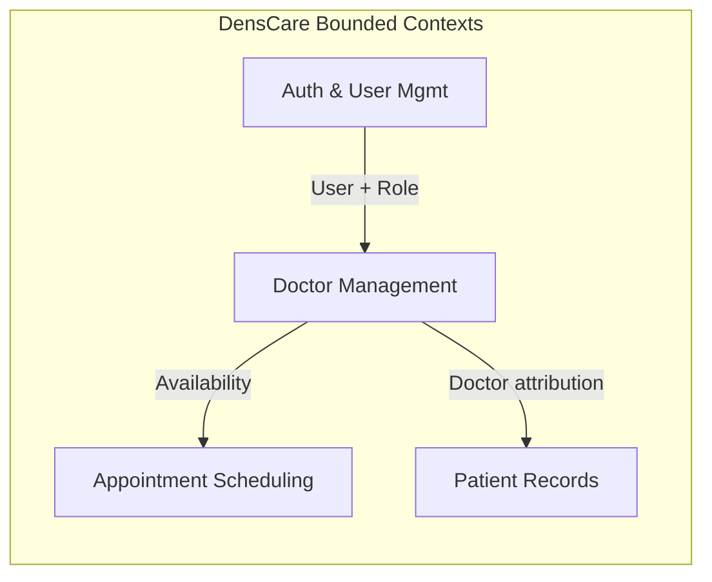
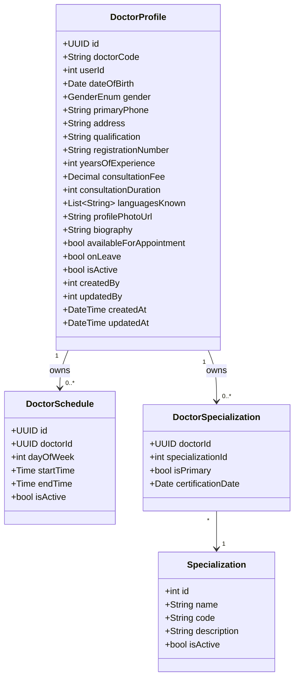
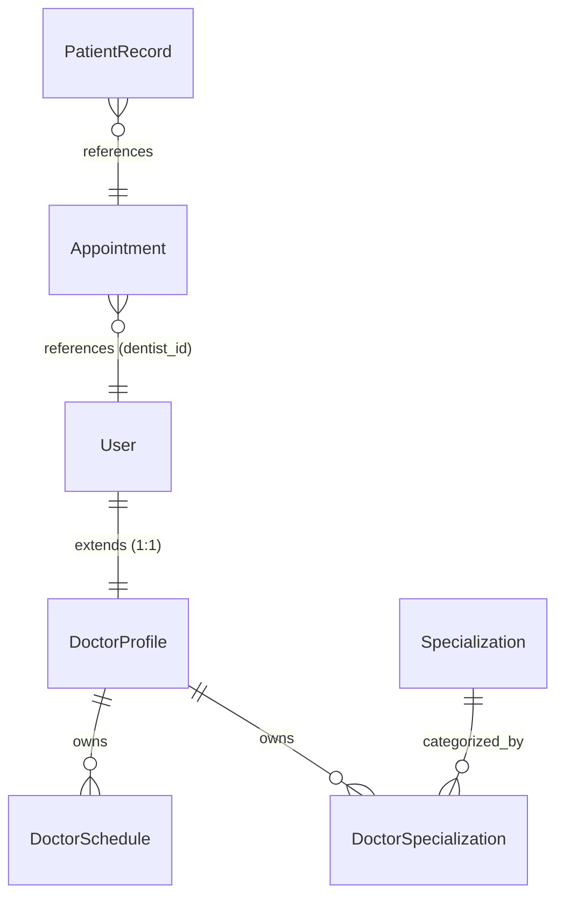
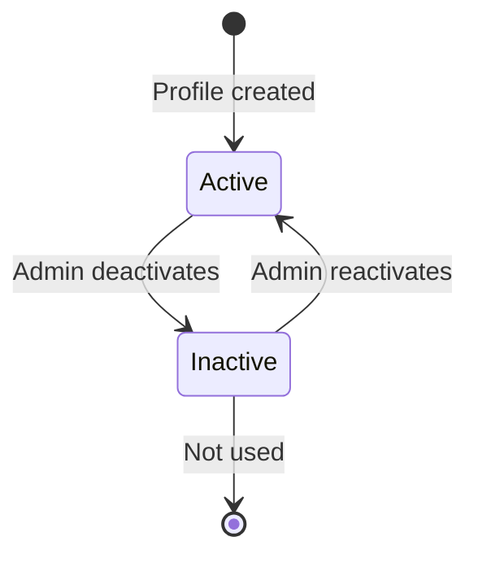
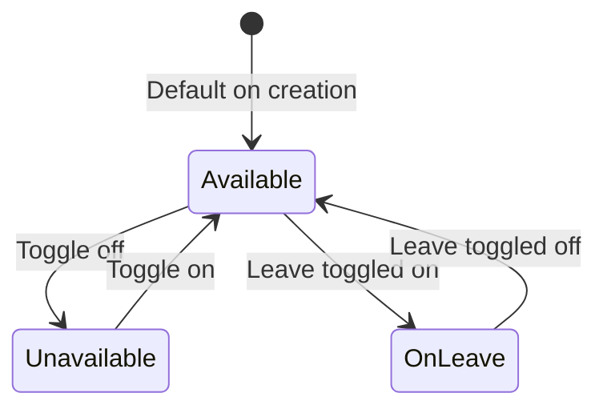

# Phase 2: Domain Analysis — Doctor Management Module

> **Status:** PASS | **Target Quality Score:** 9.8/10
> **MVP Scope:** This document reflects only the Doctor Management MVP. Future entities are documented in Phase 18 — Future Architecture Roadmap.

---

## 1. Bounded Context

The Doctor Management domain operates within the **Staffing & Scheduling** bounded context of DensCare. It is responsible for:

- Managing structured profiles for dental professionals
- Defining specialization assignments
- Maintaining weekly working schedules
- Providing search/discovery for appointment routing

This context **consumes** from the Auth & User Management context (User records, roles) and **provides** to the Appointment Scheduling and Patient Records contexts (doctor availability, doctor attribution).

**Cross Reference:** Phase 1 §3 (Business Context), §9 (Dependencies)

---

## 2. Ubiquitous Language

| Term | Definition |
|---|---|
| DoctorProfile | The aggregate root representing a dental professional. One per User with a DOCTOR-family role. |
| Doctor Code | Auto-generated unique identifier (e.g., `DOC-00001`). |
| Specialization | A recognized dental specialty area (e.g., Orthodontics, Endodontics, Periodontics). |
| Primary Specialization | The doctor's main specialty; used for patient routing and appointment defaults. |
| Weekly Schedule | A set of working days with start and end times defining recurring weekly availability. |
| Working Day | A day of the week with defined start time and end time during which the doctor accepts appointments. |
| Consultation Duration | The default length of a patient appointment slot (in minutes). |
| Consultation Fee | The base fee charged for a standard consultation with this doctor. |
| Available for Appointment | A toggle indicating whether the doctor is currently accepting new appointments. |
| On Leave | A toggle indicating the doctor is temporarily unavailable (no approval workflow). |
| Aggregate Root | The root entity that guarantees the consistency of changes within an aggregate boundary. |
| Bounded Context | A logical boundary within which a particular domain model applies and terms have specific meanings. |
| Audit Notification | A record of a data mutation recorded within the same transactional boundary. |
| Value Object | An immutable object whose equality is based on its attributes, not an identifier. |
| Invariant | A business rule that must always hold true for the system to be in a valid state. |

**Cross Reference:** Phase 1 §17 (Glossary)

---

## 3. Entities & Aggregates

### 3.1 DoctorProfile (Aggregate Root)

The central entity of the module. Each DoctorProfile is a 1:1 extension of a `User` record.

> **Note:** Identity data (full name, email) is owned by the User record — DoctorProfile does not duplicate it. DoctorProfile stores doctor-specific attributes including professional information (qualifications, specializations), clinic configuration (schedule, fee, duration), and doctor-specific personal data (date of birth, gender, primary phone, address). User identity data is obtained through the User relationship.

**Fields on User (not duplicated on DoctorProfile):** `full_name`, `email`. The User record stores these identity fields. DoctorProfile references `userId` to access them.

**Aggregate Boundary:** The DoctorProfile aggregate root owns:
- **DoctorSchedule** — Weekly availability templates (exclusive ownership)
- **DoctorSpecialization** — Specialization assignments (exclusive ownership)

The following belong to **other bounded contexts** and are NOT part of this aggregate:
- **Appointment** — Owned by Appointment Scheduling context
- **PatientRecord** — Owned by Patient Records context

**Cross Reference:** Phase 1 §5 (Scope), §7 (Business Rules), §10 (Business Constraints)

### 3.2 Specialization (Entity)

A master list of dental specialties maintained by administrators.

| Attribute | Type | Notes |
|---|---|---|
| id | Integer | Auto-increment PK |
| name | String(100) | Unique, e.g., "Orthodontics" |
| code | String(20) | Unique, e.g., "ORTHO" |
| description | Text | Optional explanation |
| is_active | Boolean | Soft-disable unused specializations |

### 3.3 DoctorSpecialization (Value Object / Join)

Links a doctor to a specialization with a primary/secondary distinction.

| Attribute | Type | Notes |
|---|---|---|
| doctor_id | UUID (FK) | References DoctorProfile |
| specialization_id | Integer (FK) | References Specialization |
| is_primary | Boolean | Exactly one primary per doctor |
| certification_date | Date | When the certification was obtained |

**Primary Specialization Enforcement:** Exactly one primary specialization per doctor is enforced via a unique constraint on `(doctor_id, is_primary=true)` at the database level, combined with service-layer validation that prevents assigning zero or multiple primary specializations.

**Cross Reference:** Phase 1 §12 FR-2.4, FR-2.5

### 3.4 DoctorSchedule (Entity)

Represents a **recurring weekly availability template** for a doctor. This is NOT an appointment calendar — it defines the default working hours for each day of the week. Appointments continue to own actual booked slots in the Appointment Scheduling context.

| Attribute | Type | Notes |
|---|---|---|
| id | UUID | PK |
| doctor_id | UUID (FK) | References DoctorProfile |
| day_of_week | Integer | 0=Monday … 5=Saturday |
| start_time | Time | Work day start |
| end_time | Time | Work day end |
| is_active | Boolean | Toggle without deleting |

**Cross Reference:** Phase 1 §12 FR-4.2, FR-4.3

---

## 4. Value Objects

| Value Object | Attributes | Used By |
|---|---|---|
| ContactInfo | primary_phone, address | DoctorProfile |
| ProfessionalInfo | qualification, registration_number, years_of_experience, languages | DoctorProfile |
| FeeConfig | consultation_fee | DoctorProfile |
| ClinicConfig | consultation_duration, available_for_appointment, on_leave | DoctorProfile |
| EmergencyContact | name, phone (embedded fields, not a separate table) | DoctorProfile |
| TimeSlot | day_of_week, start_time, end_time | DoctorSchedule |

> **Note:** `email` has been removed from ContactInfo — it is owned by the User record.
>
> **Storage Decision — `languages_known`:** Implemented as a JSON array column on the DoctorProfile table. This is an MVP simplification. A normalized `doctor_languages` table may be introduced in a post-MVP phase if query requirements demand it.
>
> **EmergencyContact** is modeled as embedded fields (name + phone columns on DoctorProfile). It is a Value Object in the domain model, not a separate table. This aligns with the Database Design (Phase 4).

**Cross Reference:** Phase 1 §5 (Scope — Professional Information, Contact Information, Clinic Information)

---

## 5. Domain Relationships

The following ER diagram reflects the actual DensCare architecture.

**Key architectural rules:**
- **Appointment** references `users.id` (via `dentist_id`) — NOT `doctor_profile.id`. Doctor availability is resolved through DoctorProfile during scheduling, but the Appointment itself stores the User FK.
- **PatientRecord** references `appointment_id`, which in turn references User. DoctorProfile is used only to enrich doctor information when displaying records.
- **DoctorProfile** extends User via a 1:1 relationship. It does NOT replace User.

**Cardinality Rules:**

- **User (1) → DoctorProfile (0..1):** Exactly zero or one Doctor Profile per User
- **DoctorProfile (1) → DoctorSchedule (0..many):** Flexible per-day entries
- **DoctorProfile (1) → DoctorSpecialization (0..many):** At least one (primary) if declared
- **Specialization (1) → DoctorSpecialization (0..many):** Many doctors per specialty
- **Appointment (*) → User (1):** Appointment stores `dentist_id` as a FK to `users.id`
- **PatientRecord (*) → Appointment (1):** Patient Record references the appointment; doctor information is resolved through the appointment's User relationship

**Availability Resolution Flow:**
1. Appointment Scheduling requests a doctor's availability
2. Doctor Management checks the Doctor Profile's `available_for_appointment` flag, `on_leave` flag, `is_active` status, and the DoctorSchedule entries
3. The resolved availability is returned to Appointment Scheduling
4. The Appointment stores the User ID (`dentist_id`), not the DoctorProfile ID

**Cross Reference:** Phase 1 §9 (Dependencies), §11 (Business Workflow)

---

## 6. Audit Trail Notifications

During the MVP, mutations to the DoctorProfile and its child entities record audit entries as part of the service method's request-scoped transaction. These are **not** domain events or asynchronous messages — they are side effects within the same transactional boundary.

| Mutation | Audit Recorded |
|---|---|
| DoctorProfile created | Who created it and when |
| DoctorProfile updated | Which fields changed and who changed them |
| DoctorProfile deactivated/reactivated | Status change and who performed it |
| DoctorSchedule changed | Schedule update and who updated it |
| Availability toggled | Availability change and who performed it |
| Leave toggled | Leave status change and who performed it |

Availability changes are read by the Appointment module via direct service calls (availability query), not via an event bus.

**Cross Reference:** Phase 1 §5 (Scope — Integration), §12 FR-6 (Audit Trail)

---

## 7. Domain Invariants

| # | Invariant | Enforcement Point | Violation |
|---|---|---|---|
| INV-1 | One DoctorProfile per User | Service + DB unique constraint | Duplicate `user_id` |
| INV-2 | Only DOCTOR-family roles can own a profile | Service | User lacks DOCTOR role |
| INV-3 | Doctor Code must be unique | DB unique constraint | Duplicate code |
| INV-4 | Doctor Code is immutable after creation | Service (rejected on update) | Code change attempt |
| INV-5 | Exactly one primary specialization per doctor (if specializations are assigned) | DB unique constraint (`doctor_id`, `is_primary=true`) + Service | Zero or multiple primaries |
| INV-6 | No overlapping schedule slots for same doctor on same day | Repository (DB query) | Time overlap |
| INV-7 | Consultation fee must be positive | Validator | Zero or negative fee |
| INV-8 | Consultation duration must be positive | Validator | Zero or negative duration |
| INV-9 | Day of week must be 0–5 (Monday–Saturday) | Validator + DB CheckConstraint | Invalid day |
| INV-10 | End time must be after start time on schedule entries | Validator | Negative duration slot |
| INV-11 | Inactive doctors cannot set `available_for_appointment=true` | Service | Inactive doctor marked available |
| INV-12 | On-leave doctors are automatically treated as unavailable | Service (availability resolution) | On-leave doctor receives bookings |
| INV-13 | A doctor's schedules must comply with clinic operating hours | Service | Schedule outside clinic hours |

**Cross Reference:** Phase 1 §10 (Business Constraints), §12 FR-1.6, FR-4.6

---

## 8. Entity Lifecycle

The lifecycle has two independent dimensions: **Account Lifecycle** (controlled by admin) and **Availability** (controlled by doctor or admin).

### 8.1 Lifecycle States

### 8.2 Availability States

**Business Rules for States:**

- **Lifecycle** is managed by admin only (activate/deactivate).
- **Availability** is managed by the doctor or admin.
- Inactive doctors CANNOT be marked as available for appointment (INV-11).
- On-leave doctors are treated as unavailable even if `available_for_appointment=true` (INV-12).
- Reactivating an inactive doctor does NOT automatically restore availability — the doctor must explicitly toggle availability.

**Cross Reference:** Phase 1 §5 (Scope — Doctor Profile Management), §12 FR-1.5

---

## 9. Aggregate Design Decisions

| Decision | Rationale |
|---|---|
| DoctorProfile as separate entity (not User columns) | Clean separation of concerns; User module unchanged; independent lifecycle; supports modular growth for future Staff Management without coupling to User entity. |
| 1:1 with User (not 1:many) | Each person is one User; one User can be at most one doctor. Reduces complexity vs allowing multiple profiles per user. |
| DoctorProfile NOT merged into User | Single Responsibility Principle — User handles authentication and identity; DoctorProfile handles professional data. Reduces coupling — changes to doctor data do not affect User schema. Enables modular growth — future Staff Management can extend the pattern without touching core Auth. |
| DoctorSchedule as normalized table with start/end time (not JSON, not session-based) | Queryable, indexable, migratable; uses simple working day model instead of fixed session presets. |
| Specialization as separate master table | Reusable across doctors; consistent naming; extensible. |
| `available_for_appointment` + `on_leave` as simple booleans | MVP simplicity; no approval workflow; appointment module checks both. |
| `consultation_duration` on DoctorProfile (not per-schedule-entry) | Single default for appointment slots; simplifies schedule management. |
| `languages_known` as JSON array (not normalized table) | MVP simplicity — a normalized table would add complexity without immediate query benefit. JSON is sufficient for display and filtering. |
| Audit fields on DoctorProfile (not separate audit table) | Follows existing DensCare pattern; sufficient for MVP. |
| Appointment references User FK, not DoctorProfile FK | DensCare's existing Appointment module uses `users.id` for dentist assignment. DoctorProfile is used for availability resolution, not storage. |

**Cross Reference:** Phase 1 §7 (Business Rules — User ↔ Doctor Profile Relationship)

---

## 10. Ownership

| Artifact | Owner | Notes |
|---|---|---|
| Doctor Profile (all fields) | Clinic Admin | Full CRUD access |
| Doctor Profile (self-editable fields only) | Doctor (self) | biography, profile photo, languages — not Doctor Code, not financial fields |
| Specialization | Chief Doctor, Clinic Admin | Both can assign/update |
| Schedule templates | Doctor (self) or Admin | Self-service for doctors, admin override |
| Specialization master list | Clinic Admin | Seeded and maintained by admin |
| Profile activation/deactivation | Clinic Admin | Only admin can lifecycle-manage |
| Availability toggle | Doctor (self) or Admin | Doctor can toggle own availability |
| Doctor search and availability lookup | Receptionist | Read-only access for patient routing |

**Cross Reference:** Phase 1 §6 (Stakeholders)

---

## 11. Future Entities (Deferred to Phase 18)

This module intentionally excludes advanced staff management entities. See Phase 18 — Future Architecture Roadmap for the complete expansion plan.

---

## 12. Cross-Reference Summary

| Phase 1 Section | Phase 2 Section |
|---|---|
| §3 Business Context | §1 Bounded Context |
| §5 Scope | §3 Entities & Aggregates, §4 Value Objects |
| §6 Stakeholders | §10 Ownership |
| §7 Business Rules | §3.1 Aggregate Boundary |
| §9 Dependencies | §5 Domain Relationships |
| §10 Business Constraints | §7 Domain Invariants |
| §11 Business Workflow | §5 Availability Resolution Flow |
| §12 FR-1 (Doctor Profile CRUD) | §3.1 DoctorProfile, §8 Lifecycle |
| §12 FR-2 (Professional Info) | §3.2–3.3 Specialization, §4 ProfessionalInfo |
| §12 FR-3 (Contact Info) | §4 ContactInfo |
| §12 FR-4 (Schedule & Clinic) | §3.4 DoctorSchedule, §4 ClinicConfig |
| §12 FR-5 (Search & Discovery) | §1 Bounded Context |
| §12 FR-6 (Audit Trail) | §6 Audit Trail Notifications |
| §17 Glossary | §2 Ubiquitous Language |
