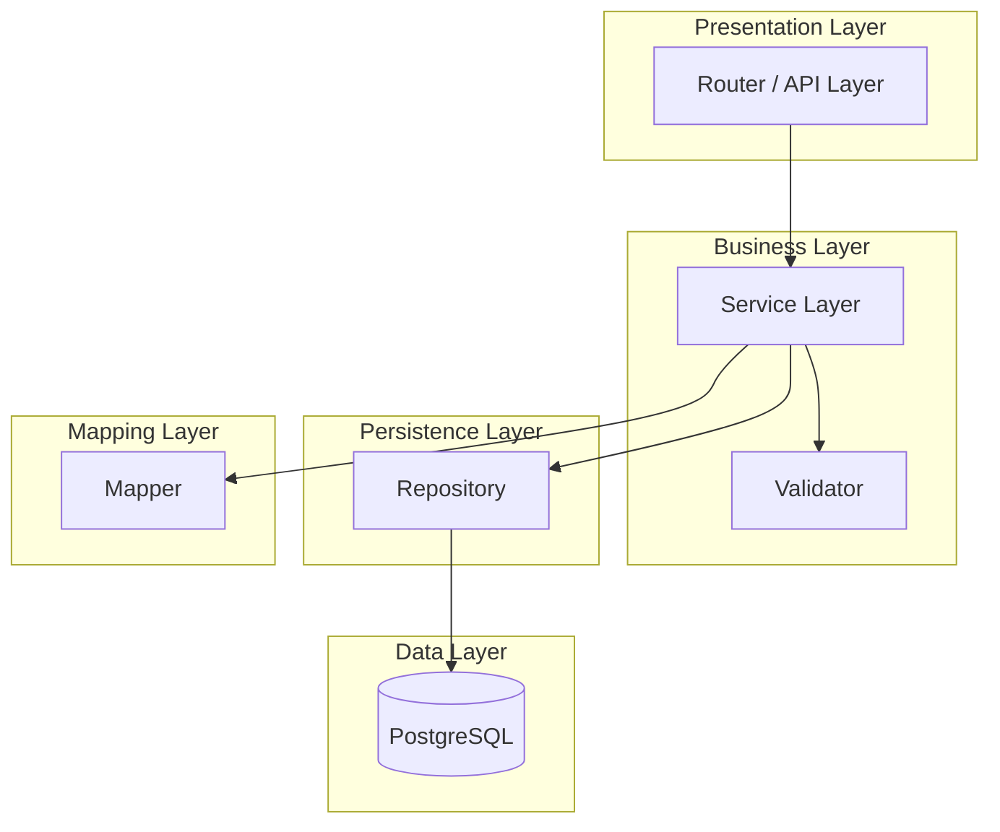
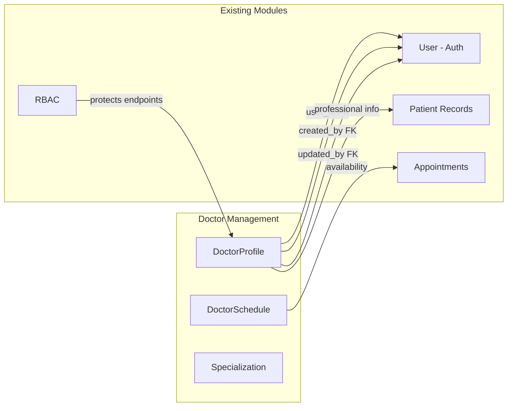
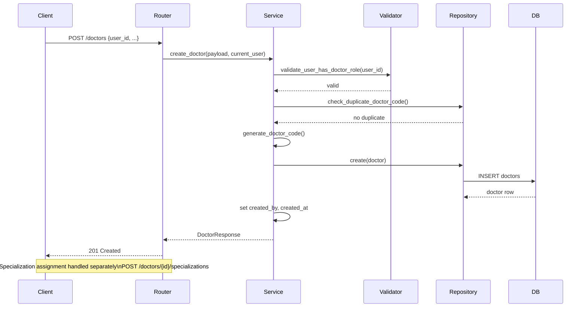
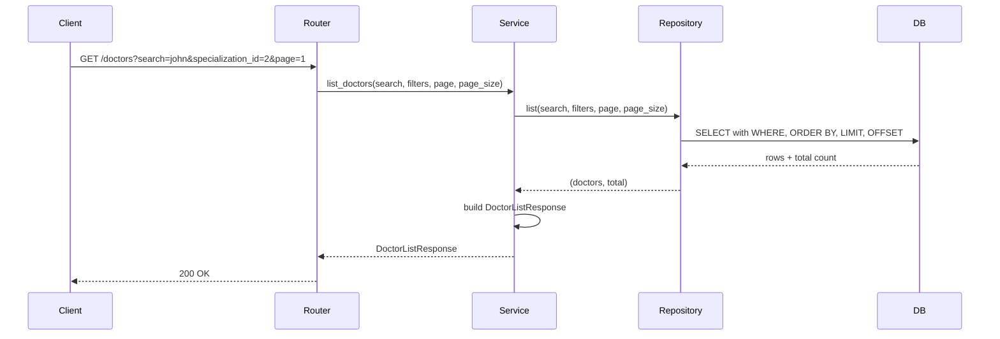
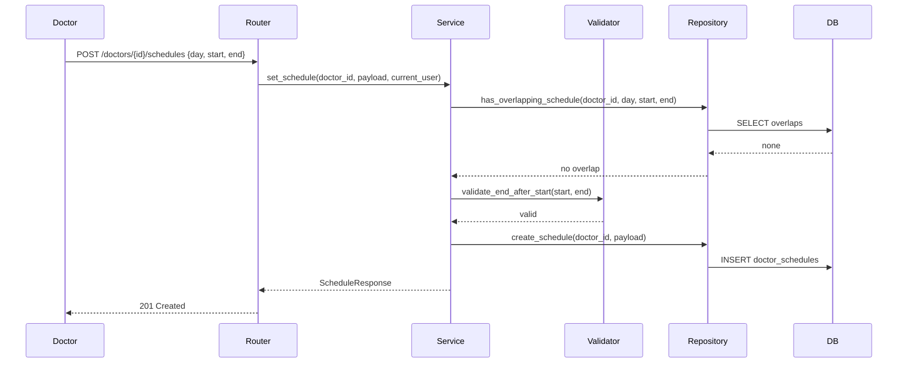

# Phase 3: Architecture Design — Doctor Management Module

> **Status:** IN REVIEW | **Target Quality Score:** 9.8/10
> **MVP Scope:** This document reflects only the Doctor Management MVP architecture.

---

## 1. Architecture Style

The Doctor Management module follows the same **layered architecture** used throughout the existing DensCare backend:

```
Router → Service → Validator → Repository → Database
```

Each layer has a single responsibility and communicates only with the layer directly below it.



---

## 2. Layer Responsibilities

### 2.1 Router Layer

**Pattern:** FastAPI APIRouter with dependency injection (following `patients/routes.py` and `appointments/router.py`)

Responsibilities:
- Define HTTP endpoints with path operations
- Bind Pydantic request/response schemas
- Inject `db: Session` via `Depends(get_db)`
- Inject `current_user` via `Depends(require_roles(...))`
- Map domain exceptions to HTTP status codes
- Return response models

### 2.2 Service Layer

**Pattern:** Stateless service class with `Session` dependency (following `patients/service.py`)

Responsibilities:
- Coordinate business logic across multiple operations
- Manage database transactions (explicit commit/rollback)
- Enforce business rules before calling repository
- Generate computed fields (doctor code)
- Resolve User relationship data (full_name, email are on User, accessed via userId FK)
- Raise domain-specific exceptions
- Handle audit field population (created_by, updated_by)
- Call Mapper to transform ORM → Pydantic response schemas

### 2.3 Validator

**Pattern:** Pydantic field validators + dedicated validation functions (following `appointments/validators.py`)

Responsibilities:
- Schema-level field validation (phone format, email format, required fields)
- Cross-field validation (end_time > start_time)
- Business rule validation (only DOCTOR roles, no overlapping schedules)

### 2.4 Orchestrator (Deferred to Post-MVP)

**Pattern:** Coordination service for multi-step workflows (following `patient_records/orchestrators/`)

The existing DensCare `ClinicalWorkflowOrchestrator` exists because it coordinates across **multiple aggregates** (diagnoses, prescriptions, attachments, followups) within a single clinical episode. For the Doctor Management MVP, the `onboard_doctor` workflow operates within a single aggregate (DoctorProfile) and does not require cross-module orchestration. The Service layer is sufficient.

An Orchestrator will be introduced post-MVP when workflows span multiple Doctor Management aggregates or modules (e.g., leave approval spanning Doctor Management and Notifications).

**MVP:** No orchestrator. All logic lives in Service layer.
**Post-MVP:** Orchestrator added for cross-aggregate workflows.

### 2.5 Repository Layer

**Pattern:** Repository class with explicit method signatures (following `patients/repository.py`)

Responsibilities:
- Construct SQLAlchemy queries
- Execute CRUD operations
- Apply search filters, pagination, and sorting
- Detect duplicate records before insert (e.g., duplicate doctor code)
- Return ORM model instances

### 2.6 Mapper

**Pattern:** Explicit mapper functions (following `patients/mapper.py`)

Responsibilities:
- Transform ORM model instances to Pydantic response schemas
- Resolve derived fields through the User relationship (full_name, email are on User, not DoctorProfile)
- Handle nested relationship loading

---

## 3. Module Structure

```
backend/app/modules/doctors/
├── __init__.py
├── enums.py              # Doctor-specific enums (EmploymentType)
├── exceptions.py         # Domain exceptions
├── models.py             # SQLAlchemy models
├── schemas.py            # Pydantic request/response schemas
├── dependencies.py       # FastAPI dependencies
├── validators.py         # Business validation functions
├── mapper.py             # ORM-to-schema transformation
├── repository.py         # Data access layer
├── service.py            # Business logic layer (includes transaction management)
├── router.py             # HTTP endpoint definitions
└── tests/
    ├── __init__.py
    ├── conftest.py
    ├── test_models.py
    ├── test_repository.py
    ├── test_service.py
    ├── test_routers.py
    └── test_integration.py
```

---

## 4. Integration with Existing Modules

### 4.1 Auth Module

**Direction:** Doctor Management consumes Auth

```
DoctorService → checks user exists → Auth User model
DoctorRepository → references users.id as FK
```

- DoctorProfile.user_id → FK to `users.id`
- Service validates user exists and is active before creating profile
- Auth handles ALL authentication (not duplicated)

### 4.2 RBAC Module

**Direction:** Doctor Management consumes RBAC

```
Router → require_roles([...]) → current_user
```

- Endpoints protected by `require_roles()` with allowed role lists
- Only ADMIN and CHIEF_DOCTOR can create/update/delete profiles
- Doctors can view own profile and update limited self-service fields
- Receptionist can search and view doctor profiles

### 4.3 User Management Module

**Direction:** Doctor Management extends User Management

```
DoctorProfile.user_id → references User.id
DoctorProfile inherits: email (from User), full_name (from User)
User lifecycle: User must be active with DOCTOR role to have profile
```

- Doctor Management does NOT create Users — it extends them
- Admin creates User first, assigns DOCTOR role, then creates DoctorProfile
- Doctor Profile resolves User identity data (full_name, email) via the userId FK relationship
- Doctor deactivation does NOT deactivate the User (separate concerns)

### 4.4 Appointment Module

**Direction:** Doctor Management provides to Appointments

```
Appointment.dentist_id → references User.id (not DoctorProfile.id)
Appointment module → queries DoctorProfile for availability
Appointment module → queries DoctorSchedule for time slots
```

- The Appointments module references `users.id` for `dentist_id` (existing pattern)
- Doctor Management provides an availability API (`GET /doctors/{id}/availability`) for the Appointments module to consume
- When `available_for_appointment=false` or `on_leave=true`, the Appointments module blocks new bookings

### 4.5 Patient Records Module

**Direction:** Doctor Management provides to Patient Records

```
Patient Records → references Appointment → references User
DoctorProfile → resolves doctor professional context for the User
```

- Patient Records reference `appointment_id`, not DoctorProfile directly. The treating doctor is resolved through Appointment → User → DoctorProfile.
- DoctorProfile provides professional context (specialization, qualification, languages) for enriching clinical record views.

### 4.6 Integration Architecture



---

## 5. Sequence Diagrams

### 5.1 Create Doctor Profile



### 5.2 Search Doctors



### 5.3 Update Schedule



---

## 6. Design Decisions

### ADR-001: DoctorProfile as Separate Entity

**Decision:** Create a new `DoctorProfile` table rather than adding columns to the `User` table.

**Rationale:**
- Clean separation of concerns — User module unchanged
- Doctor-specific fields (schedule, specialization) don't pollute User model
- Independent lifecycle — doctor can be deactivated without affecting User login
- Follows existing DensCare pattern (Patient is separate from User)

**Trade-off:** Slight join overhead when querying doctor + user data.

### ADR-002: Weekly Recurring Schedule over Dynamic Scheduling

**Decision:** Store schedules as weekly template entries (`day_of_week`, `start_time`, `end_time`) rather than on a per-date basis.

**Rationale:**
- Dental clinic schedules are predominantly weekly-recurring
- Simpler CRUD and query logic
- No date-range generation complexity
- The `on_leave` toggle handles temporary exceptions

**Trade-off:** Cannot model irregular one-off schedule changes without future `ShiftOverride` entity.

### ADR-003: Normalized DoctorSchedule over JSON Column

**Decision:** Use a separate normalized `doctor_schedules` table rather than a JSON column on `doctors`.

**Rationale:**
- Queryable — can SELECT by `day_of_week`, `start_time`
- Indexable — composite indexes for overlap detection
- Type-safe — columns have strict types and constraints
- Follows existing DensCare database design patterns

**Trade-off:** Multiple rows per doctor instead of a single JSON blob.

### ADR-004: User ID as FK (not DoctorProfile ID) in Appointments

**Decision:** The existing `Appointment.dentist_id` continues to reference `users.id`. Doctor Management provides a lookup from `users.id` to DoctorProfile.

**Rationale:**
- Zero changes to Appointments module
- Existing data and queries remain valid
- DoctorProfile is a profile extension, not a replacement for User

**Trade-off:** Appointments module needs to join through DoctorProfile for schedule/availability data.

### ADR-005: Specialization as Separate Master Table

**Decision:** Store specializations in a dedicated `specializations` table rather than as a fixed enum column on DoctorProfile.

**Rationale:**
- Reusable across all doctors with consistent naming
- Administrators can add/modify specializations without code changes
- Supports primary/secondary assignment through the DoctorSpecialization join table
- Follows existing DensCare pattern (specializations are reference data, not application enums)

**Trade-off:** Requires a join for specialization lookups instead of a simple column read.

### ADR-006: Aggregate Boundary — DoctorProfile Owns DoctorSchedule and DoctorSpecialization

**Decision:** DoctorProfile is the aggregate root. DoctorSchedule and DoctorSpecialization are child entities owned exclusively by DoctorProfile. Appointment and PatientRecord belong to separate bounded contexts.

**Rationale:**
- DoctorSchedule has no meaning without a DoctorProfile — exclusive ownership
- DoctorSpecialization links DoctorProfile to Specialization — owned by DoctorProfile, not by Specialization
- Appointment is owned by the Appointment Scheduling context (references User, not DoctorProfile)
- PatientRecord is owned by the Patient Records context (references Appointment, not DoctorProfile)
- Clear aggregate boundaries prevent accidental cross-context coupling

**Trade-off:** Availability queries require joining across DoctorProfile → DoctorSchedule within the aggregate boundary.

---

## 7. Scalability Considerations

### MVP Scale

Target: Single clinic, 5–50 doctors, single PostgreSQL instance.

| Aspect | Design | Capacity |
|---|---|---|
| Profiles | Sequential scan + filtered | 10,000+ profiles |
| Schedules | Indexed by doctor + day | 100+ slots per doctor |
| Search | ILIKE + filtered + paginated | <500ms at 1,000 doctors |
| Concurrent users | Connection pooling | 50 concurrent |

### Bottlenecks

| Bottleneck | Mitigation |
|---|---|
| Search by doctor name | Composite index on User table (full_name) joined with DoctorProfile |
| Schedule overlap queries | Composite index on (doctor_id, day_of_week, start_time) |
| N+1 on specialization loading | Eager loading via `selectinload()` in repository |

---

## 8. Implementation Notes

- Follow existing DensCare patterns for: transaction management, error handling, audit fields
- Use `ConfigDict(extra="forbid")` on request schemas
- Use `ConfigDict(from_attributes=True)` on response schemas
- Use `field_validator` for text normalization (strip, collapse whitespace)
- Use regex patterns for phone validation
- All service methods must use explicit `db.commit()` / `db.rollback()` patterns
- Raise domain exceptions (not HTTP exceptions) from service layer
- Map domain exceptions to HTTP exceptions in router layer
- Use `selectinload()` for relationship loading to avoid N+1 queries

---

## 9. Cross-Cutting Concerns

| Concern | Implementation |
|---|---|
| Logging | Standard Python logging at INFO/WARNING/ERROR levels |
| Audit | `created_by`, `updated_by`, `created_at`, `updated_at` on all tables |
| Error handling | Domain exceptions → HTTP exception mapping in router |
| Input validation | Pydantic field validators + dedicated validator functions |
| Authorization | `require_roles()` decorator on router endpoints |
| Transaction safety | Explicit commit/rollback in service layer |
| Soft delete | `is_active` boolean (not hard delete) |
| Database constraints | `CheckConstraint` for domain ranges + unique/partial unique indexes for business uniqueness |

---

## 10. Future Expansion Points

The architecture supports these future enhancements without breaking changes:

1. **Credentials/Certificates** — New `credentials` table with FK to `doctors.id`
2. **Leave Records** — New `leave_records` table; `on_leave` toggle becomes computed
3. **Commission Rates** — New `commission_rates` table
4. **Performance Metrics** — Read model or materialized view
5. **Multi-Clinic** — Add `clinic_id` FK to `doctors` and `doctor_schedules`
6. **Shift Overrides** — New `schedule_overrides` table for date-specific changes
7. **File Uploads** — Add `document_url` fields when file storage is available

See Phase 18 for the full future roadmap.
