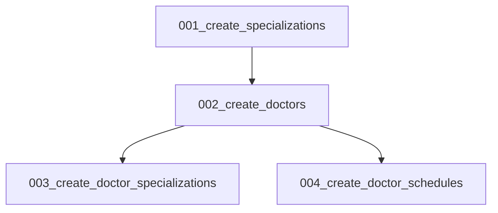

# Phase 4: Database Design — Doctor Management Module

> **Status:** PASS | **Target Quality Score:** 9.8/10
> **MVP Scope:** Four tables only. Future tables (credentials, leave_records, commission_rates) are documented in Phase 18.

---

## 1. Design Principles

- Follow existing DensCare patterns (see `patients/models.py`, `appointments/model.py`)
- Use UUID PKs for DoctorProfile and DoctorSchedule (matches Patient pattern)
- Use Integer PKs for Specialization (simple, small master table)
- Composite indexes for query performance
- Foreign keys with `RESTRICT` or `SET NULL` delete rules (matching existing patterns)
- Aggregate root table (DoctorProfile) has audit fields: `created_by`, `updated_by`, `created_at`, `updated_at`
- Child tables (DoctorSchedule, DoctorSpecialization) track changes through the aggregate root
- Soft delete via `is_active` boolean
- Check constraints for data integrity
- Identity data (full_name, email) lives on the `users` table — DoctorProfile references `user_id` FK

---

## 2. Entity Relationship Diagram

```mermaid
erDiagram
    User ||--o{ DoctorProfile : "has"
    DoctorProfile ||--o{ DoctorSchedule : "has"
    DoctorProfile ||--o{ DoctorSpecialization : "has"
    Specialization ||--o{ DoctorSpecialization : "categorized_by"

    User {
        int id PK
        string full_name
        string email
        string status
        boolean is_active
        int role_id FK
    }

    DoctorProfile {
        uuid id PK
        string doctor_code UK
        int user_id FK UK
        date date_of_birth
        gender_enum gender
        string primary_phone
        text address
        string qualification
        string registration_number
        int years_of_experience
        decimal consultation_fee
        int consultation_duration
        jsonb languages_known
        string profile_photo_url
        text biography
        string emergency_contact_name
        string emergency_contact_phone
        boolean available_for_appointment
        boolean on_leave
        boolean is_active
        int created_by FK
        int updated_by FK
        datetime created_at
        datetime updated_at
    }

    Specialization {
        int id PK
        string name UK
        string code UK
        text description
        boolean is_active
    }

    DoctorSpecialization {
        uuid doctor_id FK
        int specialization_id FK
        boolean is_primary
        date certification_date
    }

    DoctorSchedule {
        uuid id PK
        uuid doctor_id FK
        int day_of_week
        time start_time
        time end_time
        boolean is_active
    }
```

---

## 3. Table Specifications

### 3.1 `doctors`

The primary table for doctor profiles. A 1:1 extension of the `users` table. Identity data (full_name, email) is resolved through the `user_id` FK — not duplicated here.

| Column | Type | Constraints | Notes |
|---|---|---|---|
| id | UUID | PK, DEFAULT uuid_generate_v4() | Matches Patient PK pattern |
| doctor_code | VARCHAR(20) | NOT NULL, UNIQUE | Auto-generated: `DOC-{sequence}`. Add CHECK constraint for format validation. |
| user_id | INTEGER | NOT NULL, UNIQUE, FK → users.id, ON DELETE RESTRICT | 1:1 with User |
| date_of_birth | DATE | NULLABLE | |
| gender | gender_enum | NULLABLE | Reuses existing GenderEnum |
| primary_phone | VARCHAR(20) | NOT NULL | |
| address | TEXT | NULLABLE | |
| qualification | VARCHAR(500) | NULLABLE | Free-text qualifications |
| registration_number | VARCHAR(100) | NULLABLE, UNIQUE | License/registration ID. Healthcare compliance — should be unique per doctor. |
| years_of_experience | INTEGER | NULLABLE, CHECK >= 0 | Upper bound of 50 enforced by application layer |
| consultation_fee | DECIMAL(10,2) | NULLABLE, CHECK > 0 | Must be strictly positive (Phase 2 INV-7, Phase 5 BR-005) |
| consultation_duration | INTEGER | NULLABLE, CHECK > 0 | Minutes per appointment slot. Application layer enforces 15–240 min range (Phase 10 §2.1). DB enforces > 0 as the minimum integrity constraint. |
| languages_known | JSONB | NULLABLE, DEFAULT '[]' | Array of language strings |
| profile_photo_url | VARCHAR(500) | NULLABLE | |
| biography | TEXT | NULLABLE | |
| emergency_contact_name | VARCHAR(100) | NULLABLE | Embedded field, not separate table |
| emergency_contact_phone | VARCHAR(20) | NULLABLE | Embedded field, not separate table |
| available_for_appointment | BOOLEAN | NOT NULL, DEFAULT true | |
| on_leave | BOOLEAN | NOT NULL, DEFAULT false | Simple toggle |
| is_active | BOOLEAN | NOT NULL, DEFAULT true | Soft delete |
| created_by | INTEGER | NULLABLE, FK → users.id, ON DELETE SET NULL | Matches existing User/Patient audit pattern; null if referencing user is deleted |
| updated_by | INTEGER | NULLABLE, FK → users.id, ON DELETE SET NULL | Matches existing User/Patient audit pattern |
| created_at | TIMESTAMPTZ | NOT NULL, DEFAULT now() | |
| updated_at | TIMESTAMPTZ | NOT NULL, DEFAULT now() | |

**Indexes:**

```sql
-- Primary key index (auto)
-- Unique index on doctor_code (auto from UNIQUE)
-- Unique index on user_id (1:1 enforcement — matches Phase 1 C-1)
CREATE UNIQUE INDEX ix_doctors_user_id ON doctors(user_id);

-- Active status + availability filter (for search queries)
CREATE INDEX ix_doctors_active_available ON doctors(is_active, available_for_appointment);

-- Audit lookups
CREATE INDEX ix_doctors_created_by ON doctors(created_by);
CREATE INDEX ix_doctors_updated_by ON doctors(updated_by);
```

**Check Constraints:**

```sql
ALTER TABLE doctors ADD CONSTRAINT ck_doctors_years_experience CHECK (years_of_experience >= 0);
ALTER TABLE doctors ADD CONSTRAINT ck_doctors_fee_positive CHECK (consultation_fee > 0);
ALTER TABLE doctors ADD CONSTRAINT ck_doctors_duration_positive CHECK (consultation_duration > 0);
```

### 3.2 `specializations`

Master list of dental specialties. Managed by administrators.

| Column | Type | Constraints | Notes |
|---|---|---|---|
| id | SERIAL | PK | |
| name | VARCHAR(100) | NOT NULL, UNIQUE | Display name |
| code | VARCHAR(20) | NOT NULL, UNIQUE | Short code |
| description | TEXT | NULLABLE | |
| is_active | BOOLEAN | NOT NULL, DEFAULT true | |

**Indexes:**

```sql
-- Unique indexes on name and code (auto from UNIQUE)
CREATE INDEX ix_specializations_active ON specializations(is_active);
```

### 3.3 `doctor_specializations`

Join table linking doctors to their specializations. Supports one primary + optional secondary specializations per doctor.

| Column | Type | Constraints | Notes |
|---|---|---|---|
| doctor_id | UUID | NOT NULL, FK → doctors.id, ON DELETE CASCADE | |
| specialization_id | INTEGER | NOT NULL, FK → specializations.id, ON DELETE RESTRICT | |
| is_primary | BOOLEAN | NOT NULL, DEFAULT false | Exactly one primary per doctor |
| certification_date | DATE | NULLABLE | When certification was obtained |

**Primary Key:** Composite (doctor_id, specialization_id)

**Indexes:**

```sql
-- Composite primary key (auto)
CREATE INDEX ix_doctor_specializations_specialization ON doctor_specializations(specialization_id);
```

**Partial Unique Index (Primary Specialization Enforcement — Phase 2 INV-5):**

```sql
-- Ensures exactly one primary specialization per doctor
-- PostgreSQL partial unique index: only one row WHERE is_primary = true per doctor_id
CREATE UNIQUE INDEX uq_doctor_primary_specialization ON doctor_specializations(doctor_id) WHERE is_primary = true;
```

### 3.4 `doctor_schedules`

Normalized weekly recurring availability templates for each doctor. This is NOT an appointment calendar — it defines default working hours per day. Appointments own actual booked slots (see Appointment module).

| Column | Type | Constraints | Notes |
|---|---|---|---|
| id | UUID | PK, DEFAULT uuid_generate_v4() | |
| doctor_id | UUID | NOT NULL, FK → doctors.id, ON DELETE CASCADE | |
| day_of_week | INTEGER | NOT NULL, CHECK (0–5) | 0=Monday, 5=Saturday |
| start_time | TIME | NOT NULL | Work day start |
| end_time | TIME | NOT NULL, CHECK (end_time > start_time) | Work day end |
| is_active | BOOLEAN | NOT NULL, DEFAULT true | |

**Indexes:**

```sql
CREATE INDEX ix_doctor_schedules_doctor_day ON doctor_schedules(doctor_id, day_of_week);
CREATE INDEX ix_doctor_schedules_active ON doctor_schedules(doctor_id, is_active);
```

**Check Constraints:**

```sql
ALTER TABLE doctor_schedules ADD CONSTRAINT ck_schedule_day_of_week CHECK (day_of_week >= 0 AND day_of_week <= 5);
ALTER TABLE doctor_schedules ADD CONSTRAINT ck_schedule_end_after_start CHECK (end_time > start_time);
```

---

## 4. Enums

Enums are defined in `app/core/constants.py` or module-level enums.

| Enum Name | Values | Used By |
|---|---|---|
| `gender_enum` | 'male', 'female', 'other' | `doctors.gender` (reuses existing) |

See Phase 8 for full enum definitions.

---

## 5. Migration Strategy

### 5.1 Alembic Migration Order



### 5.2 Migration 001: Create `specializations`

```python
def upgrade():
    op.create_table('specializations',
        sa.Column('id', sa.Integer(), primary_key=True),
        sa.Column('name', sa.String(100), nullable=False, unique=True),
        sa.Column('code', sa.String(20), nullable=False, unique=True),
        sa.Column('description', sa.Text(), nullable=True),
        sa.Column('is_active', sa.Boolean(), nullable=False, server_default='true'),
    )
    op.create_index('ix_specializations_active', 'specializations', ['is_active'])

def downgrade():
    op.drop_table('specializations')
```

### 5.3 Migration 002: Create `doctors`

Create the `doctors` table with all columns, indexes, and constraints. Includes FK to `users.id`. Reuses existing `gender_enum`.

**Note:** Identity fields (full_name, email) are NOT included — they are on the `users` table accessed via `user_id` FK.

### 5.4 Migration 003: Create `doctor_specializations`

Create the join table with composite PK and partial unique index for primary specialization enforcement.

```sql
CREATE UNIQUE INDEX uq_doctor_primary_specialization
ON doctor_specializations(doctor_id) WHERE is_primary = true;
```

### 5.5 Migration 004: Create `doctor_schedules`

Create the schedule table with day/time constraints and composite indexes.

### 5.6 Seed Data

After migrations, seed standard specializations:

```sql
INSERT INTO specializations (name, code, description) VALUES
    ('General Dentistry', 'GENERAL', 'General dental care and checkups'),
    ('Orthodontics', 'ORTHO', 'Braces and teeth alignment'),
    ('Endodontics', 'ENDO', 'Root canal treatment'),
    ('Periodontics', 'PERIO', 'Gum disease treatment'),
    ('Prosthodontics', 'PROSTHO', 'Crowns, bridges, dentures'),
    ('Oral Surgery', 'ORAL_SURG', 'Surgical dental procedures'),
    ('Pediatric Dentistry', 'PEDO', 'Children''s dental care'),
    ('Cosmetic Dentistry', 'COSMETIC', 'Teeth whitening, veneers');
```

---

## 6. Query Patterns

### 6.1 Find available doctors by specialization

Joins through User for name data (names live on `users` table, not `doctors`).

```python
def find_available_by_specialization(
    db: Session, specialization_id: int, page: int, page_size: int
) -> tuple[list[Doctor], int]:
    query = (
        db.query(Doctor)
        .join(DoctorSpecialization)
        .join(User)  # names resolved through User
        .filter(
            DoctorSpecialization.specialization_id == specialization_id,
            Doctor.is_active == True,
            Doctor.available_for_appointment == True,
            Doctor.on_leave == False,
        )
        .order_by(User.full_name)  # sort by User's full_name
    )
    total = query.count()
    doctors = query.offset((page - 1) * page_size).limit(page_size).all()
    return doctors, total
```

### 6.2 Check schedule overlap

```python
def has_overlapping_schedule(
    db: Session, doctor_id: UUID, day: int, start: time, end: time
) -> bool:
    return (
        db.query(DoctorSchedule)
        .filter(
            DoctorSchedule.doctor_id == doctor_id,
            DoctorSchedule.day_of_week == day,
            DoctorSchedule.is_active == True,
            DoctorSchedule.start_time < end,
            DoctorSchedule.end_time > start,
        )
        .first()
        is not None
    )
```

### 6.3 Search doctors by name

Search is performed against the `users.full_name` column via the User join, not against columns on the `doctors` table.

```python
def search_doctors_by_name(
    db: Session, search_term: str, page: int, page_size: int
) -> tuple[list[Doctor], int]:
    query = (
        db.query(Doctor)
        .join(User)
        .filter(User.full_name.ilike(f"%{search_term}%"))
        .order_by(User.full_name)
    )
    total = query.count()
    doctors = query.offset((page - 1) * page_size).limit(page_size).all()
    return doctors, total
```

---

## 7. Future Tables (Deferred to Phase 18)

| Table | Purpose | Priority |
|---|---|---|
| `credentials` | License/certificate tracking with expiry | High |
| `leave_records` | Leave requests with approval workflow | Medium |
| `commission_rates` | Per-doctor financial configuration | Medium |
| `performance_metrics` | Aggregated analytics (read model) | Low |
| `schedule_overrides` | Date-specific schedule changes | Low |
| `doctor_departments` | Multi-department organizational structure | Low |

These tables are NOT created in the MVP migration set.
