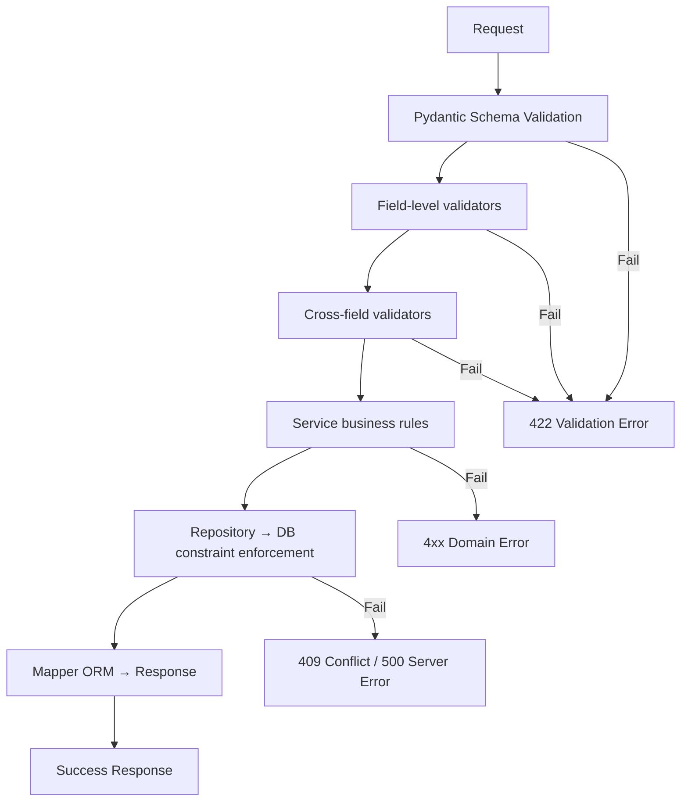

# Phase 5: Business Rules & Validations — Doctor Management Module

> **Status:** IN REVIEW | **Target Quality Score:** 9.8/10
> **MVP Scope:** Only rules required for Doctor Profile, Specialization, and Schedule management.

---

## 1. Error Codes

| Code | HTTP | Description | When |
|---|---|---|---|
| DOCTOR_NOT_FOUND | 404 | Doctor ID not found | Any operation by doctor_id |
| DUPLICATE_DOCTOR | 409 | Duplicate doctor_code or user_id | Create/Update |
| DOCTOR_CREATION_FAILED | 500 | Unexpected creation error | Create |
| DOCTOR_UPDATE_FAILED | 500 | Unexpected update error | Update |
| DOCTOR_VALIDATION_FAILED | 422 | Schema or business validation error | Any request |
| INVALID_DOCTOR_OPERATION | 409 | Invalid state transition (e.g., deactivate already inactive) | Status change |
| NOT_A_DOCTOR_USER | 422 | User does not have a DOCTOR role | Create profile |
| USER_NOT_FOUND | 404 | Referenced user_id does not exist | Create profile |
| SCHEDULE_OVERLAP | 409 | Schedule slots overlap | Create/Update schedule |
| SPECIALIZATION_NOT_FOUND | 404 | Specialization ID not found | Assign specialization |
| PRIMARY_SPECIALIZATION_REQUIRED | 422 | At least one primary required | Assign specialization |
| SELF_SERVICE_NOT_ALLOWED | 403 | Doctor modifying restricted field | Self-update blocked fields |
| FORBIDDEN | 403 | Insufficient permissions for role or ownership | Non-owner or non-Admin operation |

**Cross Reference:** Phase 1 §14 (Acceptance Criteria), Phase 3 §2 (Layer Responsibilities)

---

## 2. Business Rules

### 2.1 Doctor Profile Rules

| # | Rule | Enforcement | Error | Phase Ref |
|---|---|---|---|---|
| BR-001 | Doctor Code must be unique across all doctors | DB UNIQUE constraint + Service check | DUPLICATE_DOCTOR (409) | Phase 1 FR-1.6, C-2 |
| BR-002 | Doctor must link to an existing User record | Service lookup | USER_NOT_FOUND (404) | Phase 1 FR-1.1, BR-1 |
| BR-003 | Linked User must have a DOCTOR-family role | Service check against role name | NOT_A_DOCTOR_USER (422) | Phase 1 BR-3, C-3 |
| BR-004 | One User can have at most one DoctorProfile | DB UNIQUE index + Service check | DUPLICATE_DOCTOR (409) | Phase 1 C-1, INV-1 |
| BR-005 | Consultation fee must be positive | DB CHECK + Validator | DOCTOR_VALIDATION_FAILED (422) | Phase 1 FR-4.5, INV-7 |
| BR-006 | Years of experience must be >= 0 | DB CHECK + Validator | DOCTOR_VALIDATION_FAILED (422) | Phase 1 FR-2.3 |
| BR-007 | Primary phone is required | Schema validation | DOCTOR_VALIDATION_FAILED (422) | Phase 1 FR-3.1 |
| BR-008 | Profile photo URL must be valid if provided | Validator | DOCTOR_VALIDATION_FAILED (422) | Phase 1 FR-1.3 |
| BR-009 | Cannot deactivate an already inactive doctor | Service check | INVALID_DOCTOR_OPERATION (409) | Phase 1 FR-1.5 |
| BR-010 | Cannot activate an already active doctor | Service check | INVALID_DOCTOR_OPERATION (409) | Phase 1 FR-1.5 |
| BR-011 | Inactive doctors cannot set `available_for_appointment=true` | Service check (INV-11) | INVALID_DOCTOR_OPERATION (409) | Phase 2 INV-11 |
| BR-012 | Doctor Code is immutable after creation | Service check on update | INVALID_DOCTOR_OPERATION (409) | Phase 2 INV-4 |
| BR-013 | Doctor Code format: `DOC-{6-digit sequence}` | Service generation | — | Phase 1 FR-1.2 |

### 2.2 Specialization Rules

| # | Rule | Enforcement | Error | Phase Ref |
|---|---|---|---|---|
| BR-101 | Specialization name must be unique | DB UNIQUE constraint | DOCTOR_VALIDATION_FAILED (422) | Phase 4 §3.2 |
| BR-102 | Specialization code must be unique | DB UNIQUE constraint | DOCTOR_VALIDATION_FAILED (422) | Phase 4 §3.2 |
| BR-103 | Exactly one primary specialization per doctor (if assigned) | Service + Partial unique index | PRIMARY_SPECIALIZATION_REQUIRED (422) | Phase 1 FR-2.4, INV-5 |
| BR-104 | Same specialization cannot be assigned twice to the same doctor | Composite PK | DOCTOR_VALIDATION_FAILED (422) | Phase 4 §3.3 |

### 2.3 Schedule Rules

| # | Rule | Enforcement | Error | Phase Ref |
|---|---|---|---|---|
| BR-201 | Schedule end_time must be after start_time | DB CHECK + Validator | DOCTOR_VALIDATION_FAILED (422) | Phase 1 FR-4.3, INV-10 |
| BR-202 | Day of week must be 0–5 (Monday–Saturday) | DB CHECK + Validator | DOCTOR_VALIDATION_FAILED (422) | Phase 2 INV-9 |
| BR-203 | No overlapping schedules for same doctor on same day | Repository query | SCHEDULE_OVERLAP (409) | Phase 1 FR-4.6, C-4 |
| BR-204 | Available for appointment flag respected by booking | Cross-module | — | Phase 1 C-5, INV-11 |
| BR-205 | On leave flag blocks new appointments | Cross-module | — | Phase 1 C-5, INV-12 |

### 2.4 Access Control Rules

| # | Rule | Enforcement | Error | Phase Ref |
|---|---|---|---|---|
| BR-301 | Only Admin and Chief Doctor can create doctor profiles | Router: require_roles() | FORBIDDEN (403) | Phase 1 §6 (Stakeholders) |
| BR-302 | Only Admin and Chief Doctor can update all doctor fields | Router: require_roles() | FORBIDDEN (403) | Phase 1 §6, Phase 2 §10 |
| BR-303 | Doctors can view their own profile | Router: user_id match check | FORBIDDEN (403) | Phase 2 §10 (Ownership) |
| BR-304 | Doctors can update self-service fields | Router: owner check + field-level validation | SELF_SERVICE_NOT_ALLOWED (403) | Phase 1 §6, Phase 2 §10 |
| BR-305 | Doctors can update own schedule (self-service) | Router: owner check | SELF_SERVICE_NOT_ALLOWED (403) | Phase 1 §6, Phase 2 §10 |
| BR-306 | Receptionist can search and view doctors | Router: require_roles() | FORBIDDEN (403) | Phase 1 §6, Phase 2 §5 |
| BR-307 | Unauthenticated requests are rejected | Router: get_current_user() | 401 Unauthorized | Phase 3 §2.1 (Router) |

**Self-Service vs Admin-Only Fields:**

| Editable By | Fields |
|---|---|
| Doctor (self-service) | biography, profile_photo_url, languages_known, schedule templates, availability toggle, leave toggle |
| Admin / Chief Doctor | doctor_code, user_id, consultation_fee, consultation_duration, years_of_experience, qualification, registration_number, primary_phone, address, gender, date_of_birth, emergency_contact, is_active, specializations |

**Cross Reference:** Phase 2 §10 (Ownership), Phase 1 §6 (Stakeholders)

---

## 3. Validation Pipeline



**Cross Reference:** Phase 3 §2 (Layer Responsibilities), Phase 3 §5 (Sequence Diagrams)

### 3.1 Schema-Level Validation (FastAPI / Pydantic)

| Field | Validator | Rule |
|---|---|---|
| user_id | Field(gt=0) | Existing User ID |
| doctor_code | regex pattern (service-generated) | `^DOC-\d{6}$` |
| primary_phone | regex pattern | `^\+?[1-9]\d{9,14}$` |
| consultation_fee | Field(gt=0) | Positive decimal |
| consultation_duration | Field(ge=15, le=240) | Clinical minimum 15 minutes, max 4 hours (240 min). Implementer: set via clinic config if needed. |
| years_of_experience | Field(ge=0) | Non-negative integer |
| day_of_week | Field(ge=0, le=5) | 0=Monday through 5=Saturday |
| profile_photo_url | optional URL validation | Valid URL if provided |
| languages_known | validate JSON is array | Array of strings |

### 3.2 Business Validation (Service Layer)

| Validator | Checks |
|---|---|
| `validate_user_exists(user_id)` | User exists in DB |
| `validate_user_is_doctor(user)` | User has DOCTOR-family role |
| `validate_no_duplicate_user(user_id)` | No existing profile for this user |
| `validate_specializations_exist(ids)` | All specialization IDs are valid |
| `validate_primary_exists(specializations)` | At least one primary |
| `validate_no_overlap(doctor_id, day, start, end)` | No schedule conflict |

---

## 4. State Transitions

### 4.1 Profile Status

```
Active → Inactive  (deactivate)
Inactive → Active  (reactivate)
Active → Active     (idempotent — error)
Inactive → Inactive (idempotent — error)
```

### 4.2 Availability Toggles

```
available_for_appointment: true  ↔ false
on_leave:                       true  ↔ false
```

Both toggles are independent and can be set simultaneously. The following restrictions apply:

- **Inactive doctors CANNOT set `available_for_appointment=true`** (Phase 2 INV-11). The service layer rejects this transition.
- **On-leave doctors are treated as unavailable** regardless of `available_for_appointment` value (Phase 2 INV-12).
- **Reactivating an inactive doctor does NOT restore availability** — the doctor must explicitly toggle `available_for_appointment` back to true.

**Cross Reference:** Phase 2 §8 (Entity Lifecycle), Phase 2 §7 INV-11, INV-12

---

## 5. Cross-Module Business Rules

| # | Rule | Source Module | Target Module |
|---|---|---|---|
| CR-001 | Appointments module checks `available_for_appointment` and `on_leave` before booking NEW appointments | Appointments | Doctors |
| CR-002 | Appointment module does NOT cancel existing appointments when a doctor is deactivated or goes on leave | Appointments | Doctors |
| CR-003 | Patient Records can reference DoctorProfile for attribution | Patient Records | Doctors |
| CR-004 | User deactivation does NOT cascade to DoctorProfile | Users | Doctors |
| CR-005 | DoctorProfile deactivation does NOT cascade to User | Doctors | Users |

---

## 6. Rules Explicitly Excluded from MVP

The following rules are intentionally excluded from the MVP and documented in Phase 18:

| Rule | Reason | Future Phase |
|---|---|---|
| License expiry blocking | Requires Credential entity | Phase 18 |
| Leave overlap detection | Requires Leave entity | Phase 18 |
| Commission rate conflicts | Requires Commission entity | Phase 18 |
| Performance thresholds | Requires Performance entity | Phase 18 |
| Minimum/maximum patients per day | Not in MVP scope | Phase 18 |
| Department-based scheduling | Requires Department entity | Phase 18 |
