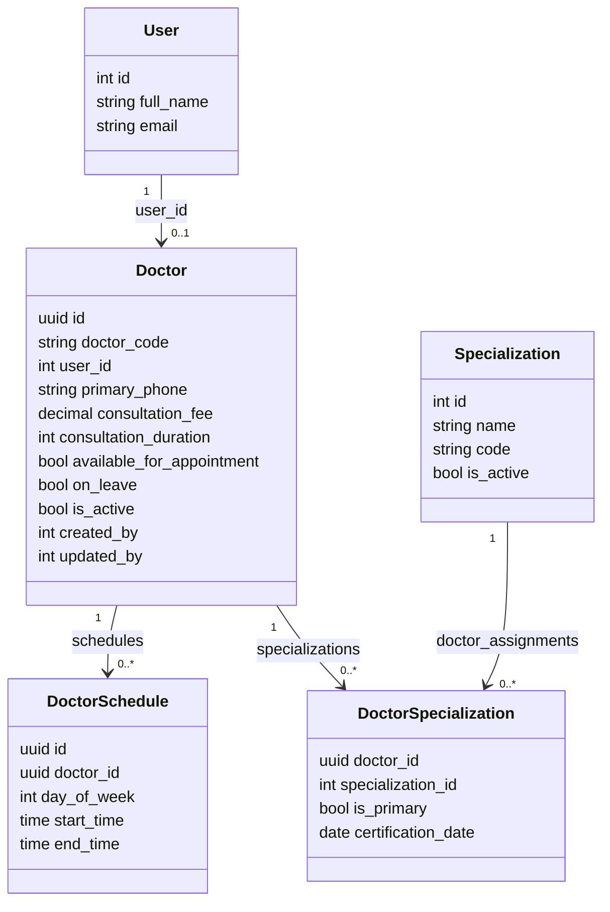

# Phase 9: SQLAlchemy Models — Doctor Management Module

> **Status:** IN REVIEW | **Target Quality Score:** 9.8/10
> **MVP Scope:** Four models only: Doctor, Specialization, DoctorSpecialization, DoctorSchedule.

---

## 1. Design Patterns

All models follow existing DensCare patterns from `patients/models.py` and `appointments/model.py`:

- `Base = declarative_base()` from `app/database/base.py`
- UUID primary keys for Doctor and DoctorSchedule (matches Patient)
- Integer primary keys for Specialization (simple lookup table)
- `TIMESTAMPTZ` for datetime columns with `server_default=func.now()`
- Explicit `__tablename__` and `__table_args__`
- Relationships with `passive_deletes=True` where appropriate
- Foreign keys with explicit `ondelete` rules

---

## 2. Doctor Model

```python
import uuid
from sqlalchemy import Column, String, Boolean, Date, DateTime, Integer, Text, Numeric, JSON, ForeignKey, CheckConstraint, Index
from sqlalchemy.dialects.postgresql import UUID
from sqlalchemy.orm import relationship
from sqlalchemy.sql import func
from app.database.base import Base
from app.core.constants import GenderEnum


class Doctor(Base):
    __tablename__ = "doctors"

    id = Column(UUID(as_uuid=True), primary_key=True, default=uuid.uuid4)
    doctor_code = Column(String(20), nullable=False, unique=True)
    user_id = Column(Integer, ForeignKey("users.id", ondelete="RESTRICT"), nullable=False, unique=True)

    # Personal Information
    date_of_birth = Column(Date, nullable=True)
    gender = Column(String(10), nullable=True)  # Reuses GenderEnum values

    # Contact Information
    primary_phone = Column(String(20), nullable=False)
    address = Column(Text, nullable=True)
    emergency_contact_name = Column(String(100), nullable=True)
    emergency_contact_phone = Column(String(20), nullable=True)

    # Professional Information
    qualification = Column(String(500), nullable=True)
    registration_number = Column(String(100), nullable=True, unique=True)
    years_of_experience = Column(Integer, nullable=True)
    consultation_fee = Column(Numeric(10, 2), nullable=True)
    consultation_duration = Column(Integer, nullable=True)
    languages_known = Column(JSON, nullable=True, default=list)

    # Profile
    profile_photo_url = Column(String(500), nullable=True)
    biography = Column(Text, nullable=True)

    # Status Flags
    available_for_appointment = Column(Boolean, nullable=False, default=True)
    on_leave = Column(Boolean, nullable=False, default=False)
    is_active = Column(Boolean, nullable=False, default=True)

    # Audit Fields
    created_by = Column(Integer, ForeignKey("users.id", ondelete="SET NULL"), nullable=True)
    updated_by = Column(Integer, ForeignKey("users.id", ondelete="SET NULL"), nullable=True)
    created_at = Column(DateTime(timezone=True), nullable=False, server_default=func.now())
    updated_at = Column(DateTime(timezone=True), nullable=False, server_default=func.now(), onupdate=func.now())

    # Relationships
    user = relationship("User", foreign_keys=[user_id], passive_deletes=True)
    creator = relationship("User", foreign_keys=[created_by], passive_deletes=True)
    updater = relationship("User", foreign_keys=[updated_by], passive_deletes=True)
    specializations = relationship("DoctorSpecialization", back_populates="doctor", cascade="all, delete-orphan", passive_deletes=True)
    schedules = relationship("DoctorSchedule", back_populates="doctor", cascade="all, delete-orphan", passive_deletes=True)

    __table_args__ = (
        CheckConstraint("years_of_experience >= 0", name="ck_doctors_years_experience"),
        CheckConstraint("consultation_fee > 0", name="ck_doctors_fee_positive"),
        CheckConstraint("consultation_duration > 0", name="ck_doctors_duration_positive"),
        Index("ix_doctors_active_available", "is_active", "available_for_appointment"),
        Index("ix_doctors_created_by", "created_by"),
    )
```

---

## 3. Specialization Model

```python
class Specialization(Base):
    __tablename__ = "specializations"

    id = Column(Integer, primary_key=True)
    name = Column(String(100), nullable=False, unique=True)
    code = Column(String(20), nullable=False, unique=True)
    description = Column(Text, nullable=True)
    is_active = Column(Boolean, nullable=False, default=True)

    # Relationships
    doctor_assignments = relationship("DoctorSpecialization", back_populates="specialization", passive_deletes=True)

    __table_args__ = (
        Index("ix_specializations_active", "is_active"),
    )
```

---

## 4. DoctorSpecialization Model (Join Table)

```python
class DoctorSpecialization(Base):
    __tablename__ = "doctor_specializations"

    doctor_id = Column(UUID(as_uuid=True), ForeignKey("doctors.id", ondelete="CASCADE"), primary_key=True)
    specialization_id = Column(Integer, ForeignKey("specializations.id", ondelete="RESTRICT"), primary_key=True)
    is_primary = Column(Boolean, nullable=False, default=False)
    certification_date = Column(Date, nullable=True)

    # Relationships
    doctor = relationship("Doctor", back_populates="specializations")
    specialization = relationship("Specialization", back_populates="doctor_assignments")

    __table_args__ = (
        Index("ix_ds_specialization", "specialization_id"),
        Index("ix_ds_doctor_specialization", "doctor_id", "specialization_id"),
    )
```

**Partial Unique Index (applied via Alembic migration):**

```sql
CREATE UNIQUE INDEX uq_doctor_primary_specialization
ON doctor_specializations(doctor_id)
WHERE is_primary = true;
```

---

## 5. DoctorSchedule Model

```python
class DoctorSchedule(Base):
    __tablename__ = "doctor_schedules"

    id = Column(UUID(as_uuid=True), primary_key=True, default=uuid.uuid4)
    doctor_id = Column(UUID(as_uuid=True), ForeignKey("doctors.id", ondelete="CASCADE"), nullable=False)
    day_of_week = Column(Integer, nullable=False)  # 0=Monday, 5=Saturday
    start_time = Column(Time, nullable=False)
    end_time = Column(Time, nullable=False)
    is_active = Column(Boolean, nullable=False, default=True)

    # Relationships
    doctor = relationship("Doctor", back_populates="schedules")

    __table_args__ = (
        CheckConstraint("day_of_week >= 0 AND day_of_week <= 5", name="ck_schedule_day_of_week"),
        CheckConstraint("end_time > start_time", name="ck_schedule_end_after_start"),
        Index("ix_schedule_doctor_day", "doctor_id", "day_of_week"),
        Index("ix_schedule_active", "doctor_id", "is_active"),
    )
```

---

## 6. Model Relationships Diagram



---

## 7. Models Explicitly Excluded from MVP

| Model | Purpose | Future Phase |
|---|---|---|
| `Credential` | License/certificate tracking with expiry | Phase 18 |
| `LeaveRecord` | Leave requests with approval workflow | Phase 18 |
| `CommissionRate` | Per-doctor financial configuration | Phase 18 |
| `PerformanceMetric` | Aggregated analytics (read model) | Phase 18 |
| `ScheduleOverride` | Date-specific schedule changes | Phase 18 |
