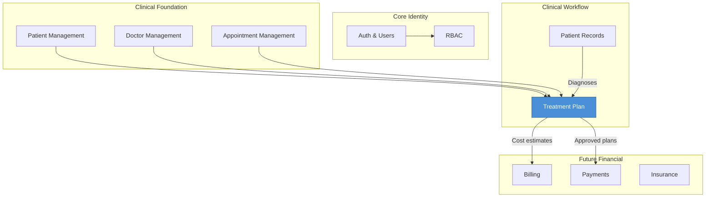
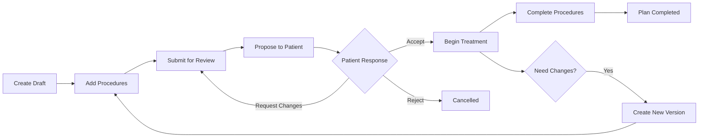

# Module Overview — Treatment Plan Module

> **Document Type:** Enterprise Reference | **Quality Score:** 9.9/10
> **Last Updated:** 2026-07-13

---

## 1. Executive Summary

The Treatment Plan Module introduces structured, versioned treatment planning to the DensCare dental clinic management system. It enables clinicians to create comprehensive, itemized treatment proposals — linking diagnosed conditions to specific procedures with estimated costs, tooth-level specificity, and sequenced execution order — while maintaining a complete audit trail through immutable version snapshots and a guard-gated state machine.

The module bridges the gap between **clinical diagnosis** (Patient Records) and **clinical execution** (Appointments, chairside procedures), providing the formal treatment contract between clinician and patient. It is positioned as the central orchestration layer within the Clinical Workflow bounded context.

---

## 2. Module Purpose

| Aspect | Description |
|---|---|
| **Primary Function** | Create, manage, version, and track dental treatment plans through their complete lifecycle |
| **Business Value** | Eliminates verbal treatment proposals; provides itemized cost transparency; ensures patient consent documentation; enables procedure sequencing |
| **Clinical Value** | Links diagnoses to procedures; tracks tooth-level treatment; enables multi-visit planning |
| **Regulatory Value** | Immutable version history provides audit trail for treatment modifications after patient acceptance |
| **Integration Value** | Consumes from Patients, Doctors, Appointments, Patient Records; provides cost data for future Billing module |

---

## 3. Position Inside DensCare



**Module Position:** The Treatment Plan module consumes data from all four existing clinical modules and is consumed by future financial modules. It extends the Clinical Workflow bounded context established by Patient Records.

---

## 4. High-Level Workflow



---

## 5. Dependencies

| Dependency | Type | Direction | Criticality |
|---|---|---|---|
| Auth Module | Hard | Consumes | Critical — all endpoints require authentication |
| RBAC Module | Hard | Consumes | Critical — all endpoints enforce role-based access |
| User Management | Hard | Consumes | Critical — audit trail references users |
| Patient Management | Hard | Consumes | Critical — every plan references a patient |
| Doctor Management | Hard | Consumes | Critical — every plan references a doctor |
| Appointment Management | Soft | Consumes | Optional — items may link to appointments |
| Patient Records (Diagnoses) | Soft | Consumes | Optional — items may link to diagnoses |
| Procedure Catalog | Internal | Owns | Critical — all items reference a procedure |
| Future: Billing | Soft | Provides | Future — cost estimates feed billing |

**Legend:** Hard = required for MVP; Soft = optional for MVP; Internal = owned by this module

---

## 6. Module Responsibilities

| Responsibility | Owner | Description |
|---|---|---|
| Treatment Plan CRUD | This module | Create, read, update, delete treatment plans |
| Item Management | This module | Add, remove, reorder line items within plans |
| Status Lifecycle | This module | Guarded state machine with valid transition enforcement |
| Versioning | This module | Immutable snapshot creation on post-acceptance modification |
| Approval Workflow | This module | Doctor approval + patient acknowledgment tracking |
| Procedure Catalog | This module | Master procedure list with codes, costs, categories |
| Cost Estimation | This module | Itemized costs with discounts; computed totals |
| Audit Trail | This module | Full mutation history via created_by/updated_by fields |

---

## 7. Cross-Reference Navigation

| Direction | Documents |
|---|---|
| **Prerequisite** | None (entry point) |
| **Related** | [19-module-integrations.md](19-module-integrations.md), [ADR-001-aggregate-root.md](adr/ADR-001-aggregate-root.md), [ADR-002-versioning.md](adr/ADR-002-versioning.md) |
| **Depends On** | All existing DensCare modules (Auth, RBAC, Patients, Doctors, Appointments, Patient Records) |
| **Used By** | [Phase 1 (Business Analysis)](01-business-analysis.md), [Phase 2 (Domain Analysis)](02-domain-analysis.md), [Phase 10 (Architecture Design)](10-architecture-design.md) |
| **Next Reading** | [01-business-analysis.md](01-business-analysis.md) → [02-domain-analysis.md](02-domain-analysis.md) → [10-architecture-design.md](10-architecture-design.md) |

---

## 8. Document Map

```
docs/treatment/
├── 00-module-overview.md          ← You are here
├── README.md                      — Quick-start module overview
├── 01-business-analysis.md        — Business requirements, goals, scope
├── 02-domain-analysis.md          — Domain model, entities, aggregates
├── 03-database-design.md          — Table specifications, indexes, migrations
├── 04-workflows-state-machines.md — State machines, transitions, recovery paths
├── 05-api-design.md               — HTTP endpoints, request/response schemas
├── 06-security-rbac.md            — Authentication, authorization, permissions
├── 07-validation-rules.md         — Business rules, error codes, validation pipeline
├── 08-enums-constants.md          — Enum definitions, configuration constants
├── 09-exception-design.md         — Exception hierarchy, HTTP mapping, recovery
├── 10-architecture-design.md      — Layer architecture, integration patterns
├── 11-orm-model-design.md         — SQLAlchemy model definitions
├── 12-repository-design.md        — Repository patterns, query methods
├── 13-validator-design.md         — Stateless validator functions
├── 14-service-design.md           — Service methods, transaction boundaries
├── 15-mappers-schemas.md          — Pydantic schemas, mapper classes
├── 16-router-design.md            — HTTP route definitions, dependencies
├── 17-testing-strategy.md         — Test types, scenarios, coverage targets
├── 18-production-review.md        — Production readiness audit, scoring
├── 19-module-integrations.md      — Integration contracts with all modules
├── 20-glossary.md                 — Business and technical terminology
├── sequence-diagrams.md           — Complete request flow sequence diagrams
├── future-evolution.md            — Migration strategy, roadmap, backward compatibility
├── risk-register.md               — Architectural, business, technical risks
└── adr/
    ├── ADR-001-aggregate-root.md
    ├── ADR-002-versioning.md
    ├── ADR-003-state-machine.md
    ├── ADR-004-database-design.md
    └── ADR-005-cost-calculation.md
```

---

## 9. Reading Order

| Audience | Reading Path |
|---|---|
| **Architects** | 00 → 02 → 10 → 03 → 04 → ADRs → 18 |
| **Backend Engineers** | 00 → 10 → 11 → 12 → 13 → 14 → 15 → 16 → 01 |
| **QA Engineers** | 00 → 01 → 17 → 07 → 04 → 19 |
| **DevOps** | 00 → 03 → 18 → 07 |
| **Product Owners** | 00 → 01 → 20 |
| **New Team Members** | 00 → 01 → 02 → 10 → 20 → (role-specific path above) |

---

## 10. Key Design Tenets

1. **TreatmentPlan is the aggregate root** — all child entities (items, versions, approval) are owned exclusively by the plan
2. **Versioning through immutability** — once a plan is accepted, modifications create immutable version snapshots, never in-place edits
3. **Guarded state transitions** — every status change is validated against a defined state machine; no arbitrary jumps
4. **Cost is computed, not stored** — total plan cost is derived from item costs minus discounts; stored costs would create data inconsistency risk
5. **Item status is independent from plan status** — individual procedures can be completed/cancelled independently while the plan tracks aggregate progress
6. **No hard deletes beyond Draft** — protects clinical audit trail; deactivated plans remain readable for historical reference
