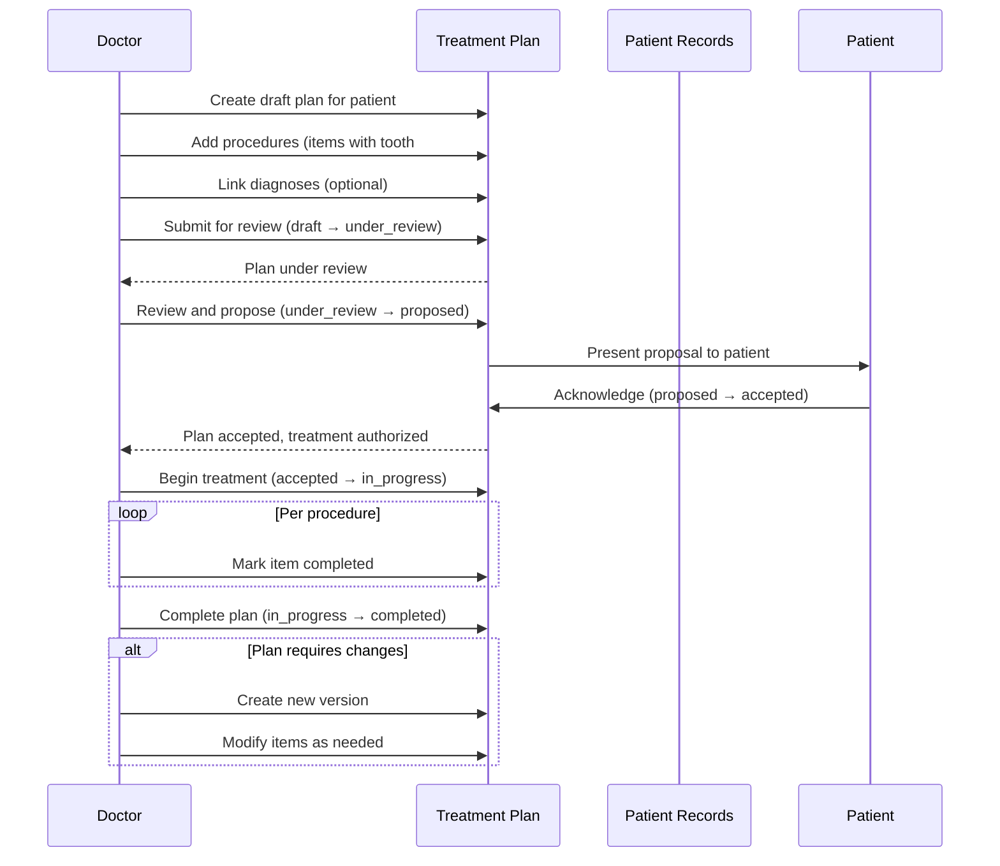
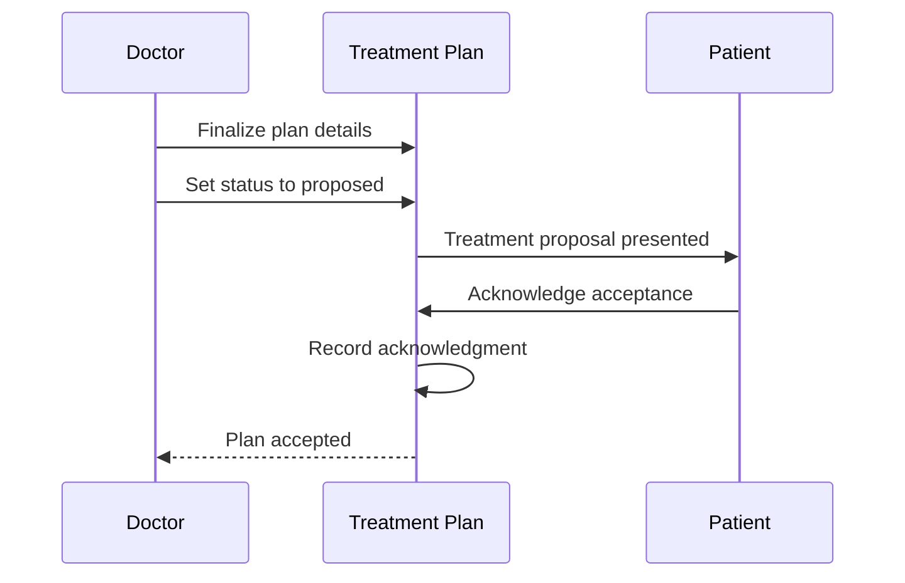
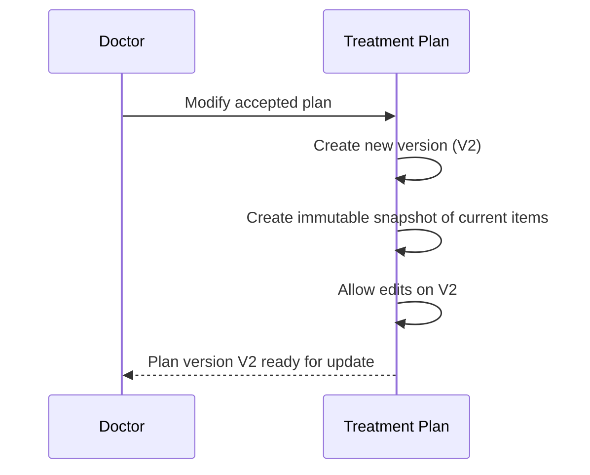

# Phase 1: Business Analysis — Treatment Plan Module

> **Status:** APPROVED | **Target Quality Score:** 9.9/10
> **MVP Scope:** This document reflects only the Treatment Plan MVP. Future features are documented in Phase 18.

| Field | Value |
|---|---|
| Document | Business Requirements Document |
| Module | Treatment Plan |
| Version | 1.0 |
| Status | Approved |
| Owner | Engineering Team |
| Last Updated | 2026-07-13 |
| Related Documents | Phase 2, Phase 3, Phase 4 |

---

## 1. Executive Summary

The Treatment Plan Module introduces structured, versioned treatment planning to DensCare, replacing the current ad-hoc approach where treatment proposals are communicated verbally or via unstructured notes. This MVP provides comprehensive plan creation with itemized procedures, cost estimation, approval tracking, versioning, and a formal status lifecycle. The module integrates with the existing Patient Management, Doctor Management, Appointment Management, and Patient Records modules to create a unified clinical workflow — from diagnosis through treatment completion.

---

## 2. Purpose

This Business Requirements Document (BRD) defines the scope, functional and non-functional requirements for the Treatment Plan MVP. It serves as the authoritative reference for architects, engineers, QA, and stakeholders throughout design, implementation, and acceptance testing.

---

## 3. Business Context

DensCare is a dental clinic management platform with the following completed modules:

- **Authentication & Authorization** — Login, token-based authentication, password management
- **RBAC** — Role-based access control with 7 roles
- **User Management** — User lifecycle (pending → active → inactive), role assignment
- **Patient Management** — Patient registration, search, profile management
- **Doctor Management** — Doctor profiles, specializations, schedules
- **Appointment Management** — Scheduling, conflict detection, status lifecycle
- **Patient Records** — Clinical documentation, diagnoses, prescriptions, attachments

### Problem Statement

Dental clinics currently lack a structured treatment planning capability. Treatment proposals are communicated verbally or via unstructured clinical notes, causing several operational problems:

| # | Problem | Business Impact |
|---|---|---|
| P1 | No structured treatment plans | Patients cannot review proposed procedures, costs, or timelines in writing. Treatment acceptance is verbal, leading to disputes. |
| P2 | No itemized cost estimation | Patients cannot see per-procedure costs. Billing has no reference document for treatment-related charges. Discrepancies between quoted and billed amounts cause patient dissatisfaction. |
| P3 | No treatment plan versioning | When a plan changes mid-treatment (e.g., additional procedures discovered), there is no audit trail of what was originally proposed versus what was actually performed. |
| P4 | No patient acknowledgment tracking | Clinics cannot prove that a patient consented to a specific treatment plan and its associated costs. Regulatory compliance risk. |
| P5 | No procedure sequencing | Complex multi-visit treatments (e.g., full-mouth rehabilitation) have no defined sequence. Clinicians may perform procedures out of order, compromising clinical outcomes. |
| P6 | No integration with diagnoses | Treatment plans should reference diagnosed conditions from Patient Records, but there is no formal linkage. Plans are created without clinical justification traceability. |

---

## 4. Business Goals

| # | Goal | Priority | Success Metric |
|---|---|---|---|
| G1 | Enable structured treatment plan creation with itemized procedures and costs | Critical | 100% of multi-procedure treatments have formal plans within 1 month of deployment |
| G2 | Support treatment plan status lifecycle with guarded transitions | Critical | Zero invalid status transitions after deployment |
| G3 | Provide plan versioning with immutable snapshots | Critical | Every plan modification after acceptance creates a versioned record |
| G4 | Enable patient acknowledgment tracking | High | 100% of accepted plans have documented patient acknowledgment |
| G5 | Enable search/filter of treatment plans by patient, doctor, status, date range | High | Staff finds matching plan in <3 seconds |
| G6 | Integrate with Patient Records for diagnosis-driven planning | High | Treatment plans reference at least one diagnosis from Patient Records |
| G7 | Integrate with Appointments for procedure scheduling | Medium | Treatment plan items can be linked to specific appointments |
| G8 | Maintain full audit trail for all treatment plan operations | Critical | Every create/update/status-change is traceable to user + timestamp |

---

## 5. Scope

### In Scope (MVP)

1. **Treatment Plan Management**
   - Create treatment plan linked to a Patient and a Doctor
   - Auto-generated Plan ID (e.g., `TXN-00001`)
   - Clinical notes, observations, and dentist recommendations
   - Multiple plan items (procedures) per plan
   - Estimated validity period (valid from / valid to dates)
   - Active/inactive status

2. **Treatment Plan Items (Line Items)**
   - Procedure reference from master Procedure catalog
   - Tooth number (FDI two-digit notation)
   - Tooth surface(s)
   - Quadrant/sextant specification
   - Estimated cost per item
   - Discount per item
   - Sequence/priority order
   - Item status (pending, in_progress, completed, cancelled, deferred)
   - Item notes
   - Linkage to appointment (optional)

3. **Procedure Master Catalog**
   - Procedure code (custom or ADA CDT format)
   - Procedure name
   - Description
   - Default estimated cost
   - Procedure category (Restorative, Surgical, Endodontic, etc.)
   - Active/inactive toggle

4. **Treatment Plan Versioning**
   - Automatic version creation on plan modification after acceptance
   - Version number (1, 2, 3, ...)
   - Snapshot of plan items at time of version creation
   - Change reason
   - Changed by (user reference)
   - Timestamp

5. **Approval Workflow**
   - Plan approval/rejection by doctor
   - Patient acknowledgment (accept/reject/request changes)
   - Approval notes
   - Timestamp and user tracking

6. **Cost Estimation**
   - Itemized estimated cost per procedure
   - Subtotal per plan
   - Total estimated cost (computed)
   - Discount tracking per item

7. **Status Lifecycle**
   - Draft → Under Review → Proposed → Accepted → In Progress → Completed/Cancelled
   - Guarded transitions (no arbitrary jumps)
   - On Hold as a pause state

8. **Search & Discovery**
   - Search by plan ID, patient name, doctor name, status
   - Filter by status, patient, doctor, date range
   - Paginated results with configurable page size
   - Sorting by created date, status, patient name

9. **Audit**
   - Created by, Updated by, Created at, Updated at on all entities
   - Full traceability per record

10. **Integration**
    - Auth module for authentication
    - RBAC for permission enforcement
    - Patient Management for patient reference
    - Doctor Management for owning doctor reference
    - Appointment Management for optional appointment linkage
    - Patient Records for diagnosis references

### Non-Goals

This module is NOT intended to:

- Replace billing/invoicing systems
- Generate insurance claims
- Provide treatment outcome analytics
- Replace clinical charting
- Generate patient treatment acceptance forms (digital acknowledgment only)

### Out of Scope (Future Modules)

The following are explicitly out of scope for the MVP and are documented in Phase 18:

- Insurance claim generation and management
- Billing/invoice integration
- Treatment outcome analytics and KPIs
- Teledentistry consent workflows
- Multi-clinic treatment plan sharing
- AI-assisted treatment recommendations
- Patient portal for treatment plan review
- Payment plan/schedule generation
- Laboratory case management integration

---

## 5.1. Explicit Non-Goals

To avoid scope creep and manage stakeholder expectations, the following capabilities are explicitly designated as non-goals for this module:

### Billing & Invoicing
- Treatment Plan provides **cost estimates**, not invoices
- Actual charges are determined by the future Billing module
- The module explicitly does NOT generate bills, process payments, or track arrears

### Payment Plans
- Treatment Plan costs are itemized estimates
- Payment schedule generation is deferred to a future Payments module
- No installment tracking, due date management, or payment status tracking

### Insurance Claims
- Treatment Plan does NOT submit insurance claims
- No insurance provider management, policy validation, or claim status tracking
- Future Insurance module will consume plan data for claim generation

### Appointment Scheduling
- Treatment Plan items CAN optionally reference appointments
- However, the module does NOT manage appointment availability, scheduling conflicts, or calendar management
- Appointment scheduling remains the responsibility of the Appointment Management module

### Dental Chart Management
- Tooth numbers are stored as integers (FDI notation)
- No graphical dental chart rendering, chart annotation, or tooth condition tracking
- Future Dental Chart module may consume treatment plan tooth data for visual display

### Laboratory Workflow
- Procedures requiring lab work (crowns, bridges, dentures) are tracked as items
- No lab case management, lab order tracking, or lab communication workflow
- Future Laboratory Integration module will manage this lifecycle

### Patient Communication
- Treatment plans are reviewed in-clinic with the patient
- No email/SMS notification engine for plan proposals
- No patient portal for online plan review (deferred to Phase C)

---

## 6. Stakeholders

| Stakeholder | Role | Interest |
|---|---|---|
| Clinic Administrator | System owner | Complete treatment plan data visibility, audit compliance, regulatory adherence |
| Chief Doctor | Clinical lead | Treatment planning standards, clinical workflow oversight |
| General Dentist | End user | Create and manage treatment plans for assigned patients |
| Specialist Dentist | End user | Create specialist-specific treatment plans, refer procedures |
| Consulting Dentist | End user | Contribute to treatment plans, review proposals |
| Receptionist | Primary operator | Search plans, schedule appointments based on plan items |
| Dental Assistant | Support | View plans, assist with chairside documentation |
| Patient | Recipient | Review proposed treatments, acknowledge acceptance |
| IT Team | Implementation | Integration, performance, deployment |
| QA Team | Validation | Acceptance criteria verification |

---

## 7. Business Rules

### 7.1 Core Rules

- **BR-1:** Every Treatment Plan SHALL reference exactly one Patient and one Doctor.
- **BR-2:** A Treatment Plan MAY reference zero or more Diagnoses from Patient Records.
- **BR-3:** A Treatment Plan SHALL have at least one Treatment Plan Item to move beyond Draft status.
- **BR-4:** A Treatment Plan Item SHALL reference exactly one Procedure from the master catalog.
- **BR-5:** A Treatment Plan MAY have multiple versions; each version is an immutable snapshot.
- **BR-6:** Only the most recent version of a Treatment Plan SHALL be editable.
- **BR-7:** A Treatment Plan SHALL follow the defined state machine for status transitions.
- **BR-8:** Once accepted, a Treatment Plan SHALL require a new version for any modification.
- **BR-9:** A Procedure code SHALL be unique across the master catalog.
- **BR-10:** Estimated cost per item SHALL be a non-negative value.
- **BR-11:** Total plan cost SHALL be computed as the sum of item costs minus item discounts, not stored directly.
- **BR-12:** A Treatment Plan SHALL NOT be deleted after it leaves Draft status — only deactivated.

### 7.2 Treatment Plan Item Rules

- **BR-20:** Tooth numbers SHALL follow the FDI two-digit notation system (11–48, 51–85).
- **BR-21:** Each Treatment Plan Item SHALL have a sequence number within its plan.
- **BR-22:** Sequence numbers SHALL be unique within a plan version.
- **BR-23:** An item SHALL be linkable to an optional Appointment via appointment_id.
- **BR-24:** An item's estimated cost SHALL default to the Procedure's default cost but MAY be overridden.

---

## 8. Assumptions

1. Patient records already exist in the Patients module before a treatment plan is created.
2. Doctor profiles already exist in the Doctor Management module.
3. Diagnoses from Patient Records exist when linking to treatment plans (optional linkage).
4. The Procedure master catalog is seeded with common dental procedures at deployment time.
5. The Auth module handles all authentication — Treatment Plan does not duplicate this.
6. The RBAC module provides role-based authorization for endpoint protection.
7. Treatment plan costs are estimates only — actual billing is handled by a separate billing module (future).
8. Tooth numbering uses the FDI two-digit system throughout (no fallback to universal numbering in MVP).
9. Database schema changes are managed following existing project patterns.
10. File uploads (supporting documents, X-rays linked to plans) are deferred to a future enhancement.

---

## 9. Dependencies

| Dependency | Module | Nature |
|---|---|---|
| Patient records | Patients | Treatment Plan references the patient |
| Doctor records | Doctors | Treatment Plan references the owning doctor |
| Appointment records | Appointments | Optional appointment linkage for plan items |
| Diagnosis records | Patient Records | Optional diagnosis reference for clinical justification |
| Authentication | Auth | Login and token validation |
| Authorization | RBAC | Role-based endpoint protection |
| User records | Users | Audit trail (created_by, updated_by) |
| Database | Database | All data persistence |
| Schema changes | Migrations | Versioned schema management |

---

## 10. Business Constraints

| # | Constraint | Description |
|---|---|---|
| C-1 | One Treatment Plan at a time may be in Draft status per patient | Prevents multiple simultaneous drafts for the same patient. Other statuses are not limited. |
| C-2 | A Treatment Plan must have at least one item to transition out of Draft | Empty plans are not actionable. |
| C-3 | Once Accepted, a plan requires versioning for changes | Protects the agreed scope and cost from unilateral modification. |
| C-4 | Plan validity dates must be logically ordered | Valid From must precede Valid To. |
| C-5 | Tooth numbers must be valid FDI notation | Invalid tooth numbers are rejected. |
| C-6 | A Procedure code must be unique | No two procedures share the same code. |
| C-7 | Estimated cost per item cannot be negative | Zero is allowed (complimentary procedure). |

---

## 11. Business Workflow

### 11.1 Treatment Plan Creation and Lifecycle

### 11.2 Treatment Plan Approval

### 11.3 Plan Versioning

---

## 12. Functional Requirements

### FR-1: Treatment Plan CRUD (Critical)

| ID | Requirement | Acceptance |
|---|---|---|
| FR-1.1 | System SHALL create a treatment plan linked to a Patient and a Doctor | Created plan references valid patient + doctor |
| FR-1.2 | System SHALL auto-generate a unique Plan ID with configurable prefix | ID format: `TXN-00001` |
| FR-1.3 | System SHALL store: clinical notes, observations, dentist recommendations | All fields stored |
| FR-1.4 | System SHALL store validity dates (valid_from, valid_to) | Date range stored |
| FR-1.5 | System SHALL update individual plan fields selectively | Only provided fields change |
| FR-1.6 | System SHALL deactivate/reactive a plan without deleting data | is_active toggle preserves history |
| FR-1.7 | System SHALL enforce Plan ID uniqueness | Duplicate Plan ID is rejected |

### FR-2: Treatment Plan Items (Critical)

| ID | Requirement | Acceptance |
|---|---|---|
| FR-2.1 | System SHALL add procedures to a treatment plan as items | Items stored with plan reference |
| FR-2.2 | System SHALL require each item to reference a Procedure from the catalog | Procedure FK is required |
| FR-2.3 | System SHALL support tooth number with optional surface | Tooth number + surface stored |
| FR-2.4 | System SHALL support quadrant/sextant specification | Quadrant field stored |
| FR-2.5 | System SHALL store estimated cost per item (defaults from Procedure) | Default cost applied, overridable |
| FR-2.6 | System SHALL store discount per item | Discount stored, default 0 |
| FR-2.7 | System SHALL assign a sequence number to each item within a plan | Order preserved |
| FR-2.8 | System SHALL store item status (pending, in_progress, completed, cancelled, deferred) | Status tracked per item |
| FR-2.9 | System SHALL support optional appointment linkage | Appointment FK stored |
| FR-2.10 | System SHALL support optional diagnosis linkage | Diagnosis FK from Patient Records |

### FR-3: Procedure Catalog (Critical)

| ID | Requirement | Acceptance |
|---|---|---|
| FR-3.1 | System SHALL maintain a master procedure catalog | Catalog exists and is queryable |
| FR-3.2 | System SHALL store procedure code (unique) | Unique code enforced |
| FR-3.3 | System SHALL store procedure name and description | Name + description stored |
| FR-3.4 | System SHALL store default estimated cost | Default cost stored |
| FR-3.5 | System SHALL categorize procedures (Restorative, Surgical, etc.) | Category assigned |
| FR-3.6 | System SHALL support activating/deactivating procedures | is_active toggle |

### FR-4: Versioning (Critical)

| ID | Requirement | Acceptance |
|---|---|---|
| FR-4.1 | System SHALL create a new version when an accepted plan is modified | Version created automatically |
| FR-4.2 | System SHALL snapshot all plan items at the time of version creation | Snapshot preserved |
| FR-4.3 | System SHALL store version number, change reason, changed by, timestamp | Version metadata stored |
| FR-4.4 | System SHALL allow viewing any historical version | Version history accessible |

### FR-5: Approval Workflow (High)

| ID | Requirement | Acceptance |
|---|---|---|
| FR-5.1 | System SHALL record doctor approval with notes and timestamp | Approval recorded |
| FR-5.2 | System SHALL record patient acknowledgment (accept/reject/request changes) | Acknowledgment recorded |
| FR-5.3 | System SHALL store approval notes | Notes stored |

### FR-6: Search & Discovery (Critical)

| ID | Requirement | Acceptance |
|---|---|---|
| FR-6.1 | System SHALL search plans by Plan ID (exact match) | Code search works |
| FR-6.2 | System SHALL search plans by patient name (partial match) | Case-insensitive |
| FR-6.3 | System SHALL filter by status | Status filter |
| FR-6.4 | System SHALL filter by patient ID | Patient filter |
| FR-6.5 | System SHALL filter by doctor ID | Doctor filter |
| FR-6.6 | System SHALL filter by date range (created_at) | Date range filter |
| FR-6.7 | System SHALL support pagination (page, page_size) | Default 20, max 100 |
| FR-6.8 | System SHALL support sorting by created date, status, patient name | ASC/DESC |

### FR-7: Audit Trail (Critical)

| ID | Requirement | Acceptance |
|---|---|---|
| FR-7.1 | System SHALL record the user who created the plan | Creation user recorded |
| FR-7.2 | System SHALL record the user who last updated the plan | Update user recorded |
| FR-7.3 | System SHALL record the timestamp when the plan was created | Creation timestamp recorded |
| FR-7.4 | System SHALL record the timestamp when the plan was last updated | Update timestamp recorded |

---

## 13. Non-Functional Requirements

| # | Category | Requirement | Target |
|---|---|---|---|
| NFR-1 | Performance | Plan search response time | <500ms for 5000 plans |
| NFR-2 | Performance | Plan load time (with items) | <300ms |
| NFR-3 | Performance | API pagination max page size | 100 items |
| NFR-4 | Security | All endpoints require authentication | Rejected on missing/invalid credentials |
| NFR-5 | Security | RBAC enforced per operation | Rejected on unauthorized access |
| NFR-6 | Security | Input validation on all requests | Rejected on invalid input |
| NFR-7 | Audit | All mutations logged with user ID | Full traceability |
| NFR-8 | Reliability | Database operations protected against partial failures | No incomplete writes |
| NFR-9 | Reliability | Version snapshots are immutable — never modified after creation | Version integrity guaranteed |
| NFR-10 | Maintainability | Follow existing DensCare architecture patterns | Consistent codebase |

---

## 14. Acceptance Criteria

| # | Criterion | Verification |
|---|---|---|
| AC-1 | Doctor creates treatment plan with all required fields → Plan created successfully | Integration test |
| AC-2 | Duplicate Plan ID is rejected | Integration test |
| AC-3 | Non-existent patient cannot have a plan | Integration test |
| AC-4 | Plan items are added, updated, reordered successfully | Integration test |
| AC-5 | Invalid tooth number is rejected | Integration test |
| AC-6 | Plan transitions through valid status lifecycle | Integration test |
| AC-7 | Invalid status transition is rejected | Integration test |
| AC-8 | Plan requires items to leave Draft status | Integration test |
| AC-9 | Version created when accepted plan is modified | Integration test |
| AC-10 | Version snapshot is immutable after creation | DB verification |
| AC-11 | Search by Plan ID returns matching results | Integration test |
| AC-12 | Filter by status returns correct subset | Integration test |
| AC-13 | Pagination returns correct item count and total | Integration test |
| AC-14 | Patient acknowledgment is recorded | Integration test |
| AC-15 | Unauthenticated requests are rejected | Integration test |
| AC-16 | Non-doctor users cannot create treatment plans | Integration test |
| AC-17 | All mutations have recorded audit information | DB verification |
| AC-18 | Procedure catalog is seeded at deployment | DB verification |
| AC-19 | Plan items can reference appointments (optional) | Integration test |
| AC-20 | Plan items can reference diagnoses (optional) | Integration test |

---

## 15. Risks

| # | Risk | Likelihood | Impact | Mitigation |
|---|---|---|---|---|
| R1 | Treatment plans created without linking to diagnoses | Medium | Medium | Diagnosis linkage is optional in MVP; mandatory linkage in future |
| R2 | Cost estimation may differ from actual billing | High | Medium | Clear UI labeling that costs are estimates; separate billing module planned |
| R3 | Versioning complexity may confuse users | Medium | Medium | Simple version display; auto-versioning without manual intervention |
| R4 | Tooth numbering system unfamiliar to some clinics | Medium | Medium | FDI system is international standard; documentation provided |
| R5 | Data migration from existing unstructured notes | High | High | Manual data entry period post-deployment |
| R6 | Concurrent modification of accepted plans | Low | Medium | Versioning prevents conflicts — new version created on each modification |

---

## 16. Success Metrics

| Metric | Target | Measurement |
|---|---|---|
| Treatment plan adoption | ≥90% of multi-procedure treatments within 1 month | DB count vs appointments with procedures |
| Plan-to-diagnosis linkage | ≥80% of plans reference a diagnosis | DB query |
| Version tracking completeness | 100% of post-acceptance modifications create versions | DB audit |
| Search response time | <500ms for 95% of queries | Application monitoring |
| Audit trail completeness | 100% of create, update, and status-change operations recorded | DB audit fields |

---

## 17. Glossary

| Term | Definition |
|---|---|
| Treatment Plan | A structured document outlining proposed dental procedures, costs, and timeline for a patient. |
| Treatment Plan Item | A single procedure line item within a treatment plan, referencing a procedure, tooth, and cost. |
| Procedure | A dental procedure from the master catalog (e.g., composite filling, root canal, crown). |
| Plan ID | Auto-generated unique identifier for a treatment plan (e.g., `TXN-00001`). |
| Version | An immutable snapshot of a treatment plan created when the plan is modified after acceptance. |
| Patient Acknowledgment | Digital record of a patient accepting, rejecting, or requesting changes to a proposed treatment plan. |
| FDI Notation | Federation Dentaire Internationale two-digit tooth numbering system (11–48 for permanent, 51–85 for primary). |
| Tooth Surface | The specific surface of a tooth being treated (mesial, distal, buccal, lingual, occlusal, etc.). |
| Estimated Cost | The anticipated cost of a procedure before actual billing. |
| Guarded Transition | A state machine rule that prevents invalid status changes (e.g., draft → completed without intermediate states). |

---

## 18. Future Considerations

This module intentionally excludes advanced treatment planning capabilities. See Phase 18 — Future Architecture Roadmap for the complete expansion plan.

---

## 19. Cross-Reference Navigation

| Direction | Documents |
|---|---|
| **Prerequisite** | [00-module-overview.md](00-module-overview.md) |
| **Related** | [02-domain-analysis.md](02-domain-analysis.md), [05-api-design.md](05-api-design.md), [risk-register.md](risk-register.md) |
| **Depends On** | [Phase 3 — Database Design](03-database-design.md) for schema validation, [Phase 7 — Validation Rules](07-validation-rules.md) |
| **Used By** | [02-domain-analysis.md](02-domain-analysis.md), [20-glossary.md](20-glossary.md) |
| **Next Reading** | [02-domain-analysis.md](02-domain-analysis.md) → [03-database-design.md](03-database-design.md) → [04-workflows-state-machines.md](04-workflows-state-machines.md) |
