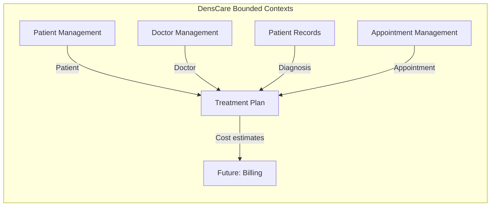
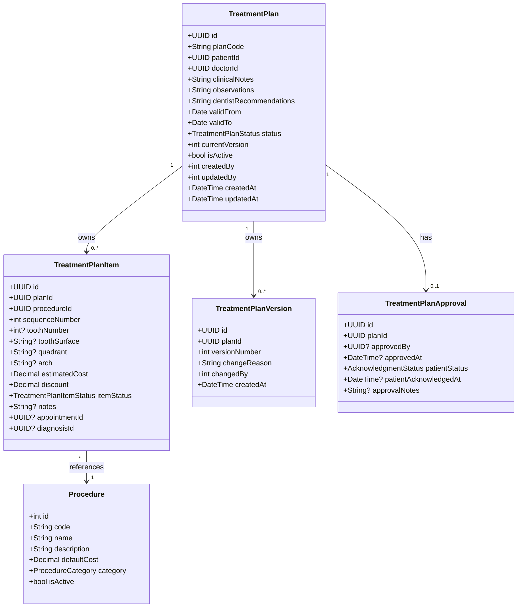
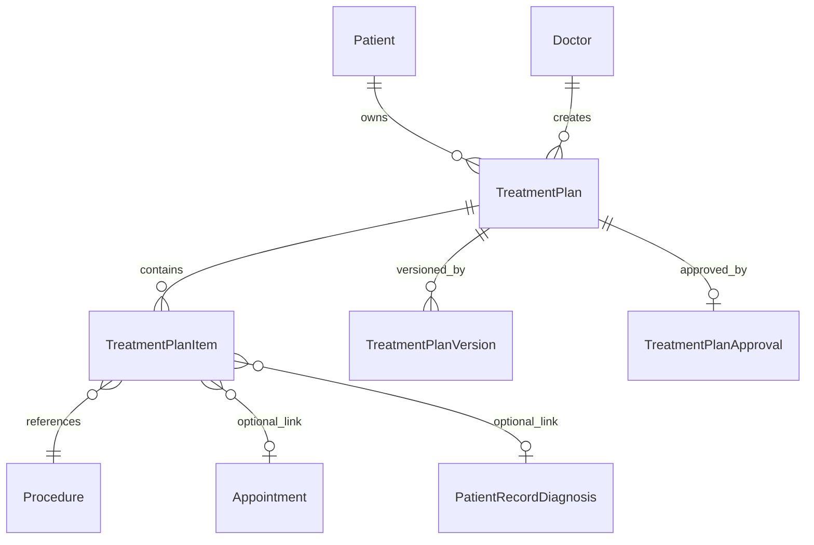
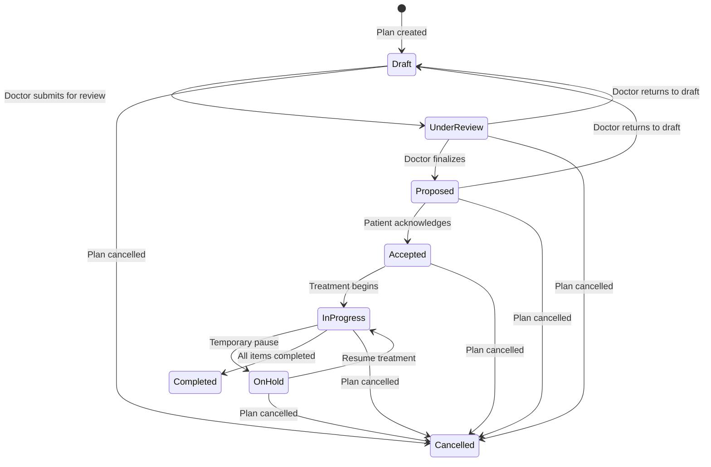
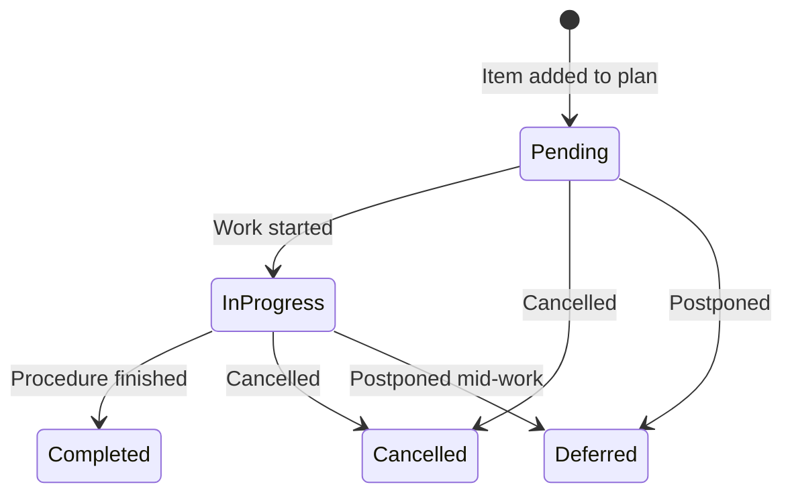

# Phase 2: Domain Analysis — Treatment Plan Module

> **Status:** PASS | **Target Quality Score:** 9.9/10
> **MVP Scope:** This document reflects only the Treatment Plan MVP. Future entities are documented in Phase 18.

---

## 1. Bounded Context

The Treatment Plan domain operates within the **Clinical Workflow** bounded context of DensCare. It is responsible for:

- Creating and managing structured treatment proposals for dental patients
- Defining itemized procedure lists with costs, tooth numbers, and sequencing
- Versioning plan changes with immutable snapshots
- Tracking patient acknowledgment and plan approvals
- Providing procedure catalogs for consistent procedure naming

This context **consumes** from the Patient Management context (Patient records), Doctor Management context (Doctor profiles), Patient Records context (Diagnoses), and Appointment Management context (Appointment linkage). It **provides** cost estimation data for future Billing/Invoicing context.

**Cross Reference:** Phase 1 §3 (Business Context), §9 (Dependencies)

---

## 2. Ubiquitous Language

| Term | Definition |
|---|---|
| TreatmentPlan | The aggregate root representing a comprehensive treatment proposal for a patient. Contains items, versions, and approvals. |
| Plan ID | Auto-generated unique identifier (e.g., `TXN-00001`). |
| TreatmentPlanItem | A single procedure line item within a treatment plan. References a Procedure, optional tooth/surface, and has its own cost and status. |
| Procedure | A dental procedure from the master catalog (e.g., composite filling, root canal). |
| Tooth Number | FDI two-digit notation identifying a specific tooth (11–48 permanent, 51–85 primary). |
| Tooth Surface | The specific aspect of a tooth (mesial, distal, buccal, lingual, occlusal, incisal). |
| TreatmentPlanVersion | An immutable snapshot of the plan items created when a plan is modified after acceptance. |
| TreatmentPlanApproval | A record of a plan's approval by the doctor and acknowledgment by the patient. |
| Estimated Cost | The anticipated cost of a procedure, used for patient quotation. |
| Patient Acknowledgment | Digital record of the patient accepting, rejecting, or requesting changes to a proposed plan. |
| Aggregate Root | The root entity that guarantees consistency within an aggregate boundary. |
| Bounded Context | A logical boundary within which a domain model applies and terms have specific meanings. |
| Value Object | An immutable object whose equality is based on its attributes, not an identifier. |
| Invariant | A business rule that must always hold true for the system to be in a valid state. |
| FDI Notation | Federation Dentaire Internationale two-digit tooth numbering system. |
| Guarded Transition | A state machine rule that prevents invalid status changes. |

**Cross Reference:** Phase 1 §17 (Glossary)

---

## 3. Entities & Aggregates

### 3.1 TreatmentPlan (Aggregate Root)

The central entity of the module — a comprehensive treatment proposal for a dental patient.

**Aggregate Boundary:** The TreatmentPlan aggregate root owns:

- **TreatmentPlanItem** — Procedure line items (exclusive ownership)
- **TreatmentPlanVersion** — Immutable snapshots (exclusive ownership)
- **TreatmentPlanApproval** — Approval/acknowledgment record (exclusive ownership)

The following belong to **other bounded contexts** and are NOT part of this aggregate:

- **Patient** — Owned by Patient Management context
- **Doctor** — Owned by Doctor Management context
- **Diagnosis** — Owned by Patient Records context
- **Appointment** — Owned by Appointment Management context
- **Procedure** — Reference data, belongs to Treatment Plan's own context but is NOT part of the aggregate

**Cross Reference:** Phase 1 §5 (Scope), §7 (Business Rules), §10 (Business Constraints)

### 3.2 Procedure (Entity / Reference Data)

A master catalog of dental procedures maintained by administrators. This is reference data shared across all treatment plans.

| Attribute | Type | Notes |
|---|---|---|
| id | Integer | Auto-increment PK |
| code | String(20) | Unique, e.g., "D2391" (ADA CDT code) or "COMP-FILL-1S" (custom) |
| name | String(200) | Display name, e.g., "Composite Filling - 1 Surface" |
| description | Text | Optional explanation |
| default_cost | Decimal(10,2) | Default estimated cost used when creating plan items |
| category | ProcedureCategory(enum) | e.g., restorative, surgical, endodontic, etc. |
| is_active | Boolean | Soft-disable obsolete procedures |

### 3.3 TreatmentPlanItem (Entity)

A single procedure line item within a treatment plan. Owned exclusively by the parent TreatmentPlan.

| Attribute | Type | Notes |
|---|---|---|
| id | UUID | PK |
| plan_id | UUID (FK) | References TreatmentPlan |
| procedure_id | Integer (FK) | References Procedure |
| sequence_number | Integer | Order within plan (1-based) |
| tooth_number | Integer | FDI notation (11–48 permanent, 51–85 primary) |
| tooth_surface | String | Optional: M, D, B, L, O, I, MOD, etc. |
| quadrant | String | Optional: UR, UL, LR, LL |
| arch | String | Optional: upper, lower |
| estimated_cost | Decimal(10,2) | Default from Procedure, overridable |
| discount | Decimal(10,2) | Per-item discount amount |
| item_status | TreatmentPlanItemStatus(enum) | pending, in_progress, completed, cancelled, deferred |
| notes | Text | Optional item-level notes |
| appointment_id | UUID (FK) | Optional link to Appointment |
| diagnosis_id | UUID (FK) | Optional link to Diagnosis from Patient Records |

### 3.4 TreatmentPlanVersion (Entity)

An immutable snapshot created when an accepted plan is modified. Preserves the state of plan items at the time of version creation.

| Attribute | Type | Notes |
|---|---|---|
| id | UUID | PK |
| plan_id | UUID (FK) | References TreatmentPlan |
| version_number | Integer | Auto-incrementing per plan (1, 2, 3, ...) |
| items_snapshot | JSONB | Snapshot of all plan items at version creation |
| change_reason | String(500) | Why the version was created |
| changed_by | Integer (FK) | Users.id of who made the change |
| created_at | DateTime | Timestamp of version creation |

### 3.5 TreatmentPlanApproval (Entity)

Tracks the doctor's approval and patient's acknowledgment of a treatment plan.

| Attribute | Type | Notes |
|---|---|---|
| id | UUID | PK |
| plan_id | UUID (FK) | References TreatmentPlan (1:1) |
| approved_by | Integer (FK) | Users.id of approving doctor |
| approved_at | DateTime | When doctor approved |
| patient_status | PatientAcknowledgmentStatus(enum) | pending, accepted, rejected, changes_requested |
| patient_acknowledged_at | DateTime | When patient acknowledged |
| approval_notes | String(500) | Optional notes from approval process |

---

## 4. Value Objects

| Value Object | Attributes | Used By |
|---|---|---|
| CostEstimate | estimated_cost, discount, subtotal (computed) | TreatmentPlanItem |
| ToothIdentifier | tooth_number, tooth_surface, quadrant, arch | TreatmentPlanItem |
| PlanStatus | status, current_version | TreatmentPlan |
| ApprovalRecord | approved_by, approved_at, patient_status, acknowledged_at | TreatmentPlanApproval |
| VersionMetadata | version_number, change_reason, changed_by, created_at | TreatmentPlanVersion |
| PlanScope | valid_from, valid_to | TreatmentPlan |

> **Storage Decision — `items_snapshot`:** Implemented as a JSONB column on TreatmentPlanVersion. At version creation time, the current set of TreatmentPlanItems is serialized into a JSON snapshot and stored alongside version metadata. This provides a complete immutable record without requiring a separate snapshot table for every version.
>
> **ToothSurface encoding:** Tooth surfaces are stored as uppercase strings using standard dental abbreviations: M (mesial), D (distal), B (buccal), L (lingual), O (occlusal), I (incisal). Multiple surfaces are concatenated without separators (e.g., "MOD" for mesial-occlusal-distal).

**Cross Reference:** Phase 1 §5 (Scope)

---

## 5. Domain Relationships

> **Note:** The `PatientRecordDiagnosis` entity is defined in the Patient Records module under the `patient_record_diagnoses` table. The FK on `TreatmentPlanItem.diagnosis_id` references `patient_record_diagnoses.id`.

**Cardinality Rules:**

- **Patient (1) → TreatmentPlan (0..*):** A patient may have multiple treatment plans (active + historical)
- **Doctor (1) → TreatmentPlan (0..*):** A doctor may create many treatment plans
- **TreatmentPlan (1) → TreatmentPlanItem (0..*):** A plan contains zero to many items (at least 1 required for Draft→Under Review transition)
- **TreatmentPlan (1) → TreatmentPlanVersion (0..*):** A plan may have zero (if never modified after acceptance) or many versions
- **TreatmentPlan (1) → TreatmentPlanApproval (0..1):** A plan has zero or one approval record
- **TreatmentPlanItem (*) → Procedure (1):** Each item references exactly one procedure
- **TreatmentPlanItem (*) → Appointment (0..1):** Optional appointment linkage
- **TreatmentPlanItem (*) → Diagnosis (0..1):** Optional diagnosis linkage

**Cross Reference:** Phase 1 §9 (Dependencies), §11 (Business Workflow)

---

## 6. Audit Trail

All mutations to TreatmentPlan and its child entities record audit entries within the same request-scoped transaction. These are side effects within the same transactional boundary — not domain events or async messages.

| Mutation | Audit Recorded |
|---|---|
| TreatmentPlan created | Who created it and when |
| TreatmentPlan updated | Which fields changed and who changed them |
| TreatmentPlan status changed | Status transition, who performed it, and when |
| TreatmentPlan deactivated/reactivated | Status change and who performed it |
| Plan item added/removed/updated | Item change and who performed it |
| Version created | Version number, reason, who created it, and when |
| Approval recorded | Who approved and when; patient acknowledgment |

**Cross Reference:** Phase 1 §12 FR-7 (Audit Trail)

---

## 7. Domain Invariants

| # | Invariant | Enforcement Point | Violation |
|---|---|---|---|
| INV-1 | Plan ID must be unique | DB unique constraint | Duplicate code |
| INV-2 | Plan must reference an existing patient | Service + DB FK | Invalid patient reference |
| INV-3 | Plan must reference an existing doctor | Service + DB FK | Invalid doctor reference |
| INV-4 | Plan must have at least one item to leave Draft status | Service | Empty plan status change |
| INV-5 | Status transitions must follow the state machine | Service + Validator | Invalid transition |
| INV-6 | Once accepted, modifications require a new version | Service | Direct modification without versioning |
| INV-7 | Valid From must precede Valid To | Validator | Invalid date range |
| INV-8 | Tooth numbers must be valid FDI (11–48, 51–85) | Validator | Invalid tooth number |
| INV-9 | Sequence numbers must be unique within a plan version | Service + DB | Duplicate sequence |
| INV-10 | Estimated cost must be non-negative | Validator + DB CHECK | Negative cost |
| INV-11 | Discount must be non-negative | Validator + DB CHECK | Negative discount |
| INV-12 | Procedure code must be unique | DB unique constraint | Duplicate code |
| INV-13 | Version snapshot is immutable after creation | Service | Attempting to modify snapshot |
| INV-14 | Only one plan may be in Draft per patient at a time | Service | Second concurrent draft |
| INV-15 | A plan cannot be deleted after leaving Draft status | Service | Hard delete attempt |

**Cross Reference:** Phase 1 §10 (Business Constraints), §7 (Business Rules)

---

## 8. Entity Lifecycle

### 8.1 Treatment Plan Lifecycle States

### 8.2 Treatment Plan Item Status

**Business Rules for States:**

- **Draft** — Plan is being composed; only the creating doctor can view/modify
- **Under Review** — Plan is being reviewed by the doctor; items can still be adjusted
- **Proposed** — Plan is finalized and presented to patient; items are locked without versioning
- **Accepted** — Patient has reviewed and accepted; plan is authoritative for treatment
- **In Progress** — Treatment has commenced; items may be marked completed as they are performed
- **On Hold** — Temporary pause (e.g., patient needs to heal, financial arrangements pending)
- **Completed** — All planned procedures have been performed
- **Cancelled** — Plan was abandoned (patient declined, condition changed, etc.)

**Cross Reference:** Phase 1 §11 (Business Workflow)

---

## 9. Aggregate Design Decisions

| Decision | Rationale |
|---|---|
| TreatmentPlan as aggregate root | Encapsulates all plan-related entities (items, versions, approval) under one consistency boundary. |
| TreatmentPlanItem owned by plan (not Procedure) | Items have plan-specific semantics (cost override, sequence, status) that do not belong to a Procedure. |
| Versioning as separate entity | Keeps snapshot data separate from active plan data. JSONB snapshot provides complete immutability. |
| TreatmentPlanApproval as 1:1 with plan | Each plan has at most one approval workflow. Separate entity avoids nullable approval fields on the plan. |
| Procedure as separate master table | Reusable across all plans; consistent naming and pricing; extensible. |
| Cost computed, not stored | Total cost is derived from item costs minus discounts — storing it would introduce data inconsistency risk. |
| JSONB snapshot for versioning | Single column captures entire plan state at version creation time without needing a separate items_snapshot table. |
| `items_snapshot` as duplicate data (not FK references) | Version snapshots must be immutable — referencing mutable items would break immutability. |
| FDI tooth numbering as integer | Two-digit integer is simpler and more precise than string notation for validation and querying. |
| Audit fields on plan (not separate audit table) | Follows existing DensCare pattern; sufficient for MVP. |

**Cross Reference:** Phase 1 §7 (Business Rules)

---

## 10. Ownership

| Artifact | Owner | Notes |
|---|---|---|
| Treatment Plan (all fields) | Creating Doctor | Full CRUD on own plans |
| Treatment Plan (view/edit) | Admin, Chief Doctor | Can view/edit any plan |
| Treatment Plan Items | Creating Doctor | Add/remove/reorder items |
| Treatment Plan Status | Doctor | Transition through states |
| Treatment Plan Approval | Doctor + Patient | Doctor approves, patient acknowledges |
| Procedure Catalog | Clinic Admin, Chief Doctor | Seed and maintain |
| Plan Versioning | System (automatic) | Created on post-acceptance modification |
| Treatment Plan Search | All clinical roles | Read-only access |

**Cross Reference:** Phase 1 §6 (Stakeholders)

---

## 11. Future Entities (Deferred to Phase 18)

This module intentionally excludes advanced entities. See Phase 18 for the complete expansion plan.

---

## 12. Cross-Reference Summary

| Phase 1 Section | Phase 2 Section |
|---|---|
| §3 Business Context | §1 Bounded Context |
| §5 Scope | §3 Entities & Aggregates, §4 Value Objects |
| §6 Stakeholders | §10 Ownership |
| §7 Business Rules | §3.1 Aggregate Boundary, §9 Design Decisions |
| §9 Dependencies | §5 Domain Relationships |
| §10 Business Constraints | §7 Domain Invariants |
| §11 Business Workflow | §8 Entity Lifecycle |
| §12 FR-1 (Plan CRUD) | §3.1 TreatmentPlan, §8 Lifecycle |
| §12 FR-2 (Plan Items) | §3.3 TreatmentPlanItem |
| §12 FR-3 (Procedure Catalog) | §3.2 Procedure |
| §12 FR-4 (Versioning) | §3.4 TreatmentPlanVersion |
| §12 FR-5 (Approval) | §3.5 TreatmentPlanApproval |
| §12 FR-7 (Audit) | §6 Audit Trail |
| §17 Glossary | §2 Ubiquitous Language |

---

## 13. Cross-Reference Navigation

| Direction | Documents |
|---|---|
| **Prerequisite** | [00-module-overview.md](00-module-overview.md), [01-business-analysis.md](01-business-analysis.md) |
| **Related** | [03-database-design.md](03-database-design.md), [10-architecture-design.md](10-architecture-design.md), [ADR-001-aggregate-root.md](adr/ADR-001-aggregate-root.md) |
| **Depends On** | Patient Management, Doctor Management, Patient Records domain models |
| **Used By** | [11-orm-model-design.md](11-orm-model-design.md), [04-workflows-state-machines.md](04-workflows-state-machines.md) |
| **Next Reading** | [03-database-design.md](03-database-design.md) |
