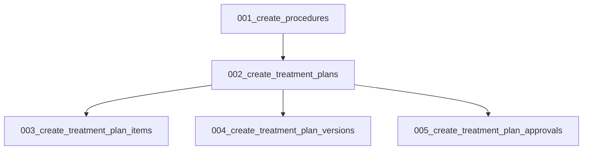

# Phase 3: Database Design — Treatment Plan Module

> **Status:** PASS | **Target Quality Score:** 9.9/10
> **MVP Scope:** Five tables only. Future tables documented in Phase 18.

---

## 1. Design Principles

- Follow existing DensCare patterns (see `patients/models.py`, `appointments/model.py`)
- Use UUID PKs for TreatmentPlan, TreatmentPlanItem, TreatmentPlanVersion, TreatmentPlanApproval (matches Patient pattern)
- Use Integer PK for Procedure (simple, small master table)
- Composite indexes for query performance
- Foreign keys with appropriate delete rules
- Aggregate root table (TreatmentPlan) has audit fields: `created_by`, `updated_by`, `created_at`, `updated_at`
- Child entities (Items, Versions, Approvals) track changes through the aggregate root
- Soft delete via `is_active` boolean
- Check constraints for data integrity
- JSONB for version snapshots (immutable)
- Partial unique indexes for business uniqueness

---

## 2. Entity Relationship Diagram

```mermaid
erDiagram
    Patient ||--o{ treatment_plans : "has"
    Doctor ||--o{ treatment_plans : "creates"
    treatment_plans ||--o{ treatment_plan_items : "contains"
    treatment_plans ||--o{ treatment_plan_versions : "versioned_by"
    treatment_plans ||--o| treatment_plan_approvals : "approved_by"
    treatment_plan_items }o--|| procedures : "references"
    treatment_plan_items }o--o| appointments : "optional"
    treatment_plan_items }o--o| patient_record_diagnoses : "optional"

    Patient {
        uuid id PK
        string patient_code
        string first_name
        string last_name
    }

    Doctor {
        uuid id PK
        string doctor_code
        int user_id FK
    }

    treatment_plans {
        uuid id PK
        string plan_code UK
        uuid patient_id FK
        uuid doctor_id FK
        text clinical_notes
        text observations
        text dentist_recommendations
        date valid_from
        date valid_to
        treatment_plan_status status
        int current_version
        boolean is_active
        int created_by FK
        int updated_by FK
        datetime created_at
        datetime updated_at
    }

    treatment_plan_items {
        uuid id PK
        uuid plan_id FK
        int procedure_id FK
        int sequence_number
        int tooth_number
        string tooth_surface
        string quadrant
        string arch
        decimal estimated_cost
        decimal discount
        treatment_plan_item_status item_status
        text notes
        uuid appointment_id FK
        uuid diagnosis_id FK
    }

    patient_record_diagnoses {
        uuid id PK
        uuid patient_record_id FK
        string diagnosis_name
        string diagnosis_type
    }

    treatment_plan_versions {
        uuid id PK
        uuid plan_id FK
        int version_number
        jsonb items_snapshot
        string change_reason
        int changed_by FK
        datetime created_at
    }

    treatment_plan_approvals {
        uuid id PK
        uuid plan_id FK UK
        int approved_by FK
        datetime approved_at
        patient_acknowledgment_status patient_status
        datetime patient_acknowledged_at
        string approval_notes
    }

    procedures {
        int id PK
        string code UK
        string name
        text description
        decimal default_cost
        procedure_category category
        boolean is_active
    }
```

---

## 3. Table Specifications

### 3.1 `treatment_plans`

The primary table for treatment plans. Each plan belongs to one patient and is created by one doctor.

| Column | Type | Constraints | Notes |
|---|---|---|---|
| id | UUID | PK, DEFAULT uuid_generate_v4() | Matches Patient PK pattern |
| plan_code | VARCHAR(20) | NOT NULL, UNIQUE | Auto-generated: `TXN-{sequence}` |
| patient_id | UUID | NOT NULL, FK → patients.id, ON DELETE RESTRICT | References Patient |
| doctor_id | UUID | NOT NULL, FK → doctors.id, ON DELETE RESTRICT | References creating Doctor |
| clinical_notes | TEXT | NULLABLE | Clinical findings and notes |
| observations | TEXT | NULLABLE | Clinical observations |
| dentist_recommendations | TEXT | NULLABLE | Dentist's recommendations |
| valid_from | DATE | NULLABLE | Plan validity start |
| valid_to | DATE | NULLABLE | Plan validity end |
| status | VARCHAR(20) | NOT NULL, DEFAULT 'draft' | Mapped to TreatmentPlanStatus enum |
| current_version | INTEGER | NOT NULL, DEFAULT 1 | Current version number |
| is_active | BOOLEAN | NOT NULL, DEFAULT true | Soft delete |
| created_by | INTEGER | NULLABLE, FK → users.id, ON DELETE SET NULL | Audit |
| updated_by | INTEGER | NULLABLE, FK → users.id, ON DELETE SET NULL | Audit |
| created_at | TIMESTAMPTZ | NOT NULL, DEFAULT now() | |
| updated_at | TIMESTAMPTZ | NOT NULL, DEFAULT now() | |

**Indexes:**

```sql
-- Primary key index (auto)
-- Unique index on plan_code (auto)

-- Patient lookup: find all plans for a patient
CREATE INDEX ix_treatment_plans_patient ON treatment_plans(patient_id);

-- Doctor lookup: find all plans created by a doctor
CREATE INDEX ix_treatment_plans_doctor ON treatment_plans(doctor_id);

-- Status-based queries (list by status)
CREATE INDEX ix_treatment_plans_status ON treatment_plans(status);

-- Active + status composite (common filter pattern)
CREATE INDEX ix_treatment_plans_active_status ON treatment_plans(is_active, status);

-- Date range queries (recent plans)
CREATE INDEX ix_treatment_plans_created_at ON treatment_plans(created_at DESC);
```

**Check Constraints:**

```sql
ALTER TABLE treatment_plans ADD CONSTRAINT ck_tp_valid_dates CHECK (
    valid_from IS NULL OR valid_to IS NULL OR valid_from <= valid_to
);

ALTER TABLE treatment_plans ADD CONSTRAINT ck_tp_status CHECK (
    status IN ('draft', 'under_review', 'proposed', 'accepted', 'in_progress', 'on_hold', 'completed', 'cancelled')
);
```

### 3.2 `treatment_plan_items`

Line items within a treatment plan. Each item references a procedure and optionally a tooth, appointment, and diagnosis.

| Column | Type | Constraints | Notes |
|---|---|---|---|
| id | UUID | PK, DEFAULT uuid_generate_v4() | |
| plan_id | UUID | NOT NULL, FK → treatment_plans.id, ON DELETE CASCADE | Parent plan |
| procedure_id | INTEGER | NOT NULL, FK → procedures.id, ON DELETE RESTRICT | Procedure reference |
| sequence_number | INTEGER | NOT NULL | Order within plan, unique per plan |
| tooth_number | INTEGER | NULLABLE, CHECK (valid FDI range) | FDI notation: 11–48, 51–85 |
| tooth_surface | VARCHAR(10) | NULLABLE | M, D, B, L, O, I, or combination |
| quadrant | VARCHAR(5) | NULLABLE | UR, UL, LR, LL |
| arch | VARCHAR(10) | NULLABLE | upper, lower |
| estimated_cost | DECIMAL(10,2) | NOT NULL, CHECK >= 0 | Default from procedure, overridable |
| discount | DECIMAL(10,2) | NOT NULL, DEFAULT 0, CHECK >= 0 | Per-item discount |
| item_status | VARCHAR(20) | NOT NULL, DEFAULT 'pending' | Mapped to TreatmentPlanItemStatus enum |
| notes | TEXT | NULLABLE | Item-level notes |
| appointment_id | UUID | NULLABLE, FK → appointments.id, ON DELETE SET NULL | Optional appointment link |
| diagnosis_id | UUID | NULLABLE, FK → patient_record_diagnoses.id, ON DELETE SET NULL | Optional diagnosis link from Patient Records |

**Indexes:**

```sql
-- Primary key index (auto)
-- Plan lookup: all items for a plan
CREATE INDEX ix_tp_items_plan ON treatment_plan_items(plan_id);

-- Plan + sequence ordering
CREATE INDEX ix_tp_items_plan_sequence ON treatment_plan_items(plan_id, sequence_number);

-- Procedure lookup: which plans use a procedure
CREATE INDEX ix_tp_items_procedure ON treatment_plan_items(procedure_id);

-- Status-based item queries
CREATE INDEX ix_tp_items_status ON treatment_plan_items(plan_id, item_status);

-- Appointment linkage
CREATE INDEX ix_tp_items_appointment ON treatment_plan_items(appointment_id);
```

**Check Constraints:**

```sql
ALTER TABLE treatment_plan_items ADD CONSTRAINT ck_tpi_estimated_cost CHECK (estimated_cost >= 0);
ALTER TABLE treatment_plan_items ADD CONSTRAINT ck_tpi_discount CHECK (discount >= 0);
ALTER TABLE treatment_plan_items ADD CONSTRAINT ck_tpi_tooth_number CHECK (
    tooth_number IS NULL OR
    (tooth_number BETWEEN 11 AND 48) OR
    (tooth_number BETWEEN 51 AND 85)
);
ALTER TABLE treatment_plan_items ADD CONSTRAINT ck_tpi_item_status CHECK (
    item_status IN ('pending', 'in_progress', 'completed', 'cancelled', 'deferred')
);
```

**Partial Unique Index (Sequence uniqueness per plan):**

```sql
-- Ensures unique sequence numbers within each plan
CREATE UNIQUE INDEX uq_tp_item_sequence ON treatment_plan_items(plan_id, sequence_number);
```

### 3.3 `treatment_plan_versions`

Immutable snapshots of plan items created when an accepted plan is modified.

| Column | Type | Constraints | Notes |
|---|---|---|---|
| id | UUID | PK, DEFAULT uuid_generate_v4() | |
| plan_id | UUID | NOT NULL, FK → treatment_plans.id, ON DELETE CASCADE | Parent plan |
| version_number | INTEGER | NOT NULL | Auto-incrementing per plan (1, 2, 3, ...) |
| items_snapshot | JSONB | NOT NULL | Immutable snapshot of all items |
| change_reason | VARCHAR(500) | NOT NULL | Why the version was created |
| changed_by | INTEGER | NOT NULL, FK → users.id, ON DELETE SET NULL | Who made the change |
| created_at | TIMESTAMPTZ | NOT NULL, DEFAULT now() | Immutable timestamp |

**Indexes:**

```sql
-- Primary key index (auto)
-- Plan lookup: all versions for a plan, ordered by version
CREATE INDEX ix_tp_versions_plan ON treatment_plan_versions(plan_id, version_number DESC);
```

**Check Constraints:**

```sql
ALTER TABLE treatment_plan_versions ADD CONSTRAINT ck_tpv_version_number CHECK (version_number >= 1);
```

### 3.4 `treatment_plan_approvals`

Tracks the doctor's approval and patient's acknowledgment of a treatment plan. One-to-one with TreatmentPlan.

| Column | Type | Constraints | Notes |
|---|---|---|---|
| id | UUID | PK, DEFAULT uuid_generate_v4() | |
| plan_id | UUID | NOT NULL, UNIQUE, FK → treatment_plans.id, ON DELETE CASCADE | 1:1 with plan |
| approved_by | INTEGER | NULLABLE, FK → users.id, ON DELETE SET NULL | Doctor who approved |
| approved_at | TIMESTAMPTZ | NULLABLE | When doctor approved |
| patient_status | VARCHAR(20) | NOT NULL, DEFAULT 'pending' | Mapped to PatientAcknowledgmentStatus |
| patient_acknowledged_at | TIMESTAMPTZ | NULLABLE | When patient acknowledged |
| approval_notes | VARCHAR(500) | NULLABLE | Notes from approval process |

**Check Constraints:**

```sql
ALTER TABLE treatment_plan_approvals ADD CONSTRAINT ck_tpa_patient_status CHECK (
    patient_status IN ('pending', 'accepted', 'rejected', 'changes_requested')
);
```

### 3.5 `procedures`

Master catalog of dental procedures. Seeded at deployment, maintained by administrators.

| Column | Type | Constraints | Notes |
|---|---|---|---|
| id | SERIAL | PK | |
| code | VARCHAR(20) | NOT NULL, UNIQUE | Custom or ADA CDT code |
| name | VARCHAR(200) | NOT NULL | Display name |
| description | TEXT | NULLABLE | |
| default_cost | DECIMAL(10,2) | NOT NULL, DEFAULT 0, CHECK >= 0 | Default estimated cost |
| category | VARCHAR(30) | NOT NULL | Mapped to ProcedureCategory enum |
| is_active | BOOLEAN | NOT NULL, DEFAULT true | |

**Indexes:**

```sql
-- Active procedures query
CREATE INDEX ix_procedures_active ON procedures(is_active);
-- Category-based queries
CREATE INDEX ix_procedures_category ON procedures(category);
```

**Check Constraints:**

```sql
ALTER TABLE procedures ADD CONSTRAINT ck_proc_default_cost CHECK (default_cost >= 0);
ALTER TABLE procedures ADD CONSTRAINT ck_proc_category CHECK (
    category IN ('diagnostic', 'preventive', 'restorative', 'endodontic', 'periodontic',
                 'prosthodontic', 'oral_surgery', 'orthodontic', 'cosmetic', 'implant', 'other')
);
```

---

## 4. Enums

Enums are defined as application-level string enums mapped to VARCHAR columns. The application layer validates values; DB CHECK constraints provide integrity backup.

| Enum Name | Values | Used By |
|---|---|---|
| `TreatmentPlanStatus` | draft, under_review, proposed, accepted, in_progress, on_hold, completed, cancelled | `treatment_plans.status` |
| `TreatmentPlanItemStatus` | pending, in_progress, completed, cancelled, deferred | `treatment_plan_items.item_status` |
| `ProcedureCategory` | diagnostic, preventive, restorative, endodontic, periodontic, prosthodontic, oral_surgery, orthodontic, cosmetic, implant, other | `procedures.category` |
| `PatientAcknowledgmentStatus` | pending, accepted, rejected, changes_requested | `treatment_plan_approvals.patient_status` |

---

## 5. Migration Strategy

### 5.1 Alembic Migration Order



### 5.2 Migration 001: Create `procedures`

Seed data included after table creation (see §5.7).

### 5.3 Migration 002: Create `treatment_plans`

Includes all columns, indexes, check constraints, and FK to patients/doctors.

### 5.4 Migration 003: Create `treatment_plan_items`

Includes composite FK to plans, FK to procedures, sequence unique index, and check constraints.

### 5.5 Migration 004: Create `treatment_plan_versions`

Includes JSONB column, FK to plans, FK to users (changed_by).

### 5.6 Migration 005: Create `treatment_plan_approvals`

Includes unique FK to plans (1:1), FK to users (approved_by).

### 5.7 Seed Data

After migrations, seed standard dental procedures:

```sql
INSERT INTO procedures (code, name, description, default_cost, category) VALUES
    ('EXAM-01', 'Comprehensive Oral Examination', 'Full mouth examination including soft tissue, hard tissue, and periodontal assessment', 500.00, 'diagnostic'),
    ('EXAM-02', 'Periodic Oral Examination', 'Follow-up examination for established patients', 300.00, 'diagnostic'),
    ('XRAY-BW', 'Bitewing X-Ray (2 Images)', 'Two bitewing radiographs for interproximal caries detection', 400.00, 'diagnostic'),
    ('XRAY-PANO', 'Panoramic X-Ray', 'Extraoral panoramic radiograph', 800.00, 'diagnostic'),
    ('XRAY-PA', 'Periapical X-Ray (Single)', 'Single periapical radiograph', 200.00, 'diagnostic'),
    ('PROPHY', 'Prophylaxis (Adult)', 'Adult teeth cleaning and polishing', 700.00, 'preventive'),
    ('SCALING', 'Scaling and Root Planing (Per Quadrant)', 'Deep cleaning per quadrant', 1500.00, 'preventive'),
    ('F-SEAL', 'Dental Sealant (Per Tooth)', 'Application of pit and fissure sealant', 300.00, 'preventive'),
    ('F-TOP', 'Topical Fluoride Application', 'Fluoride varnish or gel application', 350.00, 'preventive'),
    ('COMP-1S', 'Composite Filling - 1 Surface', 'Single-surface tooth-colored filling', 1200.00, 'restorative'),
    ('COMP-2S', 'Composite Filling - 2 Surfaces', 'Two-surface tooth-colored filling', 1800.00, 'restorative'),
    ('COMP-3S', 'Composite Filling - 3 Surfaces', 'Three-surface tooth-colored filling', 2400.00, 'restorative'),
    ('AMAL-1S', 'Amalgam Filling - 1 Surface', 'Single-surface silver filling', 800.00, 'restorative'),
    ('RCT-ANT', 'Root Canal Treatment (Anterior)', 'Root canal therapy for anterior tooth', 5000.00, 'endodontic'),
    ('RCT-PREM', 'Root Canal Treatment (Premolar)', 'Root canal therapy for premolar', 7000.00, 'endodontic'),
    ('RCT-MOL', 'Root Canal Treatment (Molar)', 'Root canal therapy for molar', 10000.00, 'endodontic'),
    ('CROWN-PFM', 'Porcelain-Fused-to-Metal Crown', 'Single PFM crown restoration', 8000.00, 'prosthodontic'),
    ('CROWN-FULL', 'Full Porcelain Crown', 'Single all-ceramic crown restoration', 12000.00, 'prosthodontic'),
    ('BRIDGE-3U', '3-Unit Bridge (PFM)', 'Three-unit fixed partial denture', 25000.00, 'prosthodontic'),
    ('DENTURE-FULL', 'Complete Denture (Full Arch)', 'Full set of complete dentures for one arch', 30000.00, 'prosthodontic'),
    ('EXTRACT-S', 'Simple Extraction', 'Single tooth simple extraction', 1500.00, 'oral_surgery'),
    ('EXTRACT-C', 'Complex Extraction (Surgical)', 'Surgical extraction including impacted tooth', 3500.00, 'oral_surgery'),
    ('IMP-3RD', 'Impacted 3rd Molar Extraction', 'Surgical extraction of impacted wisdom tooth', 5000.00, 'oral_surgery'),
    ('IMPLANT', 'Dental Implant Placement', 'Single dental implant placement', 25000.00, 'implant'),
    ('ABUTMENT', 'Implant Abutment', 'Implant abutment placement', 8000.00, 'implant'),
    ('CROWN-IMP', 'Implant Crown', 'Crown for dental implant', 15000.00, 'implant'),
    ('BLEACH', 'Teeth Whitening (Take-Home)', 'Custom tray take-home whitening', 8000.00, 'cosmetic'),
    ('VENEER', 'Porcelain Veneer (Per Tooth)', 'Single porcelain laminate veneer', 10000.00, 'cosmetic'),
    ('ORTHO-EVAL', 'Orthodontic Evaluation', 'Comprehensive orthodontic assessment', 1000.00, 'orthodontic'),
    ('ORTHO-FULL', 'Full Orthodontic Treatment', 'Comprehensive orthodontic treatment (1 arch)', 50000.00, 'orthodontic');
```

---

## 6. Query Patterns

### 6.1 Find active treatment plans for a patient

```python
def find_by_patient(
    db: Session, patient_id: UUID, page: int, page_size: int
) -> tuple[list[TreatmentPlan], int]:
    query = (
        db.query(TreatmentPlan)
        .filter(
            TreatmentPlan.patient_id == patient_id,
            TreatmentPlan.is_active == True,
        )
        .order_by(TreatmentPlan.created_at.desc())
    )
    total = query.count()
    plans = query.offset((page - 1) * page_size).limit(page_size).all()
    return plans, total
```

### 6.2 Get plan with all items (eager loaded)

```python
def get_with_items(self, plan_id: UUID) -> Optional[TreatmentPlan]:
    return (
        db.query(TreatmentPlan)
        .options(selectinload(TreatmentPlan.items))
        .options(selectinload(TreatmentPlan.approval))
        .filter(TreatmentPlan.id == plan_id)
        .first()
    )
```

### 6.3 Validate no duplicate sequence in plan

```python
def sequence_exists(self, plan_id: UUID, sequence: int) -> bool:
    return (
        db.query(TreatmentPlanItem)
        .filter(
            TreatmentPlanItem.plan_id == plan_id,
            TreatmentPlanItem.sequence_number == sequence,
        )
        .first()
        is not None
    )
```

### 6.4 Create version snapshot

```python
def create_version_snapshot(self, plan_id: UUID, change_reason: str, changed_by: int) -> TreatmentPlanVersion:
    items = (
        db.query(TreatmentPlanItem)
        .filter(TreatmentPlanItem.plan_id == plan_id)
        .order_by(TreatmentPlanItem.sequence_number)
        .all()
    )
    # Serialize items to JSON-serializable dicts
    snapshot = [item_to_dict(item) for item in items]
    version = TreatmentPlanVersion(
        plan_id=plan_id,
        version_number=next_version_number,
        items_snapshot=snapshot,
        change_reason=change_reason,
        changed_by=changed_by,
    )
    db.add(version)
    db.flush()
    return version
```

---

## 7. Future Tables (Deferred to Phase 18)

| Table | Purpose | Priority |
|---|---|---|
| `treatment_plan_payments` | Payment plan/schedule generation | Medium |
| `treatment_plan_insurance` | Insurance claim tracking per plan | Medium |
| `treatment_plan_outcomes` | Treatment outcome and success metrics | Low |
| `procedure_attachments` | Supporting documents per procedure | Low |

---

## 8. Cross-Reference Navigation

| Direction | Documents |
|---|---|
| **Prerequisite** | [01-business-analysis.md](01-business-analysis.md), [02-domain-analysis.md](02-domain-analysis.md) |
| **Related** | [11-orm-model-design.md](11-orm-model-design.md), [ADR-004-database-design.md](adr/ADR-004-database-design.md) |
| **Depends On** | Existing DensCare FK references: `patients.id`, `doctors.id`, `users.id`, `appointments.id`, `patient_record_diagnoses.id` |
| **Used By** | [11-orm-model-design.md](11-orm-model-design.md), [12-repository-design.md](12-repository-design.md) |
| **Next Reading** | [04-workflows-state-machines.md](04-workflows-state-machines.md) |
