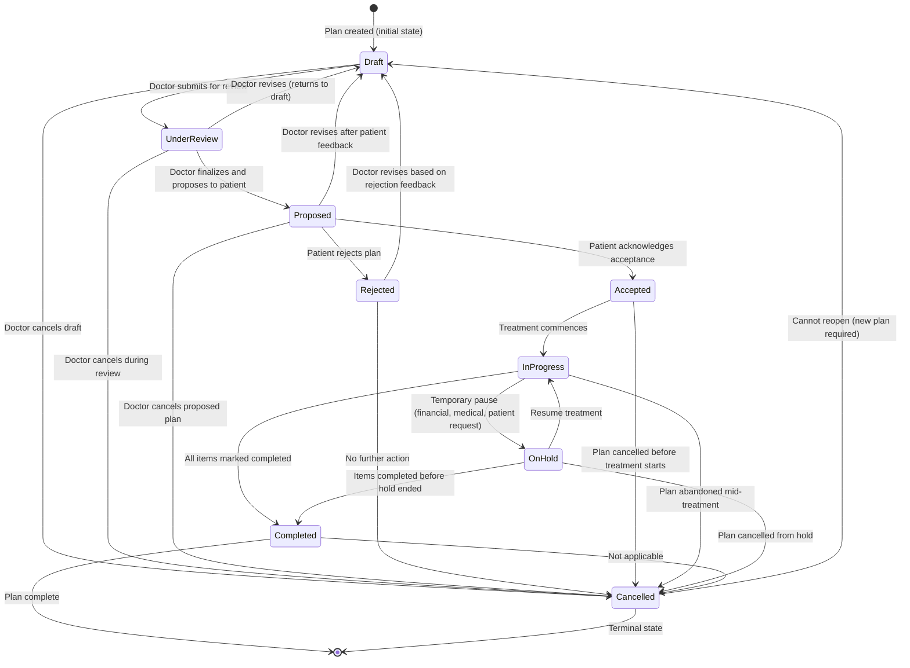
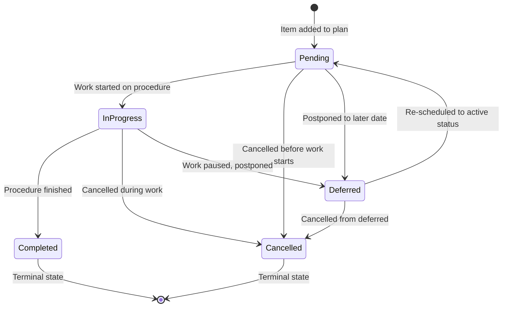
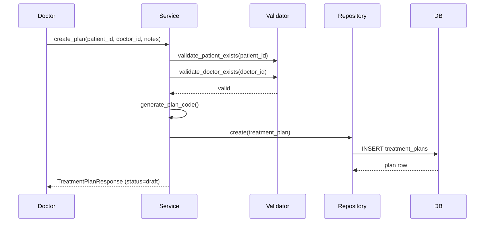
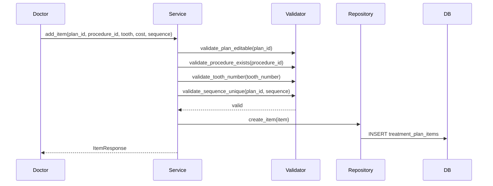
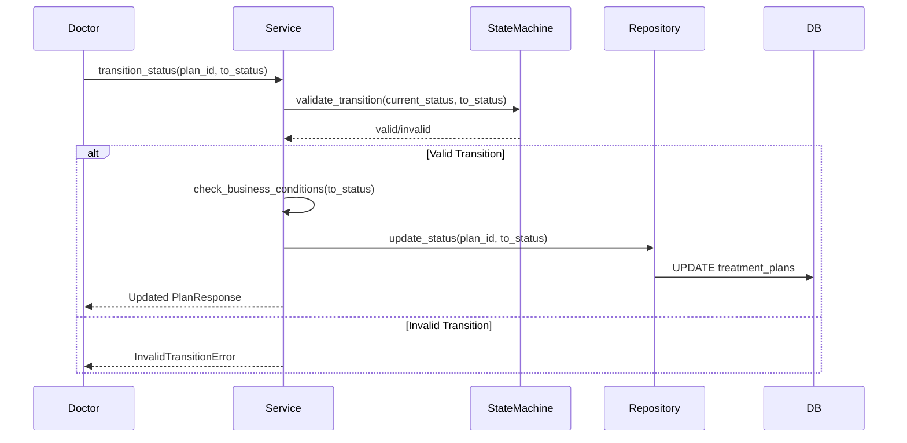
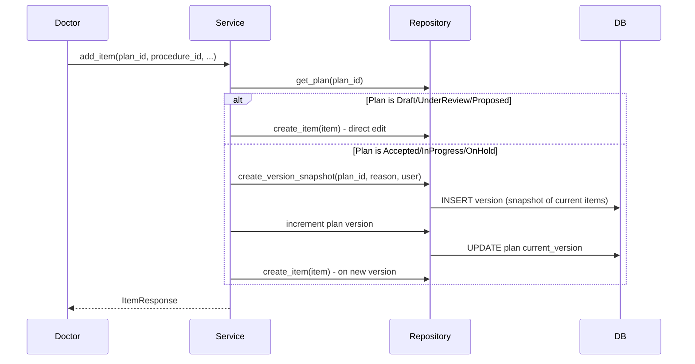
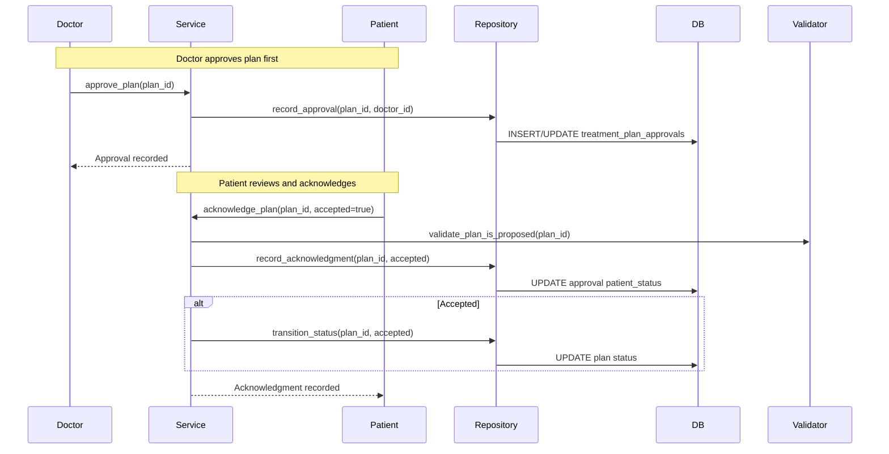

# Phase 4: Workflows & State Machines — Treatment Plan Module

> **Status:** PASS | **Target Quality Score:** 9.9/10
> **MVP Scope:** Only workflows and state machines for Treatment Plan management.

---

## 1. Treatment Plan State Machine

### 1.1 State Diagram

### 1.2 Transition Table

| From | To | Trigger | Authorization | Business Condition |
|---|---|---|---|---|
| Draft | UnderReview | Submit for review | Doctor (owner) | Plan must have ≥1 item |
| Draft | Cancelled | Cancel draft | Doctor (owner) | Always allowed |
| UnderReview | Proposed | Finalize & propose | Doctor (owner) | All items valid |
| UnderReview | Draft | Return to draft | Doctor (owner) | Always allowed |
| UnderReview | Cancelled | Cancel | Doctor (owner) | Always allowed |
| Proposed | Accepted | Patient accepts | Patient (via doctor) | Patient acknowledgment recorded |
| Proposed | Draft | Revise | Doctor | Always allowed |
| Proposed | Rejected | Patient rejects | Patient (via doctor) | Patient acknowledgment recorded |
| Proposed | Cancelled | Cancel | Doctor | Always allowed |
| Rejected | Draft | Revise | Doctor | Always allowed |
| Rejected | Cancelled | Cancel | Doctor | Always allowed |
| Accepted | InProgress | Start treatment | Doctor | Plan has ≥1 pending item |
| Accepted | Cancelled | Cancel | Doctor | Always allowed |
| InProgress | OnHold | Pause treatment | Doctor | At least 1 item in progress |
| InProgress | Completed | Complete all | Doctor | All items completed or cancelled |
| InProgress | Cancelled | Cancel | Doctor | Always allowed |
| OnHold | InProgress | Resume | Doctor | Always allowed |
| OnHold | Cancelled | Cancel | Doctor | Always allowed |
| OnHold | Completed | Complete | Doctor | All items in terminal state |

### 1.3 Invalid Transitions (Rejected)

| From | To | Reason |
|---|---|---|
| Draft | Accepted | Cannot skip review and proposal |
| Draft | InProgress | Cannot start treatment without acceptance |
| Proposed | InProgress | Must be accepted first |
| Rejected | Accepted | Must go back to draft and repropose |
| Completed | Any | Terminal state |
| Cancelled | Any | Terminal state |

---

## 2. Treatment Plan Item State Machine

### 2.1 State Diagram

### 2.2 Item Transition Table

| From | To | Trigger | Condition |
|---|---|---|---|
| Pending | InProgress | Start procedure | Plan is InProgress or OnHold |
| Pending | Cancelled | Cancel item | Always allowed |
| Pending | Deferred | Defer | Always allowed |
| InProgress | Completed | Mark complete | Procedure performed |
| InProgress | Cancelled | Cancel | Always allowed |
| InProgress | Deferred | Defer | Always allowed |
| Deferred | Pending | Reactivate | Always allowed |
| Deferred | Cancelled | Cancel | Always allowed |

---

## 3. Business Workflows

### 3.1 Treatment Plan Creation Workflow

### 3.2 Adding Items to Plan

### 3.3 Plan Status Transition Workflow

### 3.4 Version Creation on Modification (Post-Acceptance)

### 3.5 Approval and Patient Acknowledgment Workflow

---

## 4. Recovery Paths

| Scenario | Recovery | Automation |
|---|---|---|
| Plan stuck in Draft (doctor left) | Admin reassigns or cancels | Manual |
| Version creation fails during item modification | Rollback entire transaction; no partial state | Automatic (transaction) |
| Patient acknowledgment DB write fails | Rollback; status stays at Proposed | Automatic (transaction) |
| Item accidentally marked Completed | Doctor can revert to InProgress or Pending | Manual (via PATCH) |
| Concurrent modification of accepted plan | Last writer wins; version created per transaction | Automatic |

---

## 5. Edge Cases

| # | Edge Case | Handling |
|---|---|---|
| EC-1 | Patient acknowledges plan, then requests changes | Revert to Proposed → Doctor revises → New proposal |
| EC-2 | All items cancelled in InProgress plan | Auto-transition plan to Cancelled if no items remain active |
| EC-3 | Adding items to fully completed plan | Create new version, reopen plan to InProgress |
| EC-4 | Deleting the only item in a Draft plan | Allowed; plan remains in Draft but cannot transition |
| EC-5 | Invalid tooth number (e.g., 99) | Rejected by validator + DB CHECK constraint |
| EC-6 | Discount exceeds estimated cost | Allowed (zero-cost item) — clinic may offer complementary procedures |
| EC-7 | Plan created with valid_from after valid_to | Rejected by validator + DB CHECK |
| EC-8 | Doctor tries to modify another doctor's plan | Authorized roles (Admin, Chief Doctor) can modify any plan |

---

## 6. Cross-Reference Navigation

| Direction | Documents |
|---|---|
| **Prerequisite** | [02-domain-analysis.md](02-domain-analysis.md) (entity lifecycle), [08-enums-constants.md](08-enums-constants.md) |
| **Related** | [07-validation-rules.md](07-validation-rules.md) (state transition rules), [ADR-003-state-machine.md](adr/ADR-003-state-machine.md) |
| **Depends On** | State machine configuration from [08-enums-constants.md](08-enums-constants.md) §2.6 |
| **Used By** | [14-service-design.md](14-service-design.md), [05-api-design.md](05-api-design.md) |
| **Next Reading** | [05-api-design.md](05-api-design.md) |
