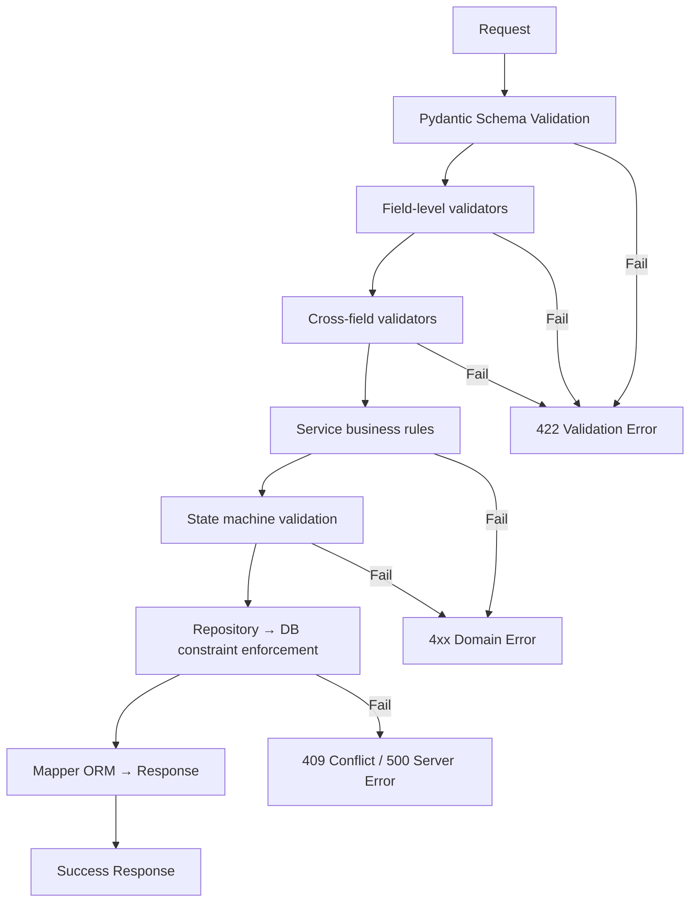

# Phase 7: Validation Rules — Treatment Plan Module

> **Status:** PASS | **Target Quality Score:** 9.9/10
> **MVP Scope:** Only rules required for Treatment Plan, Item, Version, Approval, and Procedure management.

---

## 1. Error Codes

| Code | HTTP | Description | When |
|---|---|---|---|
| PLAN_NOT_FOUND | 404 | Plan ID not found | Any operation by plan_id |
| DUPLICATE_PLAN | 409 | Duplicate plan_code | Create |
| PLAN_CREATION_FAILED | 500 | Unexpected creation error | Create |
| PLAN_UPDATE_FAILED | 500 | Unexpected update error | Update |
| PLAN_VALIDATION_FAILED | 422 | Schema or business validation error | Any request |
| INVALID_PLAN_OPERATION | 409 | Invalid state transition | Status change |
| PLAN_NOT_EDITABLE | 409 | Plan cannot be modified (status restriction) | Item add/update on locked plan |
| EMPTY_PLAN_TRANSITION | 409 | Cannot transition plan with no items | Status change |
| ITEM_NOT_FOUND | 404 | Item ID not found | Item operation |
| DUPLICATE_ITEM_SEQUENCE | 409 | Duplicate sequence number in plan | Add/update item |
| INVALID_ITEM_STATUS_TRANSITION | 409 | Invalid item status transition | Item status change |
| PROCEDURE_NOT_FOUND | 404 | Procedure ID not found | Create/update item |
| DUPLICATE_PROCEDURE | 409 | Duplicate procedure code | Create procedure |
| INVALID_TOOTH_NUMBER | 422 | Tooth number not in valid FDI range | Create/update item |
| INVALID_DATE_RANGE | 422 | valid_from > valid_to | Create/update plan |
| VERSION_NOT_FOUND | 404 | Version ID not found | Version operation |
| VERSION_IMMUTABLE | 409 | Cannot modify a version snapshot | Write to version |
| APPROVAL_NOT_FOUND | 404 | Approval record not found | Approval operation |
| PLAN_ALREADY_APPROVED | 409 | Doctor already approved this plan | Duplicate approval |
| PATIENT_ACKNOWLEDGMENT_EXISTS | 409 | Patient already acknowledged | Duplicate acknowledgment |
| PLAN_NOT_DELETABLE | 409 | Plan cannot be deleted (beyond Draft) | Delete non-draft plan |
| SELF_SERVICE_NOT_ALLOWED | 403 | Doctor modifying another doctor's plan | Owner mismatch |
| FORBIDDEN | 403 | Insufficient permissions for role | Unauthorized operation |

---

## 2. Business Rules

### 2.1 Treatment Plan Rules

| # | Rule | Enforcement | Error | Phase Ref |
|---|---|---|---|---|
| BR-001 | Plan code must be unique | DB UNIQUE constraint | DUPLICATE_PLAN (409) | Phase 1 FR-1.7 |
| BR-002 | Plan must reference an existing patient | Service lookup | PLAN_NOT_FOUND (404) | Phase 1 FR-1.1 |
| BR-003 | Plan must reference an existing doctor | Service lookup | PLAN_NOT_FOUND (404) | Phase 1 FR-1.1 |
| BR-004 | Valid From must precede Valid To | DB CHECK + Validator | INVALID_DATE_RANGE (422) | Phase 1 C-4 |
| BR-005 | Status must be a valid enum value | DB CHECK + Validator | PLAN_VALIDATION_FAILED (422) | Phase 1 FR-1.3 |
| BR-006 | Cannot deactivate an already inactive plan | Service check | INVALID_PLAN_OPERATION (409) | Phase 1 FR-1.6 |
| BR-007 | Plan code is immutable after creation | Service check on update | INVALID_PLAN_OPERATION (409) | Phase 2 INV-4 |
| BR-008 | Plan code format: `TXN-{6-digit sequence}` | Service generation | — | Phase 1 FR-1.2 |
| BR-009 | Plan must have ≥1 item to leave Draft status | Service check | EMPTY_PLAN_TRANSITION (409) | Phase 1 C-2, Phase 2 INV-4 |
| BR-010 | Cannot delete a plan beyond Draft status | Service check | PLAN_NOT_DELETABLE (409) | Phase 2 INV-15 |
| BR-011 | Only one plan per patient may be in Draft | Service check | INVALID_PLAN_OPERATION (409) | Phase 1 C-1 |
| BR-012 | Modifying an accepted plan creates a new version | Service (auto-versioning) | — | Phase 1 FR-4.1 |

### 2.2 Status Transition Rules (Guarded Transitions)

See Phase 4 §1.2 (Transition Table) for the complete set of valid transitions. The following rules govern enforcement:

| # | Rule | Enforcement | Error |
|---|---|---|---|
| TR-001 | Draft → UnderReview requires ≥1 item | Service check | EMPTY_PLAN_TRANSITION (409) |
| TR-002 | Accepted → InProgress requires ≥1 pending item | Service check | EMPTY_PLAN_TRANSITION (409) |
| TR-003 | InProgress → Completed requires all items terminal | Service check | INVALID_PLAN_OPERATION (409) |
| TR-004 | Completed/Cancelled are terminal states | Service check | INVALID_PLAN_OPERATION (409) |
| TR-005 | All other transitions follow the state machine | Service/StateMachine | INVALID_PLAN_OPERATION (409) |

### 2.3 Item Rules

| # | Rule | Enforcement | Error |
|---|---|---|---|
| IR-001 | Item must reference an existing procedure | Service lookup | PROCEDURE_NOT_FOUND (404) |
| IR-002 | Sequence number must be unique within a plan | DB partial unique index + Service | DUPLICATE_ITEM_SEQUENCE (409) |
| IR-003 | Tooth number must be in FDI range (11–48, 51–85) or null | DB CHECK + Validator | INVALID_TOOTH_NUMBER (422) |
| IR-004 | Estimated cost must be non-negative | DB CHECK + Validator | PLAN_VALIDATION_FAILED (422) |
| IR-005 | Discount must be non-negative | DB CHECK + Validator | PLAN_VALIDATION_FAILED (422) |
| IR-006 | Item status must be a valid enum value | DB CHECK + Validator | PLAN_VALIDATION_FAILED (422) |
| IR-007 | Item status must follow valid transitions | Service check | INVALID_ITEM_STATUS_TRANSITION (409) |
| IR-008 | Items can only be added/removed in editable plan statuses | Service check | PLAN_NOT_EDITABLE (409) |

### 2.4 Version Rules

| # | Rule | Enforcement | Error |
|---|---|---|---|
| VR-001 | Version number must be ≥ 1 | DB CHECK | PLAN_VALIDATION_FAILED (422) |
| VR-002 | Version snapshot is immutable after creation | Service | VERSION_IMMUTABLE (409) |
| VR-003 | Change reason is required for new versions | Schema validation | PLAN_VALIDATION_FAILED (422) |

### 2.5 Approval Rules

| # | Rule | Enforcement | Error |
|---|---|---|---|
| AR-001 | Doctor approval requires plan in Proposed status | Service check | INVALID_PLAN_OPERATION (409) |
| AR-002 | Patient acknowledgment requires plan in Proposed status | Service check | INVALID_PLAN_OPERATION (409) |
| AR-003 | Patient acknowledgment is recorded once per plan | DB + Service | PATIENT_ACKNOWLEDGMENT_EXISTS (409) |
| AR-004 | Doctor approval is recorded once per plan | DB + Service | PLAN_ALREADY_APPROVED (409) |
| AR-005 | Accepting a plan auto-transitions to Accepted status | Service | — |

### 2.6 Procedure Rules

| # | Rule | Enforcement | Error |
|---|---|---|---|
| PR-001 | Procedure code must be unique | DB UNIQUE constraint | DUPLICATE_PROCEDURE (409) |
| PR-002 | Procedure code is required | Schema validation | PLAN_VALIDATION_FAILED (422) |
| PR-003 | Procedure name is required | Schema validation | PLAN_VALIDATION_FAILED (422) |
| PR-004 | Default cost must be non-negative | DB CHECK + Validator | PLAN_VALIDATION_FAILED (422) |

### 2.7 Access Control Rules

| # | Rule | Enforcement | Error |
|---|---|---|---|
| AR-101 | Only Admin and Chief Doctor can create procedures | Router: require_roles() | FORBIDDEN (403) |
| AR-102 | All clinical roles can view treatment plans | Router: require_roles() | FORBIDDEN (403) |
| AR-103 | Only plan owner, Admin, or Chief Doctor can modify plans | Router: plan_owner_or_admin() | SELF_SERVICE_NOT_ALLOWED (403) |
| AR-104 | Any doctor can update item status on any plan | Router: require_roles() | FORBIDDEN (403) |
| AR-105 | Receptionist can view but not modify plans | Router: require_roles() | FORBIDDEN (403) |
| AR-106 | Unauthenticated requests are rejected | Router: get_current_user() | 401 |

---

## 3. Validation Pipeline

### 3.1 Schema-Level Validation (FastAPI / Pydantic)

| Field | Validator | Rule |
|---|---|---|
| patient_id | UUID format | Valid UUID |
| doctor_id | UUID format | Valid UUID |
| plan_code | regex pattern (service-generated) | `^TXN-\d{6}$` |
| estimated_cost | Field(ge=0) | Non-negative decimal |
| discount | Field(ge=0) | Non-negative decimal |
| tooth_number | custom validator | 11–48 or 51–85, or null |
| tooth_surface | custom validator | Only valid dental surface codes |
| sequence_number | Field(ge=1) | Positive integer |
| status | Field(pattern) | Must match enum set |
| item_status | Field(pattern) | Must match enum set |
| procedure_code | regex pattern | Alphanumeric, uppercase, max 20 chars |
| valid_from/valid_to | cross-field validator | valid_from <= valid_to |
| change_reason | min_length=1 | Required for version creation |

### 3.2 Business Validation (Service Layer)

| Validator | Checks |
|---|---|
| `validate_patient_exists(patient_id)` | Patient exists in DB |
| `validate_doctor_exists(doctor_id)` | Doctor exists in DB |
| `validate_plan_editable(plan_id)` | Plan is Draft, UnderReview, or Proposed |
| `validate_procedure_exists(procedure_id)` | Procedure exists and is active |
| `validate_status_transition(from_status, to_status)` | Follows state machine rules |
| `validate_item_status_transition(from_status, to_status)` | Follows item state machine |
| `validate_plan_has_items(plan_id)` | Plan has at least one item |
| `validate_no_concurrent_draft(patient_id)` | No other Draft plan for this patient |
| `validate_plan_is_proposed(plan_id)` | Plan is in Proposed status |
| `validate_version_immutable(version_id)` | Version snapshot not modified |

---

## 4. State Transitions

See Phase 4 §1.2 (Transition Table) for the complete state machine with all valid transitions, triggers, and authorization requirements.

---

## 5. Cross-Module Business Rules

| # | Rule | Source Module | Target Module |
|---|---|---|---|
| CR-001 | Treatment Plan references a Patient from Patient Management | Treatment Plan | Patients |
| CR-002 | Treatment Plan references a Doctor from Doctor Management | Treatment Plan | Doctors |
| CR-003 | Treatment Plan Items can reference Appointments (optional) | Treatment Plan | Appointments |
| CR-004 | Treatment Plan Items can reference Diagnoses from Patient Records (optional) | Treatment Plan | Patient Records |
| CR-005 | Patient deactivation does NOT cascade to Treatment Plans | Patients | Treatment Plan |
| CR-006 | Doctor deactivation does NOT cascade to Treatment Plans | Doctors | Treatment Plan |
| CR-007 | Appointment deletion sets appointment_id to NULL on items | Appointments | Treatment Plan |

---

## 6. Cross-Reference Navigation

| Direction | Documents |
|---|---|
| **Prerequisite** | [04-workflows-state-machines.md](04-workflows-state-machines.md) (state machine), [08-enums-constants.md](08-enums-constants.md) (enum values) |
| **Related** | [09-exception-design.md](09-exception-design.md) (error codes), [13-validator-design.md](13-validator-design.md) (validator functions) |
| **Depends On** | [05-api-design.md](05-api-design.md) (field specifications), [06-security-rbac.md](06-security-rbac.md) (auth rules) |
| **Used By** | [14-service-design.md](14-service-design.md), [17-testing-strategy.md](17-testing-strategy.md) |
| **Next Reading** | [08-enums-constants.md](08-enums-constants.md) |
