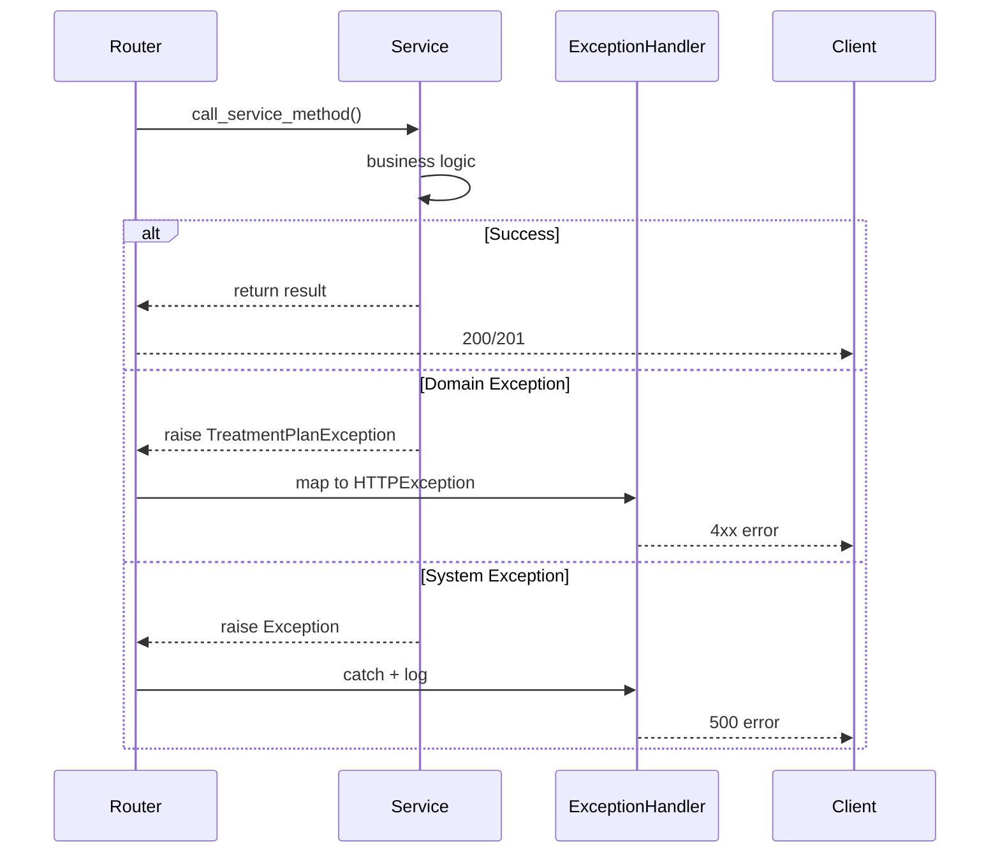

```mermaid
classDiagram
    class TreatmentPlanException {
        +string code
        +string message
        +any details
        +to_dict() dict
    }

    class PlanNotFound {
        +PlanNotFound(plan_id)
        code: PLAN_NOT_FOUND
    }
    class DuplicatePlanDetected {
        +DuplicatePlanDetected()
        code: DUPLICATE_PLAN
    }
    class PlanCreationFailed {
        +PlanCreationFailed(details)
        code: PLAN_CREATION_FAILED
    }
    class PlanUpdateFailed {
        +PlanUpdateFailed(details)
        code: PLAN_UPDATE_FAILED
    }
    class PlanValidationFailed {
        +PlanValidationFailed(details)
        code: PLAN_VALIDATION_FAILED
    }
    class InvalidPlanOperation {
        +InvalidPlanOperation(details)
        code: INVALID_PLAN_OPERATION
    }
    class PlanNotEditable {
        +PlanNotEditable(plan_id, status)
        code: PLAN_NOT_EDITABLE
    }
    class EmptyPlanTransition {
        +EmptyPlanTransition(plan_id)
        code: EMPTY_PLAN_TRANSITION
    }
    class PlanNotDeletable {
        +PlanNotDeletable(plan_id, status)
        code: PLAN_NOT_DELETABLE
    }
    class ItemNotFound {
        +ItemNotFound(item_id)
        code: ITEM_NOT_FOUND
    }
    class DuplicateItemSequence {
        +DuplicateItemSequence(plan_id, sequence)
        code: DUPLICATE_ITEM_SEQUENCE
    }
    class InvalidItemStatusTransition {
        +InvalidItemStatusTransition(from, to)
        code: INVALID_ITEM_STATUS_TRANSITION
    }
    class ProcedureNotFound {
        +ProcedureNotFound(proc_id)
        code: PROCEDURE_NOT_FOUND
    }
    class DuplicateProcedureDetected {
        +DuplicateProcedureDetected(code)
        code: DUPLICATE_PROCEDURE
    }
    class InvalidToothNumber {
        +InvalidToothNumber(tooth)
        code: INVALID_TOOTH_NUMBER
    }
    class InvalidDateRange {
        +InvalidDateRange(from, to)
        code: INVALID_DATE_RANGE
    }
    class VersionNotFound {
        +VersionNotFound(version_id)
        code: VERSION_NOT_FOUND
    }
    class VersionImmutable {
        +VersionImmutable(version_id)
        code: VERSION_IMMUTABLE
    }
    class ApprovalNotFound {
        +ApprovalNotFound(plan_id)
        code: APPROVAL_NOT_FOUND
    }
    class PlanAlreadyApproved {
        +PlanAlreadyApproved(plan_id)
        code: PLAN_ALREADY_APPROVED
    }
    class PatientAcknowledgmentExists {
        +PatientAcknowledgmentExists(plan_id)
        code: PATIENT_ACKNOWLEDGMENT_EXISTS
    }

    TreatmentPlanException <|-- PlanNotFound
    TreatmentPlanException <|-- DuplicatePlanDetected
    TreatmentPlanException <|-- PlanCreationFailed
    TreatmentPlanException <|-- PlanUpdateFailed
    TreatmentPlanException <|-- PlanValidationFailed
    TreatmentPlanException <|-- InvalidPlanOperation
    TreatmentPlanException <|-- PlanNotEditable
    TreatmentPlanException <|-- EmptyPlanTransition
    TreatmentPlanException <|-- PlanNotDeletable
    TreatmentPlanException <|-- ItemNotFound
    TreatmentPlanException <|-- DuplicateItemSequence
    TreatmentPlanException <|-- InvalidItemStatusTransition
    TreatmentPlanException <|-- ProcedureNotFound
    TreatmentPlanException <|-- DuplicateProcedureDetected
    TreatmentPlanException <|-- InvalidToothNumber
    TreatmentPlanException <|-- InvalidDateRange
    TreatmentPlanException <|-- VersionNotFound
    TreatmentPlanException <|-- VersionImmutable
    TreatmentPlanException <|-- ApprovalNotFound
    TreatmentPlanException <|-- PlanAlreadyApproved
    TreatmentPlanException <|-- PatientAcknowledgmentExists
```

# Phase 9: Exception Design — Treatment Plan Module

> **Status:** PASS | **Target Quality Score:** 9.9/10
> **MVP Scope:** Only exceptions required for Treatment Plan, Item, Version, Approval, and Procedure management.

---

## 1. Exception Hierarchy

All exceptions inherit from a base `TreatmentPlanException` which follows the existing DensCare pattern:

```python
from typing import Any


class TreatmentPlanException(Exception):
    """Base exception for all Treatment Plan domain errors."""

    def __init__(
        self,
        code: str,
        message: str,
        details: Any = None,
    ):
        self.code = code
        self.message = message
        self.details = details
        super().__init__(message)

    def to_dict(self) -> dict:
        return {
            "error": {
                "code": self.code,
                "message": self.message,
                "details": self.details,
            }
        }
```



---

## 2. HTTP Status Code Mapping

| Exception | HTTP Status | Response Message |
|---|---|---|
| `PlanNotFound` | 404 | "Treatment plan not found" |
| `DuplicatePlanDetected` | 409 | "A treatment plan with this code already exists" |
| `PlanCreationFailed` | 500 | "Failed to create treatment plan" |
| `PlanUpdateFailed` | 500 | "Failed to update treatment plan" |
| `PlanValidationFailed` | 422 | "Treatment plan validation failed" |
| `InvalidPlanOperation` | 409 | "Invalid treatment plan operation" |
| `PlanNotEditable` | 409 | "Treatment plan is not editable in its current status" |
| `EmptyPlanTransition` | 409 | "Cannot change status: plan has no items" |
| `PlanNotDeletable` | 409 | "Only draft plans can be deleted" |
| `ItemNotFound` | 404 | "Treatment plan item not found" |
| `DuplicateItemSequence` | 409 | "An item with this sequence number already exists" |
| `InvalidItemStatusTransition` | 409 | "Invalid item status transition" |
| `ProcedureNotFound` | 404 | "Procedure not found" |
| `DuplicateProcedureDetected` | 409 | "A procedure with this code already exists" |
| `InvalidToothNumber` | 422 | "Invalid tooth number: must be in FDI range (11–48, 51–85)" |
| `InvalidDateRange` | 422 | "Valid From must precede Valid To" |
| `VersionNotFound` | 404 | "Plan version not found" |
| `VersionImmutable` | 409 | "Version snapshots cannot be modified" |
| `ApprovalNotFound` | 404 | "Approval record not found for this plan" |
| `PlanAlreadyApproved` | 409 | "Doctor has already approved this plan" |
| `PatientAcknowledgmentExists` | 409 | "Patient acknowledgment already recorded for this plan" |

---

## 3. Recovery Strategies

| Exception | Recovery | User Action |
|---|---|---|
| `PlanNotFound` | Verify plan ID; check if plan was deactivated | Provide valid plan ID |
| `DuplicatePlanDetected` | Plan code is auto-generated — this is a system error | Retry (likely race condition) |
| `PlanCreationFailed` | Check payload validity; check DB connection | Retry with valid data |
| `PlanUpdateFailed` | Check payload validity; check DB connection | Retry with valid data |
| `PlanValidationFailed` | Review validation errors in response | Correct the invalid fields |
| `InvalidPlanOperation` | Review allowed transitions for current status | Provide valid target status |
| `PlanNotEditable` | Plan is Accepted/InProgress — versioning required | Create new version |
| `EmptyPlanTransition` | Add at least one item to the plan | Add items before submitting |
| `PlanNotDeletable` | Plans beyond Draft cannot be deleted | Deactivate instead |
| `ItemNotFound` | Verify item ID | Provide valid item ID |
| `DuplicateItemSequence` | Choose a different sequence number | Use next available sequence |
| `InvalidItemStatusTransition` | Review allowed item transitions | Provide valid target status |
| `ProcedureNotFound` | Verify procedure ID | Provide valid procedure ID |
| `DuplicateProcedureDetected` | Procedure code must be unique | Use a different code |
| `InvalidToothNumber` | Check FDI tooth numbering chart | Provide valid tooth number (11–48, 51–85) |
| `InvalidDateRange` | Ensure valid_from <= valid_to | Correct the dates |
| `VersionNotFound` | Verify version ID | Provide valid version ID |
| `VersionImmutable` | Versions are read-only | Do not modify version snapshots |
| `ApprovalNotFound` | Approval may not have been created yet | Create approval first |
| `PlanAlreadyApproved` | Doctor can only approve once | Not an error — approval exists |
| `PatientAcknowledgmentExists` | Patient can only acknowledge once | Not an error — acknowledgment exists |

---

## 4. Logging Strategy

| Level | When | What |
|---|---|---|
| ERROR | System failures (creation/update failed, DB errors) | Full exception with stack trace |
| WARNING | Business rule violations (invalid transitions, forbidden operations) | User ID, operation, violated rule |
| INFO | Successful operations (create, update, status change, approval) | Plan ID, user ID, operation type |
| INFO | Version creation | Plan ID, version number, change reason |
| INFO | Patient acknowledgment | Plan ID, acknowledgment status |

---

## 5. Exception Handling Flow



Exception mapping in the router layer follows the existing DensCare pattern:

```python
EXCEPTION_MAP = {
    PlanNotFound: (status.HTTP_404_NOT_FOUND, "Treatment plan not found"),
    DuplicatePlanDetected: (status.HTTP_409_CONFLICT, "Duplicate treatment plan"),
    PlanCreationFailed: (status.HTTP_500_INTERNAL_SERVER_ERROR, "Creation failed"),
    PlanUpdateFailed: (status.HTTP_500_INTERNAL_SERVER_ERROR, "Update failed"),
    PlanValidationFailed: (status.HTTP_422_UNPROCESSABLE_ENTITY, "Validation failed"),
    InvalidPlanOperation: (status.HTTP_409_CONFLICT, "Invalid operation"),
    PlanNotEditable: (status.HTTP_409_CONFLICT, "Plan not editable"),
    EmptyPlanTransition: (status.HTTP_409_CONFLICT, "Empty plan transition"),
    PlanNotDeletable: (status.HTTP_409_CONFLICT, "Plan not deletable"),
    ItemNotFound: (status.HTTP_404_NOT_FOUND, "Item not found"),
    DuplicateItemSequence: (status.HTTP_409_CONFLICT, "Duplicate sequence"),
    InvalidItemStatusTransition: (status.HTTP_409_CONFLICT, "Invalid item transition"),
    ProcedureNotFound: (status.HTTP_404_NOT_FOUND, "Procedure not found"),
    DuplicateProcedureDetected: (status.HTTP_409_CONFLICT, "Duplicate procedure"),
    InvalidToothNumber: (status.HTTP_422_UNPROCESSABLE_ENTITY, "Invalid tooth number"),
    InvalidDateRange: (status.HTTP_422_UNPROCESSABLE_ENTITY, "Invalid date range"),
    VersionNotFound: (status.HTTP_404_NOT_FOUND, "Version not found"),
    VersionImmutable: (status.HTTP_409_CONFLICT, "Version immutable"),
    ApprovalNotFound: (status.HTTP_404_NOT_FOUND, "Approval not found"),
    PlanAlreadyApproved: (status.HTTP_409_CONFLICT, "Already approved"),
    PatientAcknowledgmentExists: (status.HTTP_409_CONFLICT, "Acknowledgment exists"),
}


def handle_exception(exc: Exception) -> None:
    """Map domain exceptions to HTTP exceptions."""
    for exc_type, (status_code, message) in EXCEPTION_MAP.items():
        if isinstance(exc, exc_type):
            raise HTTPException(status_code=status_code, detail=str(exc) or message)
    raise HTTPException(status_code=500, detail="Internal server error")
```

---

## 6. Cross-Reference Navigation

| Direction | Documents |
|---|---|
| **Prerequisite** | [07-validation-rules.md](07-validation-rules.md) (error codes), [08-enums-constants.md](08-enums-constants.md) (error code constants) |
| **Related** | [16-router-design.md](16-router-design.md) (exception mapping), [06-security-rbac.md](06-security-rbac.md) (auth exceptions) |
| **Depends On** | FastAPI `HTTPException` contract for HTTP status code mapping |
| **Used By** | [14-service-design.md](14-service-design.md), [16-router-design.md](16-router-design.md), [17-testing-strategy.md](17-testing-strategy.md) |
| **Next Reading** | [10-architecture-design.md](10-architecture-design.md) |
