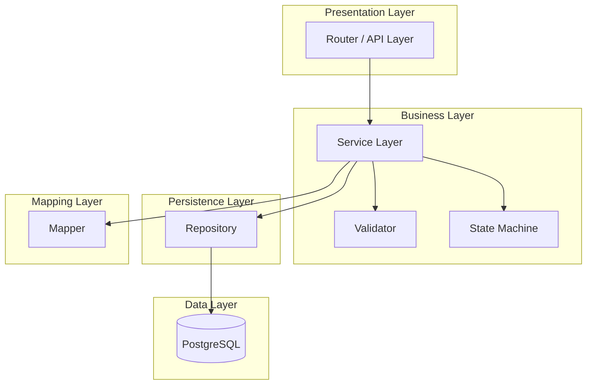
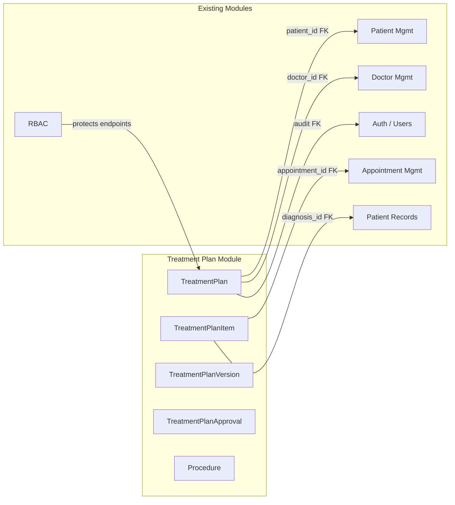
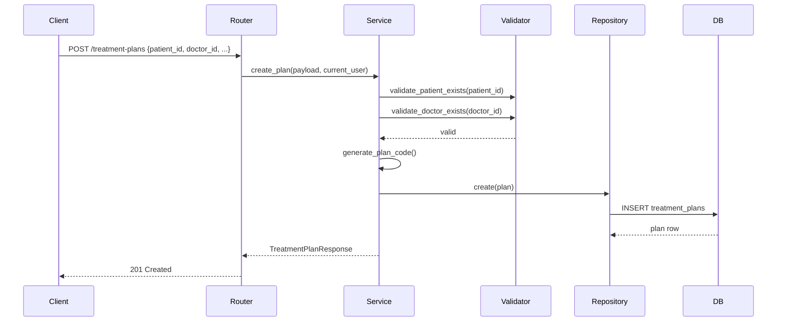
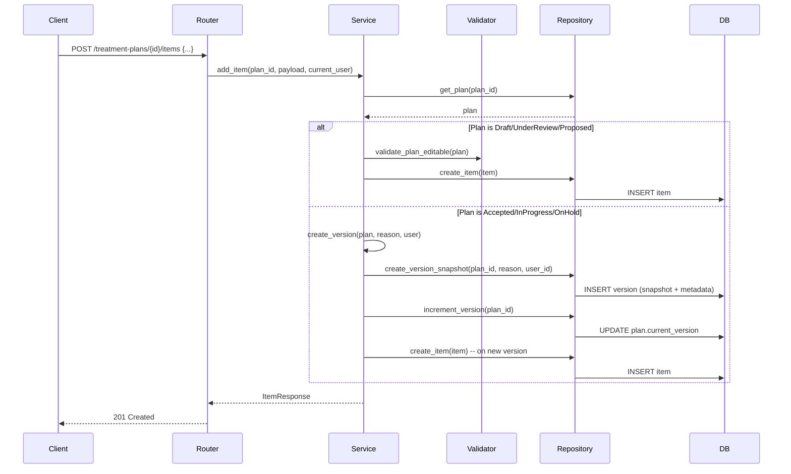
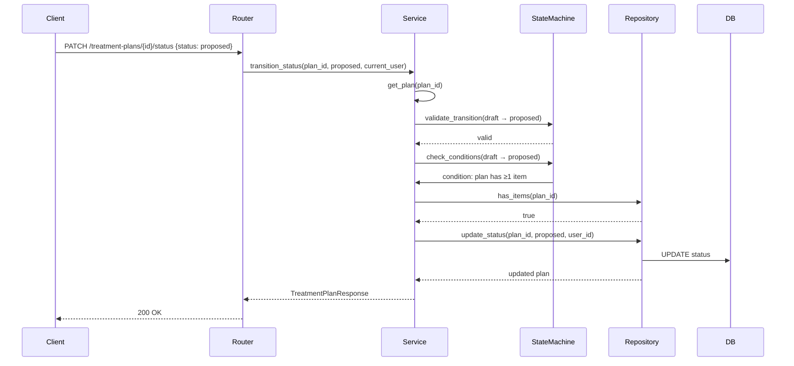

# Phase 10: Architecture Design — Treatment Plan Module

> **Status:** PASS | **Target Quality Score:** 9.9/10
> **MVP Scope:** This document reflects only the Treatment Plan MVP architecture.

---

## 1. Architecture Style

The Treatment Plan module follows the same **layered architecture** used throughout the existing DensCare backend:

```
Router → Service → Validator → Repository → Database
```

Each layer has a single responsibility and communicates only with the layer directly below it.



---

## 2. Layer Responsibilities

### 2.1 Router Layer

**Pattern:** FastAPI APIRouter with dependency injection (following `patients/routes.py`)

Responsibilities:
- Define HTTP endpoints with path operations
- Bind Pydantic request/response schemas
- Inject `db: Session` via `Depends(get_db)`
- Inject `current_user` via `Depends(require_roles(...))`
- Map domain exceptions to HTTP status codes
- Return response models

### 2.2 Service Layer

**Pattern:** Stateless service class with `Session` dependency (following `patients/service.py`)

Responsibilities:
- Coordinate business logic across multiple operations
- Manage database transactions (explicit commit/rollback)
- Enforce business rules before calling repository
- Generate computed fields (plan code)
- Manage state machine transitions
- Handle auto-versioning on post-acceptance modifications
- Raise domain-specific exceptions
- Handle audit field population (created_by, updated_by)
- Call Mapper to transform ORM → Pydantic response schemas

### 2.3 Validator Layer

**Pattern:** Pydantic field validators + dedicated validation functions

Responsibilities:
- Schema-level field validation
- Cross-field validation (valid_from < valid_to)
- Business rule validation (tooth number, sequence uniqueness, state transitions)
- Stateless pure functions — no side effects, no persistence

### 2.4 State Machine

**Pattern:** Dedicated state machine service for guarded transitions

Responsibilities:
- Validate plan status transitions against allowed transition map
- Validate item status transitions against allowed transition map
- Check business conditions for transitions (e.g., plan has items)
- Provide queryable transition table for UI/API clients
- Stateless — operates on status strings and condition checks

### 2.5 Repository Layer

**Pattern:** Repository class with explicit method signatures

Responsibilities:
- Construct SQLAlchemy queries
- Execute CRUD operations
- Apply search filters, pagination, and sorting
- Detect duplicate records before insert
- Return ORM model instances

### 2.6 Mapper Layer

**Pattern:** Explicit mapper functions (following `patients/mapper.py`)

Responsibilities:
- Transform ORM model instances to Pydantic response schemas
- Resolve derived fields (patient_name, doctor_name through relationships)
- Handle nested relationship loading (items, versions, approval)

### 2.7 Orchestrator (Deferred)

No orchestrator in MVP. All operations are single-aggregate. An orchestrator will be introduced post-MVP for cross-module workflows (e.g., plan acceptance triggers appointment scheduling or billing).

---

## 3. Module Structure

```
backend/app/modules/treatment/
├── __init__.py
├── enums.py                    # Treatment-specific enums
├── constants.py                # Constants
├── exceptions.py               # Domain exceptions
├── models.py                   # SQLAlchemy models
├── schemas.py                  # Pydantic request/response schemas
├── dependencies.py             # FastAPI dependencies
├── validators.py               # Business validation functions
├── state_machine.py            # State machine transition logic
├── mapper.py                   # ORM-to-schema transformation
├── repository.py               # Data access layer
├── service.py                  # Business logic layer
├── router.py                   # HTTP endpoint definitions
└── tests/
    ├── __init__.py
    ├── conftest.py
    ├── test_models.py
    ├── test_repository.py
    ├── test_service.py
    ├── test_routers.py
    ├── test_state_machine.py
    └── test_integration.py
```

---

## 4. Integration with Existing Modules

### 4.1 Auth Module

**Direction:** Treatment Plan consumes Auth

```
TreatmentService → checks user exists → Auth User model
```

- Auth handles ALL authentication (not duplicated)

### 4.2 RBAC Module

**Direction:** Treatment Plan consumes RBAC

```
Router → require_roles([...]) → current_user
```

- Endpoints protected by `require_roles()` with allowed role lists
- Owner-checks for doctor-specific operations

### 4.3 Patient Management Module

**Direction:** Treatment Plan consumes Patient

```
TreatmentPlan.patient_id → FK to patients.id
```

- Plan references an existing patient
- Patient deactivation does NOT cascade to plans

### 4.4 Doctor Management Module

**Direction:** Treatment Plan consumes Doctor

```
TreatmentPlan.doctor_id → FK to doctors.id
```

- Plan references an existing doctor profile
- Doctor deactivation does NOT cascade to plans
- Doctor identity resolved through Doctor → User relationship

### 4.5 Appointment Management Module

**Direction:** Treatment Plan optionally links to Appointments

```
TreatmentPlanItem.appointment_id → FK to appointments.id (optional)
```

- Items can optionally reference appointments for procedure scheduling
- Appointment deletion sets appointment_id to NULL on items (ON DELETE SET NULL)

### 4.6 Patient Records Module

**Direction:** Treatment Plan optionally links to Diagnoses

```
TreatmentPlanItem.diagnosis_id → FK to diagnoses (optional)
```

- Items can optionally reference diagnoses for clinical justification traceability
- Initial references may be at plan level (diagnosis_ids) or item level

### 4.7 Integration Architecture



---

## 5. Sequence Diagrams

### 5.1 Create Treatment Plan



### 5.2 Add Item to Plan (Post-Acceptance with Versioning)



### 5.3 Status Transition Flow



---

## 6. Design Decisions

| Decision | Rationale |
|---|---|
| TreatmentPlan as aggregate root | Encapsulates items, versions, and approval under one consistency boundary. Changes to the plan atomically affect its children. |
| Versioning via JSONB snapshot | Single column captures entire plan state at version creation. No need for separate snapshot tables. Immutable by design — no FK references to mutable items. |
| 1:1 Approval with plan | Each plan has exactly one approval workflow. Separate table (not embedded columns) keeps plan table clean. |
| Procedure as separate master table | Reusable across all plans with consistent naming and pricing. Seeded at deployment, updatable by admins. |
| Sequence numbers for item ordering | Explicit integer ordering (not positional indices). Cannot use list ordering because items may be deleted, creating gaps. |
| Total cost computed, not stored | Derived value — storing it creates data inconsistency risk when item costs or discounts change. |
| State machine as dedicated module | Encapsulates transition validation logic. Can be reused by API clients to render allowed transitions in UI. |
| Item status independent from plan status | Items can be completed independently. Plan status reflects aggregate item completion state. |
| No hard delete beyond Draft | Protects clinical audit trail. Deactivated plans remain readable for historical reference. |
| FDI tooth numbering as integer | Two-digit integer is simpler and more precise for validation. Storage as integer enables range queries. |

---

## 7. Why Sections (Architectural Rationale)

### 7.1 Why Aggregate Root?

**TreatmentPlan** is the aggregate root because all child entities (items, versions, approval) are meaningless without their parent plan. An item cannot exist without a plan, a version is always a snapshot OF a plan, and an approval approves A plan. This establishes a clear consistency boundary — all modifications to the aggregate go through the root, which enforces invariants before allowing state changes.

**Alternative considered:** Having TreatmentPlanItem as a separate aggregate referenced by TreatmentPlan. This was rejected because it would allow items to be modified independently of the plan, breaking invariants like "plan must have items to leave Draft" and "items can only be added to editable plans."

### 7.2 Why Versioning via JSONB Snapshots (not separate tables)?

Version snapshots are **immutable records of state at a point in time**. Using JSONB instead of a separate `items_snapshot` table avoids:
- Schema duplication (snapshot columns would mirror item columns)
- FK tracking complexity (snapshot items would need to reference mutable items — breaking immutability)
- Slow historical queries (reconstructing a historical state would require N joins)

JSONB also provides: built-in JSON validation, efficient storage for moderately sized documents, and no schema migrations when item structure evolves.

### 7.3 Why Services Own Transactions (not Repositories)?

The Service layer owns transactions because business operations span multiple repository calls (validate → create item → update plan → create version). If the repository owned the transaction, the service would have no way to roll back a partially completed multi-step operation.

This follows the **Unit of Work** pattern — the transaction boundary is at the use-case level, not the data-access level.

### 7.4 Why Validators are Stateless Pure Functions?

Validators must be stateless because:
1. **Testability** — Pure functions are trivially testable with no mocking needed
2. **Determinism** — Same input always produces same output; no hidden state
3. **Composability** — Validators can be chained in any order without side effects
4. **Separation of concerns** — Validation logic is separate from persistence and orchestration

### 7.5 Why UUID Primary Keys (not auto-increment)?

UUIDs provide:
- **Global uniqueness** — no collision risk across distributed systems (multi-clinic deployment ready)
- **Security** — IDs cannot be sequentially enumerated, preventing information leakage
- **Offline creation** — new entities can be assigned IDs without database round-trips

**Trade-off:** UUIDs are larger than integers (16 bytes vs 4 bytes), but at MVP scale the storage impact is negligible.

---

## 8. Decision Matrix Tables

### 8.1 Primary Key Strategy

| Option | Advantages | Disadvantages | Decision |
|---|---|---|---|
| **UUID v4** | Globally unique, secure, offline creation, multi-clinic ready | 16 bytes, slightly slower index inserts | ✅ **Selected** — matches existing DensCare pattern |
| Auto-increment Integer | 4 bytes, fast, human-readable | Sequential enumeration risk, collision in distributed systems | ❌ Rejected — not suitable for future multi-clinic |
| UUID v7 (time-ordered) | Sequential, index-friendly | Newer standard, less library support | ❌ Rejected — not yet supported by existing stack |
| Snowflake-style ID | Distributed-friendly, sortable | Requires external coordinator | ❌ Rejected — over-engineering for MVP |

### 8.2 Versioning Mechanism

| Option | Advantages | Disadvantages | Decision |
|---|---|---|---|
| **JSONB Snapshot** | Single column, no schema migration, immutable, fast | No SQL querying inside snapshot, moderate size | ✅ **Selected** — pragmatic for clinical audit trail |
| Separate snapshot table | Full SQL querying, normalized | Schema duplication, FK complexity, slower historical reads | ❌ Rejected — over-engineered for MVP needs |
| Event sourcing | Complete history, replayable | Complex, requires event store, over-engineering | ❌ Rejected — not justified for single-clinic MVP |
| Git-style diff storage | Space-efficient | Complex reconstruction, hard to audit | ❌ Rejected — audit requires complete snapshots |

### 8.3 State Machine Implementation

| Option | Advantages | Disadvantages | Decision |
|---|---|---|---|
| **Config-driven dict** | Simple, readable, easily modified, queryable | No compile-time validation | ✅ **Selected** — balances simplicity and flexibility |
| Enum-based transitions | Type-safe, compiler-verified | Rigid, requires code changes for new states | ❌ Rejected — future states would need code deploys |
| Database state machine table | Dynamic, admin-configurable | Complex querying, performance overhead | ❌ Rejected — over-engineering for MVP |
| Dedicated state machine library | Rich feature set | External dependency, learning curve | ❌ Rejected — unnecessary for this complexity level |

### 8.4 Cost Calculation

| Option | Advantages | Disadvantages | Decision |
|---|---|---|---|
| **Computed at query time** | Always consistent, no sync issues | CPU cost per query | ✅ **Selected** — consistent data trumps performance |
| Stored in DB | Fast reads | Stale data risk when item costs change | ❌ Rejected — data inconsistency risk |
| Cached + invalidated | Fast reads + eventual consistency | Cache invalidation complexity | ❌ Rejected — not needed at MVP scale |

### 8.5 Text Search Approach

| Option | Advantages | Disadvantages | Decision |
|---|---|---|---|
| **ILIKE with indexes** | Simple, no dependencies, works at MVP scale | Slower at 100K+ records | ✅ **Selected** — pragmatic for MVP (< 50K plans) |
| PostgreSQL Full-Text Search | Fast, ranked results, stemming | More complex queries, index maintenance | ⏳ Deferred — add at 50K+ plan threshold |
| Elasticsearch | Enterprise-grade search | Infrastructure overhead, data sync complexity | ❌ Rejected — over-engineering for MVP |

### 8.6 Procedure Catalog Storage

| Option | Advantages | Disadvantages | Decision |
|---|---|---|---|
| **Separate DB table** | Normalized, queryable, FK support, seedable | Requires migration management | ✅ **Selected** — clean, extensible design |
| Configuration file | Simple, no DB required | No FK enforcement, harder to update | ❌ Rejected — clinical data must be in DB |
| Enum in code | Type-safe, fast | Requires code change + deploy for new procedures | ❌ Rejected — procedures change frequently |

---

## 9. Scalability Considerations

### MVP Scale

Target: Single clinic, 5–50 doctors, thousands of plans.

| Aspect | Design | Capacity |
|---|---|---|
| Plans | Indexed by patient + doctor + status | 100,000+ plans |
| Items | Indexed by plan + sequence | 500+ items per plan |
| Search | ILIKE + filtered + paginated | <500ms at 10,000 plans |
| Concurrent users | Connection pooling | 50 concurrent |

### Bottlenecks

| Bottleneck | Mitigation |
|---|---|
| Plan search by patient name | Composite index + join to Patient table |
| Item loading for plan detail | `selectinload()` for relationship loading |
| Version snapshot serialization | JSONB built-in serialization — no N+1 |
| Status filtering | Composite index on (is_active, status) |

---

## 8. Implementation Notes

- Follow existing DensCare patterns for: transaction management, error handling, audit fields
- Use `ConfigDict(extra="forbid")` on request schemas
- Use `ConfigDict(from_attributes=True)` on response schemas
- Use `field_validator` for text normalization (strip, collapse whitespace)
- All service methods must use explicit `db.commit()` / `db.rollback()` patterns
- Raise domain exceptions (not HTTP exceptions) from service layer
- Map domain exceptions to HTTP exceptions in router layer
- Use `selectinload()` for relationship loading to avoid N+1 queries
- Version snapshots must be serialized as dicts before JSONB insertion
- State machine must be consulted before any status change

---

## 9. Cross-Cutting Concerns

| Concern | Implementation |
|---|---|
| Logging | Standard Python logging at INFO/WARNING/ERROR levels |
| Audit | `created_by`, `updated_by`, `created_at`, `updated_at` on all tables |
| Error handling | Domain exceptions → HTTP exception mapping in router |
| Input validation | Pydantic field validators + dedicated validator functions |
| Authorization | `require_roles()` decorator on router endpoints |
| Transaction safety | Explicit commit/rollback in service layer |
| Soft delete | `is_active` boolean (not hard delete) |
| Version integrity | JSONB snapshots never modified after creation |
| Database constraints | CHECK constraints for domain ranges + partial unique indexes |

---

## 11. Cross-Reference Navigation

| Direction | Documents |
|---|---|
| **Prerequisite** | [02-domain-analysis.md](02-domain-analysis.md) (domain model), [01-business-analysis.md](01-business-analysis.md) (requirements) |
| **Related** | [ADR-001-aggregate-root.md](adr/ADR-001-aggregate-root.md), [ADR-002-versioning.md](adr/ADR-002-versioning.md), [19-module-integrations.md](19-module-integrations.md) |
| **Depends On** | Existing DensCare architecture patterns (layered architecture, DI, repository pattern) |
| **Used By** | All implementation docs (Phase 11–16) |
| **Next Reading** | [11-orm-model-design.md](11-orm-model-design.md) |
