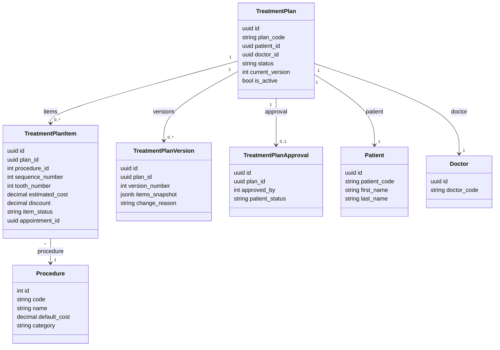

# Phase 11: ORM Model Design — Treatment Plan Module

> **Status:** PASS | **Target Quality Score:** 9.9/10
> **MVP Scope:** Five models only: TreatmentPlan, TreatmentPlanItem, TreatmentPlanVersion, TreatmentPlanApproval, Procedure.

---

## 1. Design Patterns

All models follow existing DensCare patterns from `patients/models.py` and `doctors/models.py`:

- `Base = declarative_base()` from `app/database/base.py`
- UUID primary keys for TreatmentPlan, TreatmentPlanItem, TreatmentPlanVersion, TreatmentPlanApproval (matches Patient pattern)
- Integer primary key for Procedure (simple lookup table)
- `TIMESTAMPTZ` for datetime columns with `server_default=func.now()`
- Explicit `__tablename__` and `__table_args__`
- Relationships with `passive_deletes=True` where appropriate
- Foreign keys with explicit `ondelete` rules

---

## 2. TreatmentPlan Model

```python
import uuid
from datetime import date
from sqlalchemy import (
    Column, String, Boolean, Date, DateTime, Integer, Text,
    Numeric, ForeignKey, CheckConstraint, Index, UniqueConstraint,
)
from sqlalchemy.dialects.postgresql import UUID
from sqlalchemy.orm import relationship
from sqlalchemy.sql import func
from app.database.base import Base


class TreatmentPlan(Base):
    __tablename__ = "treatment_plans"

    id = Column(UUID(as_uuid=True), primary_key=True, default=uuid.uuid4)
    plan_code = Column(String(20), nullable=False, unique=True)

    # Foreign Keys
    patient_id = Column(
        UUID(as_uuid=True),
        ForeignKey("patients.id", ondelete="RESTRICT"),
        nullable=False,
    )
    doctor_id = Column(
        UUID(as_uuid=True),
        ForeignKey("doctors.id", ondelete="RESTRICT"),
        nullable=False,
    )

    # Clinical Information
    clinical_notes = Column(Text, nullable=True)
    observations = Column(Text, nullable=True)
    dentist_recommendations = Column(Text, nullable=True)

    # Validity Period
    valid_from = Column(Date, nullable=True)
    valid_to = Column(Date, nullable=True)

    # Status & Versioning
    status = Column(String(20), nullable=False, default="draft")
    current_version = Column(Integer, nullable=False, default=1)

    # Soft Delete
    is_active = Column(Boolean, nullable=False, default=True)

    # Audit Fields
    created_by = Column(
        Integer,
        ForeignKey("users.id", ondelete="SET NULL"),
        nullable=True,
    )
    updated_by = Column(
        Integer,
        ForeignKey("users.id", ondelete="SET NULL"),
        nullable=True,
    )
    created_at = Column(
        DateTime(timezone=True), nullable=False, server_default=func.now()
    )
    updated_at = Column(
        DateTime(timezone=True),
        nullable=False,
        server_default=func.now(),
        onupdate=func.now(),
    )

    # Relationships
    items = relationship(
        "TreatmentPlanItem",
        back_populates="plan",
        cascade="all, delete-orphan",
        passive_deletes=True,
        order_by="TreatmentPlanItem.sequence_number",
    )
    versions = relationship(
        "TreatmentPlanVersion",
        back_populates="plan",
        cascade="all, delete-orphan",
        passive_deletes=True,
        order_by="TreatmentPlanVersion.version_number.desc()",
    )
    approval = relationship(
        "TreatmentPlanApproval",
        back_populates="plan",
        uselist=False,
        cascade="all, delete-orphan",
        passive_deletes=True,
    )
    patient = relationship("Patient", foreign_keys=[patient_id])
    doctor = relationship("Doctor", foreign_keys=[doctor_id])

    __table_args__ = (
        CheckConstraint(
            "valid_from IS NULL OR valid_to IS NULL OR valid_from <= valid_to",
            name="ck_tp_valid_dates",
        ),
        CheckConstraint(
            "status IN ('draft','under_review','proposed','accepted','in_progress','on_hold','completed','cancelled')",
            name="ck_tp_status",
        ),
        Index("ix_tp_patient", "patient_id"),
        Index("ix_tp_doctor", "doctor_id"),
        Index("ix_tp_status", "status"),
        Index("ix_tp_active_status", "is_active", "status"),
        Index("ix_tp_created_at", created_at.desc()),
    )

    def __repr__(self) -> str:
        return (
            f"<TreatmentPlan(id={self.id}, code={self.plan_code}, "
            f"status={self.status}, patient={self.patient_id})>"
        )
```

---

## 3. TreatmentPlanItem Model

```python
class TreatmentPlanItem(Base):
    __tablename__ = "treatment_plan_items"

    id = Column(UUID(as_uuid=True), primary_key=True, default=uuid.uuid4)
    plan_id = Column(
        UUID(as_uuid=True),
        ForeignKey("treatment_plans.id", ondelete="CASCADE"),
        nullable=False,
    )
    procedure_id = Column(
        Integer,
        ForeignKey("procedures.id", ondelete="RESTRICT"),
        nullable=False,
    )

    # Ordering
    sequence_number = Column(Integer, nullable=False)

    # Tooth Information
    tooth_number = Column(Integer, nullable=True)  # FDI 11-48, 51-85
    tooth_surface = Column(String(10), nullable=True)
    quadrant = Column(String(5), nullable=True)
    arch = Column(String(10), nullable=True)

    # Financial
    estimated_cost = Column(
        Numeric(10, 2),
        nullable=False,
        default=0.00,
    )
    discount = Column(
        Numeric(10, 2),
        nullable=False,
        default=0.00,
    )

    # Status
    item_status = Column(String(20), nullable=False, default="pending")

    # Optional Notes
    notes = Column(Text, nullable=True)

    # Optional Foreign Keys to Other Modules
    appointment_id = Column(
        UUID(as_uuid=True),
        ForeignKey("appointments.id", ondelete="SET NULL"),
        nullable=True,
    )
    diagnosis_id = Column(
        UUID(as_uuid=True),
        ForeignKey("patient_record_diagnoses.id", ondelete="SET NULL"),
        nullable=True,
        comment="Optional link to a diagnosis from Patient Records module",
    )
    # Relationships
    plan = relationship("TreatmentPlan", back_populates="items")
    procedure = relationship("Procedure")

    __table_args__ = (
        CheckConstraint("estimated_cost >= 0", name="ck_tpi_estimated_cost"),
        CheckConstraint("discount >= 0", name="ck_tpi_discount"),
        CheckConstraint(
            "tooth_number IS NULL OR "
            "(tooth_number BETWEEN 11 AND 48) OR "
            "(tooth_number BETWEEN 51 AND 85)",
            name="ck_tpi_tooth_number",
        ),
        CheckConstraint(
            "item_status IN ('pending','in_progress','completed','cancelled','deferred')",
            name="ck_tpi_item_status",
        ),
        UniqueConstraint(
            "plan_id", "sequence_number",
            name="uq_tp_item_sequence",
        ),
        Index("ix_tpi_plan", "plan_id"),
        Index("ix_tpi_plan_sequence", "plan_id", "sequence_number"),
        Index("ix_tpi_procedure", "procedure_id"),
        Index("ix_tpi_status", "plan_id", "item_status"),
        Index("ix_tpi_appointment", "appointment_id"),
    )
```


---

## 4. TreatmentPlanVersion Model

```python
from sqlalchemy import JSON
from sqlalchemy.dialects.postgresql import JSONB


class TreatmentPlanVersion(Base):
    __tablename__ = "treatment_plan_versions"

    id = Column(UUID(as_uuid=True), primary_key=True, default=uuid.uuid4)
    plan_id = Column(
        UUID(as_uuid=True),
        ForeignKey("treatment_plans.id", ondelete="CASCADE"),
        nullable=False,
    )

    # Version Metadata
    version_number = Column(Integer, nullable=False)
    items_snapshot = Column(JSONB, nullable=False)

    # Audit
    change_reason = Column(String(500), nullable=False)
    changed_by = Column(
        Integer,
        ForeignKey("users.id", ondelete="SET NULL"),
        nullable=False,
    )
    created_at = Column(
        DateTime(timezone=True),
        nullable=False,
        server_default=func.now(),
    )

    # Relationships
    plan = relationship("TreatmentPlan", back_populates="versions")
    changer = relationship("User", foreign_keys=[changed_by])

    __table_args__ = (
        CheckConstraint("version_number >= 1", name="ck_tpv_version_number"),
        Index(
            "ix_tpv_plan_version",
            "plan_id",
            "version_number",
            postgresql_order_by={"version_number": "DESC"},
        ),
    )

    def __repr__(self) -> str:
        return (
            f"<TreatmentPlanVersion(id={self.id}, plan={self.plan_id}, "
            f"version={self.version_number})>"
        )
```

---

## 5. TreatmentPlanApproval Model

```python
class TreatmentPlanApproval(Base):
    __tablename__ = "treatment_plan_approvals"

    id = Column(UUID(as_uuid=True), primary_key=True, default=uuid.uuid4)
    plan_id = Column(
        UUID(as_uuid=True),
        ForeignKey("treatment_plans.id", ondelete="CASCADE"),
        nullable=False,
        unique=True,  # 1:1 with TreatmentPlan
    )

    # Doctor Approval
    approved_by = Column(
        Integer,
        ForeignKey("users.id", ondelete="SET NULL"),
        nullable=True,
    )
    approved_at = Column(DateTime(timezone=True), nullable=True)

    # Patient Acknowledgment
    patient_status = Column(String(20), nullable=False, default="pending")
    patient_acknowledged_at = Column(DateTime(timezone=True), nullable=True)

    # Notes
    approval_notes = Column(String(500), nullable=True)

    # Relationships
    plan = relationship("TreatmentPlan", back_populates="approval")
    approver = relationship("User", foreign_keys=[approved_by])

    __table_args__ = (
        CheckConstraint(
            "patient_status IN ('pending','accepted','rejected','changes_requested')",
            name="ck_tpa_patient_status",
        ),
    )

    def __repr__(self) -> str:
        return (
            f"<TreatmentPlanApproval(id={self.id}, plan={self.plan_id}, "
            f"patient_status={self.patient_status})>"
        )
```

---

## 6. Procedure Model

```python
class Procedure(Base):
    __tablename__ = "procedures"

    id = Column(Integer, primary_key=True)
    code = Column(String(20), nullable=False, unique=True)
    name = Column(String(200), nullable=False)
    description = Column(Text, nullable=True)
    default_cost = Column(Numeric(10, 2), nullable=False, default=0.00)
    category = Column(String(30), nullable=False)
    is_active = Column(Boolean, nullable=False, default=True)

    __table_args__ = (
        CheckConstraint("default_cost >= 0", name="ck_proc_default_cost"),
        CheckConstraint(
            "category IN ('diagnostic','preventive','restorative','endodontic',"
            "'periodontic','prosthodontic','oral_surgery','orthodontic',"
            "'cosmetic','implant','other')",
            name="ck_proc_category",
        ),
        Index("ix_procedures_active", "is_active"),
        Index("ix_procedures_category", "category"),
    )

    def __repr__(self) -> str:
        return (
            f"<Procedure(id={self.id}, code={self.code}, "
            f"name={self.name}, category={self.category})>"
        )
```

---

## 7. Model Relationships Diagram



---

## 8. Models Explicitly Excluded from MVP

| Model | Purpose | Future Phase |
|---|---|---|
| `TreatmentPlanPayment` | Payment plan/schedule | Phase 18 |
| `TreatmentPlanInsurance` | Insurance claim tracking | Phase 18 |
| `TreatmentPlanOutcome` | Outcome metrics | Phase 18 |
| `ProcedureAttachment` | Supporting documents per procedure | Phase 18 |

---

## 9. Cross-Reference Navigation

| Direction | Documents |
|---|---|
| **Prerequisite** | [03-database-design.md](03-database-design.md) (table specs), [02-domain-analysis.md](02-domain-analysis.md) (entities) |
| **Related** | [10-architecture-design.md](10-architecture-design.md) (architecture), [08-enums-constants.md](08-enums-constants.md) (enum values) |
| **Depends On** | [03-database-design.md](03-database-design.md) for column specs, constraints, index definitions |
| **Used By** | [12-repository-design.md](12-repository-design.md), [15-mappers-schemas.md](15-mappers-schemas.md) |
| **Next Reading** | [12-repository-design.md](12-repository-design.md) |
