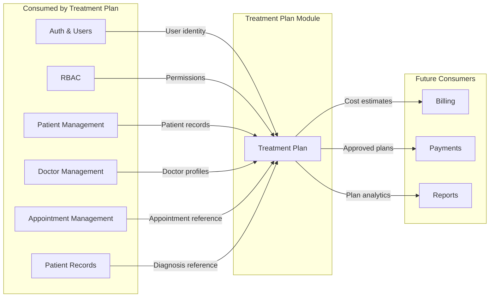

# Module Integrations — Treatment Plan Module

> **Purpose:** Define precise integration contracts between the Treatment Plan module and every other module in DensCare.
> **Status:** Final | **Quality:** 9.9/10

---

## Integration Map



---

## 1. Authentication Integration

| Aspect | Detail |
|---|---|
| **Module** | Auth (`app/modules/auth/`) |
| **Direction** | Treatment Plan consumes Auth |
| **Purpose** | Verify user identity for every API request |

### Data Exchanged

```
Request: Authorization: Bearer <JWT token>
Response (via FastAPI dependency): User ORM instance (id, email, full_name, role, is_active)
```

### Contract

```python
from app.dependencies.auth import get_current_user
from app.modules.auth.models import User

# Used in every endpoint via:
current_user: User = Depends(get_current_user)
```

| Field | Type | Source | Used For |
|---|---|---|---|
| `user.id` | int | User model | Audit trail (created_by, updated_by) |
| `user.email` | str | JWT sub claim | Authentication |
| `user.role.name` | str | Role model | RBAC authorization |
| `user.is_active` | bool | User model | Account status check |

### Transaction Boundary

- Auth operates in its own transaction context
- Treatment Plan receives the authenticated `User` object; it does not open transactions against Auth tables

### Failure Handling

| Failure | Behavior |
|---|---|
| Missing token | HTTP 401 "Could not validate credentials" |
| Expired token | HTTP 401 "Could not validate credentials" |
| Inactive user | HTTP 401 "Could not validate credentials" |
| User not found | HTTP 401 "Could not validate credentials" |

### Future Expansion

- No changes expected. Auth interface is stable.

---

## 2. RBAC Integration

| Aspect | Detail |
|---|---|
| **Module** | RBAC (`app/modules/rbac/`) |
| **Direction** | Treatment Plan consumes RBAC |
| **Purpose** | Authorize API access based on user role |

### Data Exchanged

```python
from app.modules.rbac.permissions import require_roles

# Usage patterns in Treatment Plan:
require_roles([ROLE_ADMIN, ROLE_CHIEF_DOCTOR])                    # Admin operations
require_roles([ROLE_ADMIN, ROLE_CHIEF_DOCTOR, *DOCTOR_ROLES])     # Doctor operations
require_roles([ROLE_ADMIN, ROLE_CHIEF_DOCTOR, *DOCTOR_ROLES, ROLE_RECEPTIONIST])  # Clinical reads
```

### Ownership

- Role definitions are owned by Auth/RBAC module
- Treatment Plan does NOT define or modify roles
- Treatment Plan defines which roles are allowed for each operation

### Transaction Boundary

- RBAC is a pure auth check — no database transaction involvement
- Role check happens before any business logic runs

### Failure Handling

| Failure | Behavior |
|---|---|
| No role assigned | HTTP 403 "Role not assigned" |
| Insufficient role | HTTP 403 "Insufficient permissions" |
| Owner mismatch | HTTP 403 "SELF_SERVICE_NOT_ALLOWED" |

### Future Expansion

- If finer-grained permissions are needed (e.g., department-level), extend the `plan_owner_or_admin()` dependency

---

## 3. User Management Integration

| Aspect | Detail |
|---|---|
| **Module** | Auth/Users (`app/modules/auth/models.py`) |
| **Direction** | Treatment Plan consumes Users |
| **Purpose** | Audit trail attribution |

### Data Exchanged

```
TreatmentPlan.created_by → users.id (Integer FK)
TreatmentPlan.updated_by → users.id (Integer FK)
TreatmentPlanApproval.approved_by → users.id (Integer FK)
TreatmentPlanVersion.changed_by → users.id (Integer FK)
```

### Ownership

- User records are owned by Auth/User Management
- Treatment Plan only references users.id as audit FKs
- Treatment Plan does NOT create, update, or delete User records

### Contract Rules

- FK constraint: `ON DELETE SET NULL` — deleting a user sets the audit field to null rather than cascading
- This preserves the treatment plan record even if the referenced user is removed

### Transaction Boundary

- User lookups (if needed) happen within Treatment Plan's own transaction
- No cross-module DB operations

---

## 4. Patient Management Integration

| Aspect | Detail |
|---|---|
| **Module** | Patients (`app/modules/patients/`) |
| **Direction** | Treatment Plan consumes Patients |
| **Purpose** | Every treatment plan belongs to a patient |

### Data Exchanged

```
TreatmentPlan.patient_id → patients.id (UUID FK)

Resolved at query time (via Mapper):
- Patient name: plan.patient.first_name + " " + plan.patient.last_name
- Patient code: plan.patient.patient_code
```

### Ownership

- Patient records are owned by Patient Management
- Treatment Plan creates a FK reference only
- Patient deactivation does NOT cascade to Treatment Plans

### Contract Rules

| Rule | Enforcement |
|---|---|
| Plan must reference an existing patient | FK constraint `ON DELETE RESTRICT` + Service validation |
| Patient can have multiple plans | No uniqueness constraint on patient_id in TreatmentPlan |
| Deleted/inactive patients retain their plans | FK uses RESTRICT (cannot delete patient with plans) + plans have `is_active` independent flag |

### Transaction Boundary

- Patient lookup: `SELECT FROM patients WHERE id = ?` within Treatment Plan's transaction
- No cross-module writes

### Failure Handling

| Failure | Behavior |
|---|---|
| Patient not found | HTTP 404 "Patient not found" (PlanCreationFailed) |
| Patient deactivated | Plan still creatable — patient lifecycle is separate from plan lifecycle |

### Future Expansion

- Patient name resolution could be cached if performance becomes a concern
- A patient summary view could include active treatment plan count

---

## 5. Doctor Management Integration

| Aspect | Detail |
|---|---|
| **Module** | Doctors (`app/modules/doctors/`) |
| **Direction** | Treatment Plan consumes Doctors |
| **Purpose** | Every treatment plan is created by/attributed to a doctor |

### Data Exchanged

```
TreatmentPlan.doctor_id → doctors.id (UUID FK)

Resolved at query time (via Mapper):
- Doctor name: plan.doctor.user.full_name
- Doctor code: plan.doctor.doctor_code

Owner resolution (for RBAC):
- User ID → Doctor ID: DoctorRepository.get_by_user_id(current_user.id)
```

### Ownership

- Doctor profiles are owned by Doctor Management
- Treatment Plan creates a FK reference only
- Doctor deactivation does NOT cascade to Treatment Plans

### Owner Resolution (Critical for RBAC)

```python
# Used in plan_owner_or_admin() dependency
def _get_doctor_by_user_id(user_id: int, db: Session) -> Doctor | None:
    from app.modules.doctors.repositories.doctor_repository import DoctorRepository
    return DoctorRepository(db).get_by_user_id(user_id)
```

This resolves a User (authenticated via JWT) to a Doctor profile so the system can verify that a doctor modifying a plan is the plan's owner.

### Transaction Boundary

- Doctor lookup within Treatment Plan's transaction
- DoctorRepository.get_by_user_id() is a read-only operation

### Failure Handling

| Failure | Behavior |
|---|---|
| Doctor not found | HTTP 404 "Doctor not found" (PlanCreationFailed) |
| User has no doctor profile | HTTP 403 "SELF_SERVICE_NOT_ALLOWED" (owner check fails) |
| Doctor deactivated | Plan still accessible — doctor lifecycle is separate |

---

## 6. Appointment Management Integration

| Aspect | Detail |
|---|---|
| **Module** | Appointments (`app/modules/appointments/`) |
| **Direction** | Treatment Plan optionally consumes Appointments |
| **Purpose** | Link treatment plan items to scheduled appointments |

### Data Exchanged

```
TreatmentPlanItem.appointment_id → appointments.id (UUID FK, optional, nullable)
```

### Ownership

- Appointment records are owned by Appointment Management
- Treatment Plan optionally references appointments
- Appointment deletion sets `appointment_id` to NULL (FK `ON DELETE SET NULL`)

### Contract Rules

| Rule | Enforcement |
|---|---|
| Appointment reference is optional | `appointment_id` is nullable |
| Deleting an appointment does not delete the plan item | `ON DELETE SET NULL` |
| One appointment can be referenced by many plan items | No uniqueness constraint on appointment_id |
| Appointment's dentist_id (users.id) is independent of plan's doctor_id (doctors.id) | Separate concerns — plan's responsible doctor vs appointment's performing dentist |

### Transaction Boundary

- No cross-module writes. Treatment Plan stores the FK value; it does not query Appointments directly.
- If validation of the appointment reference is needed, a read query to the appointments table is performed within Treatment Plan's transaction.

### Failure Handling

| Failure | Behavior |
|---|---|
| Appointment ID does not exist | FK constraint violation → HTTP 500 (should be prevented by service validation) |
| Appointment deleted | appointment_id silently nullified by ON DELETE SET NULL |

### Future Expansion

- Bi-directional linking: appointments could show associated treatment plan items
- Procedure-based scheduling: suggesting available appointment slots based on treatment plan items

---

## 7. Patient Records Integration (Diagnoses)

| Aspect | Detail |
|---|---|
| **Module** | Patient Records (`app/modules/patient_records/`) |
| **Direction** | Treatment Plan optionally consumes Diagnoses |
| **Purpose** | Link treatment plan items to diagnosed conditions for clinical justification traceability |

### Data Exchanged

```
TreatmentPlanItem.diagnosis_id → patient_record_diagnoses.id (UUID FK, optional, nullable)
```

### Ownership

- Diagnosis records are owned by Patient Records (`PatientRecordDiagnosis` model)
- Treatment Plan optionally references diagnoses
- Diagnosis soft-delete (`is_deleted=true`) does NOT cascade to Treatment Plan items

### Important: Table Name

The actual database table is `patient_record_diagnoses` (not `diagnoses`). The FK declaration must use:

```python
diagnosis_id = Column(
    UUID(as_uuid=True),
    ForeignKey("patient_record_diagnoses.id", ondelete="SET NULL"),
    nullable=True,
)
```

### Soft-Delete Consideration

Patient Records uses `is_deleted` for soft deletion, while Treatment Plan uses `is_active`. When the Treatment Plan service performs diagnosis lookups, it should filter:

```python
# Correct: Patient Records uses is_deleted=False
db.query(PatientRecordDiagnosis).filter(
    PatientRecordDiagnosis.id == diagnosis_id,
    PatientRecordDiagnosis.is_deleted == False,  # NOT is_active == True
).first()
```

### Transaction Boundary

- No cross-module writes. Treatment Plan stores the FK value; validation reads from the existing Patient Records module.

### Failure Handling

| Failure | Behavior |
|---|---|
| Diagnosis not found | FK constraint violation → HTTP 500 (should be prevented by service validation) |
| Diagnosis soft-deleted | Referential integrity preserved; item remains valid |
| Diagnosis parent record deleted | Diagnosis may still exist (separate lifecycle) |

### Future Expansion

- Plan-level diagnosis linkage (multiple diagnoses per plan, not just per item)
- Diagnosis-to-procedure clinical justification rules

---

## 8. Future: Dental Chart Integration

| Aspect | Detail |
|---|---|
| **Module** | Dental Chart (future) |
| **Direction** | Treatment Plan → Dental Chart (bidirectional) |
| **Purpose** | Visual tooth-level treatment planning on dental chart |

**Planned Contract:**
- Treatment plan items with tooth numbers would be rendered on the dental chart
- The dental chart could be used as an alternative UI for adding items to a plan
- Tooth numbering standardization (FDI) ensures compatibility

---

## 9. Future: Billing Integration

| Aspect | Detail |
|---|---|
| **Module** | Billing (future) |
| **Direction** | Treatment Plan → Billing (provides cost estimates) |
| **Purpose** | Generate invoices from approved treatment plans |

**Planned Contract:**
- Billing module consumes accepted/in-progress treatment plans
- Itemized costs from treatment plan items form the basis of invoices
- Discounts at the item level are respected
- Status changes (completed items) could trigger partial billing

---

## 10. Future: Payments Integration

| Aspect | Detail |
|---|---|
| **Module** | Payments (future) |
| **Direction** | Treatment Plan → Payments (provides approved plans) |
| **Purpose** | Generate payment schedules from accepted treatment plans |

**Planned Contract:**
- Payment plans are generated from accepted treatment plans
- Each payment installment corresponds to a set of planned procedures
- Treatment plan version changes may trigger payment schedule adjustments

---

## 11. Future: Reports Integration

| Aspect | Detail |
|---|---|
| **Module** | Reports (future) |
| **Direction** | Treatment Plan → Reports (provides analytics) |
| **Purpose** | Treatment plan analytics and KPIs |

**Planned KPIs:**
- Plans created per doctor per period
- Plan acceptance rate (proposed → accepted)
- Plan completion rate
- Average cost per completed plan
- Most common procedures in treatment plans

---

## Integration Summary Matrix

| Module | Status | FK Field | FK Target | On Delete | Query Pattern |
|---|---|---|---|---|---|
| Auth | ✅ Active | — | — | — | `get_current_user()` dependency |
| RBAC | ✅ Active | — | — | — | `require_roles()` dependency |
| Users | ✅ Active | created_by, updated_by | users.id | SET NULL | Audit field assignment |
| Patients | ✅ Active | patient_id | patients.id | RESTRICT | `plan.patient.first_name` |
| Doctors | ✅ Active | doctor_id | doctors.id | RESTRICT | `plan.doctor.user.full_name` |
| Appointments | ✅ Active | appointment_id | appointments.id | SET NULL | Optional item link |
| Patient Records | ✅ Active | diagnosis_id | patient_record_diagnoses.id | SET NULL | Optional item link |
| Dental Chart | 🔮 Future | — | — | — | TBD |
| Billing | 🔮 Future | — | — | — | TBD |
| Payments | 🔮 Future | — | — | — | TBD |
| Reports | 🔮 Future | — | — | — | TBD |
