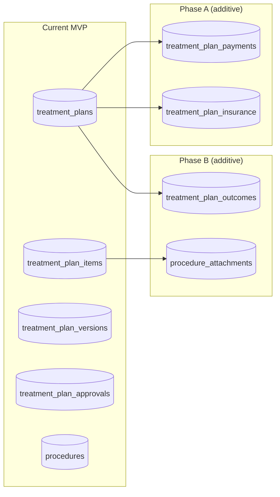

# Future Evolution — Treatment Plan Module

> **Purpose:** Document planned feature evolution, migration strategy, backward compatibility guarantees, and scalability roadmap.
> **Status:** Planning | **Quality:** 9.9/10

---

## 1. Backward Compatibility Guarantees

The Treatment Plan MVP schema and API are designed to be **forward-compatible** with all planned future enhancements.

| Guarantee | Details |
|---|---|
| **No schema changes to existing tables** | Future features add NEW tables; existing tables remain unchanged |
| **No breaking API changes** | Future endpoints are ADDITIVE; existing endpoints retain their contracts |
| **Version snapshot compatibility** | JSONB snapshot format is extensible — new fields are additive |
| **Status enum extensibility** | New status values can be added; existing values never removed |
| **Procedure catalog extensibility** | New categories can be added; existing categories never removed |

---

## 2. Phase Priority Matrix

| Priority | Phase | Timeline | Description |
|---|---|---|---|
| P0 | MVP | Current | Plan CRUD, items, versions, approval, procedure catalog |
| P1 | Phase A | Sprint 1 | Payment plans, insurance claims |
| P2 | Phase B | Sprint 2 | Treatment outcomes, procedure attachments |
| P3 | Phase C | Sprint 3 | Patient portal, dental chart integration |
| P4 | Phase D | Future | AI recommendations, multi-clinic, lab integration |

---

## 3. Phase A: Payment Plans & Insurance

### Payment Plan Generation

**New Entity:** `TreatmentPlanPayment`

```python
class TreatmentPlanPayment(Base):
    __tablename__ = "treatment_plan_payments"
    # plan_id (FK), installment_count, installment_amount,
    # payment_frequency, due_dates (JSONB), total_paid, status
```

**API Endpoints (additive):**
- `POST /treatment-plans/{id}/payment-plan` — Generate payment schedule
- `GET /treatment-plans/{id}/payment-plan` — View payment schedule
- `PATCH /treatment-plans/{id}/payment-plan` — Adjust payment schedule

**Migration Strategy:**
- New table `treatment_plan_payments` added
- No changes to existing `treatment_plans` or `treatment_plan_items` tables

### Insurance Claims

**New Entity:** `TreatmentPlanInsuranceClaim`

```python
class TreatmentPlanInsuranceClaim(Base):
    __tablename__ = "treatment_plan_insurance_claims"
    # plan_id (FK), insurance_provider, policy_number, claim_amount,
    # coverage_percentage, status, submitted_at, approved_amount
```

**API Endpoints (additive):**
- `POST /treatment-plans/{id}/insurance-claim` — Submit claim
- `GET /treatment-plans/{id}/insurance-claim` — View claim status

---

## 4. Phase B: Outcomes & Attachments

### Treatment Outcomes

**New Entity:** `TreatmentPlanOutcome`

```python
class TreatmentPlanOutcome(Base):
    __tablename__ = "treatment_plan_outcomes"
    # plan_id (FK), overall_success, complications (JSONB),
    # patient_satisfaction, notes, followup_required
```

**API Endpoints (additive):**
- `POST /treatment-plans/{id}/outcomes` — Record outcomes
- `GET /treatment-plans/{id}/outcomes` — View outcomes

### Procedure Attachments

**New Table:** `procedure_attachments`

```python
class ProcedureAttachment(Base):
    __tablename__ = "procedure_attachments"
    # item_id (FK to treatment_plan_items), file_url, file_type,
    # description, uploaded_by, uploaded_at
```

---

## 5. Phase C: Patient Portal & Dental Chart

### Patient Portal (External)

- Patients can view proposed treatment plans online
- Patients can acknowledge (accept/reject) plans through the portal
- Read-only access via authenticated portal session (not DensCare JWT)

**Integration:** New `portal_tokens` table for secure, time-limited access links.

### Dental Chart Integration

- Treatment plan items with tooth numbers rendered on an interactive dental chart
- Bi-directional: click on tooth in chart → see related plan items; add plan item by clicking tooth
- Standardizes FDI tooth numbering across chart and plans

---

## 6. Phase D: Advanced Features

### AI-Assisted Treatment Recommendations

- Based on diagnosis, patient history, and similar cases, suggest procedures
- Integration with Clinical Decision Support system
- Goal: Reduce planning time and improve treatment quality

### Multi-Clinic Treatment Plans

- Plans shared across clinic locations
- Doctor can create plan for patient at one clinic, executed at another
- Requires: `clinic_id` FK on `treatment_plans` table

### Laboratory Case Integration

- Link treatment plan items to dental lab cases (crowns, bridges, dentures)
- Track lab case status per item (sent_to_lab, in_production, received)
- Integration with external lab management

---

## 7. Migration Strategy for Future Phases



**Key Principle:** Every future phase adds NEW tables with FK references to existing tables. No existing table is modified. This ensures zero-downtime upgrades and no need for data backfills.

---

## 8. Scalability Roadmap

| Milestone | Volume | Strategy |
|---|---|---|
| **MVP** | 1 clinic, 10K plans | Single PostgreSQL instance, all indexes in place |
| **Growth** | 5 clinics, 100K plans | Connection pooling tuning, query optimization, read replicas |
| **Scale** | 20 clinics, 1M plans | Read replicas for list/search queries; archival for completed plans >2 years old |
| **Enterprise** | 100+ clinics, 10M+ plans | Sharding by clinic_id; materialized views for analytics; elasticsearch for search |

---

## 9. Data Retention & Archival

| Plan State | Retention | Action |
|---|---|---|
| Active (Draft/InProgress) | Indefinite | Keep in primary table |
| Completed | Min 7 years (regulatory) | Keep in primary table |
| Cancelled | Min 7 years (regulatory) | Keep in primary table |
| Completed > 2 years | Optional archival | Move to archival table or cold storage |
| Deactivated | Indefinite | is_active=false; kept in primary table |

---

## 10. API Versioning Strategy

| Situation | Action |
|---|---|
| New endpoint added | No versioning needed — additive change |
| New field added to response | No versioning needed — clients ignore unknown fields |
| New field added to request | Optional field with default; no versioning needed |
| Field removed from response | New API version (`/api/v2/treatment-plans/...`) |
| Request field becomes required | New API version |

DensCare follows implicit versioning (current = v1). Breaking changes get a `/api/v2/` prefix.
