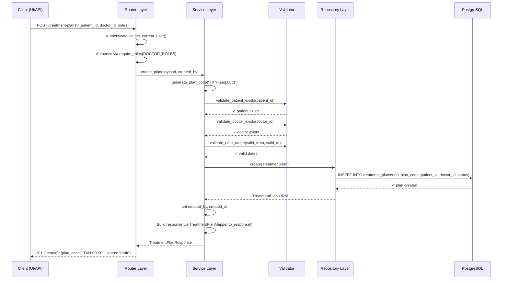
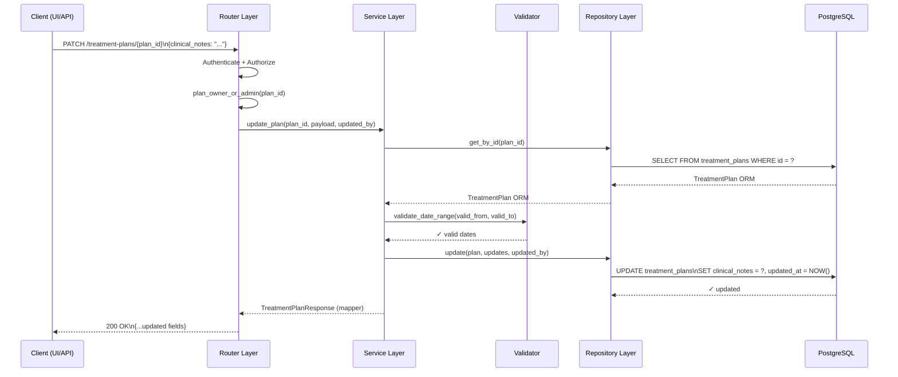
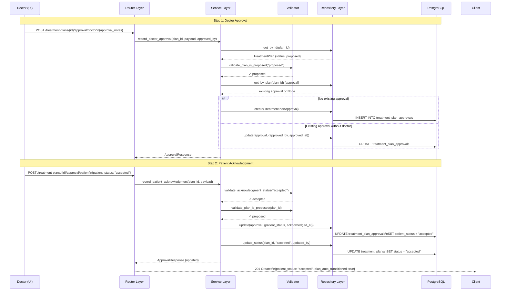
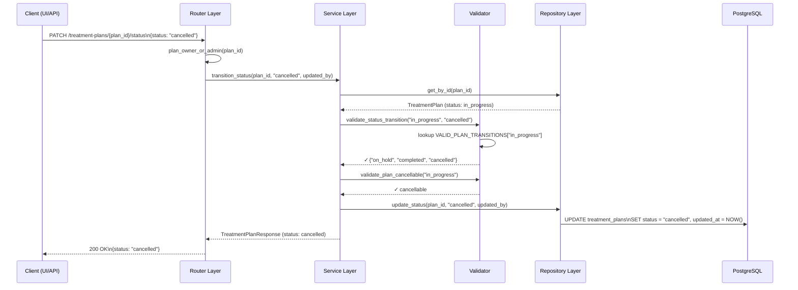
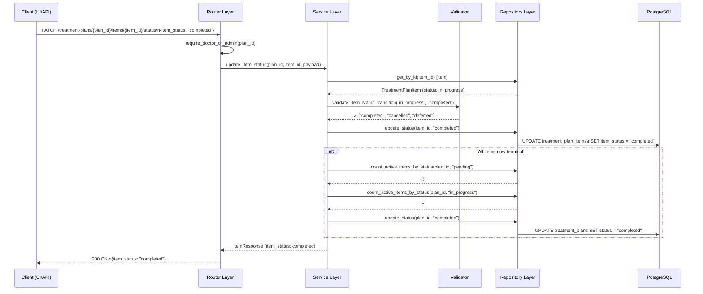
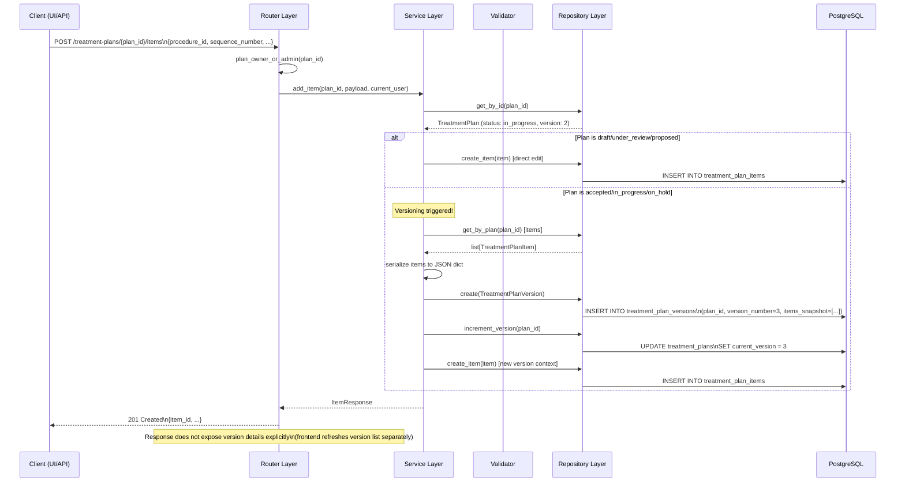
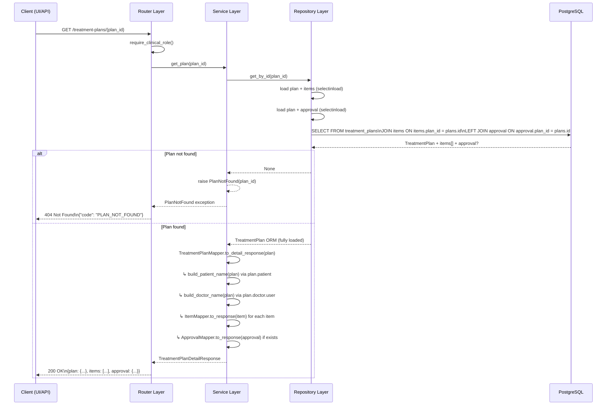

# Sequence Diagrams — Treatment Plan Module

> **Purpose:** Complete request flow diagrams showing how every major operation traverses the layered architecture.

---

## 1. Create Treatment Plan



---

## 2. Update Treatment Plan



---

## 3. Approve Treatment Plan (Doctor + Patient)



---

## 4. Cancel Treatment Plan



---

## 5. Complete Procedure (Item Status Update)



---

## 6. Create New Version (Post-Acceptance Modification)



---

## 7. View Treatment Plan (Detail)



---

## Request Flow Legend

```
Every request follows this path:
  Client → Router (Auth + RBAC) → Service (TX mgmt) → Validator → Repository → Database
```

| Layer | Responsibility |
|---|---|
| **Client** | HTTP request with JWT in Authorization header |
| **Router** | Authenticate (get_current_user), Authorize (require_roles), map exceptions to HTTP |
| **Service** | Transaction boundaries (commit/rollback), business logic, audit fields, coordinator |
| **Validator** | Pure function checks — returns None or raises ValueError/domain exception |
| **Repository** | ORM queries, pagination, filters — no business logic |
| **Database** | PostgreSQL — constraints, indexes, FK enforcement |
