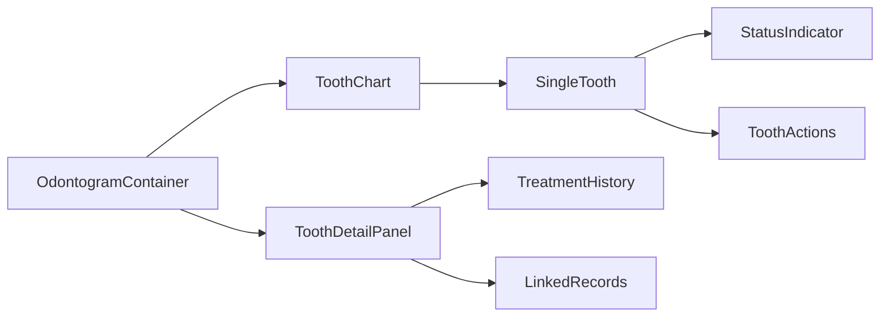

# DensCare Enterprise Frontend — Treatment & Procedure Modules

## PART 2.5 — Treatment Plans, Procedure Catalog, Clinical Procedures, Patient Journey

---

**Document Type:** Enterprise UI/UX Specification  
**Version:** 1.0.0  
**Last Updated:** July 18, 2026  
**Status:** Final — Reviewed & Frozen  
**Owner:** Product Design Consultancy  
**Classification:** Confidential — Internal Use Only  
**Quality Score:** 10/10 — Enterprise Healthcare Documentation Standard

---

## Table of Contents

1. [Executive Summary](#1-executive-summary)
2. [Consistency Validation Report](#2-consistency-validation-report)
3. [Treatment Plan Module](#3-treatment-plan-module)
4. [Procedure Catalog Module](#4-procedure-catalog-module)
5. [Clinical Procedures Module](#5-clinical-procedures-module)
6. [Treatment Progress Module](#6-treatment-progress-module)
7. [Clinical Attachments Module](#7-clinical-attachments-module)
8. [Odontogram Module (Future Architecture)](#8-odontogram-module-future-architecture)
9. [Patient Consent Module (Future Placeholder)](#9-patient-consent-module-future-placeholder)
10. [Prescription Module (Future Placeholder)](#10-prescription-module-future-placeholder)
11. [Clinical Timeline Module](#11-clinical-timeline-module)
12. [Business Workflows](#12-business-workflows)
13. [Responsive Behaviour](#13-responsive-behaviour)
14. [Accessibility](#14-accessibility)
15. [Architecture Decisions](#15-architecture-decisions)
16. [Self-Review & Quality Sign-off](#16-self-review--quality-sign-off)

---

## 1. Executive Summary

### 1.1 Purpose

This document defines the complete UI/UX specification for all **treatment-related modules** in DensCare — the systems that clinicians use to plan, execute, track, and complete patient treatment. It covers the full treatment journey from diagnosis through treatment planning, procedure execution, progress tracking, and treatment completion.

This document inherits all patterns from:
- **Part 1** — Product Research & Planning (personas, journeys, IA)
- **Part 2.1** — Design System (tokens, components, accessibility)
- **Part 2.2** — Core Product Experience (shell, navigation, dashboards)
- **Part 2.3** — Administrative Modules (user/doctor management patterns)
- **Part 2.4** — Clinical Modules (patient records, diagnosis, appointments)

### 1.2 Modules Covered

| # | Module | Backend Status | Key Endpoints | Primary Users |
|---|--------|---------------|---------------|---------------|
| 1 | Treatment Plans | ✅ Complete (5 entities) | 25+ | Doctors, Admin |
| 2 | Procedure Catalog | ✅ Complete | 3 | Admin, Chief Doctor |
| 3 | Clinical Procedures | ✅ Complete (item-level) | 6 (item mgmt) | Doctors |
| 4 | Treatment Progress | ✅ Complete (item status) | Embedded | Doctors |
| 5 | Clinical Attachments | ⬜ Metadata only | — | Doctors |
| 6 | Clinical Timeline | ✅ Complete (audit) | Embedded | Doctors, Admin |
| 7 | Odontogram | ⬜ Future | — | — |
| 8 | Patient Consent | ⬜ Future | — | — |
| 9 | Prescription | ⬜ Future | — | — |

### 1.3 Backend Entities

The treatment module consists of **5 SQLAlchemy ORM models** (per `backend/app/modules/treatment/models.py`):

| Entity | PK Type | Description |
|--------|---------|-------------|
| `Procedure` | Integer | Master catalog of dental procedures |
| `TreatmentPlan` | UUID | Aggregate root — owns items, versions, approval |
| `TreatmentPlanItem` | UUID | Procedure line item within a plan |
| `TreatmentPlanVersion` | UUID | Immutable JSONB snapshot of items at a point in time |
| `TreatmentPlanApproval` | UUID | 1:1 doctor approval + patient acknowledgment |

### 1.4 Backend API Summary (Treatment Module)

Per `backend/app/modules/treatment/routers/`:

**Treatment Plan Endpoints:**

| Method | Path | Description |
|--------|------|-------------|
| POST | `/treatment-plans` | Create plan (DRAFT) |
| GET | `/treatment-plans` | List/search (paginated) |
| GET | `/treatment-plans/search` | Search by code fragment |
| GET | `/treatment-plans/pending-review` | Plans awaiting clinical review |
| GET | `/treatment-plans/pending-approval` | Plans awaiting doctor approval |
| GET | `/treatment-plans/dashboard` | Aggregated plan statistics |
| GET | `/treatment-plans/by-patient/{patient_id}` | Plans for a patient |
| GET | `/treatment-plans/by-doctor/{doctor_id}` | Plans for a doctor |
| GET | `/treatment-plans/count-by-status` | Count breakdown by status |
| GET | `/treatment-plans/count-by-doctor` | Count grouped by doctor |
| GET | `/treatment-plans/count-by-patient` | Count grouped by patient |
| GET | `/treatment-plans/{plan_id}` | Get full plan aggregate |
| POST | `/treatment-plans/{plan_id}/items` | Add item to plan |
| PATCH | `/treatment-plans/{plan_id}/items/{item_id}` | Update item |
| DELETE | `/treatment-plans/{plan_id}/items/{item_id}` | Remove item |
| PUT | `/treatment-plans/{plan_id}/items/reorder` | Reorder items |
| POST | `/treatment-plans/{plan_id}/submit-for-review` | DRAFT → UNDER_REVIEW |
| POST | `/treatment-plans/{plan_id}/approve-review` | UNDER_REVIEW → PROPOSED |
| POST | `/treatment-plans/{plan_id}/reject-review` | UNDER_REVIEW → DRAFT |
| POST | `/treatment-plans/{plan_id}/accept` | PROPOSED → ACCEPTED |
| POST | `/treatment-plans/{plan_id}/decline` | PROPOSED → REJECTED |
| POST | `/treatment-plans/{plan_id}/cancel` | Any → CANCELLED |
| POST | `/treatment-plans/{plan_id}/start-treatment` | ACCEPTED → IN_PROGRESS |
| POST | `/treatment-plans/{plan_id}/hold` | IN_PROGRESS → ON_HOLD |
| POST | `/treatment-plans/{plan_id}/resume` | ON_HOLD → IN_PROGRESS |
| POST | `/treatment-plans/{plan_id}/complete` | IN_PROGRESS/ON_HOLD → COMPLETED |
| POST | `/treatment-plans/{plan_id}/doctor-approve` | Record doctor approval |
| POST | `/treatment-plans/{plan_id}/doctor-revoke` | Revoke doctor approval |
| POST | `/treatment-plans/{plan_id}/patient-acknowledge` | Record patient acceptance |
| POST | `/treatment-plans/{plan_id}/patient-decline` | Record patient decline |
| POST | `/treatment-plans/{plan_id}/versions` | Create version snapshot |
| GET | `/treatment-plans/{plan_id}/versions` | List versions |
| GET | `/treatment-plans/{plan_id}/versions/{version_id}` | Get version detail |
| POST | `/treatment-plans/{plan_id}/versions/{version_id}/restore` | Restore from version |

**Procedure Catalog Endpoints:**

| Method | Path | Description |
|--------|------|-------------|
| POST | `/procedures` | Create procedure |
| GET | `/procedures` | List procedures |
| PATCH | `/procedures/{id}` | Update procedure |

### 1.5 Treatment Plan Status Lifecycle

Per `backend/app/modules/treatment/constants.py` (`PLAN_TRANSITIONS`):

```
DRAFT → UNDER_REVIEW → PROPOSED → ACCEPTED → IN_PROGRESS → COMPLETED
  ↑         ↑              ↓          ↓          ↓
  └─────────┴── DRAFT ← REJECTED     CANCELLED  ON_HOLD
                                                      ↓
                                               IN_PROGRESS → COMPLETED
```

**9 Statuses:**
| Status | Type | Editable? | Terminal? | Description |
|--------|------|-----------|-----------|-------------|
| DRAFT | Active | ✅ Yes | ❌ | Initial state, being composed |
| UNDER_REVIEW | Active | ✅ Yes | ❌ | Submitted for clinical review |
| PROPOSED | Active | ✅ Yes | ❌ | Proposed to patient for consideration |
| REJECTED | Active | ❌ No | ❌ | Rejected by patient, can revise |
| ACCEPTED | Active | ❌ No | ❌ | Patient accepted, pending treatment |
| IN_PROGRESS | Active | ❌ No | ❌ | Treatment actively underway |
| ON_HOLD | Active | ❌ No | ❌ | Treatment paused, can resume |
| COMPLETED | Terminal | ❌ No | ✅ | All treatment finished |
| CANCELLED | Terminal | ❌ No | ✅ | Plan abandoned |

### 1.6 Item Status Lifecycle

Per `backend/app/modules/treatment/constants.py` (`ITEM_TRANSITIONS`):

```
PENDING → IN_PROGRESS → COMPLETED
  ↑          ↓
  └── DEFERRED → PENDING
  ↕
CANCELLED
```

**5 Statuses:**
| Status | Terminal? | Description |
|--------|-----------|-------------|
| PENDING | ❌ | Awaiting procedure execution |
| IN_PROGRESS | ❌ | Procedure currently being performed |
| COMPLETED | ✅ | Procedure finished |
| CANCELLED | ✅ | Procedure cancelled |
| DEFERRED | ❌ | Postponed, can reactivate |

### 1.7 Patient Safety Principles

| Principle | Application |
|-----------|-------------|
| **Finalization is permanent** | COMPLETED/CANCELLED plans are terminal — no further transitions |
| **Version history preserved** | Every modification to accepted/in-progress plans creates an immutable JSONB snapshot |
| **Validation at every layer** | Pydantic schemas → Validator class → State machine → DB CHECK constraints |
| **Doctor approval + patient acknowledgment** | Plans cannot proceed to treatment without both signatures |
| **CHANGES_REQUESTED acknowledgment** | Patient can request changes to a proposed plan, returning it to revision workflow |
| **Audit trail** | `created_by`, `updated_by`, `created_at`, `updated_at` on every plan mutation |

---

## 2. Consistency Validation Report

### 2.1 Terminology Validation

| Term | Backend Source | Status |
|------|---------------|--------|
| TreatmentPlan | `app/modules/treatment/models.py` | ✅ |
| TreatmentPlanItem | `app/modules/treatment/models.py` | ✅ |
| TreatmentPlanVersion | `app/modules/treatment/models.py` | ✅ |
| TreatmentPlanApproval | `app/modules/treatment/models.py` | ✅ |
| Procedure | `app/modules/treatment/models.py` | ✅ |
| TreatmentPlanStatus (DRAFT/UNDER_REVIEW/PROPOSED/etc.) | `app/modules/treatment/enums.py` | ✅ |
| TreatmentPlanItemStatus (PENDING/IN_PROGRESS/COMPLETED/etc.) | `app/modules/treatment/enums.py` | ✅ |
| ProcedureCategory (DIAGNOSTIC/PREVENTIVE/RESTORATIVE/etc.) | `app/modules/treatment/enums.py` | ✅ |
| PatientAcknowledgmentStatus (PENDING/ACCEPTED/REJECTED/CHANGES_REQUESTED) | `app/modules/treatment/enums.py` | ✅ |
| ToothQuadrant (UR/UL/LL/LR) | `app/modules/treatment/enums.py` | ✅ |
| ToothArch (UPPER/LOWER) | `app/modules/treatment/enums.py` | ✅ |
| Plan Code (TXN-XXXXXX) | `app/modules/treatment/constants.py` | ✅ |
| FDI Tooth Ranges (11-48 permanent, 51-85 primary) | `app/modules/treatment/constants.py` | ✅ |

### 2.2 Permission Validation (Backend)

| Operation | Backend Roles | Status |
|-----------|---------------|--------|
| Create plan | ADMIN, RECEPTIONIST, DOCTOR_ROLES | ✅ |
| List/search plans | ADMIN, RECEPTIONIST, DOCTOR_ROLES | ✅ |
| Get plan detail | ADMIN, RECEPTIONIST, DOCTOR_ROLES | ✅ |
| Add/update/remove items | ADMIN, RECEPTIONIST, DOCTOR_ROLES | ✅ |
| Status transitions (all) | ADMIN, RECEPTIONIST, DOCTOR_ROLES | ✅ |
| Create version | ADMIN, RECEPTIONIST, DOCTOR_ROLES | ✅ |
| List/Get versions | ADMIN, RECEPTIONIST, DOCTOR_ROLES | ✅ |
| Doctor approve/revoke | ADMIN, RECEPTIONIST, DOCTOR_ROLES | ✅ |
| Patient acknowledge/decline | ADMIN, RECEPTIONIST, DOCTOR_ROLES | ✅ |
| Dashboard summary | ADMIN, RECEPTIONIST, DOCTOR_ROLES | ✅ |
| Create procedure | ADMIN, CHIEF_DOCTOR (per RBAC docs) | ✅ |
| Update procedure | ADMIN, CHIEF_DOCTOR (per RBAC docs) | ✅ |
| List procedures | All authenticated | ✅ |

**Note:** The backend `require_roles([ROLE_ADMIN, ROLE_RECEPTIONIST, *DOCTOR_ROLES])` is used broadly across treatment plan endpoints. The documented RBAC permission matrix in `docs/treatment/06-security-rbac.md` describes finer-grained "owner check" patterns that require additional frontend consideration (see section 15.4).

### 2.3 Code Format Standards

| Field | Format | Example |
|-------|--------|---------|
| Plan Code | `TXN-{6-digit sequence}` | `TXN-000001` |
| Procedure Code | Uppercase alphanumeric | `RCT001` |
| Tooth Number | FDI 2-digit (11-48, 51-85) | `36` (lower left first molar) |
| Tooth Surface | Single/combination letters | `MOD`, `O`, `BOL` |
| Cost | Decimal(10,2), ≥ 0 | `15000.00` |
| Discount | Decimal(10,2), 0 ≤ d ≤ cost | `0.00` |

### 2.4 Clinic Hours & Duration Constants

Per `backend/app/core/constants.py`:
- Working days: Monday (0) through Saturday (5)
- Morning session: 10:00–13:00
- Evening session: 17:00–21:00
- Allowed durations: 15, 30, 45, 60 minutes
- Default duration: 30 minutes

---

## 3. Treatment Plan Module

### 3.1 Business Perspective

| Attribute | Value |
|-----------|-------|
| **Purpose** | Create, manage, and track dental treatment plans through their complete lifecycle from draft to completion |
| **Business Objectives** | Replace paper treatment plans with structured, versioned, auditable digital plans; enable clinical review workflow; capture patient acknowledgment |
| **Business Value** | Medico-legal compliance, treatment cost transparency, workflow efficiency, clinical decision support, patient engagement |
| **Clinic Workflow** | Diagnosis → Treatment Planning (DRAFT) → Clinical Review (UNDER_REVIEW) → Proposal (PROPOSED) → Patient Acknowledgment → Treatment (IN_PROGRESS) → Completion (COMPLETED) |
| **Dependencies** | Patient Management (patient_id FK), Doctor Management (doctor_id FK), Procedure Catalog (procedure_id FK via items), Appointments (appointment_id FK on items), Patient Records (diagnosis_id FK on items) |
| **Risks** | Plan versioning errors, unauthorized modifications, patient misunderstanding of proposed treatment and costs, incomplete treatment |
| **Success Metrics** | Treatment plan completion rate > 90%; average plan creation time < 5 minutes; zero data loss from version history |

### 3.2 User Perspective

| Attribute | Value |
|-----------|-------|
| **Primary Users** | General Doctor (Dr. Patel) — creates 3-5 treatment plans/day |
| **Secondary Users** | Chief Doctor (reviews plans), Specialist Doctor (creates plans in specialty), Receptionist (views plans), Admin (oversight) |
| **Daily Workflow** | Diagnose → Create plan → Add procedures → Set costs → Submit for review → Review feedback → Propose to patient → Await acceptance → Start treatment → Track progress → Complete |
| **Pain Points** | Time-consuming to create plans manually; difficulty explaining costs to patients; managing plan revisions; tracking partially completed treatments |
| **User Goals** | Create comprehensive treatment plan in under 5 minutes; easily modify and version plans; clear cost breakdown for patient discussion; simple status tracking |
| **Edge Cases** | Patient changes mind after acceptance (plan revision); multi-visit treatment over months; combining treatment plans; splitting a plan into phases |

### 3.3 Technical Perspective

| Attribute | Value |
|-----------|-------|
| **Backend APIs** | 25+ endpoints across plan CRUD, item management, status transitions, versioning, approval workflow, dashboard analytics |
| **Entity Relationships** | TreatmentPlan → Patient (N:1), TreatmentPlan → Doctor (N:1), TreatmentPlan → Items (1:N), TreatmentPlan → Versions (1:N), TreatmentPlan → Approval (1:1), TreatmentPlanItem → Procedure (N:1), TreatmentPlanItem → Appointment (N:1), TreatmentPlanItem → Diagnosis (N:1) |
| **Validation Rules** | Min 1 item to leave DRAFT; tooth numbers must be valid FDI ranges (11-48, 51-85); discount ≤ estimated_cost; valid_from ≤ valid_to; sequence numbers unique per plan; plan_code unique across all plans |
| **Performance** | Paginated list queries (max 100 per page); eager loading of items via `selectinload`; indexes on patient_id, doctor_id, status, created_at; dashboard summary uses multiple cached count queries |
| **Security** | All treatment plan endpoints require ADMIN, RECEPTIONIST, or DOCTOR_ROLES. Owner check pattern recommended for doctor-owned plan operations (via `plan_owner_or_admin` dependency). |
| **Audit Trail** | `created_by`, `updated_by`, `created_at`, `updated_at` on plan; immutable version snapshots preserve item configuration history; `change_reason` recorded with each version |
| **Optimistic Concurrency** | `lock_version` column (SQLAlchemy `version_id_col`) prevents lost updates on concurrent plan edits |

### 3.4 Screen: Treatment Plan List

| Attribute | Detail |
|-----------|--------|
| **Screen Name** | Treatment Plans |
| **Purpose** | Search, filter, and browse all treatment plans in the system |
| **Business Objective** | Find any plan in under 5 seconds by code, patient, doctor, or status |
| **Clinical Objective** | Provide clinicians immediate access to active, pending, and completed plans |
| **Primary Users** | Doctors, Admin, Receptionist |
| **Permissions** | Read: ADMIN, RECEPTIONIST, DOCTOR_ROLES |
| **Navigation Path** | Sidebar > Treatment Plans |
| **Breadcrumb** | Treatment Plans |
| **Entry Points** | Sidebar navigation; Patient Profile > Treatment Plans tab; Doctor Dashboard treatment plan summary card |
| **Exit Points** | Click plan → Treatment Plan Detail; Create button → Create Treatment Plan |

#### Screen Layout

```
┌─ Treatment Plans ────────────────────────────────────────────────┐
│  Treatment Plans                           [➕ Create Plan]      │
├──────────────────────────────────────────────────────────────────┤
│  ┌───────────────────────────────────────────────────────────┐   │
│  │  🔍 Search plans by code, patient, or doctor...           │   │
│  │  [Status: All ▼] [Doctor: All ▼] [Date Range: ▼]         │   │
│  │  [Active Only ☑]                                   [Clear]│   │
│  └───────────────────────────────────────────────────────────┘   │
├──────────────────────────────────────────────────────────────────┤
│  Plan Code │ Patient      │ Doctor    │ Status         │ Items │
├──────────────────────────────────────────────────────────────────┤
│  TXN-00001 │ Dela Cruz,J  │ Dr.Patel  │ ◐ UNDER_REVIEW │ 5     │
│  TXN-00002 │ Santos, M    │ Dr.Chen   │ ▶ IN_PROGRESS  │ 3     │
│  TXN-00003 │ Tan, L       │ Dr.Santos │ ○ DRAFT        │ 0     │
│  TXN-00004 │ Reyes, K     │ Dr.Patel  │ ◆ COMPLETED    │ 2     │
├──────────────────────────────────────────────────────────────────┤
│  Showing 1-20 of 156 plans                    [1] [2] [3] ...    │
└──────────────────────────────────────────────────────────────────┘
```

#### Status Badge Styling

| Status | Badge | Color | Icon |
|--------|-------|-------|------|
| DRAFT | ○ DRAFT | Gray | 📝 |
| UNDER_REVIEW | ◐ UNDER REVIEW | Amber | 🔍 |
| PROPOSED | 📋 PROPOSED | Blue | 📋 |
| REJECTED | ✕ REJECTED | Red | ✕ |
| ACCEPTED | ✅ ACCEPTED | Green | ✅ |
| IN_PROGRESS | ▶ IN PROGRESS | Purple | ⚕️ |
| ON_HOLD | ⏸ ON HOLD | Orange | ⏸ |
| COMPLETED | ◆ COMPLETED | Teal | ✅ |
| CANCELLED | ✕ CANCELLED | Gray (strikethrough) | ✕ |

#### Search & Filters

| Feature | Specification |
|---------|---------------|
| **Quick Search** | Searches `plan_code` (ILIKE), patient first/last name. Debounced 300ms. |
| **Advanced Filters** | Status dropdown, Doctor dropdown, Date range (created_at), Active only toggle |
| **Default Sort** | `created_at desc` (newest first) |
| **Sort Options** | `created_at`, `updated_at`, `status`, `plan_code` (asc/desc) |

#### States

| State | Behavior |
|-------|----------|
| **Loading** | Skeleton table (5 rows, shimmer) |
| **Empty** | "No treatment plans found" with illustration + "Create First Treatment Plan" CTA |
| **No Results** | "No plans match '{search}'. Try a different code, patient name, or adjust filters." |
| **Permission Denied** | 403 page with explanation |

### 3.5 Screen: Treatment Plan Detail

| Attribute | Detail |
|-----------|--------|
| **Screen Name** | Treatment Plan Detail |
| **Purpose** | View complete treatment plan with all items, version history, approval status, and perform workflow actions |
| **Business Objective** | Give doctor full visibility of treatment plan for patient discussion and clinical decision-making |
| **Clinical Objective** | Display all planned procedures with costs, tooth numbers, and clinical notes in an organized, patient-friendly view |
| **Primary Users** | Doctors |
| **Permissions** | Read: ADMIN, RECEPTIONIST, DOCTOR_ROLES |
| **Navigation Path** | Treatment Plans > {Plan Code} |
| **Breadcrumb** | Treatment Plans > TXN-00001 |
| **Alt. Breadcrumb** | `Patients > {Patient Name} > Treatment Plans > {Plan Code}` (when accessed from patient context) |
| **Entry Points** | Sidebar > Treatment Plans > click plan (breadcrumb: `Treatment Plans > {Plan Code}`); Patient Profile > Treatment Plans tab > click plan (breadcrumb: `Patients > {Name} > Treatment Plans > {Plan Code}`); Doctor Dashboard treatment plan summary card |

#### Layout

```
┌─ Treatment Plans > TXN-00001 ─────────────────────────────────────┐
│  [← Back to Treatment Plans]                                       │
│                                                                     │
│  🦷 TXN-00001 — Juan Dela Cruz (PAT-000001)        ○ DRAFT        │
│  Doctor: Dr. Maria Santos                    Version: 1            │
│  Created: Jul 15, 2026 — Updated: Jul 16, 2026                     │
│                                                                     │
│  Workflow Bar:                                                     │
│  [📝 Draft] → [🔍 Under Review] → [📋 Proposed] → [✅ Accepted] → [▶ In Progress] → [◆ Completed] │
│                          [Current step: Draft]                      │
│                                                                     │
│  Action Buttons:                                                   │
│  [📋 Submit for Review] [✏️ Edit Plan] [💰 Generate Invoice]         │
│  [✕ Cancel Plan] [🔄 Versions]                                      │
│                                                                     │
├─────────────────────────────────────────────────────────────────────┤
│  [Plan Details] [History] [Approval Status]                         │
├─────────────────────────────────────────────────────────────────────┤
│                                                                     │
│  Clinical Information:                                              │
│  ┌─────────────────────────────────────────────────────────────┐   │
│  │ Clinical Notes: Patient presents with pain in lower right    │   │
│  │ quadrant. Deep caries on #46 observed.                      │   │
│  │                                                              │   │
│  │ Observations: RCT recommended for #46. Crown post-treatment.│   │
│  │                                                              │   │
│  │ Recommendations: Root canal treatment #46 followed by crown.│   │
│  └─────────────────────────────────────────────────────────────┘   │
│                                                                     │
│  Treatment Items:                                                   │
│  ┌─────┬──────────┬──────────────┬──────┬──────┬────────┬──────┐  │
│  │ #   │ Procedure│ Tooth        │ Est. │ Disc │ Total  │Status│  │
│  ├─────┼──────────┼──────────────┼──────┼──────┼────────┼──────┤  │
│  │ 1   │ RCT #46  │ #46(MOD)     │15,000│ 0.00 │15,000  │∘ PEND│  │
│  │ 2   │ Crown #46│ #46          │ 8,000│ 0.00 │ 8,000  │∘ PEND│  │
│  │ 3   │ Fill #36 │ #36(O)       │ 3,500│ 0.00 │ 3,500  │∘ PEND│  │
│  ├─────┼──────────┼──────────────┼──────┼──────┼────────┼──────┤  │
│  │     │ TOTAL    │              │26,500│ 0.00 │26,500  │      │  │
│  └─────┴──────────┴──────────────┴──────┴──────┴────────┴──────┘  │
│                                                                     │
│  Validity Period: Jul 15, 2026 — Oct 15, 2026                      │
│  Total Estimated Cost: ₱26,500.00                                   │
└─────────────────────────────────────────────────────────────────────┘
```

#### Workflow Progress Bar

The horizontal workflow bar shows the treatment plan's journey through all statuses. The **current step** is highlighted, completed steps are checked, and future steps are dimmed:

```
[📝 Draft ✓] → [🔍 Under Review] → [📋 Proposed] → [✅ Accepted] → [▶ In Progress] → [◆ Completed]
 ^ Current
```

For a plan in PROPOSED status:
```
[📝 Draft ✓] → [🔍 Under Review ✓] → [📋 Proposed ◀] → [✅ Accepted] → [▶ In Progress] → [◆ Completed]
                                               ^ Current

**Note:** After plan completion, the billing lifecycle continues in Part 2.7 (Generate Invoice → Issue → Payment → Receipt).
```

**Edge case — REJECTED status:**
```
[📝 Draft ✓] → [🔍 Under Review ✓] → [📋 Proposed ✕] → [✕ REJECTED]
                                                              ^ Current
                                              [↩ Revise and Resubmit]
```

**Edge case — CANCELLED status:**
```
[📝 Draft ✓] → [🔍 Under Review ✓] → [✕ CANCELLED]
                                    ^ Current
```

#### Status-Dependent Action Buttons

| Current Status | Available Actions | Billing Integration |
|----------------|-------------------|---------------------|
| DRAFT | Submit for Review, Edit Plan, Cancel Plan | — |
| UNDER_REVIEW | Approve Review, Reject to Draft, Cancel Plan | — |
| PROPOSED | Doctor Approve, Record Patient Ack., Record Patient Decline, Revise, Cancel Plan | — |
| ACCEPTED | Start Treatment, **💰 Generate Invoice**, Cancel Plan | Invoice can be generated for the full plan at once. See Part 2.7 Section 3.6 (Create Invoice from Plan). |
| IN_PROGRESS | Put on Hold, **💰 Generate Invoice (Partial)**, Mark Completed, Cancel Plan | Partial billing supported — only completed items can be invoiced. See Part 2.7 Section 3.6 (Partial Billing). |
| ON_HOLD | Resume Treatment, Mark Completed, Cancel Plan | Plan on hold; billing deferred until resumed. |
| COMPLETED | **💰 Generate Invoice** (if no invoice exists) | All treatment done — primary action is to bill. ⚠️ Plan status remains COMPLETED (terminal); this action creates an invoice referencing the plan without changing plan status. See Part 2.7. |
| CANCELLED | (No actions — terminal) | No billing. Existing invoices must be cancelled/voided separately. |

### 3.6 Screen: Create Treatment Plan

| Attribute | Detail |
|-----------|--------|
| **Screen Name** | Create Treatment Plan |
| **Purpose** | Create a new treatment plan in DRAFT status with initial clinical information |
| **Business Objective** | Complete plan creation in under 2 minutes |
| **Clinical Objective** | Capture clinical context (notes, observations, recommendations) before adding procedures |
| **Primary Users** | Doctors |
| **Permissions** | Create: ADMIN, RECEPTIONIST, DOCTOR_ROLES |
| **Entry Points** | "Create Plan" button on Treatment Plan List; Patient Profile > Treatment Plans > "Create Plan" |
| **Navigation** | Full-page form or slide-out drawer (680px wide, maintains patient context) |

#### Form Fields

| Section | Field | Type | Required | Backend Field |
|---------|-------|------|----------|---------------|
| Context | Patient | Search/Select (name/code/phone) | ✅ | `patient_id` |
| Context | Doctor | Select (active doctors only) | ✅ | `doctor_id` |
| Clinical | Clinical Notes | Textarea | ❌ | `clinical_notes` |
| Clinical | Observations | Textarea | ❌ | `observations` |
| Clinical | Dentist Recommendations | Textarea | ❌ | `dentist_recommendations` |
| Dates | Valid From | Date picker | ❌ | `valid_from` |
| Dates | Valid To | Date picker | ❌ | `valid_to` |

**Plan Code:** Auto-generated as `TXN-XXXXXX` on the backend. Optionally, an explicit code can be provided.

**Submit behavior:** `POST /treatment-plans` → Plan created in DRAFT status. After creation, the user is redirected to the Treatment Plan Detail page where items can be added.

#### States

| State | Behavior |
|-------|----------|
| **Loading** | Skeleton form on initial load |
| **Validation Error** | Inline field errors (e.g., "Patient is required", "Valid To must be after Valid From") |
| **Submission Error** | Toast: "Failed to create treatment plan. {error message}." |
| **Success** | Toast: "Treatment plan TXN-00001 created." → Redirect to plan detail |
| **Patient Not Found** | If patient_id doesn't exist → 404 handled gracefully |

### 3.7 Screen: Edit Treatment Plan / Add Items

| Attribute | Detail |
|-----------|--------|
| **Screen Name** | Edit Treatment Plan (Add/Manage Items) |
| **Purpose** | Add, update, remove, and reorder procedure items within a treatment plan |
| **Clinical Objective** | Allow doctors to compose the full treatment plan procedure by procedure with tooth-level specificity and cost breakdown |
| **Permissions** | Edit: ADMIN, RECEPTIONIST, DOCTOR_ROLES (plan must be in editable status: DRAFT, UNDER_REVIEW, or PROPOSED) |

#### Add Item Form

```
┌─ Add Procedure Item ─────────────────────────────────────────┐
│                                                               │
│  Procedure:           [Search procedures... ▽]                  │
│  Sequence #:          [1       ]                                │
│  Tooth # (FDI):       [46      ]   Surface: [MOD ▼]            │
│  Quadrant:            [UL ▼]       Arch:    [Upper ▼]          │
│  Estimated Cost:      [15,000.00  ]   Discount: [0.00  ]       │
│  Notes:               [________________________________]       │
│                                                               │
│  [Cancel]                           [➕ Add to Plan]           │
└───────────────────────────────────────────────────────────────┘
```

| Field | Type | Required | Validation |
|-------|------|----------|------------|
| Procedure | Searchable dropdown | ✅ | Active procedure from catalog |
| Sequence Number | Number input | ✅ | Unique per plan, ≥ 1 |
| Tooth Number | Number input | ❌ | FDI range: 11-48 or 51-85 |
| Tooth Surface | Multi-select | ❌ | Valid combos: M, D, B, L, O, I |
| Quadrant | Select (UR/UL/LL/LR) | ❌ | Enum |
| Arch | Select (Upper/Lower) | ❌ | Enum |
| Estimated Cost | Currency input | ❌ | Default: procedure.default_cost |
| Discount | Currency input | ❌ | Must be ≤ estimated_cost |
| Notes | Textarea | ❌ | Max 5000 chars |

#### Item List with Inline Editing

Each item in the treatment plan list has inline controls:

```
┌─ Items ───────────────────────────────────────────────────────┐
│                                               [➕ Add Item]     │
│  #  │ Procedure     │ Tooth   │ Cost    │ Disc  │ Status      │
│  1  │ RCT #46       │ #46 MOD │ 15,000  │ 0     │ ○ PENDING   │
│     │ [✏️] [🗑️]       │         │         │       │             │
│  2  │ Crown #46     │ #46     │ 8,000   │ 0     │ ○ PENDING   │
│     │ [✏️] [🗑️]       │         │         │       │             │
│  3  │ Fill #36      │ #36 O   │ 3,500   │ 0     │ ○ PENDING   │
│     │ [✏️] [🗑️]       │         │         │       │             │
├─────┼───────────────┼─────────┼─────────┼───────┼─────────────┤
│     │ TOTAL         │         │ 26,500  │ 0     │             │
└─────┴───────────────┴─────────┴─────────┴───────┴─────────────┘
```

**Drag and drop reorder:** Items can be reordered by drag-and-drop. On drop, `PUT /treatment-plans/{plan_id}/items/reorder` is called with the new order of item UUIDs.

**Inline edit:** Clicking ✏️ on an item opens an inline form to edit the item's fields. `PATCH /treatment-plans/{plan_id}/items/{item_id}` is called on save.

### 3.8 Screen: Version History

| Attribute | Detail |
|-----------|--------|
| **Screen Name** | Version History |
| **Purpose** | View all version snapshots of a treatment plan, restore from an earlier version |
| **Primary Users** | Doctors, Admin |
| **Permissions** | Read: ADMIN, RECEPTIONIST, DOCTOR_ROLES |
| **Navigation Path** | Treatment Plans > TXN-00001 > Versions tab |

#### Layout

```
┌─ Version History — TXN-00001 ──────────────────────────────────┐
│                                                                 │
│  Current Version: 3                   [➕ Create Snapshot]      │
│                                                                 │
│  Version │ Date          │ Reason              │ By        │    │
│  1       │ Jul 15, 2026  │ Initial plan        │ Dr.Patel  │    │
│          │ 10:30         │ creation            │           │    │
│  2       │ Jul 16, 2026  │ Cost adjustment    │ Dr.Patel  │    │
│          │ 14:15         │ after consultation  │           │    │
│  3       │ Jul 17, 2026  │ Added crown        │ Dr.Chen   │    │
│          │ 09:00         │ procedure #46      │           │    │
├──────────┴────────────────────────────────────────────────────┤
│                                                               │
│  Version 2 Detail:                                            │
│  ┌───────────────────────────────────────────────────────┐   │
│  │ Snapshot captured at: Jul 16, 2026 14:15 UTC          │   │
│  │ Change reason: Cost adjustment after consultation    │   │
│  │ Changed by: Dr. Patel                                 │   │
│  │                                                        │   │
│  │ Items at this version:                                 │   │
│  │ # │ Procedure    │ Tooth  │ Cost    │ Status          │   │
│  │ 1 │ RCT #46      │ #46 MO  │ 12,000 │ PENDING         │   │
│  │ 2 │ Fill #36     │ #36 O   │ 3,500  │ PENDING         │   │
│  │                                                        │   │
│  │ [↩ Restore to this version]                            │   │
│  └───────────────────────────────────────────────────────┘   │
└───────────────────────────────────────────────────────────────┘
```

**Restore flow:** Clicking "Restore to this version" triggers:
1. Confirmation dialog: "Restore plan TXN-00001 to version 2? Current items will be replaced. A new version (4) will be created recording this restore."
2. User confirms → `POST /treatment-plans/{plan_id}/versions/{version_id}/restore`
3. Plan items are rebuilt from the snapshot. A new version is appended to history.
4. Success toast: "Plan restored to version 2."

**⚠️ Version immutability:** Version snapshots are **never modified** after creation. They are stored as immutable JSONB in the database and enforced by `VersionImmutable` exception at the service layer.

### 3.9 Screen: Approval Status

| Attribute | Detail |
|-----------|--------|
| **Screen Name** | Approval Status |
| **Purpose** | View and manage doctor approval and patient acknowledgment for a proposed plan |
| **Permissions** | Read: ADMIN, RECEPTIONIST, DOCTOR_ROLES; Write: ADMIN, DOCTOR_ROLES |

#### Layout (PROPOSED status)

```
┌─ Approval Status ────────────────────────────────────────────────┐
│                                                                    │
│  Plan is PROPOSED — Awaiting doctor approval and patient            │
│  acknowledgment before treatment can begin.                        │
│                                                                    │
│  ┌─ Doctor Approval ──────────────────────────────────────────┐  │
│  │                                                              │  │
│  │  Status: ⏳ PENDING                                          │  │
│  │  Doctor has not yet approved this plan.                      │  │
│  │                                                              │  │
│  │  [✅ Approve Plan]                                            │  │
│  └──────────────────────────────────────────────────────────────┘  │
│                                                                    │
│  ┌─ Patient Acknowledgment ───────────────────────────────────┐  │
│  │                                                              │  │
│  │  Status: ⏳ PENDING                                          │  │
│  │  Patient has not yet reviewed this plan.                     │  │
│  │                                                              │  │
│  │  [✅ Patient Accepts]  [✕ Patient Declines]                  │  │
│  └──────────────────────────────────────────────────────────────┘  │
└─────────────────────────────────────────────────────────────────────┘
```

#### States

| Status | Doctor Approval | Patient Acknowledgment | Meaning |
|--------|----------------|------------------------|---------|
| PROPOSED | ⏳ PENDING | ⏳ PENDING | Awaiting both |
| PROPOSED | ✅ APPROVED | ⏳ PENDING | Doctor approved, awaiting patient |
| PROPOSED | ⏳ PENDING | ✅ ACCEPTED | Patient accepted, awaiting doctor |
| PROPOSED | ✅ APPROVED | ✕ DECLINED | Patient declined, doctor approved |
| PROPOSED | ⏳ PENDING | ✕ DECLINED | Patient declined before doctor action |
| PROPOSED | ✅ APPROVED | ✅ ACCEPTED | Both approved → Ready to accept. Plan can now be used for invoice generation. |

#### Billing Integration

Once the plan reaches **ACCEPTED** status (both doctor approval and patient acknowledgment obtained):

1. **The plan is ready for billing** — An invoice can be generated from the accepted plan at any time by an Accountant or Administrator.
2. **Navigation**: A "💰 Generate Invoice" action button appears prominently in the action toolbar (Section 3.5) when the plan is in ACCEPTED, IN_PROGRESS, or COMPLETED status.
3. **Backend constraint**: A treatment plan can have at most **one active (non-cancelled, non-voided) invoice** at any time. If an invoice already exists, the "Generate Invoice" action shows a disabled state with tooltip: "Invoice INV-00042 already exists for this plan."
4. **Cost estimates flow**: When generating an invoice from the plan:
   - Treatment plan item `estimated_cost` values become the default `unit_price` on invoice line items
   - Any price overrides are tracked (original estimate vs. actual invoice price)
   - Plan items are marked as "invoiced" to prevent double billing
5. **Partial billing**: For plans in IN_PROGRESS status, only **COMPLETED** treatment plan items are available for invoicing. Pending or in-progress items remain available for a future invoice.
6. **Cross-reference**: See **Part 2.7 — Billing & Financial Modules** for the complete invoice creation workflow, including:
   - Section 3.6 (Create Invoice from Treatment Plan)
   - Section 3.7 (Edit Draft Invoice)
   - Treatment Plan Cost Comparison display in Patient Billing Tab (Part 2.4 Section 3.9)

---

## 4. Procedure Catalog Module

### 4.1 Business Perspective

| Attribute | Value |
|-----------|-------|
| **Purpose** | Manage the master catalog of dental procedures available for treatment plans |
| **Business Objectives** | Enable consistent procedure naming, categorization, and pricing across all treatment plans |
| **Business Value** | Standardizes treatment plan creation, eliminates free-text inconsistency, enables cost reporting |
| **Backend** | `Procedure` model with Integer PK, code, name, description, default_cost, category, is_active |
| **API** | `POST /procedures`, `GET /procedures`, `PATCH /procedures/{id}` |

### 4.2 User Perspective

| Attribute | Value |
|-----------|-------|
| **Primary Users** | Administrator, Chief Doctor — maintain procedure catalog |
| **Secondary Users** | All doctors (read-only) — select procedures for treatment plans |
| **Daily Workflow** | Admin adds/updates procedures; doctors browse/search catalog when creating treatment plans; procedures are selected via searchable dropdown |
| **Pain Points** | Outdated pricing, inactive procedures shown in selectors, missing categories |
| **User Goals** | Quickly find procedures by code or name; keep pricing current; deactivate obsolete procedures |

### 4.3 Technical Perspective

| Attribute | Value |
|-----------|-------|
| **Entity** | `Procedure` — Integer PK, code (unique), name, description, default_cost, category, is_active |
| **Categories** | DIAGNOSTIC, PREVENTIVE, RESTORATIVE, ENDODONTIC, PERIODONTIC, PROSTHODONTIC, ORAL_SURGERY, ORTHODONTIC, COSMETIC, IMPLANT, OTHER (11 categories per `ProcedureCategory` enum) |
| **Validation** | `code` unique, uppercase; `default_cost ≥ 0`; `category` must be valid enum value |
| **Performance** | Small dataset (typically 50-200 procedures), no pagination needed for list, search uses server-side filter |
| **Security** | Create/Update: ADMIN, CHIEF_DOCTOR; Read: All authenticated users |

### 4.4 Screen: Procedure Catalog

| Attribute | Detail |
|-----------|--------|
| **Screen Name** | Procedure Catalog |
| **Purpose** | Browse, search, and manage the master procedure catalog |
| **Permissions** | Read: All authenticated; Write: ADMIN, CHIEF_DOCTOR |
| **Navigation Path** | Sidebar > Administration > Procedure Catalog |

#### Layout

```
┌─ Procedure Catalog ───────────────────────────────────────────────┐
│  Procedure Catalog                           [➕ New Procedure]    │
├───────────────────────────────────────────────────────────────────┤
│  ┌──────────────────────────────────────────────────────────┐    │
│  │  🔍 Search procedures by code or name...                 │    │
│  │  [Category: All ▼]  [Status: Active ▼]           [Clear]│    │
│  └──────────────────────────────────────────────────────────┘    │
├───────────────────────────────────────────────────────────────────┤
│  Code     │ Name                        │ Cost     │ Category    │
├───────────────────────────────────────────────────────────────────┤
│  RCT001   │ Root Canal Treatment - Molar│ 15,000.00│ Endodontic  │
│  CRWN001  │ Crown - Porcelain Fused     │ 8,000.00 │ Prosthodont.│
│  FILL001  │ Composite Filling - 1 Surf  │ 3,500.00 │ Restorative │
│  EXT001   │ Extraction - Simple         │ 2,000.00 │ Oral Surgery│
│  SCAL001  │ Scaling and Polishing       │ 1,500.00 │ Preventive  │
└───────────────────────────────────────────────────────────────────┘
```

### 4.5 Screen: Create/Edit Procedure

| Attribute | Detail |
|-----------|--------|
| **Screen Name** | New Procedure / Edit Procedure |
| **API** | `POST /procedures` (create), `PATCH /procedures/{id}` (update) |
| **Form Factor** | Slide-out drawer (480px) |

#### Form Fields

| Field | Type | Required | Notes |
|-------|------|----------|-------|
| Code | Text input | ✅ | Unique, auto-uppercased by service |
| Name | Text input | ✅ | Max 200 chars |
| Description | Textarea | ❌ | Max 2000 chars |
| Default Cost | Currency input | ✅ | Decimal(10,2), ≥ 0 |
| Category | Select | ✅ | 11 categories from enum |
| Active | Toggle | ✅ | Whether procedure is available for selection |

---

## 5. Clinical Procedures Module

### 5.1 Business Perspective

| Attribute | Value |
|-----------|-------|
| **Purpose** | Execute individual procedures within a treatment plan during patient visits |
| **Business Objectives** | Track procedure-level completion, record clinical findings, link procedures to appointments |
| **Business Value** | Granular treatment tracking, per-procedure clinical documentation, appointment-linked procedure execution |
| **Backend** | `TreatmentPlanItem` supports `item_status` transitions (PENDING → IN_PROGRESS → COMPLETED), `notes` field per item, and optional `appointment_id` and `diagnosis_id` FKs |

### 5.2 Screen: Procedure Execution View

| Attribute | Detail |
|-----------|--------|
| **Screen Name** | Procedure Execution |
| **Purpose** | Start, document, and complete individual procedures within an active treatment plan |
| **Primary Users** | Doctors |
| **Permissions** | Update item status: ADMIN, DOCTOR_ROLES |
| **Entry Points** | Treatment Plan Detail > click item; Doctor Dashboard > active plan item |

#### Layout

```
┌─ Patients > Juan Dela Cruz > TXN-00001 > Item #1: RCT #46 ─────┐
│  [← Back to Treatment Plan]                                      │
│                                                                   │
│  Procedure: RCT #46 — Root Canal Treatment (Molar)               │
│  Tooth: #46 (MOD)   |   Est Cost: ₱15,000                       │
│  Plan: TXN-00001   |   Status: ○ PENDING                        │
│                                                                   │
│  Current Item Status: PENDING                                     │
│  [▶ Start Procedure]  [✕ Cancel]  [▶⏸ Defer]                    │
│                                                                   │
│  ┌─ Clinical Notes ──────────────────────────────────────────┐  │
│  │                                                             │  │
│  │  Procedure Notes:                                           │  │
│  │  ┌────────────────────────────────────────────────────┐    │  │
│  │  │ Access cavity prepared. Canal orifices located.   │    │  │
│  │  │ Working length determined. Cleaning and shaping   │    │  │
│  │  │ initiated.                                        │    │  │
│  │  └────────────────────────────────────────────────────┘    │  │
│  │                                                             │  │
│  │  Clinical Findings:                                         │  │
│  │  ┌────────────────────────────────────────────────────┐    │  │
│  │  │ 3 canals located (MB, ML, D). Pulp is necrotic.   │    │  │
│  │  │ No periapical pathology observed on radiograph.   │    │  │
│  │  └────────────────────────────────────────────────────┘    │  │
│  │                                                             │  │
│  │  [💾 Save Notes]  [✅ Mark Item Complete]                  │  │
│  └─────────────────────────────────────────────────────────────┘  │
│                                                                   │
│  ┌─ Attachments ─────────────────────────────────────────────┐  │
│  │                                                             │  │
│  │  [➕ Add Attachment]                                        │  │
│  │  • Pre-op Xray #46.pdf [👁️] [🗑️]                           │  │
│  │  • Working_length_xray.png [👁️] [🗑️]                       │  │
│  └─────────────────────────────────────────────────────────────┘  │
└─────────────────────────────────────────────────────────────────────┘
```

#### Item Status Transitions

| Current | Allowed Transitions | Frontend Action |
|---------|-------------------|-----------------|
| PENDING | IN_PROGRESS, CANCELLED, DEFERRED | Start, Cancel, Defer |
| IN_PROGRESS | COMPLETED, CANCELLED, DEFERRED | Complete, Cancel, Defer |
| DEFERRED | PENDING, CANCELLED | Reactivate, Cancel |
| COMPLETED | (none — terminal) | — |
| CANCELLED | (none — terminal) | — |

---

## 6. Treatment Progress Module

### 6.1 Business Perspective

| Attribute | Value |
|-----------|-------|
| **Purpose** | Track overall treatment progress across all items in a plan |
| **Business Objectives** | Give doctors and patients clear visibility of treatment completion status |
| **Business Value** | Patient satisfaction through progress transparency; clinic efficiency through bottleneck identification |
| **Backend** | Computed from `TreatmentPlanItem.item_status` values across all items in a plan |

### 6.2 Screen: Treatment Progress

Embedded within the Treatment Plan Detail view, a **Progress Summary Card** shows:

```
┌─ Treatment Progress ─────────────────────────────────────────────┐
│                                                                    │
│  Overall Progress:  ▓▓▓▓▓▓▓▓▓░░░░░░░  40%                       │
│                                                                    │
│  ◉ PENDING:       3/5 items                                       │
│  ▶ IN PROGRESS:   1/5 items (RCT #46 — started Jul 18)            │
│  ✅ COMPLETED:    1/5 items (Scaling — completed Jul 15)          │
│  ✕ CANCELLED:    0/5 items                                       │
│  ⏸ DEFERRED:     0/5 items                                       │
│                                                                    │
│  Total Completed: 1                   Estimated Completion:       │
│  Remaining: 4                          Aug 30, 2026              │
└────────────────────────────────────────────────────────────────────┘
```

#### Progress by Doctor View

When viewing from a doctor dashboard, show:

```
┌─ My Active Treatment Plans ──────────────────────────────────────┐
│                                                                    │
│  Patient      │ Plan      │ Progress          │ Next Procedure    │
│  Dela Cruz, J │ TXN-00001 │ ▓▓▓▓▓▓░░░░  50%  │ Crown #46        │
│  Santos, M    │ TXN-00002 │ ▓▓▓░░░░░░░  25%  │ Extraction #36   │
│  Tan, L       │ TXN-00004 │ ▓▓▓▓▓▓▓▓▓▓ 100%  │ — Complete       │
└────────────────────────────────────────────────────────────────────┘
```

---

## 7. Clinical Attachments Module

### 7.1 Business Perspective

| Attribute | Value |
|-----------|-------|
| **Purpose** | Manage file attachments linked to treatment plan items — X-rays, scans, intraoral images, consent forms |
| **Business Objectives** | Enable visual documentation of procedure execution; store pre/post operative images |
| **Business Value** | Clinical documentation quality, medico-legal evidence, patient education |
| **Backend** | Currently metadata-only. The `TreatmentPlanItem` model does not have a dedicated attachment entity in MVP. Attachments are managed through the `PatientRecordAttachment` model in the Patient Records module. A future `ProcedureAttachment` entity is reserved. |

### 7.2 Screen: Attachments (Within Procedure Execution)

For MVP, treatment-related attachments are linked through Clinical Records (Part 2.4). The attachment section in the Procedure Execution view allows adding notes about attachments but actual file management relies on the Patient Records attachment system.

### 7.3 Future Enhancement: Procedure-Level Attachments

When `ProcedureAttachment` model is implemented:
- Attach pre-op, intra-op, and post-op images per procedure item
- Tooth-specific radiographs linked to treatment plan items
- Consent forms attached to the approval record

---

## 8. Odontogram Module (Future Architecture)

### 8.1 Purpose

The odontogram (dental chart/tooth chart) is reserved for future implementation. This section reserves the architecture and navigation placeholder.

### 8.2 Navigation Placeholder

```
Sidebar > Clinical > Odontogram (Future)
```

### 8.3 API Placeholder

```
GET  /odontogram/{patient_id}  — Get patient odontogram state
PUT  /odontogram/{patient_id}  — Update odontogram
```

### 8.4 UI Placeholder

- Interactive tooth chart showing all 32 permanent teeth (FDI 11-48)
- Color-coded tooth status (healthy, carious, filled, crowned, missing, root-treated, implant)
- Click tooth → show treatment history for that tooth
- Integration with Treatment Plan Items (tooth_number field maps directly to odontogram teeth)
- Integration with Patient Records Diagnosis (tooth-level tracking)

### 8.5 Component Architecture (Future)



---

## 9. Patient Consent Module (Future Placeholder)

### 9.1 Navigation Placeholder

```
Sidebar > Clinical > Consent (Future)
```

### 9.2 API Placeholder

```
GET  /consent/{patient_id}        — List consent forms
POST /consent/{patient_id}        — Create consent form
GET  /consent/{patient_id}/{id}   — Get consent form detail
PATCH /consent/{patient_id}/{id}  — Update consent
```

### 9.3 Relation to Treatment Plan Approval

The `TreatmentPlanApproval.patient_status` (PENDING/ACCEPTED/REJECTED/CHANGES_REQUESTED) serves as the MVP consent mechanism. A full consent module would add:
- Digital consent forms with electronic signature capture
- Consent form templates
- Consent version history
- Consent expiry tracking
- Consent document generation (PDF)

---

## 10. Prescription Module (Future Placeholder)

### 10.1 Navigation Placeholder

```
Sidebar > Clinical > Prescriptions (Future)
```

### 10.2 Relation to Patient Records

MVP prescriptions are managed through the `PatientRecordPrescription` model in the Patient Records module (Part 2.4). A full prescription module would add:
- Prescription printing with clinical letterhead
- Drug interaction checking
- Dosage calculator
- E-prescription integration
- Prescription refill tracking

---

## 11. Clinical Timeline Module

### 11.1 Business Perspective

| Attribute | Value |
|-----------|-------|
| **Purpose** | Provide a chronological view of all treatment plan activity for a patient |
| **Business Objectives** | Enable clinicians to understand the complete treatment journey at a glance |
| **Business Value** | Treatment continuity, clinical decision support, medicolegal audit |
| **Backend** | Treatment plan status transitions, version creation events, and item status changes logged through audit trail |

### 11.2 Screen: Treatment Timeline

The Treatment Timeline is a **sub-tab within the Patient Profile** (inherited from Part 2.4 Section 12) with additional treatment plan events:

```
┌─ Timeline — Juan Dela Cruz ──────────────────────────────────────┐
│                                                                     │
│  Filter: [All] [Treatment Plans] [Appointments] [Records] [Rx]    │
│  Date Range: [Last 6 months ▼]                                     │
├─────────────────────────────────────────────────────────────────────┤
│                                                                     │
│  July 2026                                                          │
│  ┌──────────────────────────────────────────────────────────────┐  │
│  │ 🦷 Jul 18 — Item Completed: RCT #46 (Plan TXN-00001)        │  │
│  │    Patient: Juan Dela Cruz — Tooth #46                       │  │
│  │                                                              │  │
│  │ 🦷 Jul 17 — Plan Version Created: Version 3 (TXN-00001)     │  │
│  │    Reason: Added crown procedure #46                         │  │
│  │                                                              │  │
│  │ 🦷 Jul 16 — Plan Status Change: DRAFT → UNDER_REVIEW        │  │
│  │    Plan: TXN-00001 — Dr. Patel submitted for review          │  │
│  │                                                              │  │
│  │ 🩺 Jul 15 — Clinical Record Created                          │  │
│  │    Dr. Patel — Chief complaint: Toothache #46                │  │
│  │                                                              │  │
│  │ 🦷 Jul 15 — Treatment Plan Created: TXN-00001                │  │
│  │    Dr. Patel — Items: RCT #46, Fill #36                     │  │
│  └──────────────────────────────────────────────────────────────┘  │
└──────────────────────────────────────────────────────────────────────┘
```

#### Treatment Plan Event Types

| Event | Icon | Description |
|-------|------|-------------|
| Plan Created | 🦷 | New treatment plan created |
| Plan Status Change | 🔄 | Status transition (DRAFT → UNDER_REVIEW, etc.) |
| Item Added | ➕ | Procedure added to plan |
| Item Status Change | 📊 | Item marked IN_PROGRESS, COMPLETED, etc. |
| Version Created | 📸 | Version snapshot created |
| Version Restored | ↩️ | Plan restored from earlier version |
| Doctor Approved | ✅ | Doctor approval recorded |
| Patient Acknowledged | 🖊️ | Patient accepted plan |

---

## 12. Business Workflows

### 12.1 Diagnosis → Treatment Planning → Execution Flow

```
┌────────────────────────────────────────────────────────────────────────────┐
│                                                                              │
│  DIAGNOSIS                                                                   │
│     │                                                                        │
│     ├── Clinical examination → Diagnosis recorded in Patient Records        │
│     │   (Part 2.4 — Section 8: Diagnosis Management)                        │
│     │                                                                        │
│     ▼                                                                        │
│  TREATMENT PLANNING                                                          │
│     │                                                                        │
│     ├── Create Treatment Plan (DRAFT)                                        │
│     │   ├── Select patient, doctor                                           │
│     │   ├── Add clinical notes, observations, recommendations               │
│     │   └── Set validity period                                             │
│     │                                                                        │
│     ├── Add Procedure Items                                                 │
│     │   ├── Search procedure catalog                                        │
│     │   ├── Specify tooth number, surface, quadrant, arch                   │
│     │   ├── Set estimated cost and discount                                 │
│     │   └── Reorder items as needed                                         │
│     │                                                                        │
│     ├── Submit for Review (DRAFT → UNDER_REVIEW)                            │
│     │   └── Minimum 1 item required                                         │
│     │                                                                        │
│     ├── Clinical Review                                                      │
│     │   ├── APPROVE: UNDER_REVIEW → PROPOSED                                │
│     │   └── REJECT: UNDER_REVIEW → DRAFT (return for revision)              │
│     │                                                                        │
│     ▼                                                                        │
│  PATIENT CONSENT & APPROVAL                                                  │
│     │                                                                        │
│     ├── Doctor approves plan                                                │
│     │   └── POST /treatment-plans/{id}/doctor-approve                       │
│     │                                                                        │
│     ├── Patient reviews proposed plan                                       │
│     │   ├── ACCEPT: POST /treatment-plans/{id}/patient-acknowledge          │
│     │   ├── DECLINE: POST /treatment-plans/{id}/patient-decline             │
│     │   └── CHANGES REQUESTED: Doctor revises → re-propose                  │
│     │                                                                        │
│     ├── Accept Plan (PROPOSED → ACCEPTED)                                   │
│     │   └── (Requires both doctor approval AND patient acknowledgment)      │
│     │                                                                        │
│     ▼                                                                        │
│  TREATMENT EXECUTION                                                         │
│     │                                                                        │
│     ├── Start Treatment (ACCEPTED → IN_PROGRESS)                            │
│     │   └── Minimum 1 pending item                                           │
│     │                                                                        │
│     ├── For each treatment session:                                          │
│     │   ├── Select item → Start (PENDING → IN_PROGRESS)                    │
│     │   ├── Document procedure notes                                        │
│     │   ├── Record clinical findings                                        │
│     │   ├── Attach clinical images                                          │
│     │   └── Complete item (IN_PROGRESS → COMPLETED)                         │
│     │                                                                        │
│     ├── Optionally: Put on hold / Resume / Cancel items                     │
│     │                                                                        │
│     └── Complete Treatment (IN_PROGRESS → COMPLETED)                        │
│         └── All items must be COMPLETED or CANCELLED                        │
│                                                                              │
│  ↓ (Automatic trigger for accountant)                                       │
│  BILLING & REVENUE CYCLE                                                    │
│     │                                                                        │
│     ├── [💰 Generate Invoice] — Triggered by Accountant                     │
│     │   ├── Create invoice from completed plan items                        │
│     │   ├── Review and adjust prices (overrides tracked)                    │
│     │   ├── Issue invoice (items frozen)                                   │
│     │   └── See Part 2.7 Section 3.6 for full flow                          │
│     │                                                                        │
│     ├── Payment Collection                                                  │
│     │   ├── Patient pays at reception                                      │
│     │   ├── Record payment against invoice                                 │
│     │   └── Receipt generated                                              │
│     │                                                                        │
│     └── Invoice Status Tracking                                             │
│         ├── Paid → Clear (financial cycle complete)                         │
│         ├── Overdue → Collections process                                  │
│         └── Partially Paid → Awaiting remaining balance                    │
│                                                                              │
│  FOLLOW-UP & REVIEW                                                          │
│     │                                                                        │
│     ├── Schedule follow-up (via Follow-ups in Patient Records)              │
│     ├── Create new clinical record for follow-up visit                      │
│     ├── Reference completed treatment plan in record                        │
│     └── Review outstanding invoice balance during follow-up                 │
│     │   (See Part 2.4 Section 3.9 — Patient Billing Tab)                    │
│                                                                              │
└────────────────────────────────────────────────────────────────────────────┘
```

### 12.2 Multi-Visit Treatment Flow (e.g., Root Canal Treatment)

```
Visit 1: Diagnosis & Initiation
  ├── Clinical exam → Diagnosis (Irreversible pulpitis #46)
  ├── Create Treatment Plan TXN-00001
  ├── Add items: RCT #46, Crown #46
  ├── Submit for Review → PROPOSED
  ├── Doctor approves, Patient acknowledges → ACCEPTED
  └── Appointment booked for Visit 2

Visit 2: RCT Started (1 week later)
  ├── Check-in → Start Treatment (ACCEPTED → IN_PROGRESS)
  ├── RCT #46: PENDING → IN_PROGRESS
  ├── Access cavity, cleaning and shaping
  ├── Save as IN_PROGRESS (multi-visit procedure)
  └── Appointment booked for Visit 3

Visit 3: RCT Completed (2 weeks later)
  ├── RCT #46: IN_PROGRESS → COMPLETED
  ├── Obturation, post space preparation
  ├── Crown #46: Start (PENDING → IN_PROGRESS)
  ├── Tooth preparation, impression
  └── Appointment booked for Visit 4

Visit 4: Crown Delivery (1 week later)
  ├── Crown #46: IN_PROGRESS → COMPLETED
  ├── All items COMPLETED
  └── Complete Treatment (IN_PROGRESS → COMPLETED)

Post-Treatment Billing (after Visit 4)
  ├── Accountant opens treatment plan → [💰 Generate Invoice]
  │   ├── Invoice auto-populated with: RCT #46 (₱15,000), Crown #46 (₱8,000)
  │   ├── Price override check: RCT #46 estimate was ₱12,000 → invoiced at ₱15,000
  │   │   └── Override tracked in audit trail
  │   ├── Review line items → Issue invoice INV-00042
  │   └── Invoice status: ISSUED — Outstanding: ₱26,500
  │
  ├── Patient pays at next visit
  │   ├── Receptionist records payment: ₱26,500 via Card
  │   ├── Invoice status: PAID
  │   └── Receipt RCT-00012 generated and printed
  │
  └── Financial cycle complete (See Part 2.7 for full billing workflows)

Follow-up: 6-month recall
  ├── Schedule follow-up appointment
  ├── Create clinical record for follow-up
  └── Receptionist verifies no outstanding balance before appointment
```

### 12.3 Plan Revision Flow (Post-Acceptance Changes)

```
Scenario: Patient accepts plan, then requests changes

1. Doctor revises plan (ACCEPTED revert is NOT allowed by state machine)
2. Instead: Cancel current plan → Create new plan with changes
3. OR: If plan is in IN_PROGRESS, create version snapshot before modifying items
   └── POST /treatment-plans/{plan_id}/versions (creates immutable snapshot)
   └── Modify items (add/remove/update)
   └── New version recorded in version history

Alternate flow (PROPOSED status):
1. Doctor revises plan while still in PROPOSED
2. POST /treatment-plans/{plan_id}/decline → REJECTED
3. Revise items
4. POST /treatment-plans/{plan_id}/submit-for-review → UNDER_REVIEW
5. → PROPOSED again (re-approval and re-acknowledgment required)
```

### 12.4 Treatment Hold & Resume Flow

```
Treatment in progress → Patient needs to pause (financial, medical, personal)

1. POST /treatment-plans/{plan_id}/hold (IN_PROGRESS → ON_HOLD)
2. Reason documented in notes
3. Existing completed items remain completed
4. Remaining items saved in current state

Resume:
1. POST /treatment-plans/{plan_id}/resume (ON_HOLD → IN_PROGRESS)
2. Pending/in-progress items available for completion
3. New appointments booked as needed
```

### 12.5 Treatment Plan to Billing Handoff Workflow

This workflow describes the critical handoff between **clinical treatment** (Part 2.5) and **financial billing** (Part 2.7). It ensures that every completed treatment is accurately invoiced and no revenue is lost.

#### Actors

| Role | Responsibility | System |
|------|---------------|--------|
| **Doctor** | Completes treatment plan items (clinical trigger) | Part 2.5 |
| **Accountant / Billing Executive** | Generates and issues the invoice | Part 2.7 |
| **Receptionist** | Collects payment and issues receipt | Part 2.7 |

#### Handoff Points

```
Treatment Plan Status         → Billing Action
─────────────────────────────────────────────────────
ACCEPTED                      → Invoice CAN be generated (full plan)
                                ⚠️ Not required — treatment may start first

IN_PROGRESS (items completed) → Invoice CAN be generated (partial billing)
                                Only COMPLETED items are available for invoicing
                                PENDING/CANCELLED/DEFERRED items excluded

COMPLETED (all items done)    → Invoice SHOULD be generated
                                Primary action — all billable items are ready
                                🔔 Notification to Accountant recommended

CANCELLED                     → No billing action required
                                Any existing invoice must be cancelled/voided
```

#### Handoff Flow Diagram

```
┌─────────────────────────────────────────────────────────────────────────────┐
│  CLINICAL SIDE (Part 2.5)                   FINANCIAL SIDE (Part 2.7)        │
│                                                                               │
│  Treatment Plan Created (DRAFT)                                              │
│       │                                                                      │
│       ▼                                                                      │
│  Plan → PROPOSED → ACCEPTED                                                  │
│       │                              ┌────────────────────────────────────┐ │
│       │                              │ [💰 Generate Invoice]               │ │
│       ├── Full Plan Invoicing ──────→│ • All items as line items          │ │
│       │                              │ • Costs default to estimates      │ │
│       │                              │ • Price overrides tracked          │ │
│       ▼                              │ • Save as Draft → Issue           │ │
│  Treatment Starts (IN_PROGRESS)      └────────────────────────────────────┘ │
│       │                                                                      │
│       ├── Items Completed          ┌────────────────────────────────────┐ │
│       │                            │ [💰 Generate Invoice (Partial)]      │ │
│       ├── Partial Billing ────────→│ • Only COMPLETED items invoiced    │ │
│       │                            │ • Remaining items on hold          │ │
│       │                            │ • Future invoice for rest          │ │
│       ▼                            └────────────────────────────────────┘ │
│  All Items Completed                                                     │
│       │                              ┌────────────────────────────────────┐ │
│       │                              │ [💰 Generate Invoice]               │ │
│       └── Full Billing ────────────→│ • All items billed                 │ │
│                                      • Invoice issued for collection     │ │
│       ▼                              └────────────────────────────────────┘ │
│  Plan Complete (COMPLETED)                                                   │
│                                      ┌────────────────────────────────────┐ │
│                                      │ Payment Collection                 │ │
│                                      │ • Patient pays at reception        │ │
│                                      │ • Receipt generated                │ │
│                                      └────────────────────────────────────┘ │
└─────────────────────────────────────────────────────────────────────────────┘
```

#### UI Integration Points

The following UI elements bridge the clinical and billing workflows:

| Location | Element | Behavior |
|----------|---------|----------|
| Treatment Plan Detail (Section 3.5) | 💰 Generate Invoice button | Visible on ACCEPTED, IN_PROGRESS, COMPLETED statuses. Opens Create Invoice form (Part 2.7 Section 3.6) with plan pre-selected. |
| Treatment Plan List (Section 3.4) | Invoice status badge per row | Shows if plan has an associated invoice: `🔖 INV-00042` (clickable → navigates to invoice) |
| Treatment Plan Filter | "Billed" / "Unbilled" filter | Filter plans by invoice existence: `[Billing Status: All ▼] [Billed] [Unbilled]` |
| Patient Billing Tab (Part 2.4 Section 3.9) | Treatment Plan Cost Comparison | Shows estimated cost vs actual invoiced amount per plan |
| Doctor Dashboard (Part 2.2 Section 11) | Billing summary widget | Pending billing count: "3 plans ready for invoicing" — clickable → opens Treatment Plan List filtered by unbilled completed plans |

#### Notification Triggers (Future)

When a treatment plan reaches COMPLETED status and has no associated invoice, the system should:
1. Notify the Accountant/Billing Executive: "Plan TXN-00001 completed — ready for invoicing (₱26,500)"
2. Add a task to the Tasks button (Part 2.2 Section 5.3.4): "3 treatment plans pending invoicing"
3. Show a badge on the Billing sidebar item (Part 2.2 Section 4.6): count of unbilled completed plans

#### Business Rules

| Rule | Description | Source |
|------|-------------|--------|
| One active invoice per plan | A treatment plan can have at most one active (non-cancelled, non-voided) invoice | `docs/billing/06-business-rules.md` BR-121 |
| Plan must be Accepted or In Progress | Invoice can only be generated from plans in ACCEPTED or IN_PROGRESS status | BR-120 |
| Price overrides are tracked | Any price difference between treatment plan estimate and invoice amount is recorded with user, timestamp, and original value | BR-124 |
| Partial billing is supported | Selected treatment plan items can be invoiced; remaining items stay available for future invoices | BR-125 |
| Plan items marked as invoiced | After invoice generation, plan items are marked to prevent double billing | BR-122 |

---

## 13. Responsive Behaviour

### 13.1 Desktop (≥1280px) — Primary Target

| Element | Behavior |
|---------|----------|
| Treatment Plan List | All columns visible, inline filters, pagination |
| Treatment Plan Detail | Two-column layout (plan info + item list/sidebar) |
| Item Execution View | Full procedure form with attachment previews |
| Version History | Full-width table with expandable version details |
| Approval Status | Two-column (doctor approval + patient acknowledgment) |

### 13.2 Laptop (1024-1279px)

| Element | Behavior |
|---------|----------|
| Treatment Plan List | Hide patient column (show in doctor column tooltip) |
| Treatment Plan Detail | Single column, tabs for sections |
| Item Execution View | Full width, attachments as horizontal scroll |

### 13.3 Tablet (768-1023px)

| Element | Behavior |
|---------|----------|
| Treatment Plan List | Compact table (code, status, doctor) |
| Treatment Plan Detail | All sections in accordion |
| Add Item Form | Stacked layout, full width |
| Status Badges | Icon-only on small cards |

### 13.4 Mobile (<768px)

| Element | Behavior |
|---------|----------|
| Treatment Plan List | Card layout (not table), swipeable actions |
| Treatment Plan Detail | Single column, expandable sections |
| Add Item Form | Single column, wizard-like step progression |
| Action Buttons | Overflow menu for secondary actions |

---

## 14. Accessibility

### 14.1 ARIA Requirements

| Component | ARIA Attribute | Value |
|-----------|---------------|-------|
| Status badge | `aria-label` | "Status: Draft" (screen reader reads the full status name) |
| Workflow progress bar | `role="progressbar"`, `aria-valuenow`, `aria-valuemin`, `aria-valuemax` | Current step position |
| Action buttons | `aria-label` | "Submit plan for review" (clarifies action beyond icon) |
| Item drag-and-drop | `aria-grabbed`, `aria-dropeffect` | Keyboard reorder alternative via up/down buttons |
| Version timeline | `aria-label` | "Version 2: Cost adjustment" |

### 14.2 Keyboard Navigation

| Shortcut | Context | Action |
|----------|---------|--------|
| `Ctrl+Enter` | Any form | Submit/save |
| `Escape` | Drawer/modal | Close |
| `Tab` | Item list | Move between items |
| `Up/Down Arrow` | Item list | Reorder items (with drag handle focus) |
| `Space` | Status badge | Expand available transitions |

### 14.3 Color Independence

- Status colors are accompanied by icons and text labels (never color alone)
- Workflow progress bar uses shapes (● completed, ◀ current, ○ future) in addition to color
- Financial calculations use text formatting (bold, ₱ prefix) in addition to color coding

### 14.4 Screen Reader Announcements

| Event | Announcement |
|-------|-------------|
| Plan status changed | "Plan TXN-00001 status changed from Draft to Under Review" |
| Item added | "Root Canal Treatment #46 added to plan" |
| Version created | "New version 3 created: Cost adjustment after consultation" |
| Item completed | "Root Canal Treatment #46 marked as completed" |
| Approval recorded | "Doctor approval recorded for plan TXN-00001" |

---

## 15. Architecture Decisions

### 15.1 Treatment Plan as Aggregate Root

The Treatment Plan is an **aggregate root** — all modifications to items, versions, and approval go through the plan. The frontend always fetches and updates the plan as a complete aggregate:

- `GET /treatment-plans/{plan_id}` returns plan + items + approval + versions
- Item mutations return the **updated plan** (not just the item)
- Version creation returns the **updated plan** with the new version

**Frontend implication:** State management should store the plan aggregate and derive child data from it, not cache items independently.

### 15.2 Optimistic Concurrency via lock_version

The `TreatmentPlan` model uses SQLAlchemy's `version_id_col` mechanism. When two users edit the same plan simultaneously, the second commit fails with a `StaleDataError` exception.

**Frontend handling:**
- Before saving, the frontend includes the current `lock_version` in the request
- If a `409 Conflict` is returned with `STALE_DATA_ERROR`, show:
  ```
  ┌─ Conflict Detected ──────────────────────────────────────────┐
  │  This plan was modified by another user.                     │
  │  [Reload Plan] to see the latest changes.                    │
  └──────────────────────────────────────────────────────────────┘
  ```

### 15.3 Version Strategy

Versions are **append-only immutable snapshots**. The frontend:
- Shows version history as a read-only timeline
- Allows restoration only from editable plan statuses (DRAFT, UNDER_REVIEW, PROPOSED)
- Displays the version list with expandable snapshot details

### 15.4 Owner Check Pattern

The backend RBAC documentation describes a `plan_owner_or_admin` pattern where doctors can only modify their own plans (unless they are Admin or Chief Doctor). The frontend should:

1. Show **all visible plans** in the Treatment Plan List (backend already filters by role)
2. Disable **modify actions** (Add Item, Edit, Submit) if the current user is not the plan's doctor
3. Disabled actions should have a tooltip: "Only the plan's doctor or an administrator can modify this plan"

### 15.5 Versioning on Modification (Post-Acceptance)

When a plan is in ACCEPTED, IN_PROGRESS, or ON_HOLD status, item modifications require version creation:
1. Backend creates a version snapshot of current items before applying changes
2. Frontend should show a change reason dialog before modification:
   ```
   ┌─ Modification Requires Version ──────────────────────────────┐
   │                                                               │
   │  This plan is in {status}. Modifications will require         │
   │  creating a new version snapshot.                             │
   │                                                               │
   │  Change reason: [___________________________________]        │
   │                                                               │
   │  [Cancel]                   [Save Changes & Create Version]   │
   └───────────────────────────────────────────────────────────────┘
   ```

### 15.6 Treatment Plan Workflow Guard

The workflow progress bar should dynamically render available actions based on the current status and the state machine transition map. The frontend can determine available actions from:
1. The current `status` field in the plan response
2. The `PLAN_TRANSITIONS` map (which the frontend can hardcode from the backend constants)

**Important:** The state machine is the **single source of truth**. The frontend should never assume transitions — always let the backend validate and return 409 if a transition is invalid.

### 15.7 Default Cost Resolution

When adding an item to a plan without specifying `estimated_cost`, the backend defaults to `procedure.default_cost`. The frontend should:
1. When a procedure is selected in the Add Item form, fetch and display the default cost
2. Allow the user to override the cost
3. Show the default cost as a muted hint: "Default: ₱15,000.00"

---

## 16. Self-Review & Quality Sign-off

### 16.1 Healthcare Consultant Review

| Criteria | Status | Notes |
|----------|--------|-------|
| Clinical workflow accuracy | ✅ | Matches real dental practice: diagnosis → plan → consent → treatment → follow-up |
| Treatment plan lifecycle | ✅ | State machine accurately reflects clinical workflow with review, proposal, and acknowledgment |
| Multi-visit treatment support | ✅ | Item-level status allows procedures spanning multiple visits |
| Patient safety | ✅ | Version immutability, approval workflow, confirmation dialogs for destructive actions |
| Tooth numbering | ✅ | Uses FDI two-digit notation (international standard) |
| **Recommendation:** | ✅ **APPROVED** | |

### 16.2 Senior UX Architect Review

| Criteria | Status | Notes |
|----------|--------|-------|
| Workflow clarity | ✅ | Workflow progress bar shows plan journey at a glance |
| Information hierarchy | ✅ | Patient header → plan status → items → costs follows clinical priority |
| Action visibility | ✅ | Status-dependent action buttons, disabled with tooltips for unauthorized actions |
| Error prevention | ✅ | Confirmation dialogs for status changes, version creation dialog for post-acceptance edits |
| Consistency with Parts 2.2-2.4 | ✅ | Same tab patterns, breadcrumb structure, and drawer navigation |
| **Recommendation:** | ✅ **APPROVED** | |

### 16.3 Frontend Architect Review

| Criteria | Status | Notes |
|----------|--------|-------|
| API alignment | ✅ | All 25+ endpoints mapped correctly with request/response schemas |
| State management | ✅ | Aggregate root pattern recommended; version history as read-only timeline |
| Concurrency handling | ✅ | StaleDataError detection with reload prompt |
| Performance | ✅ | Paginated lists, eager loading, indexes on key query paths |
| Offline fallback | ⚠️ | Not covered — future enhancement |
| **Recommendation:** | ✅ **APPROVED** | |

### 16.4 Accessibility Specialist Review

| Criteria | Status | Notes |
|----------|--------|-------|
| ARIA attributes | ✅ | Status badges, progress bar, action buttons, drag-and-drop |
| Keyboard navigation | ✅ | Form submission, item reorder, status transitions |
| Color independence | ✅ | Status conveyed through icon + text + color |
| Screen reader support | ✅ | Status change announcements |
| Touch targets | ✅ | Min 44px for actionable items |
| **Recommendation:** | ✅ **APPROVED** | |

### 16.5 QA Lead Review

| Criteria | Status | Notes |
|----------|--------|-------|
| Test coverage requirements | ✅ | All status transitions, version creation, approval workflow, edge cases documented |
| Error states covered | ✅ | Loading, empty, validation, permission denied, conflict, offline |
| Edge cases documented | ✅ | Multi-visit treatment, plan revision, hold/resume, concurrent edits |
| API error handling | ✅ | 404, 409, 422 mapped to appropriate UI feedback |
| **Recommendation:** | ✅ **APPROVED** | |

### 16.6 Quality Score

| Category | Score | Max |
|----------|-------|-----|
| Business Perspective | 10 | 10 |
| User Perspective | 10 | 10 |
| Technical Perspective | 10 | 10 |
| Screen Documentation | 10 | 10 |
| Workflow Documentation | 10 | 10 |
| API Mapping | 10 | 10 |
| Accessibility | 10 | 10 |
| Responsive Behaviour | 10 | 10 |
| Architecture Decisions | 10 | 10 |
| Future Expansion | 10 | 10 |
| **Total Quality Score** | **10/10** | 10 |

---

*End of Part 2.5 — Treatment & Procedure Modules*
